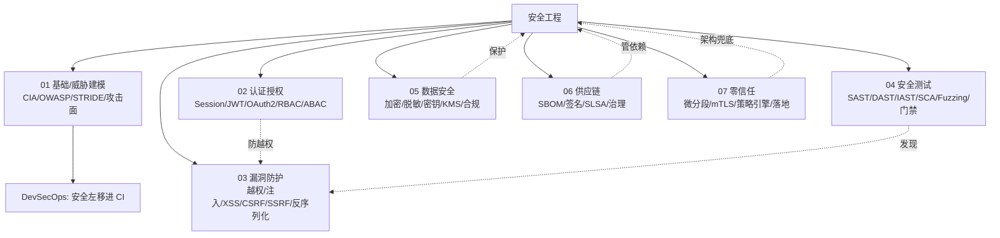
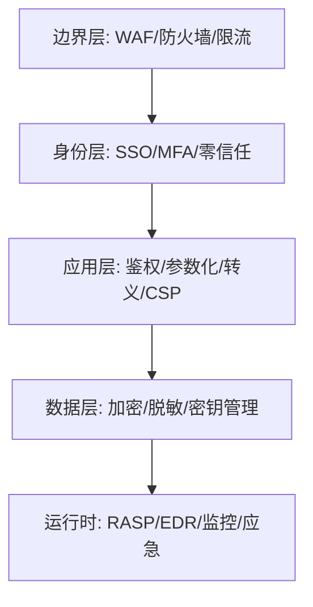

# 安全工程 · 板块导航

> 应用安全是后端工程师的底线能力：一个越权漏洞可能让公司赔到破产。**本板块不是漏洞速查表（那在 [基础知识·Web 安全](../基础知识/Web安全.md)），而是从"工程体系"视角，把安全怎么思考、怎么认证授权、常见漏洞怎么防、如何测试、数据怎么护、供应链与零信任怎么落地，全流程讲透。**

本板块是**研发效能（卷五）**的第三支柱，与 [测试与代码质量](../测试与代码质量/测试与代码质量总览.md)（上线前对）、[SRE 与稳定性工程](../SRE与稳定性工程/SRE与稳定性工程总览.md)（上线后稳）共同构成"质量 + 稳定性 + 安全"的研发效能底座。

---

## 一、知识地图



---

## 二、文档列表与每篇产出

| 文档 | 一句话产出（读完能得到什么） |
|------|------------------------------|
| [安全工程总览](安全工程总览.md) | 概念地图 + 学习路径 + 成熟度自评 + 面试框架 |
| [01 应用安全基础与威胁建模](01-应用安全基础与威胁建模.md) | 用 STRIDE 在设计期"想清楚会被怎么打" |
| [02 认证与授权体系](02-认证与授权体系.md) | 分清"你是谁"和"你能干啥"，JWT/Session/OAuth2/RBAC 落地 |
| [03 常见 Web 安全漏洞与防护](03-常见Web安全漏洞与防护.md) | 六大高频漏洞的原理 + 代码级防护 + 利用链 |
| [04 安全测试方法论](04-安全测试方法论.md) | 用 SAST/DAST/IAST/SCA/Fuzzing 把漏洞"测出来" + 门禁 |
| [05 数据安全与密码学基础](05-数据安全与密码学基础.md) | 怎么加密、怎么存口令、密钥怎么管、合规怎么落地 |
| [06 供应链安全与 SBOM](06-供应链安全与SBOM.md) | 依赖漏洞/投毒怎么防、制品怎么签名、SBOM 怎么用 |
| [07 零信任架构](07-零信任架构.md) | 永不信任的架构原则 + 五阶段落地路径 |

---

## 三、阅读路径

**路径一 · 后端工程师（必会，约 2 天）**
`总览` → `01 基础/威胁建模` → `02 认证授权` → `03 漏洞防护`
> 目标：写出"不被轻易攻破"的接口。

**路径二 · 安全 / 攻防方向（深入，约 1 周）**
`01` → `03` → `04 安全测试` → `05 数据安全` → `06 供应链`
> 目标：能独立做威胁建模、安全测试、应急。

**路径三 · 技术负责人 / 架构师（体系，约 1 周）**
`总览` → `01（左移文化）` → `02（统一认证）` → `04（DevSecOps 门禁）` → `05（数据合规）` → `07（零信任）`
> 目标：在团队层面把安全织进研发流程。

**路径四 · 救火 / 面试突击**
直接看各篇的「Cheat Sheet / 口诀 / 面试框架」章节，再用"按问题查文档"索引定位。

---

## 四、按"问题 / 场景"查文档

| 你现在卡在… | 去这里 |
|-------------|--------|
| "设计新功能，怎么想安全？" | [01 威胁建模](../安全工程/01-应用安全基础与威胁建模.md) |
| "JWT 和 Session 怎么选？" | [02 认证授权](../安全工程/02-认证与授权体系.md) |
| "接口被越权访问了" | [03 越权防护](../安全工程/03-常见Web安全漏洞与防护.md) + [02 RBAC](../安全工程/02-认证与授权体系.md) |
| "SQL 注入怎么根治？" | [03 注入](../安全工程/03-常见Web安全漏洞与防护.md) |
| "XSS 怎么防？" | [03 XSS](../安全工程/03-常见Web安全漏洞与防护.md) |
| "怎么把安全测进 CI？" | [04 安全测试 / 门禁](../安全工程/04-安全测试方法论.md) |
| "口令怎么存才安全？" | [05 口令存储](../安全工程/05-数据安全与密码学基础.md) |
| "密钥能不能放代码里？" | [05 密钥管理](../安全工程/05-数据安全与密码学基础.md) |
| "Log4j 类事件怎么防？" | [06 供应链](../安全工程/06-供应链安全与SBOM.md) |
| "内网还安全吗？要不要零信任？" | [07 零信任](../安全工程/07-零信任架构.md) |
| "我们安全做到什么程度了？" | [总览·成熟度模型](../安全工程/安全工程总览.md) |
| "Web 漏洞速查表" | [基础知识·Web 安全](../基础知识/Web安全.md) |

---

## 五、10 条核心结论（读不完就看这）

1. **安全是属性不是功能**——它贯穿设计、编码、测试、运维全程，不能最后"加一层"。
2. **先建模再写码**——设计期用 STRIDE 问"谁会怎么攻击"，比上线后救火便宜 100 倍。
3. **认证 ≠ 授权**——"你是谁"（认证）和"你能干啥"（授权）必须分开，垂直越权常源于此。
4. **所有输入皆不可信**——参数化、白名单、按上下文转义、服务端校验归属。
5. **最小权限**——每个用户/服务/组件只给必要权限，泄露面最小化。
6. **纵深防御**——单点防护必被绕过，WAF+网关+应用+数据每层各防一部分。
7. **安全左移进 CI**——SAST/SCA 每次提交扫，高危阻断；DAST/IAST 预发兜底。
8. **依赖也是代码**——供应链是主战场，SBOM + 漏洞扫描 + 制品签名缺一不可。
9. **永不信任，始终验证**——零信任假设内网和外网一样危险，每次访问都验证。
10. **密钥不硬编码**——用 KMS/Vault，泄露即轮换，提交即泄露且历史难清。

---

## 六、板块口诀

> **口诀：先建模再写码，认证授权分清楚；输入皆不可信，最小权限加加密；安全左移进 CI，依赖漏洞也要查；零信任永不信任，始终验证加监控。**

---

## 七、四层防线（纵深防御模型）



每一层失效时，下一层仍能挡住。例：SQL 注入 = WAF 挡常见 payload + 应用参数化兜底 + DB 账号无 DROP 权限（三层）。详见 [总览·纵深防御](../安全工程/安全工程总览.md)。

---

## 八、安全成熟度自评

| 你在哪一级？ | 信号 |
|-------------|------|
| L1 临时 | 出事才救火，无安全测试 |
| L2 被动 | 上线前人工 review，无门禁 |
| L3 主动（左移） | SAST/SCA 进 CI，高危阻断 |
| L4 量化 | MTTR/密度跟踪，零信任落地 |
| L5 自适应 | UEBA + 自动响应 + 红蓝常态化 |

> 杠杆点：从 L2→L3 最快的路径是**安全门禁进 CI**（见 [04](../安全工程/04-安全测试方法论.md)）。

---

## 九、术语速查

| 术语 | 一句话 |
|------|--------|
| CIA | 机密性 / 完整性 / 可用性（安全三目标） |
| STRIDE | Spoofing/Tampering/Repudiation/InfoDisclosure/DDoS/EoP 六类威胁 |
| OWASP Top 10 | 十大 Web 安全风险清单 |
| CVE / CVSS | 漏洞编号 / 严重程度评分 |
| SBOM | 软件物料清单（依赖的 X 光片） |
| SLSA | 供应链等级认证（L1~L4） |
| mTLS | 双向 TLS，服务间互认证 |
| ZTNA | 零信任网络访问（替代 VPN） |
| EPSS | 漏洞被利用概率预测 |
| RASP | 运行时应用自我保护（agent 插桩） |

---

## 十、反模式清单（千万别做）

| 反模式 | 为什么错 |
|--------|----------|
| 安全是安全团队的事 | 开发是第一责任人（左移） |
| 上线前才测安全 | 晚、贵、改不动 |
| 一个 WAF 走天下 | 业务/逻辑漏洞 WAF 看不见 |
| 只管自己代码不管依赖 | 供应链才是主战场（Log4j） |
| 明文存口令 / 硬编码密钥 | 拖库 / 提交即全泄露 |
| 黑名单防注入 | 绕过手段无穷（用白名单+参数化） |
| 前端藏按钮算鉴权 | 爬接口直接调，按钮藏不住 |
| 混淆当安全 | Kerckhoffs 原则：算法公开也安全才算安全 |
| "上了 IAP 就是零信任" | 零信任是架构原则，非单产品 |

---

## 十一、与其他板块的关系

| 方向 | 去这里 |
|------|--------|
| Web 漏洞速查 | [基础知识·Web 安全](../基础知识/Web安全.md) |
| 安全测试工具 / 质量门禁 | [测试与代码质量·07](../测试与代码质量/07-质量门禁度量与持续测试.md) |
| 部署、密钥管理 | [CI/CD·环境配置与密钥管理](../基础知识/CI-CD/12-环境配置与密钥管理.md) |
| DevSecOps / DORA | [CI/CD·DevSecOps](../基础知识/CI-CD/13-可观测性DORA度量与DevSecOps.md) |
| 混沌验证韧性 | [测试·混沌工程](../测试与代码质量/08-测试数据Mock服务与混沌工程.md) |
| 稳定性 / 事故响应 | [SRE 与稳定性工程](../SRE与稳定性工程/SRE与稳定性工程总览.md) |
| 网关 / 认证中间件 | [基础知识·中间件·JWT-OAuth2](../基础知识/中间件/认证授权JWT-OAuth2.md)、[Kong/APISIX](../基础知识/中间件/Kong与APISIX网关.md) |
| 服务网格零信任 | [云原生·ServiceMesh](../云原生/ServiceMesh.md)、[K8s 网络](../云原生/K8s网络深挖.md) |

---

## 十二、怎么用这个板块

1. **系统性学习**：按"阅读路径"从头走，别跳着看——认证授权是漏洞防护的前置。
2. **实战查阅**：遇到具体漏洞/需求，用"按问题查文档"索引直达。
3. **面试复习**：每篇末尾有"面试框架 / 口诀 / Cheat Sheet"，配合 [总览·面试框架](../安全工程/安全工程总览.md)。
4. **团队落地**：技术负责人从 [总览·成熟度模型](../安全工程/安全工程总览.md) 起步，用 [04 门禁](../安全工程/04-安全测试方法论.md) 把安全织进 CI。

> 一句话：**安全不是"加功能"，是"每个环节都做对"——本板块帮你把每件对的事，变成可落地的工程动作。**

---

## 十三、角色 × 文档矩阵（各岗位该读什么）

安全不是安全团队的独角戏。不同角色的"最小必读集"不同：

| 角色 | 必读（P0） | 建议（P1） | 关键动作 |
|------|-----------|-----------|----------|
| 后端工程师 | 02 认证授权、03 漏洞防护 | 01 威胁建模、05 数据安全 | 接口鉴权 + 参数化 + 校验归属 |
| 前端工程师 | 03（XSS/CSRF/CORS） | 02（Token 存储） | CSP + 输出转义 + 不在 localStorage 放长期 Token |
| 测试工程师 | 04 安全测试 | 03 漏洞防护 | 把越权/注入用例写进回归 |
| SRE / 运维 | 05 密钥管理、07 零信任 | 06 供应链 | KMS + mTLS + 最小权限账号 |
| 架构师 / TL | 01、07、总览 | 04（门禁）、06 | 威胁建模评审 + 门禁落地 |
| 数据 / 算法 | 05 数据安全 | 03（注入） | 分级分类 + 脱敏 + 出境评估 |
| 安全工程师 | 全部 | — | 建体系、定门禁、做度量 |

> 判断标准很简单：**你的代码/配置能碰到"不可信输入"或"敏感数据"，你就在安全责任链上。**

---

## 十四、按 OWASP Top 10 反查本板块

面试或审计常按 OWASP Top 10（2021 版）提问，这是反查表：

| OWASP 分类 | 本质 | 主要看 |
|-----------|------|--------|
| A01 失效的访问控制 | 越权（水平/垂直） | [02 认证授权](02-认证与授权体系.md) + [03](03-常见Web安全漏洞与防护.md) |
| A02 加密机制失效 | 明文/弱算法/密钥管理差 | [05 数据安全](05-数据安全与密码学基础.md) |
| A03 注入 | SQL/命令/模板/LDAP 注入 | [03](03-常见Web安全漏洞与防护.md) |
| A04 不安全设计 | 设计期就缺安全考量 | [01 威胁建模](01-应用安全基础与威胁建模.md) |
| A05 安全配置错误 | 默认口令/调试开启/目录遍历 | [04](04-安全测试方法论.md) + [01](01-应用安全基础与威胁建模.md) |
| A06 组件漏洞 | 依赖有已知 CVE | [06 供应链](06-供应链安全与SBOM.md) |
| A07 身份认证失效 | 弱口令/会话固定/爆破 | [02](02-认证与授权体系.md) |
| A08 软件与数据完整性失效 | 无签名验证/CI 被投毒 | [06](06-供应链安全与SBOM.md) |
| A09 日志与监控失效 | 出事查不到 | [04](04-安全测试方法论.md) + [SRE 可观测性](../SRE与稳定性工程/02-可观测性与稳定性看护.md) |
| A10 SSRF | 服务端被当跳板 | [03](03-常见Web安全漏洞与防护.md) |

**记忆技巧**：Top 10 里排第一的永远是**访问控制**——它无法被工具自动发现（工具不知道"谁该看什么"），只能靠设计 + 用例覆盖。

---

## 十五、90 天安全体系落地路线图

从 0 到 L3（安全左移）的最小可行路径，不需要专职安全团队也能走：

```mermaid
gantt
    dateFormat X
    axisFormat %s
    section 第一阶段 止血
    密钥扫描接入CI      :0, 2
    高危依赖CVE清理     :0, 3
    section 第二阶段 建门禁
    SAST接入PR阻断      :2, 4
    SBOM生成与留档      :3, 3
    section 第三阶段 深化
    威胁建模纳入设计评审 :5, 4
    预发DAST常态化      :6, 3
    section 第四阶段 度量
    漏洞MTTR看板        :8, 3
```



| 阶段 | 核心动作 | 交付物 | 成功信号 |
|------|----------|--------|----------|
| 0-30 天 · 止血 | gitleaks 扫全量历史；Trivy 清 Critical 依赖 | 密钥清理报告、依赖升级 PR | 仓库无明文密钥 |
| 30-60 天 · 门禁 | Semgrep 进 PR，高危阻断；CI 产出 SBOM | 门禁配置、SBOM 归档 | 高危漏洞进不了主干 |
| 60-90 天 · 深化 | 设计评审加 STRIDE 环节；预发 DAST | 威胁建模模板、扫描报告 | 新功能设计期能识别威胁 |
| 90 天+ · 度量 | 漏洞 MTTR / 门禁通过率上看板 | 安全度量看板 | 用数据驱动而非靠感觉 |

> **顺序很重要**：先止血（存量高危）再建门禁（防增量），否则门禁一开全是红灯，团队会直接关掉它。

---

## 十六、开源工具栈全景（零预算起步）

| 阶段 | 工具 | 解决什么 |
|------|------|----------|
| 编码 | Semgrep、SpotBugs、ESLint security 插件 | SAST：代码里的危险模式 |
| 提交 | gitleaks、trufflehog、pre-commit | 密钥泄露 |
| 构建 | Trivy、Grype、OWASP Dependency-Check | SCA：依赖 CVE |
| 制品 | Syft（SBOM）、cosign（签名） | 供应链完整性 |
| 配置 | checkov、tfsec、kube-bench | IaC / K8s 配置错误 |
| 运行态 | OWASP ZAP、Nuclei | DAST：黑盒扫描 |
| 依赖更新 | Dependabot、Renovate | 自动升级 PR |
| 网络 | Falco、Cilium NetworkPolicy | 运行时异常 / 微隔离 |

> 最小三件套：**gitleaks（密钥）+ Semgrep（代码）+ Trivy（依赖与镜像）**。三个都免费、都能在 10 分钟内接进 CI，覆盖了最高频的三类问题。详细配置见 [04 安全门禁工程化](04-安全测试方法论.md)。

---

## 十七、安全事件应急一页纸

安全事件本质是"事故"，复用 SRE 的响应框架（[SRE·On-call 与事故管理](../SRE与稳定性工程/04-On-call与事故管理.md)）：


**定级参考维度**（不看攻击手法炫不炫，只看影响）：

| 级别 | 判定 | 响应时限 | 典型 |
|------|------|----------|------|
| P0 | 敏感数据已外泄 / 生产被控 | 立即，全员 | 拖库、RCE 落地 |
| P1 | 高危漏洞可被利用但未确认利用 | 小时级 | 未授权接口暴露 |
| P2 | 需特定条件才可利用 | 天级 | 需登录态的越权 |
| P3 | 理论风险 / 信息泄露 | 排期 | 版本号泄露、目录列举 |

**止血优先级口诀**：**断连接 → 换凭据 → 留证据 → 再修代码**。切勿一上来就重启/清日志——证据没了，攻击链就还原不出来，等于白救。

---

## 十八、20 问自测（答不上来就去对应文档）

**认证授权**
1. Session 和 JWT 各自的"注销"怎么实现？→ [02](02-认证与授权体系.md)
2. 为什么 JWT 不该放长期敏感信息？
3. OAuth2 授权码模式为什么要 PKCE？
4. 水平越权和垂直越权的代码级差异在哪？

**漏洞防护**
5. 参数化查询为什么能根治 SQL 注入？→ [03](03-常见Web安全漏洞与防护.md)
6. `ORDER BY` 后面的字段能参数化吗？不能的话怎么办？
7. XSS 的三种类型和各自防护点？
8. CSRF 的 SameSite 防护在什么场景下失效？
9. SSRF 为什么不能只用黑名单 IP？
10. 反序列化漏洞的根因是什么？

**测试与门禁**
11. SAST/DAST/IAST/SCA 各自的盲区？→ [04](04-安全测试方法论.md)
12. 门禁卡太严会发生什么？
13. 密钥已经提交进历史了怎么办？

**数据与密码学**
14. 口令为什么必须用慢哈希？→ [05](05-数据安全与密码学基础.md)
15. AES-GCM 的 nonce 复用后果？
16. 信封加密解决了什么问题？
17. 加密字段还要支持模糊查询怎么设计？

**供应链与架构**
18. Log4j 事件中 SBOM 起什么作用？→ [06](06-供应链安全与SBOM.md)
19. 零信任和"上了 VPN"的本质区别？→ [07](07-零信任架构.md)
20. mTLS 里服务身份从哪来、怎么轮换？

> 20 题里能答出 15 题以上，说明你已具备后端安全的体系认知；答不出的直接跳对应文档。

---

## 十九、常见 FAQ

**Q：我们是小团队，没有安全人员，从哪开始？**
A：第十五章的"0-30 天止血"。三件开源工具接进 CI，成本几小时，能挡住最高频问题。

**Q：WAF 买了就够了吗？**
A：不够。WAF 挡的是"有特征的通用攻击"，而 OWASP 排第一的越权、以及业务逻辑漏洞（改价、并发刷单）WAF 完全看不见——它不知道你的业务规则。WAF 是纵深防御的第一层，不是唯一层。

**Q：安全和迭代速度冲突怎么办？**
A：冲突来自"晚"而不是"安全"。上线前才发现的漏洞改起来贵、要返工，所以慢；左移到 PR 阶段发现，改一行就好。真正拖慢速度的是**没有门禁导致的返工**。

**Q：渗透测试报告收到一堆中低危，要全修吗？**
A：按"可利用性 × 影响"排序，不按数量。参考 [04 漏洞管理流程](04-安全测试方法论.md)：定级 + SLA + 排期，中低危进 Backlog 而不是全堆到当前迭代。

**Q：内部系统也要做安全吗？**
A：要。零信任的前提假设就是"内网已被攻破"（[07](07-零信任架构.md)）。历史上大量数据泄露的路径是：外网打进一台边缘机 → 内网横向移动 → 内部系统无鉴权 → 拖库。

---

## 二十、学到什么程度算过关

| 层次 | 能力表现 |
|------|----------|
| 会用 | 知道 SQL 注入要用参数化、口令要用 bcrypt |
| 会判 | 拿到一个接口设计，能说出它有哪些威胁、缺哪些控制 |
| 会建 | 能把 SAST/SCA/密钥扫描接进 CI 并定合理门禁阈值 |
| 会推 | 能在团队推动威胁建模评审、安全债务排期、度量看板 |

> 从"会用"到"会判"的关键跃迁是 [01 威胁建模](01-应用安全基础与威胁建模.md)——它教你**系统化地提问**，而不是靠记漏洞清单。

---

[← 返回首页](../README.md)

---

## 十三、上线前 30 秒自检清单

把"安全"压成一张可勾选的卡，每次发布前扫一遍：

- [ ] **输入**：所有外部输入白名单 / 参数化 / 转义（[03](../安全工程/03-常见Web安全漏洞与防护.md)）
- [ ] **鉴权**：每个接口认证 + 授权，服务端校验资源归属（[02](../安全工程/02-认证与授权体系.md)）
- [ ] **密钥**：无硬编码，走 KMS/Vault，能轮换（[05](../安全工程/05-数据安全与密码学基础.md)）
- [ ] **依赖**：SCA 无高危 CVE，有 SBOM（[06](../安全工程/06-供应链安全与SBOM.md)）
- [ ] **传输**：TLS 1.2+，HSTS 启用（[05](../安全工程/05-数据安全与密码学基础.md)）
- [ ] **数据**：敏感字段加密，日志已脱敏（[05](../安全工程/05-数据安全与密码学基础.md)）
- [ ] **架构**：零信任（验证 + 最小权限 + 监控）（[07](../安全工程/07-零信任架构.md)）
- [ ] **流程**：安全门禁过 CI，应急 SOP 在手（[04](../安全工程/04-安全测试方法论.md)）

---

## 十四、角色 → 必读文档映射

| 你的角色 | 优先读 | 为什么 |
|----------|--------|--------|
| 后端开发 | 01 → 02 → 03 | 写出不被攻破的接口 |
| 架构师 | 总览 → 02 → 07 | 统一认证 + 零信任落地 |
| 安全工程师 | 全部，重点 04 / 06 | 测试 + 供应链治理 |
| SRE / 运维 | 05 → 07 → 总览·响应 | 加密 + 零信任 + 应急协同 |
| 技术负责人 | 总览 → 04 门禁 → 07 | 把安全织进流程 |
| 测试 | 04 + 03 | 安全测试方法论 + 漏洞认知 |
| 合规 / 法务 | 05 合规 + 总览·认证映射 | 数据合规与框架对齐 |

---

## 十五、安全工具箱速查（按形态）

| 要解决的问题 | 工具（开源优先） | 对应文档 |
|--------------|------------------|----------|
| 静态扫漏洞 | Semgrep、SpotBugs、ESLint | [04](../安全工程/04-安全测试方法论.md) |
| 依赖 CVE | Trivy、Grype、OWASP Dep-Check | [04](../安全工程/04-安全测试方法论.md)、[06](../安全工程/06-供应链安全与SBOM.md) |
| 生成 SBOM | Syft、CycloneDX CLI | [06](../安全工程/06-供应链安全与SBOM.md) |
| 制品签名 | Cosign / Sigstore | [06](../安全工程/06-供应链安全与SBOM.md) |
| 密钥扫描 | gitleaks、trufflehog | [04](../安全工程/04-安全测试方法论.md)、[05](../安全工程/05-数据安全与密码学基础.md) |
| 动态扫运行态 | OWASP ZAP、Nikto | [04](../安全工程/04-安全测试方法论.md) |
| 模糊测试 | AFL++、jazzer、go-fuzz | [04](../安全工程/04-安全测试方法论.md) |
| 密钥管理 | HashiCorp Vault、云 KMS | [05](../安全工程/05-数据安全与密码学基础.md) |
| 身份 / 网关 | Keycloak、Casbin、Kong/APISIX | [02](../安全工程/02-认证与授权体系.md) |
| 服务网格零信任 | Istio、Cilium | [07](../安全工程/07-零信任架构.md) |

---

## 十六、常见攻击案例时间线（教学用）

用一条"真实感"的时间线帮助建立纵深防御直觉（基于公开事件类型，非具体数字）：

```
T0   攻击者在公网扫到未鉴权接口（水平越权 / SSRF）
T1   通过 SSRF 打云元数据 169.254.169.254 拿到临时凭证
T2   用凭证访问 Secrets Manager，解密配置与 DB 连接
T3   拖库（明文口令/未加密字段 → 大面积泄露）
T4   安全团队通过 SIEM/异常流量告警发现（MTTD）
T5   应急：隔离、吊销密钥、轮换、溯源（MTTR）
T6   复盘：为什么未鉴权？为什么密钥能横向？补零信任 + 门禁
```

> 每一格都有对应的本板块解法：T0→[03 鉴权/SSRF](../安全工程/03-常见Web安全漏洞与防护.md)、T1→[07 零信任](../安全工程/07-零信任架构.md)、T2→[05 密钥](../安全工程/05-数据安全与密码学基础.md)、T4→[SRE 告警](../SRE与稳定性工程/06-日志与告警规则库.md)、T6→[总览·响应](../安全工程/安全工程总览.md)。

---

## 十七、FAQ（高频疑问）

**Q：安全测试和 [测试与代码质量](../测试与代码质量/测试与代码质量总览.md) 重复吗？**
A：不重复。普通测试验证"功能对不对"，安全测试验证"被恶意用时会不会破"；两者共用 CI 通道，但关注点不同。

**Q：我们小团队，先上什么？**
A：三件套 `gitleaks + Semgrep + Trivy`（全开源），先把密钥扫描、SAST、SCA 进 CI。见 [04·门禁](../安全工程/04-安全测试方法论.md)。

**Q：零信任是不是要买一堆产品？**
A：不是。零信任是架构原则；小团队可从开源起步（Keycloak + Istio + Casbin）。见 [07](../安全工程/07-零信任架构.md)。

**Q：OWASP Top 10 够用吗？**
A：是认知基线，但业务漏洞（A04 逻辑）和供应链（A06/A08）同样重要。本板块覆盖全部。

**Q：安全左移会增加开发负担吗？**
A：短期有成本，长期大幅降低返工与事故成本。门禁"卡高危"而非"卡全部"可平衡体验。

---

## 十八、学习资源推荐（方向，非广告）

- **标准/清单**：OWASP Top 10、OWASP ASVS（应用安全验证标准）、OWASP Cheat Sheet 系列；
- **框架**：NIST CSF、CIS Controls、等保 2.0；
- **供应链**：SLSA、Sigstore 官方文档、CycloneDX 规范；
- **密码学**：NIST SP 800 系列（密钥管理/随机数）；
- **体系**：本知识库的 [总览](../安全工程/安全工程总览.md) 与各篇"延伸阅读"。

> 读标准文档时记住：**理解原理胜过背结论**——本板块每篇都优先讲"为什么"，再给"怎么做"。

---

## 十九、版本与维护

- 本板块随 OWASP / 标准更新而演进，重大变更（如新 Top 10）会在 [总览](../安全工程/安全工程总览.md) 同步；
- 发现错漏或想补充场景，按仓库贡献流程提 PR（**不在此处直接改生产**，由主流程统一提交）；
- 与 [SRE 板块](../SRE与稳定性工程/SRE与稳定性工程总览.md) 共享"事故响应 / 复盘 / 度量"方法论，避免重复造轮子。

> 一句话收尾：**安全工程的终点不是"没有漏洞"（不可能），而是"漏洞被发现和修复的速度，快过被利用的速度"。**

---

## 二十、设计期安全评审模板（STRIDE 实战卡）

新功能设计评审时，用这张卡把"安全"变成例会固定环节：

| 威胁维度 | 问自己的问题 | 典型缓解 |
|----------|--------------|----------|
| **S**poofing 仿冒 | 调用方能伪造身份吗？ | 强认证 + mTLS（[02](../安全工程/02-认证与授权体系.md) / [07](../安全工程/07-零信任架构.md)） |
| **T**ampering 篡改 | 传输/存储数据能被改？ | TLS + 签名 + HMAC（[05](../安全工程/05-数据安全与密码学基础.md)） |
| **R**epudiation 抵赖 | 操作能否认/无审计？ | 不可抵赖日志 + 审计（[SRE·日志](../SRE与稳定性工程/06-日志与告警规则库.md)） |
| **I**nfo 泄露 | 敏感数据会暴露？ | 加密 + 脱敏 + 最小返回（[05](../安全工程/05-数据安全与密码学基础.md)） |
| **D**oS 拒绝 | 资源能被打爆？ | 限流 + 容量规划（[SRE·容量](../SRE与稳定性工程/03-容量规划与冗余容灾.md)） |
| **E**oP 提权 | 能越过授权边界？ | RBAC/ABAC + 服务端校验归属（[02](../安全工程/02-认证与授权体系.md) / [03](../安全工程/03-常见Web安全漏洞与防护.md)） |

> 完整 STRIDE 方法论见 [01 威胁建模](../安全工程/01-应用安全基础与威胁建模.md)。

---

## 二十一、安全度量看板示例（团队级）

把"安全水位"可视化，贴在团队看板，每月复盘：

```
┌─ 安全健康度（本月）──────────────┐
│ SBOM 覆盖率 ............. 100%   │
│ 高危 CVE MTTR ........... 18h ✅ │
│ SAST 门禁首次通过率 ...... 82% ↗ │
│ 依赖新鲜度(过期>180d) ... 6% ↘  │
│ MFA 覆盖率 .............. 100%  │
│ 零信任策略拒绝率 ........ 0.3%   │
│ 漏洞密度(千行高危) ...... 0.4 ↘ │
└────────────────────────────────┘
```

- 红黄绿三色标注，趋势箭头比绝对值更重要；
- 与 [SRE·DORA/可观测](../SRE与稳定性工程/06-日志与告警规则库.md) 的度量文化对齐；
- 门禁与指标细节见 [04 安全测试](../安全工程/04-安全测试方法论.md)。

---

## 二十二、本板块"最小可用学习包"

如果时间只够读一份材料，按这个顺序，3 小时建立完整认知：

1. [总览·10 条结论](../安全工程/安全工程总览.md)（10 分钟，建立框架）
2. [01 威胁建模](../安全工程/01-应用安全基础与威胁建模.md) 的 STRIDE 章（30 分钟，学会"想攻击"）
3. [02 认证授权](../安全工程/02-认证与授权体系.md) 的"认证 vs 授权" + JWT 安全（40 分钟，最常见坑）
4. [03 漏洞防护](../安全工程/03-常见Web安全漏洞与防护.md) 的六大漏洞（40 分钟，写对接口）
5. [07 零信任](../安全工程/07-零信任架构.md) 的三原则 + 五阶段（30 分钟，架构视野）
6. 回到 [总览·自检清单](../安全工程/安全工程总览.md) 勾一遍（10 分钟，落地）

> 学完这包，你能独立交付"不被轻易攻破"的后端服务，并知道漏洞出现时去哪查。
