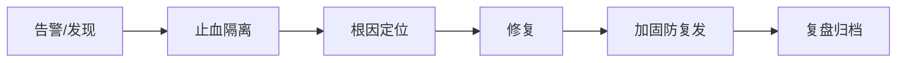

# 安全工程实战案例集

> 理论需落地为案例。本文汇总典型安全问题与应对实战：注入、越权、SSRF、反序列化、供应链，附排查与防御要点。

## 1. SQL 注入实战

**场景**：登录接口 `SELECT * FROM user WHERE name='$name' AND pwd='$pwd'`。
**攻击**：`name=' OR '1'='1' --`。
**防御**：
- 参数化/预编译（PreparedStatement）。
- 最小数据库权限。
- 输入校验 + WAF。

```java
// 正确：参数化
PreparedStatement ps = conn.prepareStatement(
    "SELECT * FROM user WHERE name=? AND pwd=?");
ps.setString(1, name); ps.setString(2, pwd);
```

## 2. 越权访问（IDOR）

**场景**：`/api/order?id=123`，直接改 id 看别人订单。
**防御**：
- 服务端校验"当前用户是否拥有该资源"。
- 用不可推测的 ID（UUID）降低猜测。
- 统一鉴权中间件。

## 3. SSRF（服务端请求伪造）

**场景**：服务代用户抓取 `url` 参数指向的内网地址。
**防御**：
- 白名单域名/协议。
- 禁止内网 IP 段（127.0.0.0/8、169.254 元数据）。
- 出网走代理并过滤。

## 4. 反序列化漏洞

**场景**：反序列化不可信字节流，触发 gadget 链执行命令。
**防御**：
- 不反序列化不可信数据。
- 用 JSON 等安全格式替代原生序列化。
- 加签名校验来源。

## 5. 供应链攻击

**场景**：依赖的 npm/PyPI 包被投毒。
**防御**：
- 私有源 + 依赖锁定（lockfile）。
- SCA 扫描 CVE。
- SBOM + 准入扫描。

## 6. 敏感信息泄露

**场景**：报错栈、密钥、用户数据返回前端。
**防御**：
- 统一错误返回，不暴露栈。
- 密钥进 KMS/配置中心。
- 日志脱敏。

## 7. 案例复盘模板



## 8. 防御体系总结

- **输入**：校验、过滤、白名单。
- **处理**：最小权限、参数化、安全格式。
- **输出**：脱敏、统一错误。
- **依赖**：扫描、锁定、私有源。
- **运行**：WAF、RASP、审计。

## 9. 面试题

1. SQL 注入为何参数化可防？
2. IDOR 如何防御？
3. SSRF 常见利用与防护？
4. 反序列化为何危险？
5. 供应链风险如何缓解？

## 10. 小结

安全是"纵深防御 + 实战复盘"。从注入、越权到供应链，每类问题都有对应工程手段；关键是把防护嵌入开发全流程（左移），而非事后救火。
