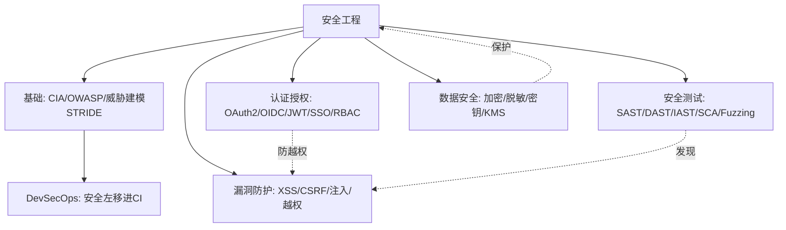
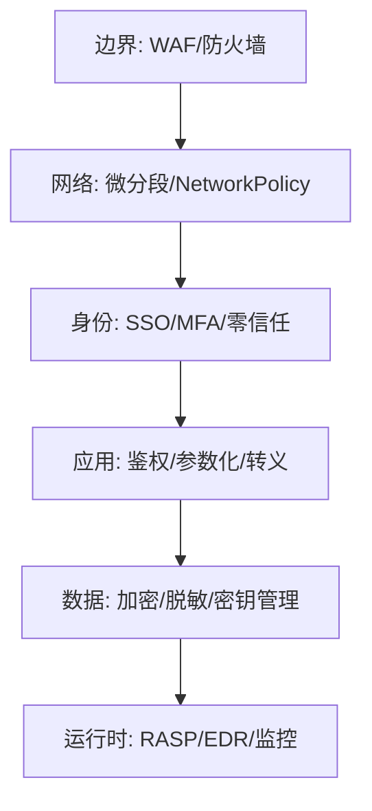
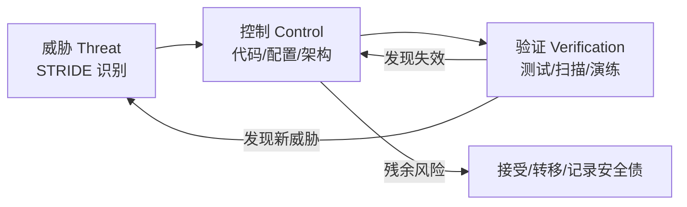
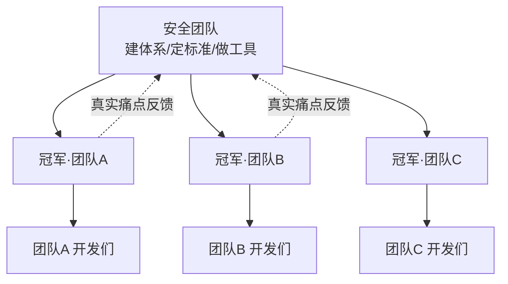
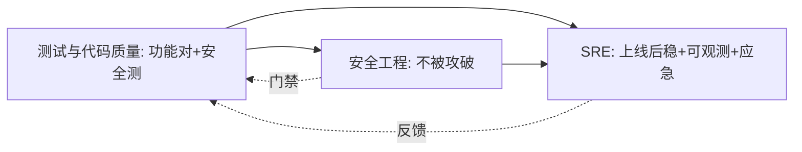

# 🔒 安全工程 · 板块总览

> *「安全不是功能，是属性。」* 应用安全是后端工程师的底线能力——一个越权漏洞可能让公司赔到破产。本板块把"如何系统地思考安全、如何认证授权、常见漏洞怎么防、如何测试安全"全流程讲透。

本板块是**研发效能（卷五）**的第三支柱，与 [测试与代码质量](../测试与代码质量/测试与代码质量总览.md)（含安全测试）、[SRE 与稳定性工程](../SRE与稳定性工程/SRE与稳定性工程总览.md) 互补。现有 [基础知识·Web 安全](../基础知识/Web安全.md) 偏漏洞速查，本板块从**工程体系**视角补全（威胁建模→认证授权→漏洞防护→安全测试→数据安全）。

---

## 一、为什么需要"安全工程"

- 安全漏洞代价极高：数据泄露、监管处罚（如 GDPR）、品牌崩塌；
- 安全不能靠"上线后测"，要**左移**——设计阶段就威胁建模；
- 安全是跨层责任：代码、依赖、配置、基础设施都要管。

---

## 二、概念地图



---

## 三、文章导航（7 篇 + 本总览）

| 编号 | 文档 | 核心内容 |
|------|------|----------|
| 00 | [安全工程总览](安全工程总览.md)（本页） | 概念地图、学习路径、定位 |
| 01 | [应用安全基础与威胁建模](01-应用安全基础与威胁建模.md) | CIA 三性、OWASP Top 10、STRIDE 威胁建模、攻击面 |
| 02 | [认证与授权体系](02-认证与授权体系.md) | 认证 vs 授权、Session/JWT、OAuth2/OIDC、SSO、RBAC/ABAC、零信任 |
| 03 | [常见 Web 安全漏洞与防护](03-常见Web安全漏洞与防护.md) | XSS/CSRF/SQL注入/SSRF/越权/反序列化，与 Web安全.md 互链 |
| 04 | [安全测试方法论](04-安全测试方法论.md) | SAST/DAST/IAST/SCA、模糊测试 Fuzzing、渗透测试、安全门禁 |
| 05 | [数据安全与密码学基础](05-数据安全与密码学基础.md) | 对称/非对称加密、哈希、TLS、KMS、脱敏、隐私合规 |
| 06 | [供应链安全与 SBOM](06-供应链安全与SBOM.md) | 依赖投毒、SBOM、制品签名、SLSA 等级、构建可复现 |
| 07 | [零信任架构](07-零信任架构.md) | 永不信任始终验证、身份即边界、mTLS/SPIFFE、微隔离、落地路径 |

> 板块导航与"按问题查文档"索引另见 [README](README.md)。

---

## 四、推荐学习路径

**路径一 · 后端工程师（必会）**
`01 基础/威胁建模` → `02 认证授权` → `03 漏洞防护`

**路径二 · 安全/攻防（深入）**
`01` → `03` → `04 安全测试` → `05 数据安全`

**路径三 · 技术负责人（体系）**
`01（左移文化）` → `02（统一认证）` → `04（DevSecOps 门禁）` → `05（数据合规）`

---

## 五、贯穿全板块的 5 条原则（口诀）

> **口诀：先建模再写码，认证授权分清楚；输入皆不可信，最小权限加加密；安全左移进 CI，依赖漏洞也要查。**

1. **威胁建模先行**：设计阶段就问"谁会怎么攻击"。
2. **认证与授权分离**：你是谁（认证）≠ 你能干啥（授权）。
3. **永不信任输入**：所有外部输入默认有害，校验+转义。
4. **最小权限**：每个组件/用户只给必要权限。
5. **安全左移 + 依赖治理**：代码与第三方依赖都要查漏洞。

---

## 六、深挖：安全开发生命周期（SDL）与安全 CheckList

### 6.1 SDL（Secure Development Lifecycle）——把安全变成流程


- 每个阶段有**退出标准**（gate）：设计无高危威胁残留、CI 无高危 CVE、发布前渗透过等。
- 与传统流程的区别：安全不是最后一步「测试」，而是**每个环节的检查点**。

### 6.2 上线安全检查清单（CheckList）

| 检查项 | 归属阶段 | 对应文章 |
|--------|----------|----------|
| 所有外部输入有白名单校验/参数化 | 编码 | 03 漏洞防护 |
| 接口有认证 + 授权（RBAC/ABAC） | 编码 | 02 认证授权 |
| 密钥/凭证无硬编码（扫描过） | 编码 | 05 数据安全 |
| 依赖无高危 CVE（SCA 通过） | 测试 | 04 安全测试 |
| SAST 高危项 = 0 | 测试 | 04 安全测试 |
| 日志无敏感字段（脱敏规则生效） | 运维 | 05 数据安全 |
| TLS 1.2+、HSTS 已配置 | 运维 | 05 数据安全 |
| 最小权限：DB/云账号/容器权限收敛 | 运维 | 05 数据安全 |
| 应急响应：泄露预案 + 密钥轮换演练 | 运维 | 04/05 |

---

## 七、与其他模块的关联

| 方向 | 去这里 |
|------|--------|
| Web 漏洞速查 | [基础知识·Web 安全](../基础知识/Web安全.md) |
| 安全测试工具/门禁 | [测试与代码质量·07](../测试与代码质量/07-质量门禁度量与持续测试.md) |
| 部署与密钥管理 | [CI/CD·环境配置与密钥管理](../基础知识/CI-CD/12-环境配置与密钥管理.md) |
| 混沌验证韧性 | [测试·混沌工程](../测试与代码质量/08-测试数据Mock服务与混沌工程.md) |

---

> 下一篇：[01 应用安全基础与威胁建模](01-应用安全基础与威胁建模.md) —— 先建立"安全怎么思考"的认知框架。

---

## 八、安全成熟度模型（5 级自评）

对照看看你的团队在哪一级：

| 级别 | 特征 | 典型表现 |
|------|------|----------|
| L1 临时 | 无流程，靠个人英雄 | 出事才救火，无安全测试 |
| L2 被动 | 有清单/工具，但事后 | 上线前靠人工 review，无门禁 |
| L3 主动（左移） | 安全进 CI，SAST/SCA 门禁 | 高危阻断，依赖扫描常态化 |
| L4 量化 | 有度量、有策略引擎 | MTTR/密度跟踪，零信任落地 |
| L5 自适应 | 自动化响应 + 威胁情报驱动 | UEBA + 自动封禁 + 红蓝常态化 |

> 绝大多数团队在 L2~L3 之间。从 L2→L3 的杠杆是**安全门禁进 CI**（见 [04](../安全工程/04-安全测试方法论.md)）。

---

## 九、安全度量指标体系

不度量无改进。建议跟踪：

| 指标 | 含义 | 目标方向 |
|------|------|----------|
| 漏洞密度 | 每千行代码高危漏洞数 | 下降 |
| 高危漏洞 MTTR | 发现到修复 | P0 < 24h |
| 门禁通过率 | 首次即过比例 | 上升 |
| 依赖新鲜度 | 过期依赖占比 | 下降 |
| SBOM 覆盖率 | 有 SBOM 的制品比例 | 100% |
| MFA / mTLS 覆盖率 | 零信任落地度 | 上升 |
| 安全意识培训完成率 | 人防 | 100% |

---

## 十、纵深防御模型（Defense in Depth）

单点防护必被绕过，**每层各防一部分**：



- 例如 SQL 注入：WAF 挡常见 payload + 应用参数化兜底 + DB 账号无 DROP 权限（三层）；
- 每一层失效时，下一层仍能挡住——这是 [03 漏洞防护](../安全工程/03-常见Web安全漏洞与防护.md) 的底层哲学。

---

## 十一、安全事件响应与 SRE 协同

安全事件也是"事故"，应复用 SRE 的响应机制（[SRE·事故管理](../SRE与稳定性工程/04-On-call与事故管理.md)）：

```
检测(监控/漏扫告警) → 确认定级(影响范围) → 止血(隔离/封禁/下线)
   → 根因(威胁建模复盘) → 修复(打补丁/轮换密钥) → 复盘(无指责)
```

- 密钥泄露：立即轮换（见 [05](../安全工程/05-数据安全与密码学基础.md)）+ 审计泄露前日志；
- 漏洞应急：用 SBOM 分钟级定位受影响制品（[06](../安全工程/06-供应链安全与SBOM.md)）；
- 与 SRE 共用 On-call、Runbook、复盘文化（Blameless）。

---

## 十二、DevSecOps：把安全织进流水线

```
需求(安全需求/合规) → 设计(威胁建模) → 编码(SAST/密钥扫描)
   → 构建(SCA/SBOM/签名) → 测试(DAST/IAST/渗透) → 发布(门禁)
   → 运维(监控/应急响应/密钥轮换)
```

- 每个阶段有**退出标准（gate）**；
- CI/CD 安全工程化见 [CI/CD·DevSecOps](../基础知识/CI-CD/13-可观测性DORA度量与DevSecOps.md)；
- 门禁设计见 [04 安全测试方法论](../安全工程/04-安全测试方法论.md)。

---

## 十三、常见反模式与误区

| 反模式 | 为什么错 |
|--------|----------|
| 安全是安全团队的事 | 开发是安全第一责任人（左移） |
| 上线前才测安全 | 晚、贵、改不动，应进 CI |
| 一个 WAF 走天下 | 业务/逻辑漏洞 WAF 看不见 |
| 只管自己代码不管依赖 | 供应链才是主战场（Log4j） |
| 明文存口令/硬编码密钥 | 拖库/提交即全泄露 |
| 安全靠"藏起来" | 混淆不是安全（Kerckhoffs 原则） |

---

## 十四、面试高频框架（答"如何保障系统安全"）

按"体系"而非"点"答题，层次分明：

1. **设计**：威胁建模（STRIDE）+ 安全需求（[01](../安全工程/01-应用安全基础与威胁建模.md)）；
2. **身份**：认证授权分离、SSO/MFA/RBAC/ABAC（[02](../安全工程/02-认证与授权体系.md)）；
3. **应用**：参数化/转义/校验归属/CSP（[03](../安全工程/03-常见Web安全漏洞与防护.md)）；
4. **测试**：SAST/DAST/IAST/SCA/Fuzzing + 门禁（[04](../安全工程/04-安全测试方法论.md)）；
5. **数据**：加密/脱敏/密钥/KMS（[05](../安全工程/05-数据安全与密码学基础.md)）；
6. **供应链**：SBOM/签名/SLSA（[06](../安全工程/06-供应链安全与SBOM.md)）；
7. **架构**：零信任（[07](../安全工程/07-零信任架构.md)）；
8. **运维**：监控/应急/复盘（复用 SRE）。

---

## 十五、板块全景与延伸


**延伸阅读**：
- 漏洞速查：[基础知识·Web 安全](../基础知识/Web安全.md)
- 测试门禁：[测试与代码质量·07](../测试与代码质量/07-质量门禁度量与持续测试.md)
- 密钥/配置：[CI/CD·密钥管理](../基础知识/CI-CD/12-环境配置与密钥管理.md)
- 稳定性协同：[SRE 与稳定性工程](../SRE与稳定性工程/SRE与稳定性工程总览.md)

> **板块口诀**：先建模再写码，认证授权分清楚；输入皆不可信，最小权限加加密；安全左移进 CI，依赖漏洞也要查；零信任永不信任，始终验证加监控。

---

## 十六、安全需求工程：把安全写进需求

大多数团队的安全是"事后补"，根因在于**需求文档里从来没有安全条目**。没写进需求 = 没排期 = 不会做。

### 16.1 滥用用例（Misuse Case）

正常用例描述"用户想干什么"，滥用用例描述"攻击者想干什么"。二者成对出现：

| 正常用例 | 对应滥用用例 | 需补的安全需求 |
|----------|-------------|----------------|
| 用户查看自己的订单 | 攻击者遍历 orderId 查别人订单 | 查询必须校验 `order.userId == currentUser` |
| 用户上传头像 | 上传 webshell / 超大文件 / SVG 携带 XSS | 白名单扩展名 + 内容嗅探 + 大小限制 + 独立域名托管 |
| 用户重置密码 | 枚举手机号 / 爆破验证码 / 越权重置他人 | 限频 + 验证码一次性 + Token 绑定用户 |
| 用户发起支付 | 前端改价 / 重复提交 / 并发超额 | 金额服务端计算 + 幂等键 + 库存原子扣减 |
| 管理员导出报表 | 普通用户直接调导出接口 | 角色校验 + 导出审计日志 |

> **实操建议**：需求评审时，每个核心用例强制配一条滥用用例。这是把 [01 威胁建模](01-应用安全基础与威胁建模.md) 落到日常流程里成本最低的方式——不需要专业安全人员，产品和开发就能做。

### 16.2 安全用户故事模板

```
作为 <系统/合规要求>，
我需要 <安全控制措施>，
以便 <阻止某类威胁>。

验收标准：
- [ ] 正向：合法用户能正常完成操作
- [ ] 反向：构造 <攻击输入> 时被拒绝并记录审计日志
- [ ] 回归：该反向用例已加入自动化测试
```

关键在**反向验收标准**：安全需求如果没有"攻击被拒绝"的可验证条目，就无法进 [04 安全测试](04-安全测试方法论.md) 的回归集，下次重构照样退化。

---

## 十七、威胁 → 控制 → 验证 三元映射

安全工程的完整闭环不是"知道有威胁"，而是**每个威胁都有控制措施，每个控制措施都有验证手段**。三者缺一就是纸面安全：

| STRIDE 威胁 | 控制措施（怎么防） | 验证手段（怎么证明有效） |
|-------------|-------------------|------------------------|
| **S** 假冒身份 | 强认证、MFA、mTLS 服务身份 | 无凭据/伪造 Token 访问测试；证书吊销后连接应失败 |
| **T** 篡改数据 | HMAC/签名、完整性校验、DB 权限收敛 | 篡改请求体/Cookie 后应被拒；制品签名验签测试 |
| **R** 抵赖 | 审计日志、不可变日志、操作留痕 | 关键操作后检查审计记录是否完整可追溯 |
| **I** 信息泄露 | 加密存储传输、脱敏、错误信息收敛 | 抓包无明文；日志扫描无 PII；报错不带堆栈 |
| **D** 拒绝服务 | 限流、熔断、配额、资源上限 | 压测超阈值应被限流而非雪崩（见 [SRE 容量规划](../SRE与稳定性工程/03-容量规划与冗余容灾.md)） |
| **E** 提权 | 最小权限、RBAC/ABAC、服务端校验归属 | 低权账号调高权接口应 403；双账号越权 diff 测试 |



> **最常见的断裂点是"验证"**：威胁建模做了、代码也改了，但没有一条自动化用例守着。半年后重构，鉴权判断被"顺手优化"掉，漏洞悄悄回归。**控制措施必须有测试用例做锚**。

---

## 十八、安全架构评审 Checklist

设计评审时按这份清单逐条问。每条都是历史上真实出过事的地方：

### 18.1 身份与访问

- [ ] 每个对外接口是否明确了"谁可以调"？有没有遗漏的内部接口暴露在公网？
- [ ] 资源查询是否校验了**归属**（不只是"登录了"，而是"这条数据是你的"）？
- [ ] 管理端与用户端是否共用同一套鉴权？管理接口有没有独立的权限层？
- [ ] 服务间调用用什么身份？是共享密钥还是可轮换的服务身份（见 [07 零信任](07-零信任架构.md)）？
- [ ] Token 的有效期、刷新、注销（吊销）链路是否完整（见 [02](02-认证与授权体系.md)）？

### 18.2 数据

- [ ] 这个功能采集了哪些字段？每个字段都必要吗（数据最小化）？
- [ ] 敏感字段落库是否加密？日志/监控/链路追踪里会不会带出来？
- [ ] 数据分级是什么？跨境/跨环境流转有没有评估（见 [05](05-数据安全与密码学基础.md)）？
- [ ] 删除功能是否真删（含备份、缓存、搜索索引、数仓副本）？

### 18.3 输入与集成

- [ ] 所有外部输入（含上游服务返回值）是否都做了校验？
- [ ] 有没有"服务端主动发起请求到用户可控 URL"的地方（SSRF 风险，见 [03](03-常见Web安全漏洞与防护.md)）？
- [ ] 反序列化 / 模板渲染 / 表达式求值 / 文件解析的输入源可信吗？
- [ ] 第三方回调（支付、OAuth）是否验签、防重放？

### 18.4 运行与可观测

- [ ] 关键操作有审计日志吗？日志能不能定位"谁在什么时候改了什么"？
- [ ] 失败/异常路径会不会泄露内部信息（堆栈、SQL、内网 IP）？
- [ ] 出事怎么止血？有开关能快速降级/封禁吗？
- [ ] 依赖的密钥/证书什么时候过期？过期了会怎样（见 [SRE 变更管理](../SRE与稳定性工程/05-变更管理与渐进式发布.md)）？

> 这份清单的用法：**贴在设计文档模板里**，让作者自己先答一遍。评审会上只讨论"答不上来"和"答了但不合理"的条目，效率最高。

---

## 十九、安全左移的经济学

为什么所有安全体系都在讲"左移"？因为**修复成本随阶段推进而急剧上升**，且上升的不是编码工时，而是协调成本：


| 阶段 | 修复动作包含什么 | 涉及角色 |
|------|------------------|----------|
| 设计期 | 改设计文档 | 开发 + 评审人 |
| 编码期 | 改代码，本地自测 | 开发 |
| 测试期 | 改代码 + 回归 + 重新提测 | 开发 + 测试 |
| 上线后 | 以上 + 紧急发版窗口 + 存量脏数据修复 | 开发 + 测试 + SRE + 业务 |
| 被利用后 | 以上 + 应急响应 + 用户通报 + 监管沟通 + 品牌修复 | 全公司 + 法务 + 公关 |

注意最后两行的角色列——**成本爆炸来自参与人数，不是代码行数**。一个越权判断在设计期是一句话，在被利用后是一场跨部门战役。

> 这也解释了为什么"门禁"比"扫描"重要：扫描只是发现，门禁才是**强制在便宜的阶段解决**。见 [04 安全门禁工程化](04-安全测试方法论.md)。

---

## 二十、组织机制：安全冠军（Security Champion）

安全团队永远配不齐（一个安全人对几十个开发是常态）。可扩展的解法不是招人，而是**在每个业务团队里培养一个"安全冠军"**：

| 维度 | 说明 |
|------|------|
| 是谁 | 业务团队内部的开发，兼职 10%~20% 时间做安全 |
| 干什么 | 参与本团队设计评审的安全环节、做第一轮漏洞研判、推动本团队安全债偿还 |
| 不干什么 | 不做渗透测试、不做架构级方案（那是安全团队的事） |
| 怎么赋能 | 安全团队提供培训、工具、模板、答疑通道；冠军定期轮换分享 |
| 怎么度量 | 本团队漏洞密度、MTTR、门禁通过率的改善趋势 |



> 核心价值是**双向的**：安全能力向下扩散，业务痛点向上反馈。没有反馈通道的安全策略往往脱离实际（比如定了个连本地开发都跑不过的门禁），最后被集体绕过。

---

## 二十一、标准与合规地图

不同标准解决不同问题，别混为一谈：

| 标准/框架 | 类型 | 解决什么 | 对工程师意味着 |
|-----------|------|----------|----------------|
| **OWASP Top 10** | 风险清单 | 最高频的十类 Web 风险 | 代码级必知，面试必考 |
| **OWASP ASVS** | 验证标准 | 应用安全要求的分级清单（L1/L2/L3） | 可直接当"安全需求库"用 |
| **OWASP SAMM** | 成熟度模型 | 组织的安全能力怎么演进 | 团队安全建设的路线图参考 |
| **CWE** | 缺陷分类 | 漏洞类型的字典（如 CWE-89 SQL注入） | SAST 规则和报告的分类依据 |
| **CVE / CVSS / EPSS** | 漏洞编号/评分/利用概率 | 具体某个已知漏洞的标识与优先级 | SCA 的输入，排优先级用 |
| **ISO 27001** | 管理体系认证 | 信息安全管理制度是否健全 | 主要影响流程与文档留痕 |
| **SOC 2** | 审计报告 | 面向客户证明控制有效性 | 需要提供审计证据（日志、权限记录） |
| **等级保护（等保）** | 国内合规 | 分等级的安全要求 | 常涉及国密算法、日志留存期限 |
| **个人信息保护法 / GDPR** | 隐私法规 | 个人信息的采集使用边界 | 数据分级、同意管理、删除权 |
| **PCI-DSS** | 行业规范 | 支付卡数据保护 | 卡号不落库、强加密、隔离网段 |
| **SLSA** | 供应链等级 | 构建过程的完整性保障等级 | 见 [06 供应链安全](06-供应链安全与SBOM.md) |

**关系速记**：
- **CWE 是"病种"，CVE 是"病例"，CVSS 是"病情严重度"，EPSS 是"传染概率"**；
- **Top 10 告诉你"最该防什么"，ASVS 告诉你"具体要做到什么"，SAMM 告诉你"组织怎么一步步做到"**。

> 工程落地建议：把 ASVS L2 当成需求库裁剪一份"公司应用安全基线"，比直接背 Top 10 更可执行——因为 ASVS 的每一条都是可验证的具体要求。

---

## 二十二、安全债务管理

安全问题不可能全部立刻修完。**不能修完不代表可以假装看不见**——关键是显式登记、定级、排期，让残余风险可见可控。

### 22.1 登记项

| 字段 | 说明 |
|------|------|
| 问题描述 | 什么组件、什么缺陷、什么威胁 |
| 定级 | 影响 × 可利用性（不看漏洞名字听起来多可怕） |
| 临时缓解 | 现在靠什么兜住（WAF 规则？限流？关闭入口？） |
| 修复方案 | 根治办法 |
| 负责人 / 期限 | 必须有人有日期，否则等于不存在 |
| 风险接受人 | 若决定暂不修，谁签字接受这个风险 |

### 22.2 定级矩阵

| | 易利用 | 需条件 | 极难利用 |
|---|---|---|---|
| **影响：数据泄露/RCE** | P0 立即 | P1 本迭代 | P2 排期 |
| **影响：越权读写** | P1 本迭代 | P2 排期 | P3 记录 |
| **影响：信息泄露** | P2 排期 | P3 记录 | P3 记录 |

### 22.3 反模式

| 反模式 | 后果 |
|--------|------|
| 漏洞只存在扫描报告里 | 报告没人看，等于没发现 |
| 全部标"高危"要求立刻修 | 团队疲劳后集体忽略，真高危被淹没 |
| 没有"风险接受人" | 出事时无人负责，安全团队背锅 |
| 缓解措施当根治 | WAF 规则一改就复发（临时措施必须有到期日） |

> 与 SRE 的错误预算思路同源（[SRE·SLO 与错误预算](../SRE与稳定性工程/01-SRE理念与SLI-SLO-ErrorBudget.md)）：**承认不可能零风险，用可量化的方式管理剩余风险**，比喊"零漏洞"务实得多。

---

## 二十三、踩坑实录

1. **门禁一次性全开，第二天被全员关掉**。正确做法：先只对新增代码生效（增量扫描），存量走专项治理，让门禁始终是绿的基线。
2. **威胁建模做成了文档表演**。产出一份 20 页没人看的文档，不如产出 5 条"必须加的测试用例"。**威胁建模的交付物应该是待办项，不是文档**。
3. **把安全扫描结果直接抛给业务团队**。几百条未研判的告警会摧毁信任。安全团队应先做一轮研判，只把"确认可利用 + 给出修复方案"的条目派下去。
4. **只防外部攻击，忽略内部越权**。大量真实事故是内部账号权限过大 + 无审计。最小权限和审计日志对内同样适用。
5. **应急时先重启清场**。日志、内存、连接状态全丢，攻击链无法还原，同一个洞会被再打一次。**先留证据再止血**（见 [README·应急一页纸](README.md)）。
6. **合规当成安全**。过了等保不等于打不进来；合规是基线，攻防是实战。反之，安全做得好但缺留痕，审计一样过不了——两者都要。
7. **密钥轮换没做过演练**。真出事时才发现下游有十几个地方硬编码引用，轮换即全站故障。轮换能力要像 [SRE 容灾演练](../SRE与稳定性工程/03-容量规划与冗余容灾.md) 一样定期验证。

---

## 二十四、口诀汇总

> **威胁建模三问**：我有什么值钱的？谁想要它？他怎么拿？
>
> **控制闭环三段**：识别威胁 → 落地控制 → 用例守护（缺一即纸面安全）。
>
> **输入处理四字**：**验、转、参、限**——校验白名单、按上下文转义、参数化查询、限频限量。
>
> **权限三查**：查身份（是谁）、查角色（能做什么）、查归属（这条数据是不是你的）。
>
> **应急四步**：断连接、换凭据、留证据、修代码。
>
> **左移一句话**：便宜的阶段解决，靠门禁强制，不靠自觉。

---

## 十六、安全与合规认证映射

安全工程常要支撑合规审计，提前对齐：

| 框架 | 关注点 | 本板块对应 |
|------|--------|------------|
| 等保 2.0（中国） | 分级保护、身份鉴别、审计 | 02 认证 / 05 加密 / 06 供应链 |
| ISO 27001 | ISMS 体系、访问控制 | 全板块 + 总览治理 |
| SOC 2 | 安全/可用/保密/处理完整/隐私 | SRE 可用 + 本板块安全/隐私 |
| GDPR / 个保法 | 数据主体权利、最小化 | 05 数据合规 |
| PCI-DSS | 卡数据保护 | 05 加密 + 02 访问控制 |

> 合规不是"法务填表"，而是**每个控制项都要有工程证据**（日志、加密、门禁记录）。与 [SRE·可观测性](../SRE与稳定性工程/02-可观测性与稳定性看护.md) 的审计日志天然衔接。

---

## 十七、红蓝对抗组织（把攻击常态化）

```
红队(Red): 模拟真实攻击者 —— 找突破口、拿权限、横向
蓝队(Blue): 监测+响应+加固 —— 提升检测率与响应速度
紫队(Purple): 红蓝复盘 —— 输出检测缺口清单、改进项
```

- 频率：每季度一次大型演练 + 不定期突击；
- 产出：不只是"有没有漏洞"，更是"**发现与响应速度**"（MTTD/MTTR）；
- 与 SRE 事故演练（[SRE·混沌/演练](../SRE与稳定性工程/04-On-call与事故管理.md)）共用 Runbook / 复盘文化。

---

## 十八、安全文化建设（最难的"人"的层面）

工具再多，人不重视也白搭：

| 举措 | 作用 |
|------|------|
| 安全左移培训 | 让开发懂"为什么这么写" |
| 安全 Champions | 每个团队选一个安全接口人 |
| 漏洞奖励（内部） | 鼓励白帽上报而非隐瞒 |
| 无指责复盘 | 复盘根因而非追责，鼓励暴露 |
| 安全门禁可视化 | 把 MTTR/密度贴在团队看板 |
| 红蓝演练 | 制造"真实压力"检验体系 |

> 安全是**持续过程**而非一次性项目。这也是为什么本板块反复强调"进 CI、进流程、进文化"。

---

## 十九、板块术语总表（速查）

| 术语 | 一句话 |
|------|--------|
| CIA | 机密性 / 完整性 / 可用性 |
| STRIDE | 六类威胁建模维度 |
| OWASP Top 10 | 十大 Web 风险 |
| CVE / CVSS / EPSS | 漏洞编号 / 严重度 / 利用概率 |
| SBOM | 软件物料清单 |
| SLSA | 供应链等级 |
| mTLS / ZTNA | 双向 TLS / 零信任访问 |
| RASP / IAST | 运行时防护 / 交互式测试 |
| KMS / HSM | 密钥管理 / 硬件加密机 |
| DAST / SAST / SCA | 动态 / 静态 / 成分分析 |

---

## 二十、最后的自检清单（30 秒过一遍）

- [ ] 所有外部输入：白名单 / 参数化 / 转义？
- [ ] 每个接口：认证 + 授权（服务端校验归属）？
- [ ] 密钥：无硬编码、有 KMS、能轮换？
- [ ] 依赖：SCA 通过、有 SBOM、高危阻断？
- [ ] 传输：TLS 1.2+、HSTS？
- [ ] 数据：敏感字段加密 + 日志脱敏？
- [ ] 架构：零信任（验证 + 最小权限 + 监控）？
- [ ] 流程：安全门禁进 CI + 应急响应 SOP？

> 八项全过，基本达到本板块 L3 主动防御水位。

---

## 二十一、安全债与技术债一样要管理

安全漏洞会"利滚利"——拖得越久，修复成本指数上升（改动面变大、依赖变深、人员遗忘）。

| 状态 | 处理策略 |
|------|----------|
| 高危且有 PoC | 立即修（P0，24h） |
| 高危难利用 | 临时缓解（WAF 规则 / 配置收敛）+ 排期根治 |
| 中危 | 进迭代 backlog，按 EPSS 排序 |
| 低危 | 接受风险 + 记录，定期复审 |
| 误报 | 填 IGNORE 理由 + 定期复审，避免规则腐烂 |

> 与 [SRE·错误预算](../SRE与稳定性工程/01-SRE理念与SLI-SLO-ErrorBudget.md) 同理：用"风险预算"思想，把有限人力投到 ROI 最高的漏洞上。

---

## 二十二、跨板块协同全景（质量 + 稳定 + 安全）

研发效能三大支柱不是孤岛，而是同一流水线的三段：



- **测试板块**提供安全测试工具与质量门禁（[测试·07](../测试与代码质量/07-质量门禁度量与持续测试.md)）；
- **SRE 板块**提供可观测性、事故响应、复盘文化（[SRE 总览](../SRE与稳定性工程/SRE与稳定性工程总览.md)）；
- **安全板块**把"不被攻破"织进每一环节；
- 三者共享：**CI 通道、度量文化、无指责复盘、Runbook**。

> 一句话：**质量是"做对"，稳定是"不倒"，安全是"不被破"——三者共同定义"好系统"。**
