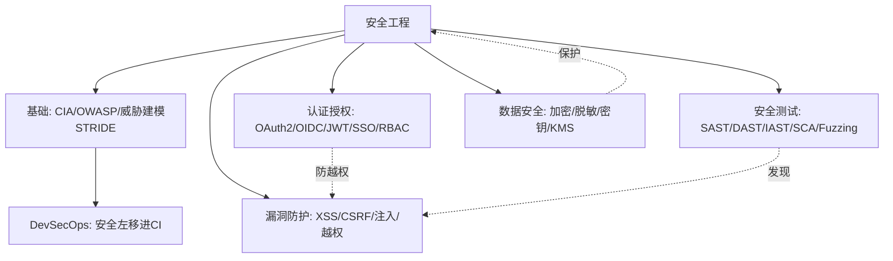

# 🔒 安全工程 · 板块总览

> *「安全不是功能，是属性。」* 应用安全是后端工程师的底线能力——一个越权漏洞可能让公司赔到破产。本板块把"如何系统地思考安全、如何认证授权、常见漏洞怎么防、如何测试安全"全流程讲透。

本板块是**研发效能（卷五）**的第三支柱，与 [测试与代码质量](测试与代码质量/测试与代码质量总览.md)（含安全测试）、[SRE 与稳定性工程](SRE与稳定性工程/SRE与稳定性工程总览.md) 互补。现有 [基础知识·Web 安全](基础知识/Web安全.md) 偏漏洞速查，本板块从**工程体系**视角补全（威胁建模→认证授权→漏洞防护→安全测试→数据安全）。

---

## 一、为什么需要"安全工程"

- 安全漏洞代价极高：数据泄露、监管处罚（如 GDPR）、品牌崩塌；
- 安全不能靠"上线后测"，要**左移**——设计阶段就威胁建模；
- 安全是跨层责任：代码、依赖、配置、基础设施都要管。

---

## 二、概念地图

---

## 三、文章导航（5 篇 + 本总览）

| 编号 | 文档 | 核心内容 |
|------|------|----------|
| 00 | [安全工程总览](安全工程总览.md)（本页） | 概念地图、学习路径、定位 |
| 01 | [应用安全基础与威胁建模](01-应用安全基础与威胁建模.md) | CIA 三性、OWASP Top 10、STRIDE 威胁建模、攻击面 |
| 02 | [认证与授权体系](02-认证与授权体系.md) | 认证 vs 授权、Session/JWT、OAuth2/OIDC、SSO、RBAC/ABAC、零信任 |
| 03 | [常见 Web 安全漏洞与防护](03-常见Web安全漏洞与防护.md) | XSS/CSRF/SQL注入/SSRF/越权/反序列化，与 Web安全.md 互链 |
| 04 | [安全测试方法论](04-安全测试方法论.md) | SAST/DAST/IAST/SCA、模糊测试 Fuzzing、渗透测试、安全门禁 |
| 05 | [数据安全与密码学基础](05-数据安全与密码学基础.md) | 对称/非对称加密、哈希、TLS、KMS、脱敏、隐私合规 |

---

## 四、推荐学习路径

**路径一 · 后端工程师（必会）**
`01 基础/威胁建模` → `02 认证授权` → `03 漏洞防护`

**路径二 · 安全/攻防（深入）**
`01` → `03` → `04 安全测试` → `05 数据安全`

**路径三 · 技术负责人（体系）**
`01（左移文化）` → `02（统一认证）` → `04（DevSecOps 门禁）` → `05（数据合规）`

---

## 五、贯穿全板块的 5 条原则（口诀）

> **口诀：先建模再写码，认证授权分清楚；输入皆不可信，最小权限加加密；安全左移进 CI，依赖漏洞也要查。**

1. **威胁建模先行**：设计阶段就问"谁会怎么攻击"。
2. **认证与授权分离**：你是谁（认证）≠ 你能干啥（授权）。
3. **永不信任输入**：所有外部输入默认有害，校验+转义。
4. **最小权限**：每个组件/用户只给必要权限。
5. **安全左移 + 依赖治理**：代码与第三方依赖都要查漏洞。

---

## 六、与其他模块的关联

| 方向 | 去这里 |
|------|--------|
| Web 漏洞速查 | [基础知识·Web 安全](../基础知识/Web安全.md) |
| 安全测试工具/门禁 | [测试与代码质量·07](../测试与代码质量/07-质量门禁度量与持续测试.md) |
| 部署与密钥管理 | [CI/CD·环境配置与密钥管理](../基础知识/CI-CD/12-环境配置与密钥管理.md) |
| 混沌验证韧性 | [测试·混沌工程](../测试与代码质量/08-测试数据Mock服务与混沌工程.md) |

---

> 下一篇：[01 应用安全基础与威胁建模](01-应用安全基础与威胁建模.md) —— 先建立"安全怎么思考"的认知框架。
