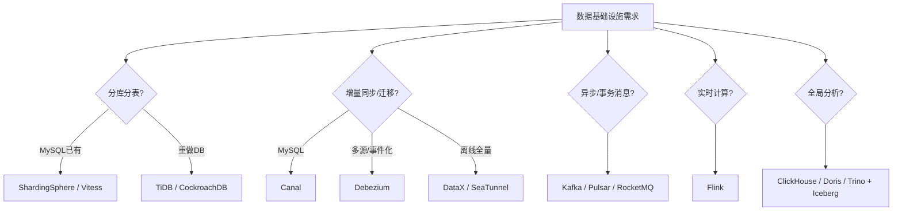

# 开源项目 · 数据基础设施与中间件

> 本篇盘点**数据基础设施与中间件**领域的标杆开源项目：分库分表中件、CDC 数据同步、消息流、批流计算、OLAP/数据湖、调度编排。它们撑起"数据从产生 → 同步 → 计算 → 存储 → 服务"的整条链路。
>
> **与 [04-后端框架与数据库](04-后端框架与数据库.md) 的边界**：04 聚焦"数据库引擎本身"（PostgreSQL/MySQL/Redis/ES/ClickHouse 等）与 Web 框架；本篇聚焦"在这些引擎之间搬运、分片、计算、编排"的**中间件与基础设施层**——也就是你做分库分表、数据迁移、实时数仓时真正会去选型的那一层。
>
> 本篇与知识库「[分库分表与数据迁移](../分库分表与数据迁移/分库分表与数据迁移总览.md)」板块强呼应：原理在该板块，工具清单在本篇。星数为 GitHub 公开近似值（2026-07），会波动，看 stars 找方向、看 commits/dependents 看真用。

---

## 一、分库分表与分布式数据库

| 项目 | 语言 | 星数(≈) | 一句话 |
|------|------|--------|--------|
| [Apache ShardingSphere](https://github.com/apache/shardingsphere) | Java | 19k+ | "Database Plus" 增强层，Sharding-JDBC/Proxy 双端，分库分表+读写分离+加密+治理全能 |
| [Vitess](https://github.com/vitessio/vitess) | Go | 18k+ | YouTube 出身的 MySQL 集群中间件，支撑超大规模（PlanetScale 内核），K8s 原生 |
| [Apache TiDB](https://github.com/pingcap/tidb) | Go/Rust | 37k+ | 兼容 MySQL 的 NewSQL，自动分片（基于 Raft 的 TiKV），HTAP |
| [CockroachDB](https://github.com/cockroachdb/cockroachdb) | Go | 30k+ | 兼容 PG 的分布式 SQL，自管理分片与副本，强一致 |
| [Apache Doris](https://github.com/apache/doris) | C++/Java | 13k+ | 实时 OLAP MPP，高并发即席查询，替代部分 Kylin/Druid 场景 |

💡 选型提示：业务已有 MySQL 想平滑分片 → ShardingSphere/Vitess；想要"不用管分片"的 NewSQL → TiDB/CockroachDB。

---

## 二、CDC 与数据同步（迁移/双写的核心通道）

| 项目 | 语言 | 星数(≈) | 一句话 |
|------|------|--------|--------|
| [Canal](https://github.com/alibaba/canal) | Java | 29k+ | 阿里开源，解析 MySQL binlog，做增量同步/异构（配合 [基础知识/CDC-Canal](../基础知识/中间件/数据同步CDC-Canal.md)） |
| [Debezium](https://github.com/debezium/debezium) | Java | 11k+ | 基于 Kafka Connect 的 CDC 平台，支持 MySQL/PG/Oracle/Mongo，事件化变更流 |
| [Apache SeaTunnel](https://github.com/apache/seatunnel) | Java | 8k+ | 数据集成/同步框架，批流一体，连接数百种数据源 |
| [DataX](https://github.com/alibaba/DataX) | Java | 16k+ | 阿里离线数据同步工具，插件化，适合全量迁移 |

💡 与「[03 数据迁移双写](../分库分表与数据迁移/03-数据迁移双写与平滑扩容.md)」呼应：增量追平阶段就是靠 Canal/Debezium 这类 CDC 把老表变更实时同步到新分片。

---

## 三、消息流（异步解耦 / 事务消息 / 流处理源）

| 项目 | 语言 | 星数(≈) | 一句话 |
|------|------|--------|--------|
| [Apache Kafka](https://github.com/apache/kafka) | Java/Scala | 28k+ | 分布式流平台事实标准，高吞吐日志/事件总线 |
| [Apache Pulsar](https://github.com/apache/pulsar) | Java | 14k+ | 云原生消息流，存算分离+多租户，分层存储 |
| [Apache RocketMQ](https://github.com/apache/rocketmq) | Java | 21k+ | 阿里开源，金融级，支持**事务消息**（[04 分布式事务](../分库分表与数据迁移/04-分布式事务与一致性.md) 落地利器） |
| [RabbitMQ](https://github.com/rabbitmq/rabbitmq-server) | Erlang | 12k+ | 成熟 AMQP 代理，灵活路由，企业常用 |

💡 与「[04 分布式事务](../分库分表与数据迁移/04-分布式事务与一致性.md)」呼应：事务消息（RocketMQ）/本地消息表都依赖这类消息中间件做最终一致。

---

## 四、批流计算（数据进来后怎么算）

| 项目 | 语言 | 星数(≈) | 一句话 |
|------|------|--------|--------|
| [Apache Flink](https://github.com/apache/flink) | Java/Scala | 24k+ | 流处理标杆，精确一次语义，实时计算/ETL/CDC 下游 |
| [Apache Spark](https://github.com/apache/spark) | Scala | 40k+ | 批处理王者，Structured Streaming 兼顾流，ML/SQL 生态全 |
| [Apache Airflow](https://github.com/apache/airflow) | Python | 36k+ | 工作流编排（DAG），离线调度首选 |
| [Apache NiFi](https://github.com/apache/nifi) | Java | 4k+ | 可视化数据流，易用的数据路由/转换 |

---

## 五、OLAP / 数据湖格式

| 项目 | 语言 | 星数(≈) | 一句话 |
|------|------|--------|--------|
| [ClickHouse](https://github.com/ClickHouse/ClickHouse) | C++ | 36k+ | 列存 OLAP，极致单表聚合性能（见 [基础知识/ClickHouse](../基础知识/中间件/ClickHouse.md)） |
| [Apache Druid](https://github.com/apache/druid) | Java | 13k+ | 实时分析型数据库，低延迟钻取 |
| [Apache Iceberg](https://github.com/apache/iceberg) | Java | 7k+ | 表格式（Table Format），数据湖 ACID，与 Spark/Flink/Trino 打通 |
| [Apache Hudi](https://github.com/apache/hudi) | Java | 5k+ | 数据湖增量处理，支持 upsert/时间旅行 |
| [Trino](https://github.com/trinodb/trino) | Java | 10k+ | 分布式 SQL 查询引擎，跨数据源联邦查询 |

💡 OLAP/数据湖常用于"分片库的跨分片聚合"替代方案——把分片数据同步到 ClickHouse/Iceberg，用专门的引擎做全局分析，避免在线库做痛苦的全分片 JOIN。

---

## 六、选型决策图（数据基础设施怎么挑）

---

## 七、关键机制速览（读源码前先懂这些）

| 项目 | 关键机制 | 工程启示 |
|------|----------|----------|
| ShardingSphere | 路由引擎（分片键 → 数据源）+ SQL 改写（分页/聚合归并） | 分片键选择决定一切：不带分片键的查询会广播全分片 |
| Canal | 伪装 Slave 拉取 binlog → 解析成结构化事件 | binlog 是 MySQL 事实上的变更日志标准，CDC 都绕不开它 |
| Kafka | 分区有序 + 副本 ISR 机制 + 页缓存写 | 吞吐靠顺序写与批量；乱序/重复是消费端要解决的语义 |
| RocketMQ | 事务消息（half message + 回查）+ 延迟消息 | 事务消息 = 本地事务消息表思想的中间件化 |
| Flink | 状态后端 + Checkpoint（精确一次）+ 窗口 | 流计算难点在状态管理与恢复，而非计算本身 |
| Spark | RDD 血缘 + Stage 划分 + 缓存 | 血缘即容错——重算而非复制，理解它才能调优 DAG |
| Iceberg | 元数据层（manifest）+ 快照隔离 + 隐藏分区 | 数据湖的 ACID 靠元数据版本管理实现，不是锁 |

## 八、与知识库其他板块的关联

- **[分库分表与数据迁移板块](../分库分表与数据迁移/分库分表与数据迁移总览.md)** → 本篇是其中工具的"选型清单版"
- **[大数据全链路](../基础知识/大数据/README.md)** → 批流计算/数据湖深入
- **[时序库](../基础知识/时序库/README.md)** → 海量遥测另走 TSDB，勿与关系型分片混用
- **[04 后端框架与数据库](04-后端框架与数据库.md)** → 数据库引擎本身
- **[05 DevOps 云原生](05-DevOps云原生与基础设施.md)** → Kafka/Pulsar/Flink 的容器化部署

---

## 九、面试高频问答（中间件选型版）

1. Q：ShardingSphere 和 TiDB 怎么选？ A：已有 MySQL 存量、要平滑分片 → ShardingSphere（对应用透明）；要"自动分片、强一致、可扩展"的新库 → TiDB（NewSQL），接受生态差异。
2. Q：Canal 和 Debezium 区别？ A：Canal 专注 MySQL binlog 轻量接入（阿里生态多）；Debezium 是 Kafka Connect 框架的通用 CDC（多数据源、事件化），更现代化。
3. Q：Kafka 和 RocketMQ 怎么选？ A：Kafka 吞吐与生态更强（大数据/日志）；RocketMQ 事务消息/延迟消息/金融场景更顺（Java 业务栈）。
4. Q：Flink 为什么能做到精确一次？ A：Checkpoint 快照状态 + 两阶段提交（端到端 exactly-once 需配合 Kafka 事务/幂等输出）。
5. Q：数据湖和数仓什么关系？ A：数仓强调治理与分析（结构先行）；数据湖（Iceberg 等）强调存原始数据 + ACID 表格式，湖仓一体是融合方向。
6. Q：跨分片 JOIN 怎么办？ A：禁止在线库全分片 JOIN——同步到分析引擎（ClickHouse/Iceberg）+ 预聚合/宽表，或用 Trino 联邦查询。

---

> **口诀**：「分片靠 ShardingSphere/Vitess，迁移靠 Canal/Debezium，异步靠 Kafka/RocketMQ，计算靠 Flink/Spark，分析靠 ClickHouse/Iceberg。」
