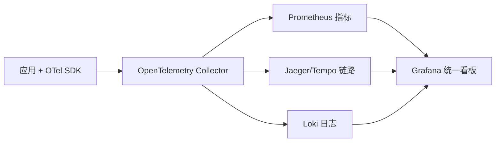

# 10 · 云原生与可观测性生态（CNCF & Observability）

> 配套：[README](README.md) · [05-DevOps云原生与基础设施](05-DevOps云原生与基础设施.md) · 关联：[云原生/可观测性](../云原生/可观测性.md)
> 本篇补充云原生与可观测性的开源核心项目清单，作为"工程师该关注哪些开源基础设施"的速查。

---

## 一、CNCF 全景（分层速记）

| 层 | 代表项目 | 作用 |
|----|----------|------|
| 编排调度 | Kubernetes、Kubernetes Operators | 容器编排事实标准 |
| 服务网格 | Istio、Linkerd、Cilium | 流量治理、mTLS、可观测 |
| 服务代理 | Envoy、CoreDNS | 数据面、服务发现 |
| 可观测 | Prometheus、Grafana、OpenTelemetry、Jaeger、Loki | 指标/日志/链路 |
| 存储 | etcd、Rook（Ceph）、MinIO | KV/块/对象存储 |
| 消息/流 | NATS、Apache Pulsar | 异步通信 |
| CI/CD | Argo CD、Tekton、Flux | GitOps/流水线 |
| 网关 | Envoy、APISIX、Kong | 入口流量 |

> 完整版图见 [CNCF Landscape](https://landscape.cncf.io/)；面试常问"云原生技术栈"可从上述分层口述。

---

## 二、可观测性三件套（Metrics / Logs / Traces）

### 2.1 Prometheus（指标）
- 拉模型（pull）+ 多维数据模型（label）+ PromQL；
- 配套：Alertmanager（告警）、Grafana（可视化）；
- 取舍：不适合高基数/长周期明细（明细交给日志/链路）。

### 2.2 OpenTelemetry（统一采集）
- **厂商中立**的 trace/log/metric 采集与导出标准；
- 一处埋点，可导出到 Jaeger / Tempo / 各类 APM；
- 已成为可观测性埋点事实标准（详见[云原生/可观测性](../云原生/可观测性.md)）。

### 2.3 Jaeger / Tempo（链路追踪）
- 分布式链路追踪，定位跨服务慢调用；
- 基于 OpenTelemetry 数据。

### 2.4 Loki（日志）
- 类 Prometheus 的日志系统，索引少、成本低；
- 与 Grafana 一体展示。

---

## 三、服务网格：Istio 与 Cilium

| 项目 | 特点 | 适用 |
|------|------|------|
| Istio | Envoy 数据面 + 控制面，流量/安全/可观测全栈 | 多语言微服务治理 |
| Cilium | 基于 eBPF，网络+安全+可观测，性能好 | K8s 网络/零信任 |

> 服务网格把**重试/熔断/限流/mTLS/灰度**从应用代码下沉到 Sidecar，但引入复杂度；中小团队可先用 SDK（如 Sentinel）再上网格。

---

## 四、GitOps 与渐进交付

| 项目 | 作用 |
|------|------|
| Argo CD / Flux | Git 为唯一事实源，自动同步集群状态 |
| Argo Rollouts | 金丝雀/蓝绿发布 |
| Tekton | K8s 原生 CI/CD Pipeline |

---

## 五、选型记忆卡（面试/调研用）

| 诉求 | 首选开源 |
|------|----------|
| 容器编排 | Kubernetes |
| 指标 | Prometheus + Grafana |
| 统一采集 | OpenTelemetry |
| 链路 | Jaeger / Tempo |
| 日志 | Loki / ELK |
| 服务网格 | Istio / Cilium |
| GitOps | Argo CD / Flux |
| 对象存储 | MinIO |
| 消息流 | Pulsar / NATS |

---

> 延伸：本篇是[开源项目板块](../开源项目/)在云原生与可观测性方向的补强；工程落地见[云原生](../云原生/)与[CI-CD](../基础知识/CI-CD/)。
