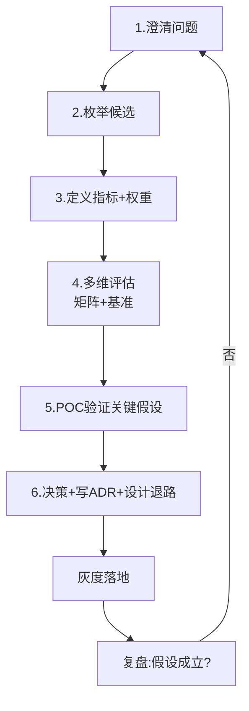

# 01 · 选型方法论与决策框架（深入：案例库 / 指标权重 / 风险控制 / POC 设计）

> 选型的本质，是**在不确定性下做权衡（trade-off）**。本篇深入拆解：选型案例库、指标权重设计、风险控制机制、POC 设计方法、组织因素。

---

## 一、选型的本质：不是挑最好，是做权衡

任何技术都有代价。选 A 通常意味着放弃 B 的某些好处：

| 你想要的 | 你通常要放弃的 |
|----------|----------------|
| 强一致（不丢不错） | 高可用 / 低延迟（CAP 取舍） |
| 极致性能（自研/裸金属） | 开发效率 / 可维护性 |
| 生态成熟（Java 全家桶） | 资源成本 / 冷启动 |
| 简单（单体） | 团队并行扩展能力 |
| 前沿（新框架） | 稳定性 / 招人容易度 |

> **没有"完美技术"，只有"在当下约束下代价最小的组合"。** 选型的功力 = 识别真正约束的能力。

---

## 二、决策框架全景：五件趁手的工具

### 2.1 第一性原理四问（任何选型第一步）

```
1. 问题是什么？      —— 用一句话说清要解决什么（最好能量化）
2. 约束是什么？      —— 预算/工期/团队/合规/性能底线（不可妥协的）
3. 选项有哪些？      —— 穷举候选，不要只考虑"已知的那个"
4. 每个选项的后果？  —— 对指标的影响、代价、风险
```

### 2.2 加权决策矩阵（多选项量化对比）

```
步骤：
1. 列出关键指标（性能/成本/生态/团队熟悉度...）
2. 给每个指标赋权重（总和=100%，场景决定权重）
3. 对每个候选按 1-5 分打分（要有依据，不是拍脑袋）
4. 加权求和：得分 = Σ(指标分 × 权重)
5. 排序 + 敏感性分析（权重±20% 结果是否反转？）
```

### 2.3 指标权重设计（深入）

```
权重来源：
  业务目标倒推（延迟敏感 → 性能权重大）
  约束倒推（成本受限 → 成本权重大）
  风险倒推（合规强制 → 合规必须达标）

权重校准：
  敏感性分析：权重 ±20%，看结果是否反转
  若反转 → 说明候选接近，需 POC 深挖差异
  若稳定 → 结论可信

硬约束（一票否决）：
  合规不达标 → 直接出局（不计权重）
  性能底线不满足 → 直接出局
  预算超限 → 直接出局
```

### 2.4 示例：缓存选型

| 指标（权重） | Redis | Memcached | Caffeine |
|--------------|-------|-----------|----------|
| 数据结构丰富度 (20%) | 5 | 2 | 3 |
| 分布式共享 (25%) | 5 | 5 | 1 |
| 极致读性能 (20%) | 4 | 4 | 5 |
| 运维成本 (15%) | 3 | 3 | 5 |
| 团队熟悉度 (20%) | 4 | 3 | 4 |
| **加权总分** | **4.25** | **3.65** | **2.85** |

> 结论随权重变：若"极致读性能+零运维"权重高（单体应用本地缓存场景），Caffeine 反超。这就是加权的价值——逼你把假设显性化。

---

## 三、选型案例库

### 3.1 经典案例

| 案例 | 背景 | 决策 | 关键原因 |
|------|------|------|----------|
| 消息中间件 | 国内业务，需要事务消息 | RocketMQ | 事务消息 + 国内生态 |
| 日志检索 | 云原生 K8s，资源敏感 | Loki | 轻量 + 成本低 |
| 实时计算 | 毫秒级 + Exactly-once | Flink | 流批一体 + 状态管理 |
| OLAP | 多表 Join + BI | Doris | MySQL 协议 + Join 强 |
| 对象存储 | 私有部署 | MinIO | S3 协议兼容 |
| 注册中心 | Java 微服务 | Nacos | 配置 + 注册一体 |

### 3.2 案例复盘方法

```
复盘模板：
  背景（当时的业务状态/约束）
  选项（考虑过的候选 + 弃选原因）
  决策（选了谁 + 为什么）
  后果（正面收益 + 负面代价）
  反思（重来会怎么做）
```

---

## 四、选型六步法（标准流程）



1. **澄清问题**：一句话 + 量化指标（QPS？延迟？数据量？合规？）。
2. **枚举候选**：横向（同类替换）+ 纵向（不同范式）。
3. **定义指标与权重**：权重由场景定，硬约束一票否决。
4. **多维评估**：决策矩阵 + 文献/他人复盘，先粗筛。
5. **POC 验证**：只对"最不确定、最影响决策"的 1-2 个假设做 POC。
6. **决策 + 留退路**：写 ADR，设计回滚/逃生通道。

---

## 五、POC 设计方法（深入）

### 5.1 POC 不是"试试看"

> **任何"据说很快/很稳"的结论，都必须被自己的基准测试验证。** POC 是"带着假设去证伪"。

### 5.2 POC 设计模板

```
POC 目标：验证 X 能否达到 Y（量化）
  例：验证 ClickHouse 单表 10 亿行聚合 < 1s

POC 场景：贴近真实负载（不是 hello world）
  数据量：真实规模 1/10~1/100
  查询模式：真实查询集合
  并发：预估峰值

POC 指标：
  主指标（延迟/吞吐/成本）
  次指标（运维复杂度/生态支持）

POC 时间盒：1~2 周
POC 结论：假设成立？边界条件？风险？
```

### 5.3 POC 常见失败

| 失败原因 | 对策 |
|----------|------|
| 数据量太小（万级测亿级） | 数据规模逼近真实 |
| 查询不真实（只测单条） | 用真实查询集合 |
| 忽略并发 | 测峰值并发 |
| 环境差异（本地 vs 生产） | 生产环境小流量验证 |
| 只看平均不看 P99 | 报告分布（P50/P99/P999） |

---

## 六、风险控制机制

### 6.1 逃生通道设计

```
上线前设计退路：
  双写：新旧系统并行写（数据可回退）
  特性开关：功能开关切换（新系统问题秒切回）
  影子流量：复制线上流量到新系统（验证不生效）
  灰度发布：逐步放量（1% → 10% → 50% → 100%）

回滚预案：
  数据回滚（版本回退）
  流量回切（开关切换）
  时间窗口（低峰期操作）
```

### 6.2 风险清单

| 风险 | 评估维度 | 缓解 |
|------|----------|------|
| 技术风险 | 新系统是否成熟/有坑 | POC + 社区调研 |
| 团队风险 | 会不会用/愿意用 | 培训 + 内部 champion |
| 运维风险 | 部署/监控/排障成本 | 运维介入评估 |
| 厂商风险 | 锁定/收费变化 | 协议兼容层 |
| 迁移风险 | 数据迁移复杂度 | 迁移演练 |

### 6.3 技术债管理

```
选型后维护：
  升级策略（版本跟进节奏）
  退出策略（什么信号下替换）
  技术债记录（ADR + 遗留问题清单）

信号检测：
  维护成本上升（bug 多/排障难）
  生态萎缩（社区活跃度下降）
  能力瓶颈（无法满足新需求）
```

---

## 七、组织因素

| 因素 | 影响 | 对策 |
|------|------|------|
| 团队熟悉度 | 上手成本 | 培训 + 试点团队 |
| 招聘难度 | 人才供给 | 社区热度调研 |
| 跨团队协作 | 推广阻力 | 内部 champion + 社区运营 |
| 管理层支持 | 资源投入 | 价值量化（ROI 测算） |

---

## 八、常见误区（血泪清单）

| 误区 | 表现 | 正确姿势 |
|------|------|----------|
| **技术镀金** | 用分布式解决单机问题 | 先"能不引就不引" |
| **跟风大厂** | "淘宝/字节都用 XX" | 先问"大厂的问题和我一样吗" |
| **唯性能指标论** | 只看 benchmark 第一名 | 指标加权，性能只是其一 |
| **忽视团队** | 选了没人会的技术 | 团队熟悉度是无形成本 |
| **过度设计** | 为 3 年后规模提前重装 | YAGNI：为当前 + 1 阶设计 |
| **Demo 即生产** | 凭官网 demo 下结论 | POC 必须贴近真实负载 |
| **一次定终身** | 没有 ADR、没有退路 | 留逃生通道，定期复审 |
| **用新不用旧** | 新版一定更好 | 成熟度/稳定性优先于新特性 |
| **忽视运维** | 只评估功能性能 | 运维成本纳入指标 |
| **无退出机制** | 绑死了换不掉 | 选型时就设计退路 |

---

## 九、ADR 实践（架构决策记录）

```
ADR 核心字段：
  状态：提议 / 已采纳 / 已废弃 / 已替代
  背景：为什么需要决策（问题 + 约束）
  决策：我们选了谁
  考量：选项对比（为什么不选其他）
  后果：正面 + 负面（长期影响）
  备选：未来可能的替代

示例：
  # 3. 消息中间件选型 RocketMQ
  状态：已采纳
  背景：需要事务消息 + 延迟消息，国内部署
  决策：RocketMQ 4.9
  考量：Kafka（无事务语义）、RabbitMQ（吞吐低）
  后果：+ 事务消息能力；- 学习成本、运维复杂度
  备选：Pulsar（未来可迁移）
```

---

## 十、Cheat Sheet

```
选型前问自己 5 句话：
① 我到底要解决什么问题？（能一句话说清吗）
② 硬约束是什么？（钱/人/时间/合规/性能底线）
③ 我有几个真候选？还是只想到一个？
④ 我准备为"性能"放弃"什么"？（trade-off 显性化）
⑤ 选错了怎么退？（逃生通道在哪）

答不全 → 别拍板。
```

---

## 十一、加权打分的数学与敏感性分析（Python 实战）

加权矩阵不是"打分游戏"，它有明确的数学含义：在给定权重向量下，候选方案的得点是各指标得分的线性组合。真正有价值的不是"谁分高"，而是"领先优势有多薄、是否经得起权重扰动"。

```python
# 缓存选型：加权打分 + 敏感性分析
candidates = {
    "Redis":     {"数据结构":5, "分布式":5, "读性能":4, "运维":3, "熟悉度":4},
    "Memcached": {"数据结构":2, "分布式":5, "读性能":4, "运维":3, "熟悉度":3},
    "Caffeine":  {"数据结构":3, "分布式":1, "读性能":5, "运维":5, "熟悉度":4},
}
weights = {"数据结构":0.20, "分布式":0.25, "读性能":0.20, "运维":0.15, "熟悉度":0.20}

def score(c, w):
    return round(sum(c[k] * w[k] for k in w), 3)

base = {n: score(c, weights) for n, c in candidates.items()}
rank_base = sorted(base, key=base.get, reverse=True)
print("基准排名:", rank_base, base)

# 逐个权重做 ±20% 扰动，看排名是否反转
for key in weights:
    for delta in (-0.2, 0.2):
        w = dict(weights)
        w[key] = round(w[key] * (1 + delta), 4)
        s = sum(w.values())
        w = {k: v / s for k, v in w.items()}          # 归一化，保证 Σ=1
        res = {n: score(c, w) for n, c in candidates.items()}
        rank = sorted(res, key=res.get, reverse=True)
        stable = rank == rank_base
        print(f"扰动 {key}{delta:+.0%}: 稳定={stable} 排名={rank}")
```

**解读心法**：

- 若某次扰动后排名反转 → 说明候选差距在噪声范围内，结论"不可信"，必须靠 POC 用真实数据把差异拉开。
- 若所有合理扰动下排名稳定 → 决策可信，无需为这点差异再做 POC。
- 敏感性分析还能反推"哪些指标最关键"：对排名影响最大的权重，就是团队真正在意的维度。

> 一句话：**加权矩阵告诉我们"现在谁赢"，敏感性分析告诉我们"这个赢靠不靠谱"**。

---

## 十二、决策框架的反模式：决策也会变质

框架用错，比没框架还危险——因为它披着"科学"的外衣：

| 反模式 | 表现 | 修正 |
|--------|------|------|
| 指标注水 | 给自己想选的打 5，其他打 2 | 每项打分必须写依据，否则作废 |
| 权重作弊 | 暗中把权重调成"想选的那个赢" | 权重由业务目标倒推，开会当场定 |
| 矩阵套结论 | 先有结论再编矩阵 | 矩阵先于偏好；若结论与矩阵冲突，重审矩阵 |
| POC 走过场 | 只测证明自己对的场景 | POC 目标是"证伪"，专测最不确定的假设 |
| ADR 事后补 | 上线后才写，记忆已失真 | 决策当天定稿 ADR |
| 一票否决滥用 | 用红线把不想选的踢掉 | 红线只限合规/一致/成本硬约束 |

---

## 十三、选型的组织博弈：让决策"可执行"

选型 30% 是技术，70% 是组织。再对的方案，团队推不动也是零。

| 博弈方 | 典型立场 | 对策 |
|--------|----------|------|
| 架构师 | 想用"先进/通用"方案 | 让其负责 POC 与上线代价，而不只是建议 |
| 一线开发 | 想用"好维护/熟"的方案 | 让其参与打分，熟悉度权重落到人头上 |
| 平台/中间团队 | 推自研/内部组件（KPI 驱动） | 把"接入与排障人力"计入 TCO |
| 业务方 | 只要快，不管技术债 | 用"返工风险"量化给业务方看 |
| 招聘市场 | 小众栈招不到人 | 招聘难度作为红线指标 |

> **决策落地公式：技术正确 × 组织可执行 = 真正落地。** 缺一不可。

---

## 十四、选型决策检查单（上线前 12 问）

```
[ ] 1. 问题能一句话说清吗？（含量化指标）
[ ] 2. 硬约束列全了吗？（钱/人/时间/合规/性能底线）
[ ] 3. 候选 ≥ 2 个吗？（不是只想到一个就拍板）
[ ] 4. 指标维度列全了吗？（11 维扫一遍）
[ ] 5. 权重由场景倒推吗？（不是拍脑袋）
[ ] 6. 红线过滤做了吗？（不达标直接出局）
[ ] 7. 打分都写了依据吗？（定性指标不许空口）
[ ] 8. 敏感性分析做了吗？（权重±20% 排名反转吗）
[ ] 9. 最不确定的假设 POC 了吗？（真实负载、时间盒）
[ ] 10. ADR 写了吗？（状态/背景/决策/后果/复审）
[ ] 11. 逃生通道设计了吗？（开关/双写/影子）
[ ] 12. 复审触发条件定了吗？（量超阈值/社区停更）
```

> 12 问答不全 → 别拍板。这不是流程负担，是把"赌"变成"决策"的护栏。

---

## 十五、一句话总结

> **选型的思考框架 = 第一性原理定问题 → 加权矩阵做对比（硬约束一票否决）→ ADR 留记录 → POC 验假设（贴近真实负载）→ 退路保安全（双写/开关/影子流量）。** 工具是手段，把"隐性假设"变"显性决策"才是目的。再加一句：**加权矩阵靠敏感性分析兜底，组织博弈靠检查单兜底**——前者防"算错"，后者防"推不动"。
