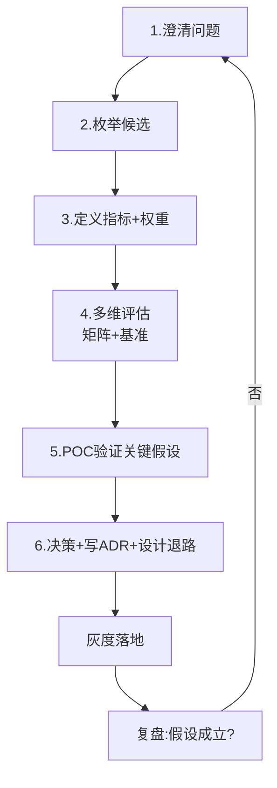

# 01 · 选型方法论与决策框架

> 选型的本质，是**在不确定性下做权衡（trade-off）**。这一篇给你一套可复用的"思考操作系统"：从问题定义到决策落地的完整流程、可套用的决策框架、以及必须绕开的陷阱。

---

## 一、选型的本质：不是挑最好，是做权衡

任何技术都有代价。选 A 通常意味着放弃 B 的某些好处：

| 你想要的 | 你通常要放弃的 |
|----------|----------------|
| 强一致（不丢不错） | 高可用 / 低延迟（CAP 取舍） |
| 极致性能（自研/裸金属） | 开发效率 / 可维护性 |
| 生态成熟（Java 全家桶） | 资源成本 / 冷启动 |
| 简单（单体） | 团队并行扩展能力 |
| 前沿（新框架） | 稳定性 / 招人容易度 |

> **没有"完美技术"，只有"在当下约束下代价最小的组合"。** 选型的功力 = 识别真正约束的能力。

---

## 二、决策框架全景：五件趁手的工具

不同问题用不同工具，不要一把锤子砸所有钉子。

### 2.1 第一性原理四问（任何选型第一步）

```
1. 问题是什么？      —— 用一句话说清要解决什么（最好能量化）
2. 约束是什么？      —— 预算/工期/团队/合规/性能底线（不可妥协的）
3. 选项有哪些？      —— 穷举候选，不要只考虑"已知的那个"
4. 每个选项的后果？  —— 对指标的影响、代价、风险
```

> 四问答不全，不要进入评估。多数"选型翻车"是因为问题或约束没定义清就急着看榜单。

### 2.2 加权决策矩阵（多选项量化对比）

当候选≥2 且指标多维时，用**加权评分**把"感觉"变成"数字"：

```
步骤：
1. 列出关键指标（见 02 篇，如 性能/成本/生态/团队熟悉度...）
2. 给每个指标赋权重（总和=100%，场景决定权重）
3. 对每个候选按 1-5 分打分（要有依据，不是拍脑袋）
4. 加权求和：得分 = Σ(指标分 × 权重)
5. 排序 + 敏感性分析（权重±20% 结果是否反转？）
```

**示例：缓存选型（Redis vs Memcached vs 本地 Caffeine）**

| 指标（权重） | Redis | Memcached | Caffeine |
|--------------|-------|-----------|----------|
| 数据结构丰富度 (20%) | 5 | 2 | 3 |
| 分布式共享 (25%) | 5 | 5 | 1 |
| 极致读性能 (20%) | 4 | 4 | 5 |
| 运维成本 (15%) | 3 | 3 | 5 |
| 团队熟悉度 (20%) | 4 | 3 | 4 |
| **加权总分** | **4.25** | **3.65** | **2.85** |

> 结论随权重变：若"极致读性能+零运维"权重高（单体应用本地缓存场景），Caffeine 反超。这就是加权的价值——逼你把假设显性化。

### 2.3 ADR（架构决策记录）

> **选型不写 ADR = 没有选型，只有"当时随便定的"。**

ADR 是给"为什么这么选"留档，让 2 年后的同事不骂你。模板见 [05-选型落地与治理](05-选型落地与治理.md)。

核心字段：`状态(提议/已采纳/已废弃) / 背景 / 决策 / 考量(选项对比) / 后果(正面+负面) / 备选`。

### 2.4 ATAM（架构权衡分析方法）

当选型涉及多个**质量属性冲突**（性能 vs 安全 vs 成本）时，用 ATAM 把冲突摆到台面。详细见「[架构/质量属性与 ATAM](../架构/质量属性与ATAM.md)」。选型中常用的简化版：

```
列出 3-5 个关键质量属性 → 识别它们之间的冲突 → 明确"哪个场景下哪个优先" → 用场景六元组量化
```

### 2.5 假设检验 / POC 驱动

> **任何"据说很快/很稳"的结论，都必须被自己的基准测试验证。**

榜单是别人的场景，不是你的。POC 不是"试试看"，是"带着假设去证伪"（详见 [05 篇](05-选型落地与治理.md)）。

---

## 三、选型六步法（标准流程）



1. **澄清问题**：一句话 + 量化指标（QPS？延迟？数据量？合规？）。
2. **枚举候选**：别只想到一个。横向（同类替换）+ 纵向（不同范式，如"用 MQ" vs "用定时任务"）。
3. **定义指标与权重**：用 [02 篇](02-选型关键指标体系.md) 的体系，权重由场景定。
4. **多维评估**：决策矩阵 + 文献/他人复盘，先粗筛掉明显不合适的。
5. **POC 验证**：只对"最不确定、最影响决策"的 1-2 个假设做 POC，时间盒（1-2 周）。
6. **决策 + 留退路**：写 ADR，同时设计回滚/逃生通道（双写、特性开关、影子流量）。

---

## 四、常见误区（血泪清单）

| 误区 | 表现 | 正确姿势 |
|------|------|----------|
| **技术镀金** | 用分布式解决单机问题 | 先"能不引就不引" |
| **跟风大厂** | "淘宝/字节都用 XX 所以我们也用" | 先问"大厂的问题和我一样吗" |
| **唯性能指标论** | 只看 benchmark 第一名 | 指标加权，性能只是其一 |
| **忽视团队** | 选了没人会的技术 | 团队熟悉度是无形成本 |
| **过度设计** | 为 3 年后规模提前重装 | YAGNI：为当前 + 1 阶设计 |
| **Demo 即生产** | 凭官网 demo 下结论 | POC 必须贴近真实负载 |
| **一次定终身** | 没有 ADR、没有退路 | 留逃生通道，定期复审 |
| **用新不用旧** | 新版一定更好 | 成熟度/稳定性优先于新特性 |

---

## 五、Cheat Sheet

```
选型前问自己 5 句话：
① 我到底要解决什么问题？（能一句话说清吗）
② 硬约束是什么？（钱/人/时间/合规/性能底线）
③ 我有几个真候选？还是只想到一个？
④ 我准备为"性能"放弃"什么"？（trade-off 显性化）
⑤ 选错了怎么退？（逃生通道在哪）

答不全 → 别拍板。
```

---

## 六、一句话总结

> **选型的思考框架 = 第一性原理定问题 → 加权矩阵做对比 → ADR 留记录 → POC 验假设 → 退路保安全。** 工具是手段，把"隐性假设"变"显性决策"才是目的。
