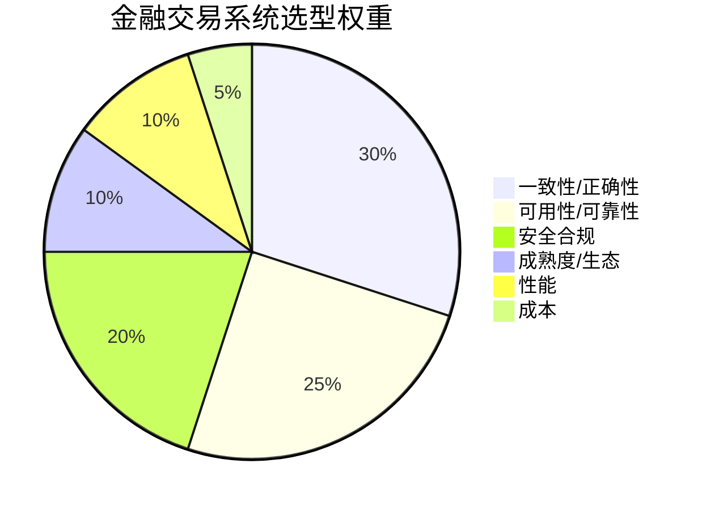
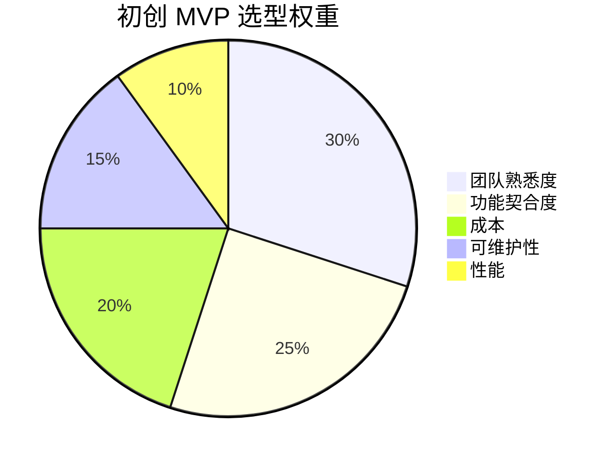

# 02 · 选型关键指标体系

> 上篇讲了"怎么想"，这篇讲"看什么"。选型之所以玄学，是因为大家嘴里的"好"指的是不同东西。把指标**显性化、结构化、可量化**，决策才有客观依据。

---

## 一、指标全景（11 维）

任何技术选型，都逃不出这 11 个维度。不同场景只是**权重不同**，不是维度不同。

| # | 维度 | 问自己的问题 | 典型度量 |
|---|------|--------------|----------|
| 1 | **功能契合度** | 它能不能直接解决我的问题？要改多少？ | 覆盖需求比例、定制量 |
| 2 | **性能** | 快不快？扛不扛得住？ | 吞吐(QPS/TPS)、延迟(p99/p999)、并发 |
| 3 | **一致性/正确性** | 数据会不会错、丢、乱序？ | 一致性级别、丢消息率、乱序率 |
| 4 | **可用性/可靠性** | 挂了怎么办？能多快恢复？ | SLA(几个9)、MTTR、容灾能力 |
| 5 | **可扩展性** | 业务涨 10 倍要怎么扩？ | 水平扩展成本、分片友好度 |
| 6 | **可维护性/可观测性** | 出事看得懂、改得动吗？ | 文档质量、Metrics/Log/Trace 支持 |
| 7 | **成熟度/生态/社区** | 会不会突然没人维护？招得到人吗？ | 版本稳定性、GitHub Star/贡献者、发布频率 |
| 8 | **团队熟悉度** | 我们团队会用吗？踩坑要多久？ | 已有经验、学习曲线、招人难度 |
| 9 | **成本 (TCO)** | 全周期要花多少钱？ | License + 人力 + 基础设施 + 运维 |
| 10 | **安全合规** | 过得了安全/合规审计吗？ | 加密/审计/等保/信创兼容 |
| 11 | **供应商风险/锁定** | 被绑死了吗？换得起吗？ | 标准协议、迁移成本、单点依赖 |

---

## 二、指标如何加权：场景决定权重

**核心认知：没有"绝对好"的技术，只有"对你的场景加权后分最高"的技术。**

### 2.1 不同场景的典型权重分布





> 金融把"一致性+合规"放到 70%，初创把"熟悉度+速度"放到 55%——同样的候选清单，排出来的第一名可能完全不同。**这就是加权的力量**。

### 2.2 加权打分模板

```
得分 = Σ( 指标i得分(1-5) × 权重i(0-1) )

注意：
- 得分标度要统一（1=很差 3=及格 5=优秀），并写清每档定义
- 权重总和为 100%
- 做敏感性分析：权重±20% 后排名是否反转？
```

---

## 三、一票否决项（红线指标）

有些指标不是"加权"，而是**不达标直接出局**：

| 红线场景 | 一票否决项 |
|----------|------------|
| 金融/支付 | 不支持事务/对账、数据可能丢失 |
| 涉政/国企 | 不满足信创（国产化）、无等保资质 |
| 强合规（医疗/金融数据） | 数据必须不出域，却依赖境外 SaaS |
| 高并发核心链路 | p99 在压测下超 SLA 且无降级方案 |
| 长期维护项目 | 社区已停更 / 单公司独大且闭源 |

> **红线指标不参与加权，先做"及格线过滤"，再对剩下的做加权排序。**

---

## 四、量化 vs 定性

不是所有指标都能精确量化，要分清：

| 类型 | 例子 | 怎么处理 |
|------|------|----------|
| **可精确量化** | QPS、延迟、License 价格 | 直接测、直接算 |
| **可半量化** | 社区活跃度（Star/提交频率）、学习曲线（上手周数） | 给代理指标 + 量表 |
| **偏定性** | 文档质量、团队"感觉"、生态"氛围" | 1-5 分量表 + 必须写依据 |

> **定性指标必须写依据**，否则就退化成"我觉得"。例："团队熟悉度=5：团队 3 人都有 2 年 Spring 经验，且现有系统已用"。

---

## 五、指标陷阱（别被数字骗了）

| 陷阱 | 真相 |
|------|------|
| **基准测试造假** | 厂商 benchmark 常用最优配置/最小数据集；要自己用真实数据复测 |
| **忽略隐性成本** | 开源"免费"但运维要 2 个人；闭源贵但省心——TCO 才公平 |
| **Demo ≠ 生产** | 官网示例跑得飞起，真实负载下 GC 崩了 |
| **峰值 ≠ 常态** | p99 好看但长尾 p999 崩；看分位而非平均 |
| **过早优化指标** | 为"未来 100 万 QPS"牺牲当下开发效率 |
| **单一指标冠军** | 某项第一但其他全崩（如某 DB 写入快但 JOIN 弱） |

---

## 六、指标体系速查卡

```
评估一项技术，逐维过一遍（✓=达标 / △=需 POC / ✗=出局）：
[ ] 功能契合：覆盖需求 ≥80%？定制量可接受？
[ ] 性能：实测 p99 在 SLA 内？（自己压，别信榜单）
[ ] 一致性：数据不丢不错？
[ ] 可用性：有容灾/降级？MTTR 可接受？
[ ] 扩展：涨 10 倍怎么扩？
[ ] 可维护：文档/监控/日志齐？
[ ] 生态：社区活？招得到人？
[ ] 团队：会用？踩坑成本低？
[ ] 成本：TCO 算过？
[ ] 合规：过审计？
[ ] 锁定：换得起？
```

---

## 七、一句话总结

> **指标是选型的"通用语言"：把"好"拆成 11 维，用场景定权重，用红线做过滤，用 POC 验真值。** 没有这个体系，选型永远是主观偏好。
