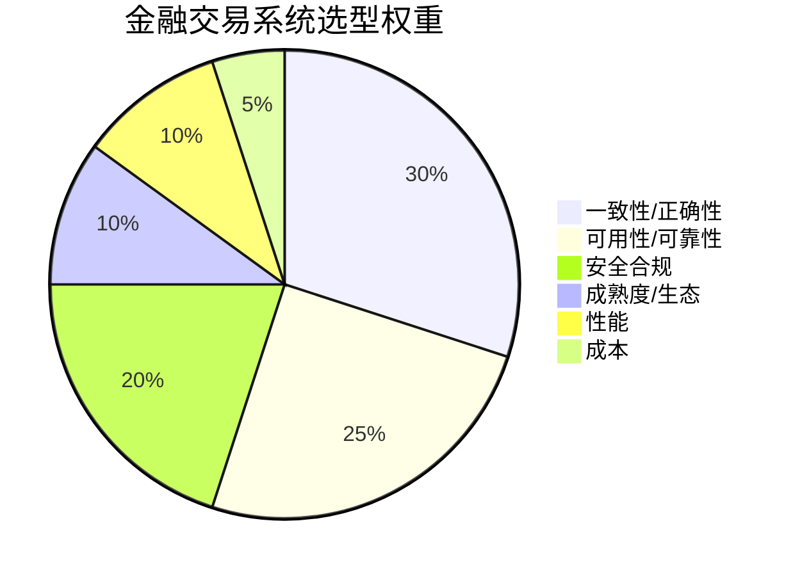
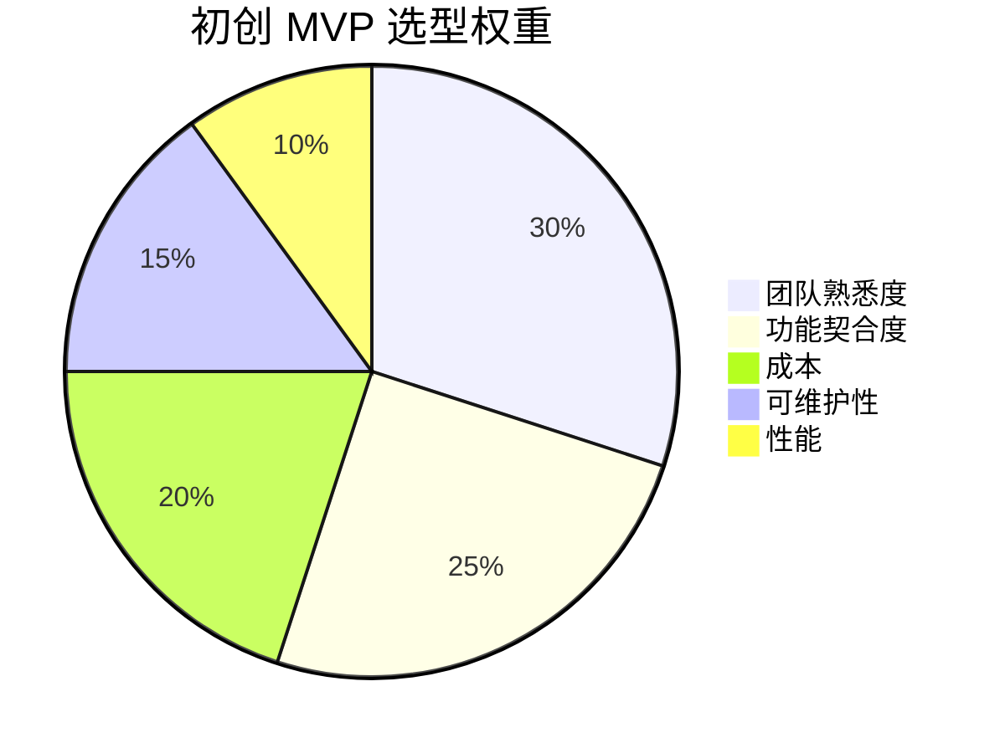
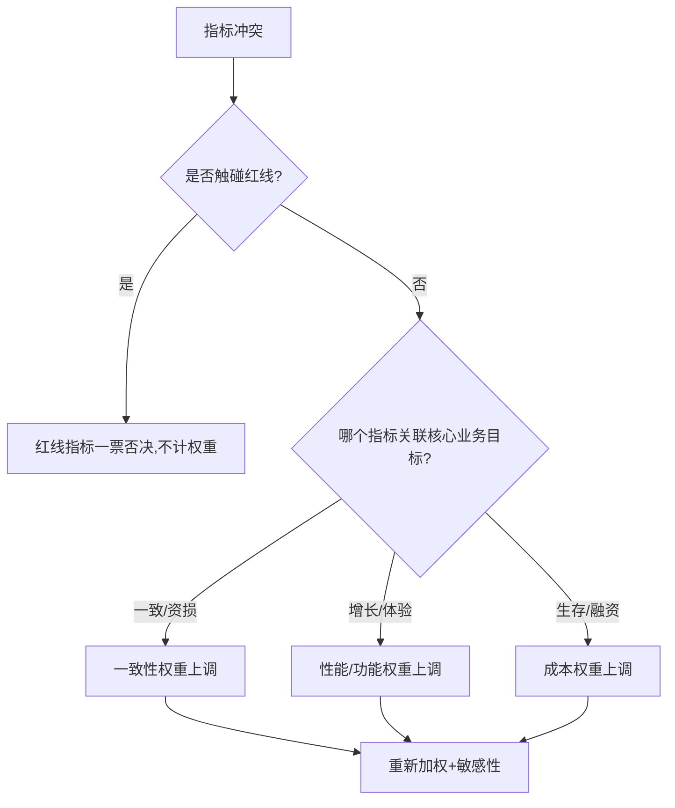

# 02 · 选型关键指标体系

> 上篇讲了"怎么想"，这篇讲"看什么"。选型之所以玄学，是因为大家嘴里的"好"指的是不同东西。把指标**显性化、结构化、可量化**，决策才有客观依据。

---

## 一、指标全景（11 维）

任何技术选型，都逃不出这 11 个维度。不同场景只是**权重不同**，不是维度不同。

| # | 维度 | 问自己的问题 | 典型度量 |
|---|------|--------------|----------|
| 1 | **功能契合度** | 它能不能直接解决我的问题？要改多少？ | 覆盖需求比例、定制量 |
| 2 | **性能** | 快不快？扛不扛得住？ | 吞吐(QPS/TPS)、延迟(p99/p999)、并发 |
| 3 | **一致性/正确性** | 数据会不会错、丢、乱序？ | 一致性级别、丢消息率、乱序率 |
| 4 | **可用性/可靠性** | 挂了怎么办？能多快恢复？ | SLA(几个9)、MTTR、容灾能力 |
| 5 | **可扩展性** | 业务涨 10 倍要怎么扩？ | 水平扩展成本、分片友好度 |
| 6 | **可维护性/可观测性** | 出事看得懂、改得动吗？ | 文档质量、Metrics/Log/Trace 支持 |
| 7 | **成熟度/生态/社区** | 会不会突然没人维护？招得到人吗？ | 版本稳定性、GitHub Star/贡献者、发布频率 |
| 8 | **团队熟悉度** | 我们团队会用吗？踩坑要多久？ | 已有经验、学习曲线、招人难度 |
| 9 | **成本 (TCO)** | 全周期要花多少钱？ | License + 人力 + 基础设施 + 运维 |
| 10 | **安全合规** | 过得了安全/合规审计吗？ | 加密/审计/等保/信创兼容 |
| 11 | **供应商风险/锁定** | 被绑死了吗？换得起吗？ | 标准协议、迁移成本、单点依赖 |

---

## 二、指标如何加权：场景决定权重

**核心认知：没有"绝对好"的技术，只有"对你的场景加权后分最高"的技术。**

### 2.1 不同场景的典型权重分布





> 金融把"一致性+合规"放到 70%，初创把"熟悉度+速度"放到 55%——同样的候选清单，排出来的第一名可能完全不同。**这就是加权的力量**。

### 2.2 加权打分模板

```
得分 = Σ( 指标i得分(1-5) × 权重i(0-1) )

注意：
- 得分标度要统一（1=很差 3=及格 5=优秀），并写清每档定义
- 权重总和为 100%
- 做敏感性分析：权重±20% 后排名是否反转？
```

---

## 三、一票否决项（红线指标）

有些指标不是"加权"，而是**不达标直接出局**：

| 红线场景 | 一票否决项 |
|----------|------------|
| 金融/支付 | 不支持事务/对账、数据可能丢失 |
| 涉政/国企 | 不满足信创（国产化）、无等保资质 |
| 强合规（医疗/金融数据） | 数据必须不出域，却依赖境外 SaaS |
| 高并发核心链路 | p99 在压测下超 SLA 且无降级方案 |
| 长期维护项目 | 社区已停更 / 单公司独大且闭源 |

> **红线指标不参与加权，先做"及格线过滤"，再对剩下的做加权排序。**

---

## 四、量化 vs 定性

不是所有指标都能精确量化，要分清：

| 类型 | 例子 | 怎么处理 |
|------|------|----------|
| **可精确量化** | QPS、延迟、License 价格 | 直接测、直接算 |
| **可半量化** | 社区活跃度（Star/提交频率）、学习曲线（上手周数） | 给代理指标 + 量表 |
| **偏定性** | 文档质量、团队"感觉"、生态"氛围" | 1-5 分量表 + 必须写依据 |

> **定性指标必须写依据**，否则就退化成"我觉得"。例："团队熟悉度=5：团队 3 人都有 2 年 Spring 经验，且现有系统已用"。

---

## 五、指标陷阱（别被数字骗了）

| 陷阱 | 真相 |
|------|------|
| **基准测试造假** | 厂商 benchmark 常用最优配置/最小数据集；要自己用真实数据复测 |
| **忽略隐性成本** | 开源"免费"但运维要 2 个人；闭源贵但省心——TCO 才公平 |
| **Demo ≠ 生产** | 官网示例跑得飞起，真实负载下 GC 崩了 |
| **峰值 ≠ 常态** | p99 好看但长尾 p999 崩；看分位而非平均 |
| **过早优化指标** | 为"未来 100 万 QPS"牺牲当下开发效率 |
| **单一指标冠军** | 某项第一但其他全崩（如某 DB 写入快但 JOIN 弱） |

---

## 六、指标体系速查卡

```
评估一项技术，逐维过一遍（✓=达标 / △=需 POC / ✗=出局）：
[ ] 功能契合：覆盖需求 ≥80%？定制量可接受？
[ ] 性能：实测 p99 在 SLA 内？（自己压，别信榜单）
[ ] 一致性：数据不丢不错？
[ ] 可用性：有容灾/降级？MTTR 可接受？
[ ] 扩展：涨 10 倍怎么扩？
[ ] 可维护：文档/监控/日志齐？
[ ] 生态：社区活？招得到人？
[ ] 团队：会用？踩坑成本低？
[ ] 成本：TCO 算过？
[ ] 合规：过审计？
[ ] 锁定：换得起？
```

---

## 七、一句话总结

> **指标是选型的"通用语言"：把"好"拆成 11 维，用场景定权重，用红线做过滤，用 POC 验真值。** 没有这个体系，选型永远是主观偏好。

---

## 八、POC 验证清单（指标落地成实验）

指标说了「该看什么」，POC 回答「实际行不行」。一份标准 POC 至少包含：

```
1. 压测方案：真实数据量 + 目标 QPS/TPS + 时长（30min+，含长尾）
2. 故障演练：节点挂 1/3、网络抖动、磁盘慢——看降级与恢复行为
3. 运维演练：部署/升级/回滚/扩缩容的实操成本（多人协作试一次）
4. 代码级：集成真实业务代码跑通核心链路（不是 Hello World）
5. 交付物：对比表 + 压测报告 + 决策建议（含 ADR 草稿）
```

| POC 常见失败 | 原因 | 规避 |
|--------------|------|------|
| 压测数据太干净 | 没含脏数据/热点 key | 用生产样本脱敏 |
| 只测最好配置 | 没测默认配置行为 | 同时记录「默认 + 调优」两档 |
| 没测恢复 | 只看正常态 | 强制演练 kill -9 后行为 |
| 没留记录 | 结论拍脑袋 | POC 报告作为 ADR 附件归档 |

> 心法：**POC 的目的不是「证明它行」，而是「尽早暴露它不行的方式」**——把失败留到实验环境，把稳定留给生产。

---

## 九、权重标定方法（别拍脑袋定权重）

权重决定排名，所以权重的来源必须"可辩护"。三种常用标定法：

### 9.1 业务目标倒推法（最常用）

```
1. 列出本系统 Top3 业务目标（如：交易零资损 / 大促不宕机 / 上线快）
2. 每个目标映射到受影响的指标维度
3. 受多个核心目标共同影响的维度 → 权重高
4. 只剩" nice to have"的维度 → 权重低
```

例：支付系统目标 =「零资损 + 监管可审计」→ 一致性/正确性、安全合规权重天然最高。

### 9.2 德尔菲法（多人共识）

```
1. 找 3-5 个相关角色（架构/开发/运维/业务）背对背打分权重
2. 汇总均值与离散度
3. 离散度大 → 组织对齐：讨论分歧直至收敛
4. 输出"共识权重"，避免一人独断
```

### 9.3 信息量法（熵权法思路，客观加权）

当历史数据充足时，可用各指标在候选间的"区分度"自动定权——区分度越大的指标权重越高：

```python
import math
# 候选在 4 个指标上的归一化得分矩阵（行=候选，列=指标）
M = [[5,3,4,2],[2,5,4,3],[3,1,5,5]]
cols = list(zip(*M))
weights = []
for c in cols:
    p = [x/sum(c) for x in c]
    e = -sum(x*math.log(x) for x in p if x>0) / math.log(len(c))  # 信息熵
    weights.append(1 - e)                                          # 区分度
s = sum(weights); weights = [round(w/s,3) for w in weights]
print("客观权重(区分度越高权重越大):", weights)
```

> 注意：客观法（熵权法）只反映"数据差异"，不反映"业务重要性"。实战中**主观业务权重为主、客观权重为辅**，二者冲突时以业务为准。

---

## 十、多场景权重基准表（直接套用再微调）

不同场景的权重分布差异极大。给出四套"基准权重"，套用后按自己约束微调：

| 维度 \ 场景 | 金融交易 | 电商大促 | 初创 MVP | 政企信创 |
|-------------|:---:|:---:|:---:|:---:|
| 一致性/正确性 | 30 | 18 | 12 | 15 |
| 可用性/可靠性 | 22 | 28 | 12 | 15 |
| 安全合规 | 18 | 8 | 6 | 35 |
| 性能 | 10 | 26 | 8 | 8 |
| 功能契合 | 8 | 8 | 25 | 10 |
| 团队熟悉度 | 5 | 5 | 30 | 5 |
| 成本 TCO | 4 | 4 | 25 | 8 |
| 生态/成熟度 | 2 | 2 | 5 | 2 |
| 可维护性 | 1 | 1 | 10 | 2 |
| 锁定风险 | 0 | 0 | 5 | 0 |

> 用法：先把基准权重贴进自己的评估表，再按"硬约束"上下浮动。金融把"一致+合规"压到 70%，政企把"合规"单拉到 35%——这就是场景决定权重的具象化。

---

## 十一、1-5 量表的标定（让打分可比较）

不标定量表，打分就是"个人心情"。建议统一如下刻度，并要求"每分必须有事实支撑"：

| 分 | 含义 | 必须附的依据示例 |
|----|------|------------------|
| 1 | 完全不满足，有致命缺陷 | "无事务支持，支付场景直接出局" |
| 2 | 勉强可用，需大量改造 | "要自研代理层才能分片" |
| 3 | 及格，开箱即用但有短板 | "主从成熟，但分析需外挂" |
| 4 | 良好，基本契合 | "事务消息原生支持，仅需适配" |
| 5 | 优秀，行业标杆 | "千万级吞吐经生产验证" |

---

## 十二、指标怎么"抓"：从监控与文档取数

定性靠量表，定量要真数据。给出常见指标的数据来源：

| 指标 | 数据来源 | 工具/方法 |
|------|----------|-----------|
| 吞吐 QPS/TPS | 压测 + 生产监控 | wrk / JMeter / Prometheus |
| 延迟 p99/p999 | 压测分布 | 压测报告分位图 |
| 一致性 | 对账差异率 | 双写对账脚本 |
| 可用性 SLA | 历史故障记录 | 监控看板 MTTR |
| 成本 TCO | 人力+资源账单 | 资源单价 × 规模 |
| 生态活跃度 | 社区数据 | GitHub 提交/Issue 响应 |
| 团队熟悉度 | 内部技能盘点 | 技能矩阵表 |

```bash
# 最简压测示例：用 wrk 测某接口 30s、12 线程、400 连接，看延迟分布
wrk -t12 -c400 -d30s --latency http://svc/api/order
# 输出关注：Latency 的 p50/p90/p99，Requests/sec（吞吐）
```

> 心法：**定量指标自己测，定性指标写依据，红线指标先过滤**。三者齐了，矩阵才可信。

---

## 十三、指标体系的速记口诀

```
指标十一维，场景定权重；
红线先过滤，加权才公平；
定量自己测，定性写依据；
基准别全信，分位看长尾；
权重会作弊，德尔菲对齐；
敏感性兜底，反转要 POC。
```

---

## 十四、指标冲突时的裁决原则

现实里指标常打架：性能要最高、成本要最低、一致性要最强——三者不可兼得。裁决靠"约束优先级"：



通用裁决序（从硬到软）：**合规/安全 → 一致性（资损） → 可用性 → 性能 → 功能 → 成本 → 熟悉度**。前三项多为红线，后四项可加权协商。

---

## 十五、指标采集的代码化（把"主观"变成"可跑"）

定性指标也能半自动化采集，减少"拍脑袋"：

```python
# 用 GitHub API 给"生态活跃度"打客观分（替代纯主观）
import requests
repo = "apache/kafka"
data = requests.get(f"https://api.github.com/repos/{repo}").json()
# 客观代理指标：Star、近一月提交数、Open Issue 响应速度
score = data["stargazers_count"] // 1000 + data["forks_count"] // 500
print(f"{repo} 生态客观分(代理): {score}")
```

> 注意：这只是"代理指标"，最终打分仍需结合团队实际（见 02 篇"量化 vs 定性"）。代码负责"去主观化"，人负责"定权重"。

---

## 十六、指标体系的常见失效模式

| 失效 | 表现 | 修正 |
|------|------|------|
| 维度缺失 | 漏了"运维成本"导致选了养不起的 | 11 维逐维过 |
| 权重倒置 | 把"熟悉度"放第一，忽视正确性 | 业务目标倒推权重 |
| 量表漂移 | 不同人"4 分"标准不同 | 统一 1-5 标定表 |
| 红线软化 | 合规也参与加权，最后被加权稀释 | 红线先过滤再加权 |
| 只看均值 | 平均 QPS 高但 p999 崩 | 看分位分布 |

---

## 十七、面试高频追问

1. Q：选型指标体系里最重要的是哪几个？ A：没有固定答案——先用红线过滤（合规/一致性/可用性），再按场景加权（金融重一致、初创重熟悉度）；功能契合与 TCO 永远是核心两维。
2. Q：怎么防止被 benchmark 骗？ A：用自己真实数据 + 目标负载复测，看分位（p99/p999）不看平均，看默认配置也看调优上限。
3. Q：加权打分有没有套路？ A：统一 1-5 分量表并写清每档定义 + 权重归一化 + 敏感性分析（权重 ±20% 排名是否反转），防止「感觉第一」。
4. Q：开源免费是不是就选它？ A：TCO 才算数——开源省 License 但运维/排障/定制人力可能更贵；结合团队能力与社区活跃度评估。
5. Q：什么时候该放弃一个候选？ A：命中任何一条红线（数据丢失风险、停更、合规不满足）直接出局，不参与加权——加权只解决「都达标了怎么选」。

---

## 十八、指标体系的工程化：从"一张表"到"一套机制"

指标不该只活在选型评审的 PPT 里，而应变成可追踪、可复跑的"评估系统"：

| 层级 | 做法 | 说明 |
|------|------|------|
| 指标采集 | 压测平台 + 监控 + 社区 API | 定量指标自动取数，减少人工拍脑袋 |
| 打分固化 | 矩阵模板进代码库（如 `adr/matrix/` 下的 yaml） | 每次选型用同一把尺子 |
| 敏感性自动跑 | 跑权重 ±20% 脚本，输出"是否反转" | 见 01 篇十一节的 Python |
| 结果归档 | 打分结果 + ADR 互链 | 让"为什么这么打"可追溯 |
| 复审触发 | 指标阈值告警（如社区月提交骤降） | 自动提示复审，而非靠人记 |

> 心法：**指标体系的价值不在"选完那一下"，而在"半年后还能复查当初的假设是否成立"**。把它工程化，才能让经验复利。

---

## 十九、红线指标落地清单（直接贴进评审会）

把 02 篇第三章的"一票否决"拍成可勾选的硬门禁，评审会前过一遍：

```
[ ] 合规/信创：是否命中强制项（等保/国密/不出境）？命中且不达标 → 直接出局
[ ] 一致性：金融/支付是否支持事务与对账？不支持 → 出局
[ ] 性能底线：压测 p99 是否 ≤ SLA？超且无降级 → 出局
[ ] 生存性：社区是否停更 > 1 年 / 单公司闭源独大？是 → 谨慎或出局
[ ] 成本上限：TCO 是否超预算红线？超 → 出局
[ ] 团队底线：核心链路技术是否无人能维护？是 → 出局或重培训

红线全过 → 进入加权矩阵（11 维 + 场景权重）
任一不过 → 该候选直接淘汰，不进矩阵
```

> 红线是"筛子"，矩阵是"天平"：**先用筛子滤掉不可能的，再用天平称出最合适的**。顺序不能反——拿停更的技术去做加权打分，纯属浪费时间。

---

## 二十、指标维度的"反直觉"权重案例

同样的候选，权重一变结论就翻。再补两个实战反例，体会"场景定权重"：

| 场景 | 被低估的维度 | 结果 |
|------|--------------|------|
| 内部工具（用几次/周） | 团队熟悉度被压到 5% | 选了"功能强但没人会"的，半年没人动，重写 |
| 出海业务 | 合规（数据出境）漏算 | 上线被监管叫停，回炉私有化，损失数月 |

> 一句话：**权重错位的代价，远大于"选错技术"本身**——因为权重错了，你连"错在哪"都看不到。

---

## 二十一、再补一条面试高频追问

6. Q：指标体系会不会让选型变得太重、太慢？ A：框架是"护栏"不是"枷锁"。小决策用"红线 + 直觉 + 逃生通道"三步即可；只有高代价、难回滚的决策才值得完整矩阵 + POC。框架的用量，应与"选错的成本"成正比。
