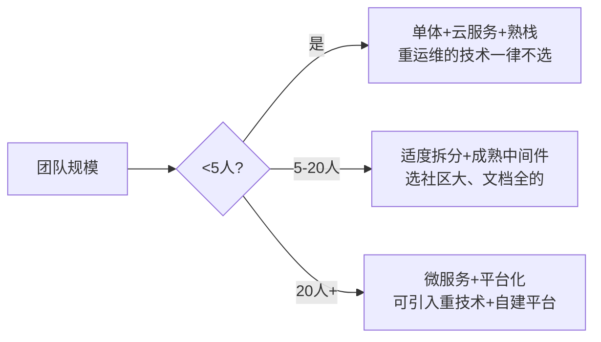

# 03 · 结合业务场景的选型决策

> 前两篇给了"思考框架"和"指标清单"。这篇是**实战的关键**：同一个技术，在 A 场景是神器，在 B 场景是累赘。**场景决定一切。**

---

## 一、选型的第一性：先给场景画像

在打开任何榜单前，先填这张"场景画像表"：

| 维度 | 要回答 |
|------|--------|
| **数据规模** | 当前 / 1 年后数据量？GB / TB / PB？ |
| **读写比** | 读多写少 / 写多读少 / 读写均衡？ |
| **延迟要求** | 实时(<10ms) / 近实时(<1s) / 离线(T+1)？ |
| **一致性要求** | 强一致 / 最终一致 / 可容忍丢失？ |
| **峰值特征** | 平稳 / 周期峰值（大促）/ 突发？ |
| **合规要求** | 数据出境 / 等保 / 信创 / 审计？ |
| **团队现状** | 几个人？熟什么栈？招人难度？ |
| **工期** | MVP 两周 / 半年规划？ |

> **画像不清，选型必偏。** 很多"该用 Kafka 还是 RabbitMQ"的争论，本质是没先回答"吞吐多大、要不要严格顺序、要不要事务消息"。

---

## 二、场景 → 技术映射决策树

```mermaid
flowchart TD
    Root[业务场景] --> Q1{数据量级?}
    Q1 -->|GB级/单机可扛| S1[MySQL主从 + Redis缓存<br/>能不分布式就不分布]
    Q1 -->|TB级/高并发| S2{读写特征?}
    S2 -->|读多写少| S3[加多级缓存+读副本+CDN]
    S2 -->|写多/交易| S4[分库分表 + MQ削峰 + 异步化]
    S2 -->|海量检索| S5[ES/ClickHouse 专用引擎]
    Q1 -->|PB级/分析| S6[数据湖+Spark/Flink]

    Root --> Q2{一致性要求?}
    Q2 -->|强一致/金融| T1[分布式事务TCC/Saga + 对账<br/>NewSQL(TiDB/OceanBase)]
    Q2 -->|最终一致| T2[MQ最终一致 + 幂等补偿]

    Root --> Q3{实时性?}
    Q3 -->|实时决策| R1[Flink/CEP + 规则引擎]
    Q3 -->|离线批| R2[Spark + 调度]
    Q3 -->|时序监控| R3[TSDB(InfluxDB/TDengine)]

    Root --> Q4{合规?}
    Q4 -->|数据不出域| P1[私有化部署 + 信创栈]
    Q4 -->|等保/审计| P2[带审计日志 + 加密 + 权限隔离]
```

---

## 三、典型场景画像与推荐组合

### 3.1 高并发"读多写少"（内容/Feed/商品详情）

- **特征**：读 QPS 极高、写少、允许短暂不一致。
- **组合**：MySQL 主从（读副本分担）+ Redis 多级缓存 + CDN（静态）+ 本地缓存(Caffeine)防击穿。
- **不该选**：一上来就分库分表（增加复杂度，收益低）。

### 3.2 高并发"写/交易"（下单/支付/抢购）

- **特征**：写峰值高、不能超卖、不能丢单。
- **组合**：分库分表（按用户/订单号）+ MQ 削峰填谷 + 库存 Redis 预扣 + 异步化非核心链路。
- **关键**：防超卖（分布式锁/Lua 原子）+ 幂等（唯一索引兜底）。

### 3.3 强一致金融（支付/清算/账务）

- **特征**：数据绝对不能错、不能丢、可审计。
- **组合**：支持事务的数据库 + 分布式事务（TCC/Saga/本地消息表）+ **对账机制** + 多副本强同步 + 同城双活。
- **不该选**：纯最终一致、无事务消息的 MQ（除非配补偿）。

### 3.4 海量数据低延迟检索（搜索/日志/OLAP）

- **特征**：数据量大、查询灵活、容忍秒级延迟。
- **组合**：ES（搜索/日志）、ClickHouse/Doris（OLAP 报表）、专用列存。
- **不该选**：用 MySQL 跑复杂聚合（慢且拖垮主库）。

### 3.5 时序 / 监控 / IoT（储能/设备遥测见业务模型）

- **特征**：写多、按时间查、数据量大但单条简单。
- **组合**：TSDB（InfluxDB / TDengine / VictoriaMetrics）+ MQTT 接入。
- **不该选**：用关系库存时序（索引膨胀、写入瓶颈）。

### 3.6 高可用 / 容灾（核心链路）

- **特征**：不允许长时间挂。
- **组合**：多机房多活 / 单元化 + 限流熔断降级 + 故障转移 + 演练。
- 参考「[SRE与稳定性工程](../SRE与稳定性工程/)」「[场景设计/异地多活](../场景设计/异地多活.md)」。

### 3.7 合规 / 数据不出域（政企/金融内网）

- **特征**：数据不能出域、要信创、要等保。
- **组合**：私有化部署 + 国产数据库（OceanBase/TiDB 信创版）+ 国密 + 审计。
- 参考「[安全工程/数据安全](../安全工程/05-数据安全与密码学基础.md)」。

### 3.8 初创 MVP（速度优先）

- **特征**：人少、要快、需求不确定。
- **组合**：单体 + 托管云服务（RDS/对象存储/托管 MQ）+ 团队最熟的栈。
- **原则**：YAGNI，为当前 + 1 阶设计，**别提前上微服务/分布式**。

### 3.9 大厂规模化（治理优先）

- **特征**：百人团队、几百服务、要统一治理。
- **组合**：微服务 + 服务网格 + 统一中间件平台 + 标准化（参考「[架构/企业架构](../架构/企业架构.md)」）。
- **原则**：把"复用/治理"权重放到最高。

---

## 四、团队规模与成熟度匹配



> **选技术要看"团队能不能养得起"。** Kafka 很香，但 3 人团队可能 80% 精力在运维它。这种隐性成本，权重里必须体现（见 [02 篇](02-选型关键指标体系.md) 第 8、9 维）。

---

## 五、演进视角：选型不是一次性


> **好的选型留"演进阶梯"**：每一步都是上一步的自然延伸，而不是推倒重来。
> **反例**：一开始就用最重的方案，团队被运维压垮；或一开始过度简化，量一上来就得重写。

**演进原则**：
- 先单体后分布（能主从解决的别分片）。
- 先同步后异步（能同步搞定的别 MQ）。
- 选"可平滑升级"的技术（如 MySQL→TiDB 比 Oracle→某自研平滑）。

---

## 六、反模式速记

| 反模式 | 表现 | 修正 |
|--------|------|------|
| 用大炮打蚊子 | MVP 上 K8s+微服务+分库分表 | 单体 + 云托管 |
| 用蚊子拍大炮 | PB 数据用 MySQL 硬扛 | 直接选专用引擎 |
| 唯大厂论 | 不顾场景复制大厂栈 | 先对齐场景画像 |
| 一次性到位 | 为 3 年后规模提前重装 | 为当前+1阶设计 |
| 忽视养不起 | 选了团队运维不动的技术 | 团队熟悉度加权 |

---

## 七、一句话总结

> **场景是选型的输入，指标是选型的语言，决策是选型的输出。** 先画像、再映射、后加权——技术榜单只是参考答案，不是标准答案。
