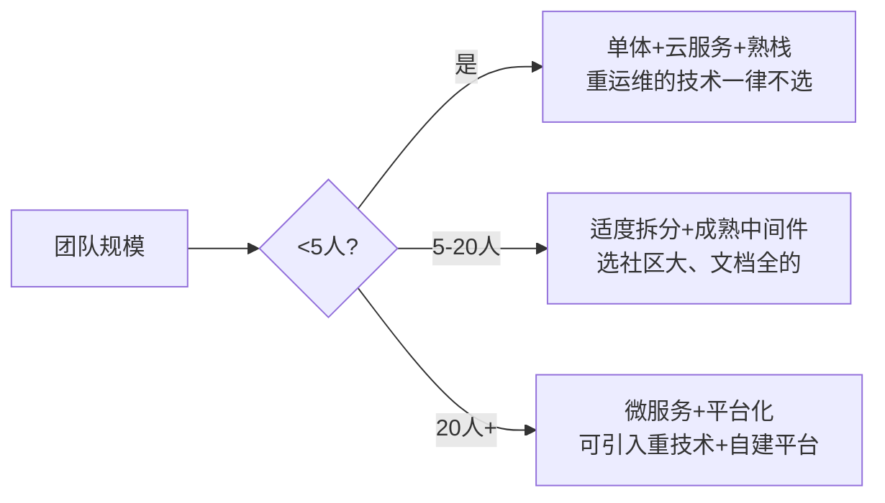

# 03 · 结合业务场景的选型决策

> 前两篇给了"思考框架"和"指标清单"。这篇是**实战的关键**：同一个技术，在 A 场景是神器，在 B 场景是累赘。**场景决定一切。**

---

## 一、选型的第一性：先给场景画像

在打开任何榜单前，先填这张"场景画像表"：

| 维度 | 要回答 |
|------|--------|
| **数据规模** | 当前 / 1 年后数据量？GB / TB / PB？ |
| **读写比** | 读多写少 / 写多读少 / 读写均衡？ |
| **延迟要求** | 实时(<10ms) / 近实时(<1s) / 离线(T+1)？ |
| **一致性要求** | 强一致 / 最终一致 / 可容忍丢失？ |
| **峰值特征** | 平稳 / 周期峰值（大促）/ 突发？ |
| **合规要求** | 数据出境 / 等保 / 信创 / 审计？ |
| **团队现状** | 几个人？熟什么栈？招人难度？ |
| **工期** | MVP 两周 / 半年规划？ |

> **画像不清，选型必偏。** 很多"该用 Kafka 还是 RabbitMQ"的争论，本质是没先回答"吞吐多大、要不要严格顺序、要不要事务消息"。

---

## 二、场景 → 技术映射决策树

```mermaid
flowchart TD
    Root[业务场景] --> Q1{数据量级?}
    Q1 -->|GB级/单机可扛| S1[MySQL主从 + Redis缓存<br/>能不分布式就不分布]
    Q1 -->|TB级/高并发| S2{读写特征?}
    S2 -->|读多写少| S3[加多级缓存+读副本+CDN]
    S2 -->|写多/交易| S4[分库分表 + MQ削峰 + 异步化]
    S2 -->|海量检索| S5[ES/ClickHouse 专用引擎]
    Q1 -->|PB级/分析| S6[数据湖+Spark/Flink]

    Root --> Q2{一致性要求?}
    Q2 -->|强一致/金融| T1[分布式事务TCC/Saga + 对账<br/>NewSQL(TiDB/OceanBase)]
    Q2 -->|最终一致| T2[MQ最终一致 + 幂等补偿]

    Root --> Q3{实时性?}
    Q3 -->|实时决策| R1[Flink/CEP + 规则引擎]
    Q3 -->|离线批| R2[Spark + 调度]
    Q3 -->|时序监控| R3[TSDB(InfluxDB/TDengine)]

    Root --> Q4{合规?}
    Q4 -->|数据不出域| P1[私有化部署 + 信创栈]
    Q4 -->|等保/审计| P2[带审计日志 + 加密 + 权限隔离]
```

---

## 三、典型场景画像与推荐组合

### 3.1 高并发"读多写少"（内容/Feed/商品详情）

- **特征**：读 QPS 极高、写少、允许短暂不一致。
- **组合**：MySQL 主从（读副本分担）+ Redis 多级缓存 + CDN（静态）+ 本地缓存(Caffeine)防击穿。
- **不该选**：一上来就分库分表（增加复杂度，收益低）。

### 3.2 高并发"写/交易"（下单/支付/抢购）

- **特征**：写峰值高、不能超卖、不能丢单。
- **组合**：分库分表（按用户/订单号）+ MQ 削峰填谷 + 库存 Redis 预扣 + 异步化非核心链路。
- **关键**：防超卖（分布式锁/Lua 原子）+ 幂等（唯一索引兜底）。

### 3.3 强一致金融（支付/清算/账务）

- **特征**：数据绝对不能错、不能丢、可审计。
- **组合**：支持事务的数据库 + 分布式事务（TCC/Saga/本地消息表）+ **对账机制** + 多副本强同步 + 同城双活。
- **不该选**：纯最终一致、无事务消息的 MQ（除非配补偿）。

### 3.4 海量数据低延迟检索（搜索/日志/OLAP）

- **特征**：数据量大、查询灵活、容忍秒级延迟。
- **组合**：ES（搜索/日志）、ClickHouse/Doris（OLAP 报表）、专用列存。
- **不该选**：用 MySQL 跑复杂聚合（慢且拖垮主库）。

### 3.5 时序 / 监控 / IoT（储能/设备遥测见业务模型）

- **特征**：写多、按时间查、数据量大但单条简单。
- **组合**：TSDB（InfluxDB / TDengine / VictoriaMetrics）+ MQTT 接入。
- **不该选**：用关系库存时序（索引膨胀、写入瓶颈）。

### 3.6 高可用 / 容灾（核心链路）

- **特征**：不允许长时间挂。
- **组合**：多机房多活 / 单元化 + 限流熔断降级 + 故障转移 + 演练。
- 参考「[SRE与稳定性工程](../SRE与稳定性工程/)」「[场景设计/异地多活](../场景设计/异地多活.md)」。

### 3.7 合规 / 数据不出域（政企/金融内网）

- **特征**：数据不能出域、要信创、要等保。
- **组合**：私有化部署 + 国产数据库（OceanBase/TiDB 信创版）+ 国密 + 审计。
- 参考「[安全工程/数据安全](../安全工程/05-数据安全与密码学基础.md)」。

### 3.8 初创 MVP（速度优先）

- **特征**：人少、要快、需求不确定。
- **组合**：单体 + 托管云服务（RDS/对象存储/托管 MQ）+ 团队最熟的栈。
- **原则**：YAGNI，为当前 + 1 阶设计，**别提前上微服务/分布式**。

### 3.9 大厂规模化（治理优先）

- **特征**：百人团队、几百服务、要统一治理。
- **组合**：微服务 + 服务网格 + 统一中间件平台 + 标准化（参考「[架构/企业架构](../架构/企业架构.md)」）。
- **原则**：把"复用/治理"权重放到最高。

---

## 四、团队规模与成熟度匹配



> **选技术要看"团队能不能养得起"。** Kafka 很香，但 3 人团队可能 80% 精力在运维它。这种隐性成本，权重里必须体现（见 [02 篇](02-选型关键指标体系.md) 第 8、9 维）。

---

## 五、演进视角：选型不是一次性


> **好的选型留"演进阶梯"**：每一步都是上一步的自然延伸，而不是推倒重来。
> **反例**：一开始就用最重的方案，团队被运维压垮；或一开始过度简化，量一上来就得重写。

**演进原则**：
- 先单体后分布（能主从解决的别分片）。
- 先同步后异步（能同步搞定的别 MQ）。
- 选"可平滑升级"的技术（如 MySQL→TiDB 比 Oracle→某自研平滑）。

---

## 六、反模式速记

| 反模式 | 表现 | 修正 |
|--------|------|------|
| 用大炮打蚊子 | MVP 上 K8s+微服务+分库分表 | 单体 + 云托管 |
| 用蚊子拍大炮 | PB 数据用 MySQL 硬扛 | 直接选专用引擎 |
| 唯大厂论 | 不顾场景复制大厂栈 | 先对齐场景画像 |
| 一次性到位 | 为 3 年后规模提前重装 | 为当前+1阶设计 |
| 忽视养不起 | 选了团队运维不动的技术 | 团队熟悉度加权 |

---

## 七、场景画像的量化模板（把"感觉"变成"数字"）

画像表不能只写"高并发"，要能量化。下面给一套可直接填的模板，含容量估算口径：

```
【业务画像】
- 数据规模：当前 ___ GB；1 年后预估 ___ TB（按 日增量×365×冗余 估）
- 峰值 QPS：读 ___ / 写 ___ （来源：历史监控 or 业务目标÷秒数）
- 读写比：___ : ___ （如 9:1 读多写少）
- 延迟 SLA：P99 < ___ ms（实时/近实时/离线）
- 一致性：强一致 / 最终一致 / 可丢
- 峰值特征：平稳 / 周期(大促×N) / 突发(峰值/均值=___)
- 合规：数据出域? 等保级别? 信创? 审计?

【容量估算示例】
- 单条记录 ≈ 1KB，日增 1000 万 → 日增 10GB，年增 ≈ 3.6TB
- 若单表建议 < 5000 万行(≈50GB)：约 5 个月触顶 → 必须提前分表或归档
```

> 画像不清，映射必偏。上面这套数字出来后，"要不要分库分表""要不要 NewSQL"就不再是玄学。

---

## 八、场景 → 技术映射速查表（决策树落地成表）

把第二篇的决策树拍平成可直接查的表：

| 场景特征 | 首选组合 | 明确不选 |
|----------|----------|----------|
| 数据 < 500GB，读多写少 | MySQL 主从 + Redis + CDN | 一上来分库分表 |
| 数据 TB 级，高并发写 | 分库分表 + MQ 削峰 + Redis 预扣 | 单机 MySQL 硬扛 |
| 强一致 + 可审计（金融） | 事务型 DB + 分布式事务 + 对账 | 纯最终一致 MQ |
| 海量检索 / 日志 | ES / ClickHouse / Doris | MySQL 跑聚合 |
| 时序 / IoT 遥测 | TSDB（TDengine/VM） | 关系库存时序 |
| 实时计算 / 风控 | Flink + 规则引擎 | 仅用批处理 |
| 合规 / 不出域 | 私有化 + 信创栈 + 国密 | 境外 SaaS |
| 初创 MVP | 单体 + 托管云 + 熟栈 | 全套 K8s+微服务 |

---

## 九、典型场景代码级要点（不只是"选了谁"）

### 9.1 高并发写（防超卖）——Redis + Lua 原子预扣

```lua
-- 库存预扣：原子判断+扣减，避免并发超卖
-- KEYS[1]=库存key  ARGV[1]=扣减数量
local stock = tonumber(redis.call('GET', KEYS[1]))
local dec = tonumber(ARGV[1])
if not stock or stock < dec then
  return 0   -- 库存不足
end
redis.call('DECRBY', KEYS[1], dec)
return 1     -- 预扣成功
```

```java
// 预扣成功后异步落库 + 发 MQ，失败补偿回滚库存
Boolean ok = redisTemplate.execute(preReduceScript,
        Collections.singletonList(stockKey), String.valueOf(1));
if (Boolean.FALSE.equals(ok)) throw new BizException("库存不足");
orderService.create(order);        // 落库
mq.send(new OrderCreated(order));   // 异步后续链路
```

### 9.2 读多写少——多级缓存防穿透/击穿

```java
// 本地(Caffeine) → Redis → DB，布隆过滤器挡穿透
String get(Long id){
  String v = local.get(id);
  if (v != null) return v;
  if (!bloom.mightContain(id)) return null;   // 穿透拦截
  v = redis.get(id);
  if (v == null) {
     v = db.load(id);                          // 击穿：单飞合并
     redis.set(id, v, 5, MINUTES);
  }
  local.put(id, v);
  return v;
}
```

---

## 十、团队规模 × 场景 的选型矩阵

| 团队/场景 | 读多写少 | 高并发写 | 强一致 | 海量分析 |
|-----------|----------|----------|--------|----------|
| <5 人 | 单体+云RDS+Redis | 云RDS+托管MQ | 云RDS事务+对账 | 托管数仓 |
| 5-20 人 | 主从+Redis集群 | 分库分表+MQ | 事务消息+补偿 | ClickHouse |
| 20+ 人 | 读写分离平台 | 自研/中间件分片 | NewSQL+多活 | 实时数仓平台 |

> 横轴看团队养不养得起，纵轴看场景要什么。**养不起的重技术，再对也是错。**

---

## 十一、演进阶梯的"平滑度"评估

选技术要看"下一步怎么走"。给出平滑度自评：

| 当前 → 下一步 | 平滑度 | 说明 |
|---------------|--------|------|
| 单体 MySQL → 主从 | ⭐⭐⭐⭐⭐ | 改连接串即可 |
| 主从 → 分库分表 | ⭐⭐⭐ | 需引入中间件/改 SQL |
| MySQL → TiDB | ⭐⭐⭐⭐ | 协议兼容，改动小 |
| Oracle → 自研 | ⭐ | 基本重写 |
| 单体 → 微服务 | ⭐⭐ | 组织+架构大改 |

> 平滑度高的演进，容错空间大；平滑度低，等于"赌现在选对"，风险集中。

---

## 十二、踩坑清单（场景错配的血泪）

| 坑 | 现象 | 根因 | 修正 |
|----|------|------|------|
| 读少写多却堆缓存 | 缓存命中率低、一致性噩梦 | 场景是写密集 | 先 MQ 削峰+分表 |
| MVP 上微服务 | 50% 精力在运维治理 | 规模不匹配 | 单体优先 |
| 金融用最终一致 MQ 裸跑 | 对账差错、资损 | 缺事务/补偿 | 加 TCC/本地消息表 |
| 用 MySQL 跑 OLAP | 慢查询拖垮主库 | 场景是分析 | 迁 ClickHouse/ES |
| 信创场景用境外 SaaS | 合规翻车 | 画像漏了合规 | 私有化+信创栈 |

---

## 十三、场景决策速记口诀

```
先画像，再映射，榜单只是参考答案；
读少写多别堆缓存，写多读少别裸 MySQL；
金融重一致，初创重速度，合规是红线；
演进留阶梯，平滑度高容错大；
养不起的重技术，再对也是错。
```

---

## 十四、容量规划与成本估算（场景画像的延伸）

画像之后还要算"钱"和"机器"，否则选型落地时预算爆雷：

```
【容量→资源估算】
- 数据总量 D(GB)，副本数 R，预留 30% → 存储 = D × R × 1.3
- 单节点可用内存 M，缓存命中率 h → 可缓存热数据 ≈ M × h
- 峰值 QPS Q，单实例承载 q → 实例数 = ceil(Q / q × 安全系数1.3)

【成本估算(TCO)】
TCO = License(若有) + 机器(节点数×单价×时长)
     + 人力(运维人月×单价 + 开发适配人月)
     + 隐性(排障/扩容/培训)
```

> 例：某读服务峰值 5 万 QPS，单实例 8000 QPS → 约 9 个实例（含安全系数）。若上 Redis 集群把 DB 读降 90%，DB 实例数可从 20 降到 4——**缓存省下的机器费可能远超 Redis 自身成本**。

---

## 十五、多活与单元化场景的选型

当业务到了"同城双活/异地多活"阶段，选型维度变了：

| 诉求 | 技术含义 | 选型关注 |
|------|----------|----------|
| 单元化 | 按用户分片，单元内自闭环 | 分片键能否对齐业务单元 |
| 异地多活 | 多地写，冲突收敛 | 是否支持 CRDT/冲突合并 |
| 容灾切换 | 单元挂了流量漂走 | 是否有全局路由+健康检查 |

> 多活不是"加机器"，是"架构级别的选型约束"——它会影响分片键、ID 生成、一致性方案的全链条（见 [分库分表与数据迁移](../分库分表与数据迁移/)）。

---

## 十六、场景错配的代价量化

错配不只是"不好用"，是实打实的成本：

| 错配 | 直接代价 | 间接代价 |
|------|----------|----------|
| 选小了 | 频繁扩容救火、限流丢单 | 用户流失、口碑 |
| 选大了 | 闲置资源 + 重运维 | 团队被拖垮、士气 |
| 选偏了 | 功能用不上/不够用 | 二次重构 |
| 选孤了 | 无人维护、CVE 不修 | 安全事件、重写 |

> 一句话：**选错的成本 = 直接资源浪费 + 机会成本（本可做别的事）**，后者往往更大。

---

## 十七、一句话总结

> **场景是选型的输入，指标是选型的语言，决策是选型的输出。** 先画像、再映射、后加权——技术榜单只是参考答案，不是标准答案。补一句：**画像要量化（含容量估算）、映射要拍表、演进要评平滑度**——把"我觉得该用 XX"变成"按这张表我该用 XX"。

---

## 十八、场景错配的"自救"路径（已经选偏了怎么办）

不是所有错配都要推倒重来，按"代价递增"分三档自救：

| 档位 | 适用 | 动作 |
|------|------|------|
| 轻 | 仅容量/性能余量不足 | 加缓存/读写分离/归档，先顶住 |
| 中 | 技术可用但成本高/运维重 | 加适配层（如代理/网关）隔离复杂度，逐步迁 |
| 重 | 根本性错配（如关系型扛时序） | 绞杀者模式渐进替换，老系统保留作回退 |

> 心法：**选偏不可怕，可怕的是"明知偏了还硬撑"**。错配自愈的第一原则是"止损优先于完美"——先让系统活下来，再慢慢换血。

---

## 十九、场景画像的"反向校验"（画像本身也会骗你）

画像填错，映射全错。给出画像最常见的三类失真与校验：

| 失真 | 表现 | 校验动作 |
|------|------|----------|
| 拍脑袋量级 | "大概几千万吧" | 拉生产监控/库表统计，用真实数据回填 |
| 峰值误估 | 用日均当峰值 | 取大促/突发真实峰值，算 峰值/均值 比 |
| 读写比误判 | 以为读多，实则写密 | 查慢查询 + 写 QPS 监控，确认主导负载 |

> 画像数据来源：库表 `information_schema` 行数、监控 QPS 曲线、业务目标反推。宁可多花半天核实画像，不省这步导致选错。

---

## 二十、再补一条场景速记

```
画像不清不映射，峰值日均莫混谈；
读写主次先定调，演进阶梯留平滑；
选偏三档可自救，止损优先于完美；
养不起的重技术，再对也是错。
```
