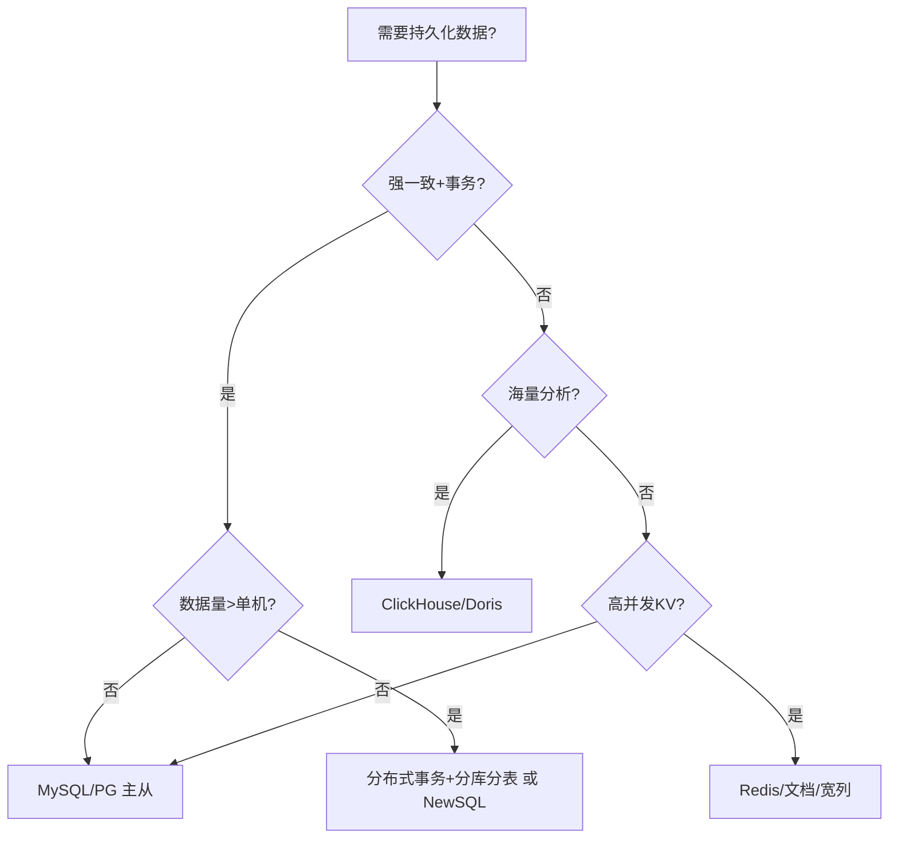

# 04 · 主流技术域选型对比

> 把最常见的技术域，按 [02 篇指标体系](02-选型关键指标体系.md) 做横向对比，并给**决策要点 checklist**。具体技术细节见「[基础知识/中间件](../基础知识/中间件/)」「[分库分表与数据迁移](../分库分表与数据迁移/)」「[开源项目](../开源项目/)」。

---

## 一、关系型数据库

| 候选 | 强项 | 弱项 | 适合场景 | 慎选场景 |
|------|------|------|----------|----------|
| **MySQL** | 生态最大、运维熟、主从成熟 | 单表过大需分表、复杂分析弱 | 绝大多数 OLTP 业务 | 超大规模/强分析 |
| **PostgreSQL** | 功能强(JSON/地理/窗口)、扩展好 | 运维人才略少、写入并发一般 | 复杂查询、GIS、混合负载 | 极简单 CRUD 且团队只熟 MySQL |
| **Oracle** | 企业级、稳定、强特性 | 贵、重、绑定 | 传统大企/强一致核心 | 初创/云原生优先 |
| **TiDB** | 水平扩展、MySQL 协议、HTAP | 运维重、对小数据过度 | 海量 OLTP+分析一体 | 数据量小（收益抵不过复杂度） |
| **OceanBase** | 金融级、高压缩、信创 | 学习曲线、闭源生态 | 金融/信创核心 | 非合规通用业务 |
| **CockroachDB** | 全球分布、强一致 | 延迟/成本、Postgres 协议 | 多地域强一致 | 单地域业务 |

**Checklist**：① 数据量会不会超单机？② 要不要 HTAP？③ 合规/信创要求？④ 团队熟哪个？

---

## 二、缓存

| 候选 | 强项 | 弱项 | 适合 |
|------|------|------|------|
| **Redis** | 数据结构丰富、分布式、生态全 | 内存贵、持久化弱 | 绝大多数缓存/分布式锁/限流 |
| **Memcached** | 极简、多线程高吞吐 | 只 KV、无持久化 | 纯 KV 高并发读 |
| **Caffeine（本地）** | 进程内最快、零网络 | 不共享、容量小 | 单实例热点/防穿透兜底 |
| **多级缓存** | Redis + Caffeine + CDN 组合 | 一致性复杂 | 超高读并发 |

**Checklist**：① 要不要共享（分布式）？② 数据结构复杂度？③ 能不能接受本地缓存不一致？详见「[场景设计/多级缓存](../场景设计/多级缓存框架.md)」「[缓存经典三问](../场景设计/缓存经典三问与一致性.md)」。

---

## 三、消息队列

| 候选 | 强项 | 弱项 | 适合 |
|------|------|------|------|
| **Kafka** | 超高吞吐、持久化、流处理 | 延迟较高(ms级)、运维重 | 日志/大数据管道/高吞吐 |
| **RocketMQ** | 事务消息、低延迟、国产生态 | 生态较 Kafka 小 | 电商/金融交易（削峰+事务） |
| **Pulsar** | 存算分离、多租户、灵活 | 架构复杂、运维门槛高 | 企业级多租户/云原生 |
| **RabbitMQ** | 易用、灵活路由、延迟低 | 吞吐一般、集群扩展性弱 | 中小业务/任务队列 |

**Checklist**：① 吞吐要求（万级 vs 百万级）？② 要不要事务消息/严格顺序？③ 团队运维能力？详见「[基础知识/MQ.md](../基础知识/MQ.md)」「[基础知识/中间件/ApachePulsar.md](../基础知识/中间件/ApachePulsar.md)」。

---

## 四、搜索引擎 / OLAP

| 候选 | 强项 | 适合 |
|------|------|------|
| **Elasticsearch** | 全文检索、聚合、日志 | 搜索/日志/复杂查询 |
| **ClickHouse** | 列存极速聚合、PB 级 | 报表/OLAP/埋点分析 |
| **Doris / StarRocks** | 实时 OLAP、高并发查询 | 实时数仓/广告/BI |

**Checklist**：① 主要查全文还是聚合？② 实时性要求？③ 数据量级？详见「[基础知识/ES体系.md](../基础知识/ES体系.md)」「[基础知识/中间件/ClickHouse.md](../基础知识/中间件/ClickHouse.md)」。

---

## 五、时序数据库

| 候选 | 强项 | 适合 |
|------|------|------|
| **InfluxDB** | 时序原生、易用 | 通用监控/IoT |
| **TDengine** | 极高压缩、国产、快 | 国产 IoT/设备遥测（见「[储能业务模型](../业务模型/储能业务模型.md)」） |
| **VictoriaMetrics** | 兼容 PromQL、省资源 | Prometheus 生态大规模 |

**Checklist**：① 数据规模与保留期？② 是否 Prometheus 生态？③ 信创要求？详见「[基础知识/时序库](../基础知识/时序库/)」。

---

## 六、网关 / 服务通信

| 候选 | 强项 | 适合 |
|------|------|------|
| **Spring Cloud Gateway** | Java 生态、易集成 | Spring 微服务 |
| **APISIX** | 高性能、插件化、云原生 | 高并发/多云 |
| **Kong** | 成熟、企业特性 | 企业 API 管理 |
| **Nginx/OpenResty** | 极简高性能 | 反向代理/LB |

**Checklist**：① 是否云原生（K8s Ingress）？② 插件/限流/鉴权需求？详见「[基础知识/中间件/API网关.md](../基础知识/中间件/API网关.md)」。

---

## 七、后端框架 / 语言

| 维度 | Java(Spring) | Go | Node | Python |
|------|--------------|-----|------|--------|
| 生态/招聘 | ⭐⭐⭐⭐⭐ | ⭐⭐⭐⭐ | ⭐⭐⭐ | ⭐⭐⭐⭐ |
| 性能/并发 | ⭐⭐⭐⭐ | ⭐⭐⭐⭐⭐ | ⭐⭐⭐ | ⭐⭐ |
| 开发效率 | ⭐⭐⭐⭐ | ⭐⭐⭐⭐ | ⭐⭐⭐⭐⭐ | ⭐⭐⭐⭐⭐ |
| 云原生 | ⭐⭐⭐⭐ | ⭐⭐⭐⭐⭐ | ⭐⭐⭐⭐ | ⭐⭐⭐ |

**Checklist**：① 团队最熟哪个？② 性能/并发要求？③ 招聘市场？详见「[大模型/工程落地/01-技术选型与语言栈](../大模型/工程落地/01-技术选型与语言栈.md)」。

---

## 八、大模型 / AI 应用（专项）

| 维度 | 闭源 API | 开源自部署 | 微调/自研 |
|------|----------|-----------|-----------|
| 上手速度 | ⭐⭐⭐⭐⭐ | ⭐⭐⭐ | ⭐ |
| 数据隐私 | ⭐⭐（出域风险） | ⭐⭐⭐⭐⭐ | ⭐⭐⭐⭐⭐ |
| 成本(规模) | 高(按量) | 中(算力) | 高(训练) |
| 可控性 | ⭐⭐ | ⭐⭐⭐⭐⭐ | ⭐⭐⭐⭐⭐ |

**Checklist**：① 数据是否敏感？② 调用规模与成本？③ 要不要私有化？详见「[大模型/工程落地](../大模型/工程落地/)」。

---

## 九、选型对比通用模板（可直接复制）

```
技术域: _______
候选: A / B / C

| 指标(权重) | A | B | C |
|------------|---|---|---|
| 功能契合    |   |   |   |
| 性能        |   |   |   |
| 一致性      |   |   |   |
| 可用性      |   |   |   |
| 生态/成熟度 |   |   |   |
| 团队熟悉度  |   |   |   |
| 成本TCO     |   |   |   |
| 安全合规    |   |   |   |
| 锁定风险    |   |   |   |
| 加权总分    |   |   |   |

红线过滤: _______
POC 验证假设: _______
决策: 选 ___，因为 ___
```

---

## 十、一句话总结

> **对比不是为了"分高下"，是为了"看清差异、对齐场景"。** 每个技术域都有它的甜区，选型的艺术在于把"场景的痛点"对准"技术的甜区"。

---

## 十一、技术域组合决策速查（一套系统怎么配）

| 系统类型 | 参考组合 | 为什么 |
|----------|----------|--------|
| 常规业务系统 | MySQL + Redis + Kafka | OLTP 主数据 + 缓存读 + 异步削峰，团队最熟组合 |
| 高吞吐日志管道 | Kafka + Flink + ClickHouse | 海量事件 → 实时处理 → 列存分析 |
| 搜索/站内检索 | MySQL + Elasticsearch | 主数据入库 + 双写同步，检索走 ES |
| 金融交易核心 | MySQL(或 OB/TiDB) + RocketMQ | 强一致 + 事务消息，重一致轻吞吐 |
| 实时监控/运维 | Prometheus + VictoriaMetrics + Grafana | 拉模型指标 + 兼容 PromQL + 面板 |
| AI 应用平台 | 模型 API/自部署 + 向量库 + Redis | LLM 编排 + 向量检索 + 缓存/会话 |
| 海量 IoT 遥测 | TDengine/InfluxDB + MQTT 网关 | 时序写放大场景，专库专用 |

> 组合心法：**数据库管「对」，缓存管「快」，MQ 管「平」，搜索引擎管「找」，列存管「算」，时序管「测」**——每个系统只干自己最擅长的事。

---

## 十二、NoSQL 家族（KV / 文档 / 宽列 / 图）

关系型之外，按数据模型选型往往比按"名气"更准：

| 模型 | 代表 | 强项 | 弱项 | 适合 |
|------|------|------|------|------|
| **KV** | Redis / RocksDB | 极简极快 | 无结构查询 | 缓存/计数器/会话 |
| **文档** | MongoDB / Elastic | 灵活 schema、嵌套 | 事务弱、Join 弱 | 内容/画像/日志 |
| **宽列** | Cassandra / HBase | 写入海量、横向扩展 | 读模式固定、运维重 | 时序/宽表/IoT |
| **图** | Neo4j / Nebula | 多跳关系查询 | 规模与生态限制 | 社交/风控/知识图谱 |

**Checklist**：① 数据是不是强结构（是→关系型）？② 要不要多跳关系（是→图）？③ 写入是否海量且模式固定（是→宽列）？

---

## 十三、对象存储 / 配置中心 / 调度

| 技术域 | 候选 | 选型要点 |
|--------|------|----------|
| **对象存储** | MinIO / Ceph / OSS | 私有部署选 MinIO（S3 协议）；云上直接 OSS/COS |
| **配置中心** | Nacos / Apollo / Etcd | Java 体系 Nacos（配置+注册一体）；K8s 原生走 ConfigMap+Operator |
| **任务调度** | XXL-JOB / DolphinScheduler / K8s Cron | 轻量定时 XXL-JOB；数据调度 DolphinScheduler；云原生 K8s CronJob |
| **服务注册** | Nacos / Consul / Etcd / Zookeeper | 一致性强 Consul/Etcd；Java 微服务 Nacos |

> 配置/注册/调度属于"平台件"，**优先选和主语言/主云原生体系一致的**，减少集成成本。

---

## 十四、迁移成本矩阵（"换得起吗"量化）

选型时要评估"将来想换"的代价，这是"锁定风险"的具象化：

| 从 \ 到 | MySQL | PostgreSQL | MongoDB | TiDB | 换的代价 |
|---------|-------|-----------|---------|------|----------|
| MySQL | — | 中（SQL 方言差） | 高（模型变） | 低（协议兼容） | TiDB 最平滑 |
| PostgreSQL | 中 | — | 高 | 高 | 模型差异大 |
| MongoDB | 高 | 高 | — | 极高 | 基本重写 |

> 结论：**协议兼容层（如 TiDB 兼容 MySQL、MinIO 兼容 S3）能大幅降低锁定风险**——优先选"标准协议兼容"的候选。

---

## 十五、数据库关键参数对照（选型不止看功能）

同样是 MySQL，参数决定能不能扛住场景。给出"读多/写多"两档基准：

```ini
# 读多写少：加大缓冲与连接
innodb_buffer_pool_size = 物理内存的 70%
max_connections        = 2000
query_cache_type       = 0        # 高并发下查询缓存反而成锁瓶颈，关掉
# 写多：优化刷盘与并发
innodb_flush_log_at_trx_commit = 2   # 折中：丢最后一秒，换吞吐
sync_binlog                       = 100
innodb_io_capacity               = 2000  # 依磁盘 IOPS 调
```

> 选型要结合"默认参数能否达标"——调优上限也是打分维度之一（见 [02 篇](02-选型关键指标体系.md)）。

---

## 十六、技术雷达象限（团队级持续选型）

把候选按"采用/试用/评估/淘汰"四象限持续管理，比一次性选型更可持续：

```mermaid
quadrantChart
    title 团队技术雷达示例
    x-axis 成熟度 --> 前沿度
    y-axis 风险低 --> 风险高
    quadrant-1 采用(Adopt): Redis, MySQL, Kafka
    quadrant-2 试用(Trial): Flink, Doris
    quadrant-3 评估(Assess): Pulsar, TiDB
    quadrant-4 淘汰(Hold): 自研配置中心, 停更 MQ
```

> 雷达每季度更新一次：被"淘汰"的技术，新项目默认不选；"评估"中成熟了再升"试用"。

---

## 十七、对比选型的 5 个高频踩坑

| 坑 | 表现 | 修正 |
|----|------|------|
| 只看功能不看运维 | 选了功能强但没人会运维 | TCO 含运维人力 |
| 被单一 benchmark 带偏 | 某项第一就选 | 看加权总分 |
| 忽视迁移成本 | 锁死在闭源 | 优先标准协议兼容 |
| 跟风堆组件 | 每个域都引新中间件 | 一个组件多职责优先 |
| 选型不写 ADR | 半年后没人知道为什么 | 对比表归档 |

---

## 十八、对比选型速记口诀

```
对比不为分高下，是为看清差异点；
甜区对准痛点用，场景错配全白选；
协议兼容降锁定，迁移成本是红线；
基准参数也打分，调优上限纳入权；
技术雷达持续管，淘汰象限莫再看。
```

---

## 十九、数据库选型决策流程图（把对比拍平为动作）



> 这张图不是"标准答案"，而是"决策骨架"——每个分叉点都对应 04 篇的一张对比表。

---

## 二十、云厂商 vs 自建的选型原则

很多"技术域选型"最终落到"云托管 vs 自建"：

| 维度 | 云托管（RDS/托管 MQ） | 自建（开源自搭） |
|------|----------------------|------------------|
| 起步速度 | ⭐⭐⭐⭐⭐ | ⭐⭐ |
| 运维成本 | 低（平台负责） | 高（自己养） |
| 可控/定制 | 受限于平台 | 完全可控 |
| 锁定风险 | 高（迁移难） | 低（标准协议） |
| 成本曲线 | 规模大时贵 | 规模大时摊薄 |

> 原则：**小团队/早期走云托管换速度；规模起来后把"核心且标准化"的部分自建或迁私有化**；始终优先"标准协议兼容"以保留退路。

---

## 二十一、版本与发行版选型（同一技术也有坑）

同一个技术，版本/发行版差异巨大：

| 技术 | 选型注意 |
|------|----------|
| MySQL | 5.7（稳）vs 8.0（JSON/窗口函数）；云上多 8.0 |
| Redis | 6（稳定）vs 7（多线程 IO）；Cluster vs 哨兵按容量选 |
| Kafka | 2.x vs 3.x（Kraft 去 ZooKeeper）；是否需 KRaft |
| JDK | LTS 8/11/17/21；别选非 LTS |

> 版本落点也要写进 ADR——它直接影响"能用哪些特性、踩哪些已知 bug"。

---

## 二十二、面试高频追问

1. Q：MySQL 和 PostgreSQL 怎么选？ A：团队熟 + 生态优先选 MySQL；需要复杂查询/JSON/GIS/合规宽松场景可考虑 PG；不是「谁更好」而是「谁更配」。
2. Q：什么时候该从 Redis 单机升级集群？ A：容量逼近单机内存上限（>64G 且持续增长）、或需要水平扩展与自动分片；先确认瓶颈在容量而非代码。
3. Q：Kafka 延迟高为什么还用？ A：Kafka 换的是「吞吐 × 持久化 × 生态」；延迟敏感（毫秒级）走 RocketMQ/Pulsar，纯任务队列走 RabbitMQ。
4. Q：搜用 ES 还是 ClickHouse？ A：全文检索/相关性排序 → ES；大规模聚合统计/报表 → ClickHouse；实时数仓 → Doris/StarRocks。
5. Q：一套技术栈能覆盖所有场景吗？ A：不能——不同负载有不同甜区；但也不要过度拆分，先确认瓶颈再引入新组件（遵循「先小步后重装」）。

---

## 二十三、技术域对比的"甜区/雷区"卡片（随身速查）

把每个主流技术域的"最适合"与"最忌讳"压成一张卡，评审时秒查：

| 技术域 | 甜区（用了就香） | 雷区（用了就坑） |
|--------|------------------|------------------|
| MySQL | 绝大多数 OLTP、团队熟 | 超大规模/强分析/单表亿级 |
| PostgreSQL | 复杂查询/GIS/JSON/混合负载 | 极简单 CRUD 且只熟 MySQL |
| Redis | 缓存/分布式锁/限流/幂等 | 当主存储（持久化弱）、存大 value |
| Kafka | 海量事件管道、流处理 | 低延迟事务消息、简单任务队列 |
| RocketMQ | 事务消息/削峰/国产生态 | 极简任务队列（RabbitMQ 更轻） |
| ES | 全文检索、日志聚合 | 高频写+强一致交易 |
| ClickHouse | 列存聚合、报表 | 高并发点查、行级更新频繁 |
| Flink | 实时计算、CEP 风控 | 纯离线批（Spark 更省） |
| TDengine | 国产 IoT/设备遥测 | 通用业务关系查询 |

> 选型的艺术 = 把"场景痛点"对准"技术甜区"，同时别踩"技术雷区"。

---

## 二十四、对比选型后的"收敛"动作（别停在对比表）

对比完容易陷入"选择瘫痪（choice paralysis）"。给出收敛三步：

1. **先红线过滤**：不达标直接砍，别进矩阵。
2. **再矩阵打分**：只给达标候选打分，省时间。
3. **差距薄才 POC**：领先优势 > 1 分且敏感性稳定 → 直接定；差距薄 → 只对关键假设做 POC。

| 状态 | 动作 |
|------|------|
| 某候选甩开第二名 ≥1 分且敏感性稳定 | 直接采纳，写 ADR |
| 前二名差距 < 0.3 分 | 必须 POC 拉开差距 |
| 所有候选都踩红线 | 回到需求侧，重新定义问题 |

> 对比的终点是"决策"，不是"又多了一张对比表"。

---

## 二十五、再补一条对比速记

```
对比不为分高下，是为看清差异点；
甜区对准痛点用，雷区红线莫去踩；
收敛三步莫瘫痪，差距薄才上 POC；
技术雷达持续管，淘汰象限莫再看。
```
