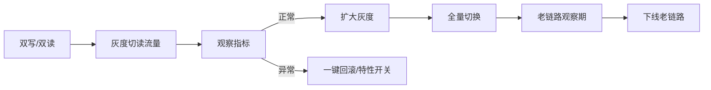

# 05 · 选型落地与治理

> 决策只是开始。选型真正的价值在落地：用 POC 验证假设、用灰度控制风险、用 ADR 留下决策、用复盘避免重蹈。这一篇给你一套"从选完到跑稳"的闭环。

---

## 一、POC（概念验证）：带着假设去证伪

> **POC 不是"试试看能不能跑"，而是"验证我最不确定的那个假设"。**

### 1.1 POC 三原则

1. **只验关键假设**：不要全功能复刻，只验"影响决策的那 1-2 个点"（如"Redis 集群在 10 万 QPS 下 p99 < 5ms"）。
2. **贴近真实负载**：用真实数据量、真实查询模式、真实网络，别用官网 demo 数据集。
3. **时间盒**：1-2 周封顶，超时说明技术或团队不匹配，本身就是结论。

### 1.2 POC 模板

```
目标假设: ______ 在 ______ 负载下，______ 指标达到 ______
环境: 配置/数据量/工具
执行: 步骤
结果: 实测值 vs 目标
结论: 假设成立/不成立 → 影响决策？
```

---

## 二、基准测试方法论（别被数字骗）

| 要点 | 做法 |
|------|------|
| **用真实数据** | 脱敏生产数据 / 同分布生成，别用 1 万行测试集估生产 |
| **看分位不是平均** | 关注 p99/p999，平均好看长尾崩是常态 |
| **逐步加压** | 从低到高找拐点（吞吐上限、延迟拐点） |
| **预热** | JVM/缓存需预热，首跑数据作废 |
| **持续时长** | 跑够久看 GC/内存泄漏（短测看不出） |
| **隔离变量** | 一次只变一个因子，否则不知瓶颈来源 |

> 配套：压测工程见「[测试与代码质量/05-性能与负载测试](../测试与代码质量/05-性能与负载测试.md)」。

---

## 三、灰度与逃生通道（锁死前先留退路）



**逃生三件套**：
- **特性开关（Feature Flag）**：新方案出问题秒级切回。
- **双写/双读**：迁移期新旧并行，可比对可回退。
- **影子流量**：复制一份真实流量到新系统，不影响生产。

> **没有逃生通道的切换 = 赌博。** 详见「[CI-CD/10-部署策略](../基础知识/CI-CD/10-部署策略.md)」「[SRE/渐进式发布](../SRE与稳定性工程/05-变更管理与渐进式发布.md)」。

---

## 四、ADR（架构决策记录）模板

> **选型不写 ADR，等于没选型。** 让后人知道"为什么这么选"，而不是"一直这么做"。

```markdown
# ADR-00X: 选用 XXX 作为 YYY

## 状态
已采纳（2026-08-03）

## 背景
我们要解决 ______（问题量化：QPS/数据量/合规）。
约束：预算/工期/团队/合规 ______。

## 决策
采用 ______。

## 考量（候选对比）
| 候选 | 优 | 劣 | 得分 |
|------|----|----|------|
| A(选中) |   |   |      |
| B |   |   |      |

## 后果
正面：______
负面：______（含已知风险与缓解：逃生通道/监控/回滚）
备选方案：若 ______ 发生，则切换到 B。

## 复审
复审日期：______ / 触发条件：数据量超 X / 社区停更
```

---

## 五、技术债与淘汰机制

选型不是"选完就完"。技术会老、业务会变：

| 机制 | 说明 |
|------|------|
| **定期复审** | ADR 设复审日期（如半年），或触发条件（量超阈值/社区停更） |
| **技术雷达** | 团队维护"采用/试用/评估/淘汰"四象限 |
| **渐进替换** | 用绞杀者模式（Strangler）逐步替换，而非重写 |
| **淘汰标准** | 社区停更 >1 年 / 招不到人 / 安全无人修 / 成本失控 |

---

## 六、选型评审会怎么开

```
会前：发 ADR 草稿 + 候选对比表（让参会者有准备）
会中：
  1. 问题澄清（1-2 分钟，确认"大家在谈同一件事"）
  2. 约束确认（硬约束不可妥协）
  3. 候选陈述（每个 5 分钟，只讲差异与后果）
  4. 决策（负责人拍板，或投票+负责人裁决）
会后：定稿 ADR + 排 POC/灰度计划
```

> **评审不是"比谁嗓门大"，是"比谁的依据硬"。** 每个结论都要能追溯到指标和假设。

---

## 七、选错了怎么办（复盘）

```mermaid
flowchart TD
    A[发现选型问题] --> B{可救?}
    B -->|局部| C[加缓存/限流/降级 缓解]
    B -->|需替换| D[绞杀者模式渐进迁移]
    D --> E[复用已有逃生通道]
    E --> F[更新ADR为"已废弃" + 写新ADR]
    F --> G[复盘:当初哪个假设错了?]
```

**复盘三问**：
1. 当初的哪个假设不成立？（数据量？团队？性能？）
2. 指标体系漏了哪个维度？（如忽略了运维成本）
3. 下次怎么更早发现问题？（加监控/加 POC 项/加复审）

> **选错不可怕，不复盘才可怕。** 每一个"选错"都是未来选对的养料。

---

## 八、Cheat Sheet：选型落地清单

```
[ ] ADR 已写（状态/背景/决策/后果/复审）
[ ] 关键假设已 POC（时间盒、真实负载）
[ ] 逃生通道就位（特性开关/双写/影子）
[ ] 灰度计划（切流比例+观察指标+回滚）
[ ] 监控告警（新系统黄金指标已接入）
[ ] 复审机制（日期或触发条件）
[ ] 团队已培训（不会用 = 没选）
```

---

## 九、一句话总结

> **选型 = 决策(01) + 指标(02) + 场景(03) + 对比(04) + 落地(05)。** 前四步决定"选什么"，第五步决定"选完能不能活"。没有落地的选型，只是 PPT 上的赢家。
