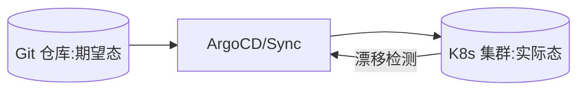

# CI/CD 工具链选型实战

> CI/CD 是研发效能的主动脉。工具链选型要在"自建 vs 托管""易用 vs 可控""单体流水线 vs 矩阵编排"之间权衡。选对了，发布从"惊心动魄"变成"日常操作"。

## 1. 能力矩阵

| 能力 | 说明 |
| --- | --- |
| 构建 | 多语言、缓存、并行 |
| 流水线 | 编排、并行、审批 |
| 制品 | 镜像/包仓库 |
| 部署 | 多环境、灰度、回滚 |
| 门禁 | 测试/扫描/质量卡点 |
| 可观测 | 流水线看板、追踪 |

## 2. 方案对比

| 方案 | 特点 | 适用 |
| --- | --- | --- |
| GitLab CI | 一体化、易上手 | 中小团队 |
| GitHub Actions | 生态丰富、托管 | 开源/轻量 |
| Jenkins | 灵活、插件多、需运维 | 复杂定制 |
| Argo/CD | K8s 原生、GitOps | 云原生 |

## 3. GitOps 模式

- Git 是唯一真相源，变更即 PR。
- 集群状态自动与 Git 对齐，漂移自动修正。
- 审计清晰，回滚即回退提交。

## 4. 质量门禁

- 单元测试、集成测试、代码扫描、安全扫描逐级卡点。
- 制品签名，部署前验真。
- 测试环境自动部署 + 冒烟。

## 5. 常见坑

| 坑 | 现象 | 对策 |
| --- | --- | --- |
| 流水线慢 | 等很久 | 并行 + 缓存 |
| 环境不一致 | 测过挂了 | IaC 统一环境 |
| 密钥泄露 | 风险 | 密钥管理 |
| 无门禁 | 烂代码上线 | 卡点 |
| 回滚难 | 应急慢 | 一键回滚 |

## 6. 面试题

1. GitOps 与普通 CI/CD 区别？
2. 流水线如何提速？
3. 质量门禁有哪些？
4. 密钥如何在 CI 中安全管理？
5. 回滚怎么设计？

## 7. 小结

CI/CD 选型 = 工具匹配团队 + 流水线编排 + 质量门禁 + GitOps 可追溯。核心是用自动化把"发布"从风险事件变成可靠流程。
