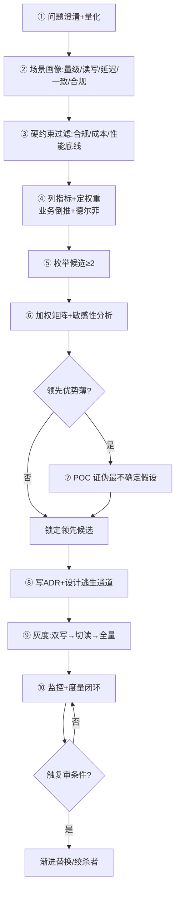
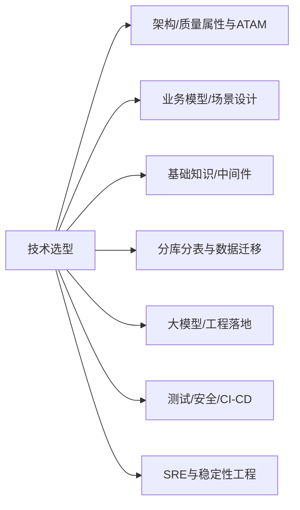

# 技术选型 · 板块导航

> 把"技术选型"从拍脑袋/跟大厂/唯性能论的玄学，变成**可复用、可复盘、可辩护**的工程决策学问：选型的本质与决策框架（加权矩阵/ADR/ATAM/六步法）、关键指标体系（11 维+加权+红线）、结合业务场景的选型决策、主流技术域横向对比、落地与治理。

## 文档列表（按学习顺序）

- 📝 [技术选型总览（概念地图+六原则+学习路径+ATAM）](技术选型总览.md) —— **先读这里**：建立全局框架
- 📝 [01 选型方法论与决策框架](01-选型方法论与决策框架.md) —— 怎么想：加权矩阵、ADR、POC、组织博弈
- 📝 [02 选型关键指标体系](02-选型关键指标体系.md) —— 看什么：11 维指标、权重标定、红线过滤
- 📝 [03 结合业务场景的选型决策](03-结合业务场景的选型决策.md) —— 怎么落地：场景画像、映射表、演进阶梯
- 📝 [04 主流技术域选型对比](04-主流技术域选型对比.md) —— 横向比：DB/缓存/MQ/搜索/时序/框架
- 📝 [05 选型落地与治理](05-选型落地与治理.md) —— 选完怎么活：POC/灰度/ADR 库/复审淘汰

## 怎么用这套文档

| 你的处境 | 建议阅读路径 |
|----------|--------------|
| 第一次接触选型方法论 | 总览 → 01 → 03 |
| 手头有个具体选型要决策 | 02（列指标）→ 03（对场景）→ 04（缩候选）→ 05（落地） |
| 要说服团队/老板 | 01（加权矩阵+敏感性）→ 05（ADR 模板） |
| 选完发现踩坑 | 05（复盘+绞杀者替换） |
| 准备面试 | 各篇末尾「面试高频追问」 |

## 一句话决策流（贴在工位上）

```
问题量化 → 场景画像 → 硬约束过滤
→ 列指标定权重 → 枚举≥2候选 → 加权打分+敏感性
→ 差距薄做POC → 写ADR+逃生通道 → 灰度三步走 → 复审淘汰
```

## 六条核心原则（口诀）

> **先问题后技术，先约束后指标，先场景后榜单，先小步后重装，先记录后拍板，先可退后锁死。**

## 与其他模块的关联

| 本模块 | 关联模块 | 关系 |
|--------|----------|------|
| 01 决策框架 / ATAM | [架构/质量属性与 ATAM](../架构/质量属性与ATAM.md) | 选型是 ATAM 的落地动作 |
| 02 指标体系 | [架构/系统架构](../架构/系统架构.md)、[SRE/可观测性](../SRE与稳定性工程/02-可观测性与稳定性看护.md) | 指标来自质量属性 |
| 03 场景决策 | [业务模型](../业务模型/业务模型总览.md)、[场景设计](../场景设计/) | 场景是选型的输入 |
| 04 技术域对比 | [基础知识/中间件](../基础知识/中间件/)、[分库分表与数据迁移](../分库分表与数据迁移/)、[开源项目](../开源项目/) | 具体技术细节 |
| 04 大模型选型 | [大模型/工程落地/01-技术选型与语言栈](../大模型/工程落地/01-技术选型与语言栈.md) | AI 应用专项 |
| 05 落地治理 | [测试与代码质量](../测试与代码质量/)、[安全工程](../安全工程/)、[CI-CD](../基础知识/CI-CD/) | 落地靠测试/安全/流水线 |

## 常见 Quick Question

- **Q：到底先看指标还是先看场景？** A：先场景画像（03）定"要什么"，再用指标（02）量化"怎么比"，最后横向对比（04）。
- **Q：小团队要不要这么重的方法论？** A：流程可轻，但"硬约束过滤 + 逃生通道"两步不能省；小团队更输不起选错。
- **Q：大厂方案能直接抄吗？** A：不能——先问"大厂的问题规模和我的问题一样吗"，再裁剪。
- **Q：选型最重要的是什么？** A：没有唯一答案；先按约束筛掉不可能项，再在剩余候选里比功能契合度与 TCO。

---

## 一、各篇深度导读（决定你先翻哪篇）

### 📝 技术选型总览

- **定位**：全模块的"地图"，先读。
- **核心产出**：概念地图（mermaid）、六原则口诀、学习路径、ATAM 权衡法、成熟度模型、成本公式。
- **何时翻**：不知道从哪下手、要给团队做选型培训、要说服老板"为什么需要方法论"。
- **不可错过**：第五节「选型总流程图」（问题→复审闭环）、第九节「能力成熟度模型」。

### 📝 01 选型方法论与决策框架

- **定位**：解决"怎么想"。
- **核心产出**：第一性原理四问、加权决策矩阵、指标权重设计、POC 设计、风险控制、组织博弈、ADR、敏感性分析数学（Python）。
- **何时翻**：要做一次正式选型、评审会被带偏、需要把"感觉"变成"可辩护的决策"。
- **不可错过**：第十一节「加权打分的数学与敏感性分析」、第十三节「组织博弈」。

### 📝 02 选型关键指标体系

- **定位**：解决"看什么"。
- **核心产出**：11 维指标全景、场景权重基准表、1-5 量表标定、红线过滤、权重标定三法（业务倒推/德尔菲/熵权）、分位与压测。
- **何时翻**：列候选前先列指标、被 benchmark 骗过、不知道权重怎么定。
- **不可错过**：第十节「多场景权重基准表」、第十四节「指标冲突裁决原则」。

### 📝 03 结合业务场景的选型决策

- **定位**：解决"怎么落地到我的场景"。
- **核心产出**：场景画像表（量化模板）、场景→技术映射决策树、9 类典型场景画像、代码级要点（防超卖/多级缓存）、演进阶梯、容量与成本估算。
- **何时翻**：候选缩到几个、要说服业务方"为什么这么选"、做容量规划。
- **不可错过**：第二节「场景→技术映射决策树」、第十四节「容量规划与成本估算」。

### 📝 04 主流技术域选型对比

- **定位**：解决"有哪些候选、甜区在哪"。
- **核心产出**：DB/缓存/MQ/搜索/时序/网关/框架/NoSQL/对象存储等横向对比表、checklist、技术雷达、迁移成本矩阵、甜区雷区卡。
- **何时翻**：要缩小候选范围、做横向对比表、技术雷达季度更新。
- **不可错过**：第十一节「技术域组合决策速查」、二十三节「甜区/雷区卡片」。

### 📝 05 选型落地与治理

- **定位**：解决"选完能不能活"。
- **核心产出**：POC 三原则、基准测试方法论、灰度与逃生通道、ADR 模板与状态机、技术债度量与淘汰信号、度量闭环、伪完成信号。
- **何时翻**：要写 ADR、设计灰度方案、做复盘、建选型治理机制。
- **不可错过**：第三节「灰度与逃生通道」、第十一节「ADR 库怎么管」、十八节「伪完成信号」。

---

## 二、完整决策流（mermaid 版，可贴 wiki）



---

## 三、模块关联图（mermaid）



---

## 四、决策前自检清单（12 问）

```
[ ] 1. 问题能一句话说清吗？（含量化指标）
[ ] 2. 硬约束列全了吗？（钱/人/时间/合规/性能底线）
[ ] 3. 候选 ≥ 2 个吗？
[ ] 4. 指标维度列全了吗？（11 维扫一遍）
[ ] 5. 权重由场景倒推吗？
[ ] 6. 红线过滤做了吗？
[ ] 7. 打分都写了依据吗？
[ ] 8. 敏感性分析做了吗？（权重±20% 排名反转吗）
[ ] 9. 最不确定的假设 POC 了吗？
[ ] 10. ADR 写了吗？
[ ] 11. 逃生通道设计了吗？（开关/双写/影子）
[ ] 12. 复审触发条件定了吗？
```

> 12 问答不全 → 别拍板。详见 [01 篇第十四节](01-选型方法论与决策框架.md)。

---

## 五、术语表（看文档前先扫盲）

| 术语 | 含义 |
|------|------|
| **加权决策矩阵** | 把各指标按 1-5 打分 × 权重求和，量化对比候选 |
| **敏感性分析** | 权重 ±20% 扰动，看排名是否反转，判断结论稳不稳 |
| **红线/一票否决** | 不达标直接出局的硬约束（合规/一致性/性能底线） |
| **ADR** | Architecture Decision Record，架构决策记录 |
| **ATAM** | Architecture Tradeoff Analysis Method，架构权衡评估法 |
| **POC** | Proof of Concept，概念验证，带假设去证伪 |
| **技术雷达** | 采用/试用/评估/淘汰四象限，持续管理技术 |
| **TCO** | Total Cost of Ownership，总拥有成本 |
| **绞杀者模式** | Strangler Pattern，渐进替换而非重写 |
| **逃生通道** | 双写/特性开关/影子流量，保证可回退 |

---

## 六、常见技术组合速查（照抄不出错）

| 系统类型 | 参考组合 |
|----------|----------|
| 常规业务系统 | MySQL + Redis + Kafka |
| 高吞吐日志管道 | Kafka + Flink + ClickHouse |
| 搜索/站内检索 | MySQL + Elasticsearch |
| 金融交易核心 | MySQL(或 OB/TiDB) + RocketMQ |
| 实时监控/运维 | Prometheus + VictoriaMetrics + Grafana |
| AI 应用平台 | 模型 API/自部署 + 向量库 + Redis |
| 海量 IoT 遥测 | TDengine/InfluxDB + MQTT 网关 |

> 组合心法见 [04 篇第十一节](04-主流技术域选型对比.md)。

---

## 七、如果只有 10 分钟

1. 读 [总览·六原则口诀](技术选型总览.md)。
2. 抄 [本页·决策前自检清单](#四决策前自检清单12-问)。
3. 对着 [总览·选型总流程图](#二完整决策流mermaid-版可贴-wiki) 走一遍。

---

## 八、扩展 FAQ

- **Q：加权矩阵是不是形式主义？** A：形式与否取决于打分是否写依据、权重是否由场景倒推。写依据 + 敏感性分析，它就是"把隐性假设显性化"的利器；否则才是形式主义。
- **Q：敏感性分析一定要写代码吗？** A：不必须，但可以。见 [01 篇第十一节](01-选型方法论与决策框架.md) 的 Python，几行就能跑。
- **Q：如何避免"矩阵套结论"？** A：先有矩阵再有偏好；若结论与矩阵冲突，重审矩阵而非改矩阵迎合结论（见 01 篇十二节反模式）。
- **Q：POC 一般做多久？** A：1-2 周时间盒，超时本身说明技术或团队不匹配，也是一种结论。
- **Q：逃生通道会增加很多工作量吗？** A：特性开关 + 双写是一次性投入，远小于一次生产事故的成本。小团队至少保留特性开关。
- **Q：ADR 要写多长？** A：一页足够：状态/背景/决策/考量/后果/复审。详见 [05 篇第四节](05-选型落地与治理.md)。

---

## 九、选型评审 checklist 详解

把"决策前 12 问"展开成可执行说明：

| # | 问题 | 怎么答 |
|---|------|--------|
| 1 | 问题能一句话说清？ | 量化：QPS/数据量/合规 |
| 2 | 硬约束列全？ | 钱/人/时间/合规/性能底线 |
| 3 | 候选 ≥2？ | 不是只想到一个 |
| 4 | 指标维度列全？ | 11 维扫一遍 |
| 5 | 权重由场景倒推？ | 业务目标倒推 |
| 6 | 红线过滤？ | 不达标直接出局 |
| 7 | 打分写依据？ | 定性不许空口 |
| 8 | 敏感性分析？ | 权重±20% 排名反转吗 |
| 9 | POC 最不确定假设？ | 真实负载、时间盒 |
| 10 | ADR 写？ | 状态/背景/决策/后果/复审 |
| 11 | 逃生通道？ | 开关/双写/影子 |
| 12 | 复审触发？ | 量超阈值/社区停更 |

---

## 十、一个完整选型演练（选消息中间件）

假设：电商交易，需要事务消息 + 延迟消息，国内部署。

```
① 场景画像：吞吐峰 10w/s，需事务消息，需延迟消息，国内团队
② 硬约束：国内部署、需事务语义
③ 候选枚举：Kafka / RocketMQ / Pulsar / RabbitMQ
④ 红线过滤：需事务消息 → RabbitMQ（弱）/ Kafka（无事务语义）出局或降级
⑤ 加权矩阵（事务30/吞吐20/生态15/运维15/团队10/成本10）：
   RocketMQ 领先，Pulsar 次之
⑥ 敏感性：权重±20% 排名稳定 → 直接定 RocketMQ
⑦ ADR：选 RocketMQ 4.9，逃生=可迁 Pulsar
```

> 这就是"框架变决策"的落地：每一步都可辩护、可追溯。

---

## 十一、指标权重模板（可直接复制）

```yaml
# adr/matrix/mq-2026.yaml
candidates: [RocketMQ, Pulsar, Kafka]
weights:
  事务消息: 0.30
  吞吐: 0.20
  生态成熟度: 0.15
  运维成本: 0.15
  团队熟悉度: 0.10
  成本TCO: 0.10
scores:
  RocketMQ: {事务消息:5, 吞吐:4, 生态:4, 运维:4, 团队:4, 成本:4}
  Pulsar:    {事务消息:5, 吞吐:5, 生态:3, 运维:2, 团队:2, 成本:3}
  Kafka:     {事务消息:2, 吞吐:5, 生态:5, 运维:3, 团队:4, 成本:4}
red_lines: [事务消息支持]
```

---

## 十二、常见反模式速查卡

| 反模式 | 一句话修正 |
|--------|------------|
| 技术镀金 | 先"能不引就不引" |
| 跟风大厂 | 先问问题一样吗 |
| 唯性能论 | 指标加权，性能其一 |
| 忽视团队 | 熟悉度是无形成本 |
| 过度设计 | YAGNI，当前+1阶 |
| Demo 即生产 | POC 贴近真实负载 |
| 一次定终身 | 留逃生通道+复审 |
| 矩阵套结论 | 先有矩阵再有偏好 |

---

## 十三、面试高频追问汇总（跨篇）

1. 怎么证明选型是对的？→ 约束→指标→POC→ADR→逃生，闭环可辩护。
2. Redis 集群还是哨兵？→ 容量/扩展选 Cluster，简单选哨兵。
3. 什么信号该换技术？→ 容量顶/瓶颈在架构/维护超收益。
4. 大厂方案能抄吗？→ 先问规模一样吗，再裁剪。
5. 分布式 ID 怎么选？→ 雪花/号段/UUIDv7（见分库分表 02）。

---

## 十四、跨模块导航详解

| 想深入 | 去哪 |
|--------|------|
| 架构权衡底层 | [架构/质量属性与 ATAM](../架构/质量属性与ATAM.md) |
| 具体中间件用法 | [基础知识/中间件](../基础知识/中间件/) |
| 分库分表专项 | [分库分表与数据迁移](../分库分表与数据迁移/) |
| AI 应用选型 | [大模型/工程落地](../大模型/工程落地/) |
| 落地靠什么 | [测试与代码质量](../测试与代码质量/) / [安全工程](../安全工程/) / [CI-CD](../基础知识/CI-CD/) |

---

## 十五、选型失败复盘模板

```
# 选型复盘 #2026-XX
- 当初目标：
- 候选与选择：
- 结果：达成 / 未达成
- 代价是否超预期：
- 哪个假设错了：
- 再选一次会换吗：
```

---

## 十六、不同类型决策的"用量"建议

| 决策类型 | 流程用量 |
|----------|----------|
| 边缘/可逆（如一个内部工具库） | 红线 + 直觉 + 逃生通道 |
| 中等（团队常用中间件） | 矩阵 + POC（轻）+ ADR |
| 核心/难回滚（数据库/框架） | 完整矩阵 + 敏感性 + POC + ADR + 灰度 |

> 框架用量应与"选错的成本"成正比——越贵越走全套。

---

## 十七、选型知识库维护规范

- ADR 进版本库（`adr/` 目录），状态机可追溯。
- 矩阵模板固化，每次选型用同一把尺子。
- 技术雷达每季度更新（采用/试用/评估/淘汰）。
- 历史选型半年复审，触发条件写进 ADR。

---

## 十八、常见误区对话录

- ❓"大厂都用 Kafka 我们也用" → ✅ 先问吞吐/事务需求是否一样。
- ❓"这个 benchmark 第一" → ✅ 用自己真实负载复测，看 p99/p999。
- ❓"先上了再说，不行再换" → ✅ 选型时就设计退路，别赌。
- ❓"团队都会 Spring 就选它" → ✅ 熟悉度是权重之一，不是唯一。

---

## 十九、终极速记口诀

```
问题量化先开选，场景画像要填满；
硬约束先过滤掉，加权矩阵才公平；
差距薄做 POC，差距大直接定；
ADR 当天写，灰度逃生莫省；
复审有触发，烂了就替换；
选对是起点，活久才是赢。
```

---

[← 返回首页](../README.md)
