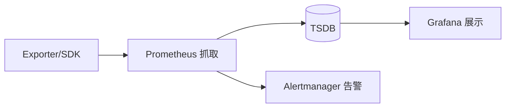

# 可观测性工具选型实战

> 指标、日志、链路各有成熟工具栈。本文对比 Prometheus、Grafana、Loki、ELK、Jaeger、Datadog 等，给出自建与托管的取舍。

## 1. 三大支柱工具

| 支柱 | 开源代表 | 托管/SaaS |
| --- | --- | --- |
| Metrics | Prometheus + Grafana | Datadog / ARMS |
| Logs | Loki / ELK(ES) | CloudWatch / 阿里SLS |
| Traces | Jaeger / Tempo | Datadog APM |

## 2. 指标：Prometheus 生态

- Pull 模型，主动抓取 metrics 端点。
- PromQL 强大查询。
- 长期存储可接 Thanos / Cortex / Mimir。

## 3. 日志：ELK vs Loki

| 维度 | ELK(ES) | Loki |
| --- | --- | --- |
| 索引 | 全文索引 | 仅元数据索引 |
| 成本 | 高 | 低 |
| 查询 | 灵活 | 标签过滤为主 |
| 适用 | 复杂检索 | 容器日志 |

## 4. 链路：Jaeger/Tempo

- 兼容 OpenTelemetry 协议。
- 存储后端可插拔（ES/Cassandra/S3）。
- 可视化调用链、瓶颈定位。

## 5. 托管 vs 自建

| 维度 | 自建 | 托管 |
| --- | --- | --- |
| 成本 | 人力高、机器可控 | 按量付费 |
| 可控性 | 高 | 受限 |
| 运维 | 自己扛 | 厂商扛 |
| 适用 | 大规模/合规 | 中小/快速 |

## 6. 统一标准 OTel

- 一套 SDK 覆盖三类遥测，导出任意后端。
- 避免厂商锁定。
- Collector 做批处理、过滤、转发。

## 7. 成本治理

- 指标降采样、日志采样、链路采样。
- 高基数（high cardinality）标签是 Prometheus 杀手——谨慎打标。
- 存储分层：热存短、冷存长。

## 8. 落地坑点

| 坑 | 现象 | 对策 |
| --- | --- | --- |
| 高基数爆炸 | Prometheus 崩 | 限制标签 |
| 日志无结构 | 难查 | JSON 化 |
| 成本失控 | 账单爆 | 采样+分层 |
| 三套割裂 | 无法关联 | OTel 统一 |

## 9. 面试题

1. Prometheus Pull 与 Push 区别？
2. ELK 与 Loki 取舍？
3. 为什么用 OpenTelemetry？
4. 高基数指标有什么危害？
5. 自建与托管如何选？

## 10. 小结

可观测性工具 = 指标(Prometheus)+日志(Loki/ES)+链路(Jaeger)，统一以 OpenTelemetry 采集。自建可控但重运维，托管省心但贵；高基数与成本是两大隐形杀手。
