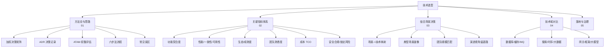
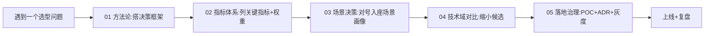

# 技术选型总览

> 本模块把"技术选型"从拍脑袋、跟大厂、唯性能指标论的玄学，变成一门**可复用、可复盘、可辩护**的工程决策学问。
>
> 配套：架构权衡基础见「[架构/质量属性与 ATAM](../架构/质量属性与ATAM.md)」；数据库/缓存/MQ 等具体技术见「[基础知识/中间件](../基础知识/中间件/)」「[分库分表与数据迁移](../分库分表与数据迁移/)」；AI 应用选型见「[大模型/工程落地/01-技术选型与语言栈](../大模型/工程落地/01-技术选型与语言栈.md)」；开源清单见「[开源项目](../开源项目/)」；行业落地见「[业务模型](../业务模型/)」。

---

## 〇、为什么需要"选型方法论"

技术选型失败，是后端工程里**最贵、最难回滚**的一类决策。它的代价不在当下，而在 18 个月后：

- **选小了**：业务一涨就扛不住，半夜扩容救火（强一致场景下尤其致命）。
- **选大了**：引入 Kafka、TiDB、K8s 一套重装，3 人小团队被运维拖垮，80% 能力用不上。
- **选偏了**：跟风大厂用 Flink，实际只是每日跑批，Spark 足矣；或反向——该用 Flink 实时风控却用批处理，错过拦截窗口。
- **选孤了**：用了社区快死的技术，3 年后无人维护，迁移成本等于重写。

> **选型不是"挑最好"，而是"在约束下挑最合适"。** 最好的技术 ≠ 最适合你当前场景的技术。

本模块回答三件事，对应你的三个诉求：

| 诉求 | 对应章节 |
|------|----------|
| 选型的**关键指标**有哪些、怎么量化、怎么加权 | [02-选型关键指标体系](02-选型关键指标体系.md) |
| 选型的**思路 / 决策框架**是什么 | [01-选型方法论与决策框架](01-选型方法论与决策框架.md) |
| 怎么**结合业务场景**落地 | [03-结合业务场景的选型决策](03-结合业务场景的选型决策.md) |
| 主流技术域**横向对比**与 checklist | [04-主流技术域选型对比](04-主流技术域选型对比.md) |
| 选定后怎么**落地 + 治理 + 复盘** | [05-选型落地与治理](05-选型落地与治理.md) |

---

## 一、概念地图



---

## 二、六条核心原则（口诀）

> **口诀：先问题后技术，先约束后指标，先场景后榜单，先小步后重装，先记录后拍板，先可退后锁死。**

1. **先问题后技术**：没有"该不该用 XX"，只有"我要解决什么"。问题定义错，选型必错。
2. **先约束后指标**：预算、团队、合规、工期是硬约束，先于一切性能数字。
3. **先场景后榜单**：Benchmark 第一名不等于你的场景第一名。"大厂同款"要先问"大厂的问题和我一样吗"。
4. **先小步后重装**：能用 MySQL 主从解决的，别上分布式；能用单服务解决的，别上微服务。"能不引就不引"。
5. **先记录后拍板**：所有重要选型落 ADR（决策记录），让后人知道"为什么这么选"，而不是"一直这么做"。
6. **先可退后锁死**：选型时先设计逃生通道（双写、灰度、特性开关），再全面切换。锁死是最后一步。

---

## 三、学习路径



- **速通（1 小时）**：本总览 + 01 + 03。
- **实战（半天）**：补齐 02 + 04，带着真实选型问题套用。
- **体系（1 天）**：全部 + 把团队历史选型补成 ADR。

---

## 四、与其他模块的关联

| 本模块 | 关联模块 | 关系 |
|--------|----------|------|
| 01 决策框架 / ATAM | [架构/质量属性与 ATAM](../架构/质量属性与ATAM.md) | 选型是 ATAM 的落地动作 |
| 02 指标体系 | [架构/系统架构](../架构/系统架构.md)、[SRE/可观测性](../SRE与稳定性工程/02-可观测性与稳定性看护.md) | 指标来自质量属性 |
| 03 场景决策 | [业务模型](../业务模型/业务模型总览.md)、[场景设计](../场景设计/) | 场景是选型的输入 |
| 04 技术域对比 | [基础知识/中间件](../基础知识/中间件/)、[分库分表与数据迁移](../分库分表与数据迁移/)、[开源项目](../开源项目/) | 具体技术细节 |
| 04 大模型选型 | [大模型/工程落地/01-技术选型与语言栈](../大模型/工程落地/01-技术选型与语言栈.md) | AI 应用专项 |
| 05 落地治理 | [测试与代码质量](../测试与代码质量/)、[安全工程](../安全工程/)、[CI-CD](../基础知识/CI-CD/) | 落地靠测试/安全/流水线 |

---

## 五、一句话定位

> **选型是工程师的"第二架构"：架构决定系统长什么样，选型决定系统能不能活到两年后。**

---

## 六、选型失败的真实案例（教训池）

| 案例 | 踩了什么坑 | 正确做法 |
|------|-----------|----------|
| 3 人团队上全套 K8s + Service Mesh | 选大了：运维负担 > 收益 | 先单机 Docker Compose，业务起量再演进 |
| 每日跑批业务选了 Flink | 选偏了：为「实时」而实时 | 批处理 Spark/定时任务足够，先算清频率 |
| 用 RabbitMQ 顶千万级日志总线 | 选小了：吞吐量级不匹配 | 日志类海量吞吐直接上 Kafka |
| 跟风换掉 MySQL 上 NewSQL | 选孤了：生态/团队不熟，迁移代价巨大 | 先分库分表 + 中间件，确认瓶颈在数据量 |
| 未评估开源 License 就集成 | 合规翻车：GPL 传染 / 商业条款 | 选型清单加「License 与合规」硬门槛 |
| 用全局唯一索引当分布式 ID | 选小了：单点瓶颈 + 跨库不唯一 | 号段/雪花（见 [分布式ID生成](../场景设计/分布式ID生成.md)） |

> 规律：**大部分翻车不是「选错了技术」，而是「没按流程选」**——跳过约束分析、跳过 POC、跳过逃生通道，直接拍板。

---

## 七、选型复盘模板（半年后回来打分）

```text
# 技术选型复盘：#2026-02 Redis Cluster 替代哨兵
- 当初目标：缓存容量 > 500G，可水平扩展
- 候选：Cluster / Codis / 自研代理，选择 Cluster（ADR 链接）
- 结果评估：
  [x] 达成容量目标（线上 600G，节点 12 个）
  [x] 运维复杂度可控（自动分片，无人工搬槽）
  [ ] 槽位搬迁期间的延迟抖动（预期外，需预热）
- 教训：多 key 操作受槽位约束，业务侧做了很多本地映射
- 再选一次会怎样：早期就限制 multi-key 用法，避免后期改造
```

> 复盘三问：**目标达成了吗？代价超出预期了吗？再选一次会换吗？**——让每次选型的经验变成团队的复用资产。

---

## 八、面试高频追问

1. Q：怎么证明你的选型是对的？ A：约束优先 → 指标加权 → 候选 POC（压测/试点）→ ADR 记录 → 逃生通道，四步闭环可辩护。
2. Q：Redis 集群和哨兵怎么选？ A：容量/扩展性优先选 Cluster（自动分片）；规模小、要简单选哨兵（主从+故障切换）。
3. Q：什么信号说明该换技术？ A：容量逼近上限且无法水平扩展、性能瓶颈在架构而非实现、维护成本超收益——并提前半年规划迁移。
4. Q：大厂方案能直接抄吗？ A：不能——先问「大厂的问题规模和我的问题一样吗」，再结合约束做裁剪（规模不同，架构分层就不同）。
5. Q：选型里最重要的指标是什么？ A：没有唯一答案——先按约束（预算/团队/合规/工期）筛掉不可能项，再在剩余候选中比功能契合度与 TCO。
