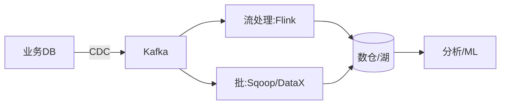

# 数据管道与 ETL 选型实战

> 数据从业务系统流向数仓/数据湖，要经过抽取、清洗、转换、加载。ETL/ELT 选型决定数据的"新鲜度、成本、可靠性"。批处理与流处理各有战场，现代架构趋向流批一体。

## 1. 模式对比

| 模式 | 说明 | 时效 | 适用 |
| --- | --- | --- | --- |
| 批 ETL | 定时全量/增量 | 小时/天 | 报表、离线 |
| 流处理 | 实时消费 | 秒级 | 实时监控 |
| ELT | 先入仓再转 | 灵活 | 湖仓一体 |
| CDC | 捕获变更 | 近实时 | 同步/数仓 |

## 2. 工具谱系

- **抽取**：DataX/Sqoop（批）、Debezium（CDC）。
- **传输**：Kafka（缓冲 + 解耦）。
- **计算**：Spark（批）、Flink（流）。
- **存储**：Hive/Iceberg（湖）、ClickHouse（OLAP）。

## 3. 数据质量

- **Schema 校验**：结构变化告警。
- **去重/幂等**：同一记录多次入仓一致。
- **迟到/乱序**：水位线 + 窗口处理。
- **血缘**：字段级追踪来源。

## 4. 成本与时效权衡

- 实时链路贵，关键业务才用。
- 离线链路便宜，容忍延迟。
- 分层（ODS→DWD→DWS→ADS）控复杂度。

## 5. 常见坑

| 坑 | 现象 | 对策 |
| --- | --- | --- |
| 数据漂移 | 对不上 | 校验 + 对账 |
| 重复入仓 | 翻倍 | 幂等 |
| Schema 变更 | 任务挂 | 兼容 + 告警 |
| 延迟堆积 | 时效差 | 扩并发 |
| 成本爆 | 账单贵 | 分级时效 |

## 6. 面试题

1. ETL 与 ELT 区别？
2. CDC 相比定时抽取优势？
3. 流批一体怎么理解？
4. 数据质量如何保障？
5. 如何降低管道成本？

## 7. 小结

数据管道 = 抽取(CDC/批) + 传输(Kafka) + 计算(Spark/Flink) + 质量门禁。核心是"按时效分级、用幂等保准确、用分层控复杂"。
