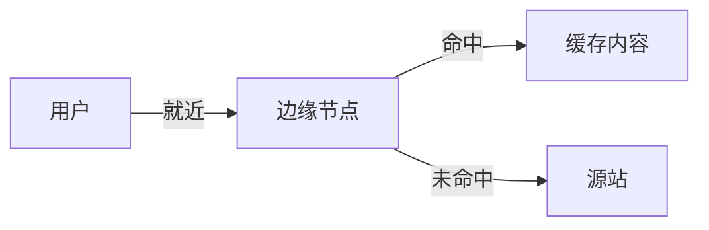

# 边缘计算与 CDN 选型实战

> CDN 把内容推到离用户最近的节点，边缘计算让算力也下沉到边缘。本文对比 CDN 厂商、边缘函数、选型与调优。

## 1. CDN 价值

- 降低延迟：就近返回。
- 减轻源站：缓存命中，源站只服务回源。
- 抗 DDoS：分布式吸收流量。

## 2. CDN 关键能力

| 能力 | 说明 |
| --- | --- |
| 静态加速 | 图片/JS/CSS 缓存 |
| 动态加速 | 路由优化、协议优化 |
| 视频点播/直播 | 切片、转码 |
| 边缘函数 | 在边缘跑代码（改写/鉴权） |
| 安全 | WAF、DDoS 防护 |

## 3. 边缘计算（Edge Compute）

- **边缘函数**（如 Cloudflare Workers、AWS Lambda@Edge、阿里 CDN 边缘脚本）：在边缘节点执行轻量逻辑。
- 用途：请求改写、A/B、鉴权、个性化、Bot 防护。
- 限制：无状态/短执行、冷启动低。

## 4. 选型要点

- **节点覆盖**：国内外覆盖、运营商接入。
- **回源策略**：回源协议、缓存规则、刷新预热。
- **成本**：流量单价、超额、请求数计费。
- **合规**：数据出境、境内合规（国内需备案/ICP）。
- **功能**：是否支持边缘函数、视频、安全。

## 5. 缓存策略

- 合理 cache-control，区分静态/动态。
- 版本化 URL（加 hash）实现 immutable 缓存。
- 刷新/预热 API 应对发布。

## 6. 动态加速

- 全站加速（DSA）：优化 TCP/路由，动态内容也受益。
- 协议优化：HTTP/2、QUIC 降延迟。
- 需权衡：动态内容无法缓存，靠路由优化。

## 7. 落地坑点

| 坑 | 现象 | 对策 |
| --- | --- | --- |
| 缓存错 | 旧内容 | 版本化 URL |
| 回源风暴 | 源站挂 | 合并回源+锁 |
| 边缘状态 | 函数难写 | 无状态设计 |
| 成本失控 | 账单高 | 监控+预算 |

## 8. 面试题

1. CDN 如何降低延迟？
2. 边缘函数适合做什么？
3. 静态与动态加速区别？
4. 如何避免回源风暴？
5. CDN 选型看什么？

## 9. 小结

CDN/边缘 = 就近 + 缓存 + 安全 + 边缘算力。静态靠缓存命中，动态靠路由优化，边缘函数承接轻逻辑；选型看覆盖、成本与合规，缓存策略决定命中率。
