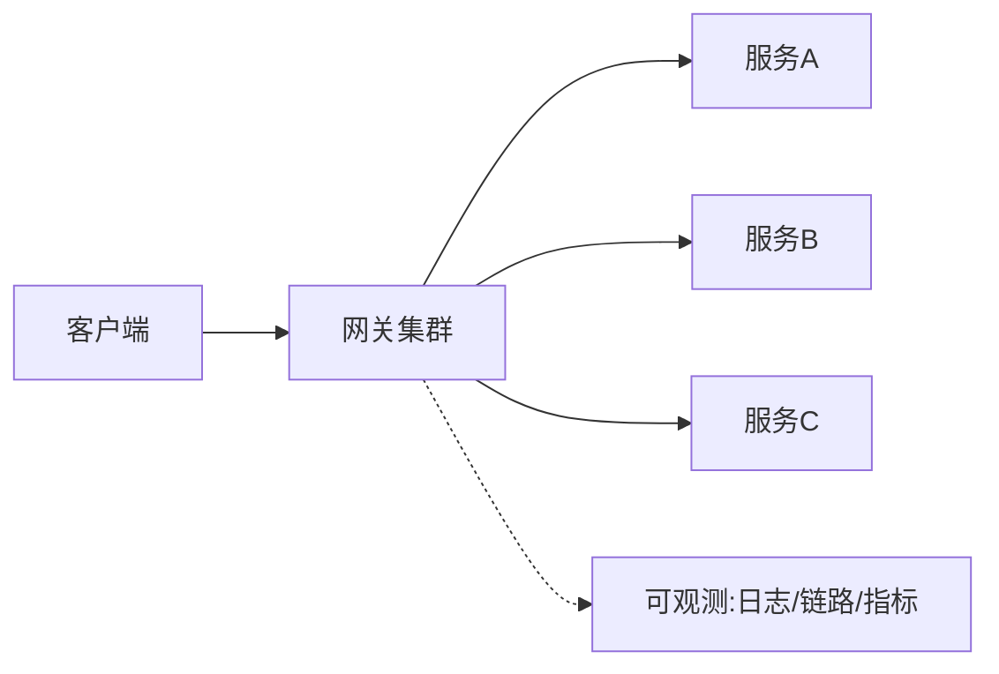

# API 网关架构实战

> 网关是系统南北向流量的唯一收口。架构层面它要解决：高可用（不成为单点）、高性能（低延迟）、可扩展（插件化）、可观测（全链路）。一个设计良好的网关能挡住大部分横切问题。

## 1. 网关在架构中的位置



## 2. 关键架构决策

| 决策 | 选项 | 取舍 |
| --- | --- | --- |
| 部署 | 独立集群/边车 | 独立易运维，边车无额外跳数 |
| 转发 | 同步/异步 | 同步简单，异步高吞吐 |
| 插件 | Lua/Go/Java | 看技术栈与性能 |
| 配置 | 中心化下发 | 动态生效，需强一致 |

## 3. 高可用设计

- **多实例 + 无状态**：水平扩展，前面挂 LB。
- **健康检查**：摘除不健康后端。
- **熔断限流**：保护后端不被打垮。
- **优雅退出**：摘流后再停。

```nginx
# 限流示例（概念）
limit_req_zone $binary_remote_addr zone=api:10m rate=100r/s;
location /api/ {
    limit_req zone=api burst=200 nodelay;
    proxy_pass http://backend;
}
```

## 4. 插件化

- 认证、限流、日志、灰度做成可插拔 filter 链。
- 新能力以插件形式加，不侵入业务。
- 插件热加载，避免重启。

## 5. 常见坑

| 坑 | 现象 | 对策 |
| --- | --- | --- |
| 单点 | 全站挂 | 集群 + LB |
| 配置错 | 路由崩 | 灰度 + 校验 |
| 延迟叠加 | 变慢 | 异步 + 连接池 |
| 插件泄漏 | 内存涨 | 资源限制 |
| 日志爆 | 磁盘满 | 采样 + 限流 |

## 6. 面试题

1. 网关如何做到高可用？
2. 网关插件化有什么好处？
3. 网关限流与业务限流区别？
4. 网关成为瓶颈怎么优化？
5. 灰度路由网关如何实现？

## 7. 小结

API 网关架构 = 集群无状态 + 插件链 + 熔断限流 + 全链路可观测。它是系统的"前门"，把横切关注点统一收口，让业务服务专心做业务。
