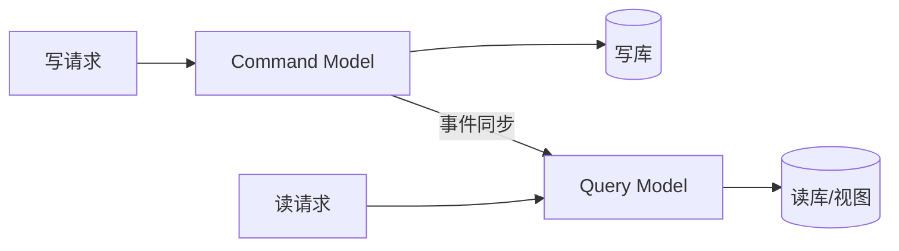
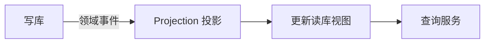

# CQRS 模式与落地实战

> CQRS（Command Query Responsibility Segregation，命令查询职责分离）将"写模型"与"读模型"分开设计，解决复杂领域下读写诉求冲突的问题。常与事件溯源、最终一致搭配。

## 1. 为什么需要 CQRS

| 问题 | 单一模型 |
| --- | --- |
| 读写负载不同 | 读多写少却被写约束 |
| 模型兼用别扭 | 领域模型既要服务写又要服务查询 |
| 复杂查询慢 | 聚合根不适合直接查报表 |
| 扩展受限 | 读写无法独立伸缩 |

CQRS 把**写侧（Command）**与**读侧（Query）**拆成两套模型、甚至两套存储。

## 2. 基本结构



- **Command Side**：处理写，强一致性，领域模型复杂。
- **Query Side**：处理读，模型为查询优化（宽表、冗余、预聚合）。
- 两侧通过事件/消息同步，读侧最终一致。

## 3. 写模型设计

```python
class CreateOrderHandler:
    def handle(self, cmd: CreateOrder):
        # 聚合内业务校验
        order = Order.create(cmd.items, cmd.user)
        repo.save(order)              # 持久化
        bus.publish(order.events())   # 发布领域事件
```

- 写模型聚焦不变量（invariant）与业务规则。
- 聚合根保证一致性边界。

## 4. 读模型设计

读模型是**为查询而生**的：

```sql
-- 订单列表视图（宽表，冗余用户/金额/状态）
CREATE TABLE order_view (
  order_id, user_id, user_name,
  total_amount, status, created_at
);
```

- 可由写侧事件异步更新（投影 Projection）。
- 支持复杂筛选、排序、分页，无需 join 聚合。

## 5. 同步机制



- **投影（Projection）**：消费事件，更新读模型。
- 延迟通常毫秒~秒级，业务需容忍最终一致。
- 投影失败可重放事件重建（事件溯源场景天然支持）。

## 6. 最终一致与补偿

- 读侧滞后时，写后立刻读可能见到旧值（读写分离通病）。
- 对策：写后短暂读主（sticky read）、或前端轮询、或接受延迟。
- 投影幂等：同一事件重复消费不重复应用。

## 7. 何时不该用 CQRS

- 简单 CRUD、读写模型一致即可——引入 CQRS 是过度设计。
- 团队小、领域不复杂——复杂度不值得。
- 强一致读要求极高——最终一致难满足。

> 经验法则：只有"读写模型差异大 + 读写负载差异大 + 领域复杂"才上 CQRS。

## 8. 与事件溯源配合

- 写侧状态由事件流重放得出。
- 读侧是事件的多种物化视图。
- 可回放事件到任意时点重建状态，审计能力极强。

## 9. 落地坑点

| 坑 | 现象 | 对策 |
| --- | --- | --- |
| 读旧数据 | 写后读不一致 | sticky read/轮询 |
| 投影卡住 | 读模型不更新 | DLQ + 监控 |
| 过度设计 | 简单系统变复杂 | 仅复杂域使用 |
| 事件版本 | 旧事件新模型不兼容 | 事件版本化+迁移 |
| 双写不一致 | 读写库分歧 | 以事件为准单写 |

## 10. 面试题

1. CQRS 解决什么问题？
2. 读写模型如何同步？
3. 最终一致下写后读怎么处理？
4. 什么场景不该用 CQRS？
5. CQRS 与事件溯源关系？

## 11. 小结

CQRS 用"分"换"专"：写模型守业务规则，读模型为查询优化，中间以事件驱动同步。它适合复杂领域，但带来最终一致与运维复杂度，需权衡使用。
