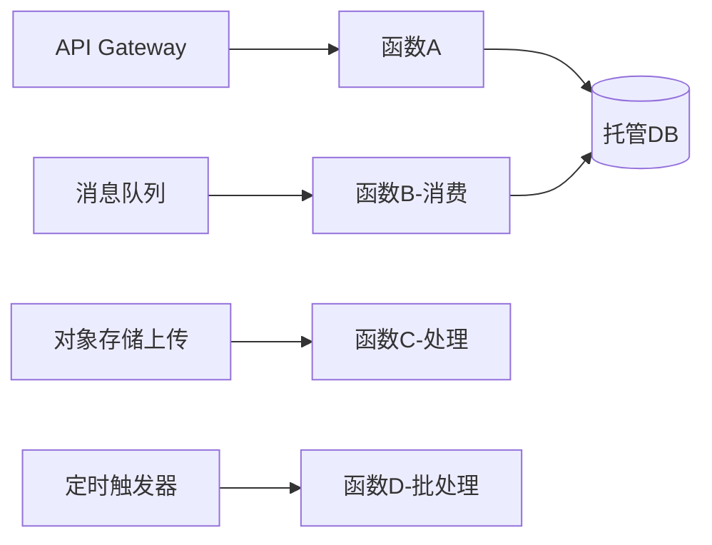

# Serverless 与函数计算架构实战

> 板块：架构 　|　 返回：[README](README.md)
> 适用：事件驱动后端、异步任务、Web API、流式处理、定时作业。

Serverless（无服务器）不是"没有服务器"，而是**开发者不再管理服务器**：算力由平台按事件弹性供给，按实际使用（调用次数/时长/内存）计费。核心是 FaaS（函数即服务）+ BaaS（后端即服务）。

## 一、核心概念

| 概念 | 含义 |
|------|------|
| FaaS | 函数作为部署单元，事件触发执行 |
| BaaS | 托管的服务（对象存储、数据库、Auth），无需自运维 |
| 事件源 | 触发函数的事件（HTTP、消息、定时、对象存储上传） |
| 按量计费 | 只为实际执行付费，空闲不花钱 |
| 自动弹性 | 并发随流量自动伸缩 |

## 二、典型架构

```
事件源(HTTP网关/消息/MQ/对象存储/定时) → 函数计算(多实例自动扩) → BaaS(数据库/存储/缓存)
                                              ↓
                                        日志/监控(平台托管)
```



## 三、适用场景

| 场景 | 为何适合 |
|------|----------|
| 异步任务（转码/导出/通知） | 事件触发、偶发、无需常驻 |
| Web API（低频/波动大） | 自动弹性，闲时不花钱 |
| 数据管道 | 文件/消息触发处理 |
| 定时作业（报表/清理） | Cron 触发器 |
| 原型/MVP | 免运维，快速上线 |

## 四、冷启动与优化

**冷启动**：函数实例从无到有的启动延迟（加载运行时/代码/依赖），首个请求明显变慢。

优化手段：
- **预置并发（Provisioned Concurrency）**：提前预热固定实例，消除冷启动（代价：常驻计费）。
- **精简依赖**：减小包体积、用轻量运行时（如 Node/Python vs Java 较重）。
- **连接复用**：在函数外（全局作用域）初始化 DB 连接，实例复用。
- **选择合适内存**：内存与 CPU 配比影响执行速度。

```python
# 全局初始化（实例级复用，避免每次冷启动重连）
import pymysql
conn = pymysql.connect(host=..., ...)   # 冷启动只执行一次

def handler(event, context):
    with conn.cursor() as cur:
        cur.execute("SELECT ...")
    return {...}
```

## 五、主流产品

| 厂商 | 产品 | 特点 |
|------|------|------|
| AWS | Lambda | 生态最全、触发器丰富 |
| 阿里云 | 函数计算 FC | 国内生态、事件总线强 |
| 腾讯云 | SCF | 轻量、与微信生态结合 |
| Cloudflare | Workers | 边缘运行、极低延迟 |
| 字节/华为 | 函数计算 | 各自云内集成 |

## 六、适用与不适用

**适合**：流量波动大、事件驱动、运维人力有限、成本敏感（闲时零成本）。
**不适合**：
- 长耗时任务（受超时限制，通常 15min 内）。
- 有状态/长连接（WebSocket 需特殊方案）。
- 极低延迟要求（冷启动难控）。
- 强一致事务跨多函数（分布式复杂度高）。
- 厂商锁定敏感（函数与 BaaS 强绑定）。

## 七、与容器/K8s 的取舍

| 维度 | Serverless | K8s/容器 |
|------|------------|----------|
| 运维 | 几乎零 | 需运维集群 |
| 弹性 | 自动、秒级 | 需配置 HPA |
| 成本模型 | 按调用 | 按节点（闲时也付费） |
| 冷启动 | 存在 | 无（常驻） |
| 控制力 | 低（黑盒） | 高 |
| 锁定 | 强 | 弱（标准化） |

> 实践：核心常驻服务用 K8s，异步/突发/边缘用 Serverless，混合架构最常见。

## 八、可观测与调试

- **日志**：平台聚合每次调用日志，按 RequestId 检索。
- **指标**：调用次数、错误率、 Duration、冷启动次数。
- **追踪**：分布式链路（X-Ray/自研）。
- **本地调试**：用容器模拟运行时（如 AWS SAM Local）。

## 九、安全

- **最小权限**：函数执行角色只授权必要资源。
- **密钥管理**：从 KMS/Secret 注入，不硬编码。
- **隔离**：多租户函数在同一平台，依赖平台沙箱隔离。
- **依赖安全**：检测第三方包漏洞。

## 十、常见坑

1. **冷启动延迟** → 首请求慢；预置并发 + 依赖精简。
2. **连接不复用** → 每次重连 DB 打满连接池；全局初始化。
3. **超时限制** → 长任务被砍；拆小或用异步 + 状态机（Step Functions）。
4. **厂商锁定** → 难迁移；抽象适配层或选可移植框架（如 Knative）。
5. **调试困难** → 黑盒；完善日志 + 本地模拟。
6. **成本失控** → 死循环/异常重试爆量；设并发上限 + 告警。
7. **有状态误用** → 实例随时回收；状态外置到存储。

## 十一、延伸阅读

- [架构/云原生架构演进实战](云原生架构演进实战.md)
- [云原生/Kubernetes核心](Kubernetes核心.md)
- [架构/高并发架构与缓存实战](高并发架构与缓存实战.md)
- [场景设计/延时任务与定时调度](../场景设计/延时任务与定时调度.md)
