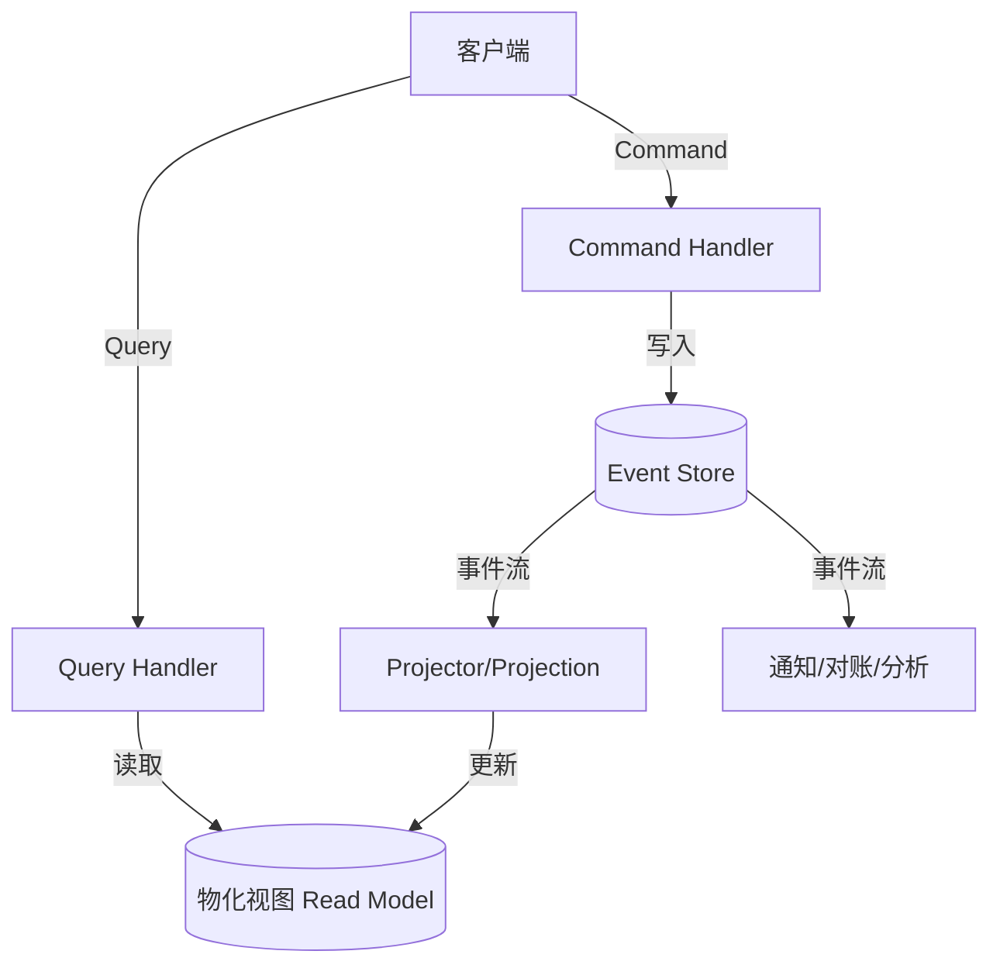

# 事件溯源与 CQRS 实战

## 〇、本体介绍

**事件溯源（Event Sourcing）+ CQRS（Command Query Responsibility Segregation）**：一种将系统状态变更记录为一系列不可变事件（而非仅存储当前状态），并将读写操作分离到不同模型的架构风格。它是 DDD、微服务、高并发场景的"架构核武器"。

**核心矛盾**：
1. 传统 CRUD 只存当前状态，**丢失历史**；事件溯源存全量事件，但查询要回放；
2. 读写共享一个模型导致**查询污染写入性能**；CQRS 分离读写但引入一致性复杂度；
3. 事件溯源天然支持审计、回放、对账，但**实现成本高**（快照、版本迁移、事件风暴）。

**核心主线**：事件建模 → 事件存储 → 聚合根 → CQRS 读写分离 → 最终一致 → 快照优化。

---

## 一、事件溯源核心概念

### 1.1 事件（Event）

```java
// 事件是不可变的、过去时态的、携带业务语义的
public interface DomainEvent {
    String getAggregateId();
    long getVersion();
    Instant getOccurredOn();
}

public record OrderCreated(String orderId, long version, Instant occurredOn,
    String userId, List<OrderItem> items, BigDecimal totalAmount) implements DomainEvent {}

public record OrderPaid(String orderId, long version, Instant occurredOn,
    String paymentId, BigDecimal paidAmount) implements DomainEvent {}

public record OrderShipped(String orderId, long version, Instant occurredOn,
    String trackingNo) implements DomainEvent {}
```

### 1.2 聚合根（Aggregate）

```java
public class Order {
    private String orderId;
    private OrderStatus status;
    private List<DomainEvent> uncommittedEvents = new ArrayList<>();

    // 业务方法产生事件（不直接改状态）
    public void pay(String paymentId, BigDecimal amount) {
        if (status != OrderStatus.CREATED) {
            throw new IllegalStateException("Only CREATED order can be paid");
        }
        apply(new OrderPaid(orderId, getNextVersion(), Instant.now(), paymentId, amount));
    }

    // apply 方法既改状态又记录事件
    private void apply(DomainEvent event) {
        uncommittedEvents.add(event);
        switch (event) {
            case OrderPaid e -> this.status = OrderStatus.PAID;
            case OrderShipped e -> this.status = OrderStatus.SHIPPED;
            default -> throw new IllegalStateException("Unknown event: " + event);
        }
    }

    public List<DomainEvent> getUncommittedEvents() { return uncommittedEvents; }
}
```

> 口诀：**"事件不可变，聚合根产事件；回放重建状态，历史全保留。"**

### 1.3 事件存储（Event Store）

```sql
CREATE TABLE event_store (
    aggregate_id  VARCHAR(64) NOT NULL,
    version       BIGINT NOT NULL,
    event_type    VARCHAR(128) NOT NULL,
    event_data    JSONB NOT NULL,
    occurred_on   TIMESTAMP NOT NULL,
    PRIMARY KEY (aggregate_id, version)
);

-- 关键约束：同一 aggregate_id 的 version 唯一且连续（乐观锁）
-- 追加写入，禁止 UPDATE/DELETE（事件不可变）
```

| 存储方案 | 优点 | 缺点 | 适用 |
|----------|------|------|------|
| **关系库（MySQL/PG）** | 简单、事务强、查询灵活 | 写入吞吐有限 | 中小规模、强一致 |
| **专用事件库（EventStoreDB）** | 为事件溯源设计、订阅流 | 学习曲线、运维成本 | 事件溯源核心系统 |
| **Kafka + 物化视图** | 高吞吐、天然流处理 | 非专用、无版本约束 | 大规模、已有 Kafka |

**Kafka 作事件存储的深化（面试讲 10 分钟的内容）**：

- **有序性**：Kafka 只在**分区内**有序——事件溯源要求同一聚合根的事件严格有序 → **`aggregate_id` 做 key，同一聚合根永远进同一分区**；跨分区即乱序，是 Kafka 存储的致命前提；
- **不可变性冲突**：Kafka 的日志压缩（`log.cleanup.policy=compact`）会**删除旧 key 的事件**（保留每个 key 最新值）——与「事件不可变」冲突！事件溯源要么关掉压缩（`delete` 策略 + 按时间保留），要么接受「压缩只影响旧快照，重放语义由物化视图承担」；
- **版本约束缺失**：Kafka 没有「version 连续且唯一」的天然约束 → 乐观锁要靠**生产端 keyed-partition + 应用层 version 校验**，或用 Kafka 事务 + 幂等生产者保证不重不丢；
- **重放**：从头消费（`--from-beginning`）重建物化视图，Kafka Streams/ksqlDB 可直接做「事件 → 视图」的流式投影（Projector 的 Kafka 形态）；
- **选型结论**：**Kafka 适合「事件数量极大、已有 Kafka 基建、接受最终一致视图」的场景**；中小系统别为事件溯源上 Kafka——关系库 + Outbox（见下）更简单可靠。

### 1.4 事件版本化与演进（Upcasting，正文对应面试题 9）

事件一旦落库就**不可变**，但业务会演进——领域事件 schema 变了怎么办？答案是**兼容读取**，不修改事件本身：

- **向后兼容原则**：新字段**加默认值**、字段只增不删、语义不变只改名（JSON Schema 校验在写入端把关）；
- **Upcasting（升格）**：读取时把「旧版本事件」转成「当前代码能理解的版本」——反序列化时按 `event_version` 分发到不同的转换函数：

```java
// 旧事件 OrderPlacedV1: {orderId, itemIds}
// 新事件 OrderPlacedV2: {orderId, itemIds, totalAmount}
Event upcast(Map<String, Object> raw, int version) {
    return switch (version) {
        case 1 -> new OrderPlacedV2(
            raw.get("orderId"), raw.get("itemIds"),
            computeTotal(raw.get("itemIds"))   // V1 → V2 需要补字段
        );
        default -> mapper.readValue(raw, OrderPlacedV2.class);
    };
}
```

- **Schema Registry 治理**：事件 schema 放注册中心（Confluent Schema Registry / Karapace），**向后兼容策略（BACKWARD）强制**：新 schema 必须能读旧数据，不兼容提交直接拒绝——把「演进纪律」从口头变成门禁；
- **老事件不动**：绝不 UPDATE 历史事件（那是溯源的本意）；要修正业务错误，追加 `OrderAmended` 类型事件——「修正也是事件」。

### 1.5 领域事件 vs 集成事件（澄清三兄弟）

| 类型 | 产生者 | 语义 | 消费范围 |
|------|--------|------|----------|
| **领域事件** | 聚合根 apply() | 业务事实（OrderPaid） | 本限界上下文内部 |
| **集成事件（Integration Event）** | 事务提交后发布 | 跨服务通知（OrderPaidPublished） | 其他服务/系统 |
| **通知事件（Notification）** | 视图/第三方 | 触发副作用 | 邮件/推送/Webhook |

> 实践：聚合根只产领域事件；**事务提交后**（Outbox 或 CDC，见 1.6）才发布集成事件；区分两者避免「业务逻辑泄漏到消息层」。

### 1.6 写事件存储与写业务库的原子性（Outbox，面试必问）

事件溯源最大的工程坑：**业务状态变更（写业务表）与事件追加（写事件库）是两个存储，不是原子操作**——先写业务后写事件，崩溃就丢事件。

- **方案一：共用存储（推荐）**：业务表和事件表放**同一个事务**（MySQL 单库）——事件溯源天然满足「同事务写入」，这是关系库方案的最大优势；
- **方案二：Transactional Outbox**：业务与事件**同库同事务**写 Outbox 表，后台进程读 Outbox 发布到 MQ（消费者侧幂等）——Kafka 方案下没有「同事务」可用，Outbox 是标准解（细节见[分布式事务实战](分布式事务实战.md)第四节）；
- **方案三：CDC**：业务库 binlog 解析（Canal/Debezium）生成事件流——无需双写，但事件 schema 与业务表耦合。

> 一句话：**事件溯源 + 关系库 = 同事务天然原子；事件溯源 + Kafka = 必须 Outbox/CDC 补原子性，否则「事件丢一半」是必现事故。**

---

## 二、CQRS 读写分离

### 2.1 架构设计



### 2.2 Command 侧（写）

```java
@Service
public class OrderCommandHandler {
    @Transactional
    public void handle(PayOrderCommand cmd) {
        // 1. 加载聚合根（从事件存储回放）
        Order order = eventStore.load(cmd.orderId(), Order.class);
        // 2. 执行业务逻辑（产生事件）
        order.pay(cmd.paymentId(), cmd.amount());
        // 3. 追加写入事件存储（乐观锁防并发）
        eventStore.append(order.getUncommittedEvents());
    }
}
```

### 2.3 Query 侧（读）

```java
// 物化视图：针对查询优化的宽表（反范式）
@Service
public class OrderQueryService {
    // 查订单详情（从读库/缓存，不从事件回放）
    public OrderDetailView getOrderDetail(String orderId) {
        return orderDetailViewRepo.findById(orderId);
    }

    // 查用户订单列表（分页、过滤、排序）
    public List<OrderListItemView> listUserOrders(String userId, int page) {
        return orderListItemViewRepo.findByUserId(userId, page);
    }
}
```

### 2.4 Projector（投影器）

```java
@Component
public class OrderProjector {
    @EventListener
    public void on(OrderPaid event) {
        // 事件 → 更新读模型（物化视图）
        orderDetailViewRepo.updateStatus(event.orderId(), "PAID");
        orderListItemViewRepo.updateStatus(event.orderId(), "PAID");
        // 可发送通知、触发下游
        notificationService.notifyUser(event.orderId(), "您的订单已支付");
    }
}
```

> 口诀：**"Command 写事件，Query 读视图；Projector 做投影，最终一致靠流。"**

---

## 三、最终一致性与并发控制

### 3.1 乐观锁（版本号）

```sql
-- 追加事件时检查版本号（防止并发写同一聚合根）
INSERT INTO event_store (aggregate_id, version, ...)
SELECT ?, ?, ...
WHERE NOT EXISTS (
    SELECT 1 FROM event_store WHERE aggregate_id = ? AND version = ?
);
-- 若插入失败 → 版本冲突 → 重试或报错
```

### 3.2 事件回放与快照

```java
// 快照：定期保存聚合根当前状态，避免回放全量事件
public class OrderSnapshot {
    String orderId;
    long version;       // 快照版本
    OrderState state;   // 聚合根序列化状态
}

// 加载聚合根：先加载快照 + 回放快照之后的事件
OrderSnapshot snapshot = snapshotStore.loadLatest(orderId);
List<DomainEvent> events = eventStore.loadAfter(orderId, snapshot.version());
Order order = Order.replay(snapshot, events);
```

| 优化手段 | 做法 | 收益 |
|----------|------|------|
| **快照** | 每 N 个事件保存一次聚合根状态 | 回放时间从 O(N) → O(N-M) |
| **内存缓存** | 热点聚合根缓存 | 减少事件存储读取 |
| **批量追加** | 多事件一次写入 | 减少 DB 往返 |

---

## 四、与其他板块的关系

- **场景设计**：[分布式锁](../场景设计/分布式锁.md) — 事件溯源的并发控制（乐观锁 vs 分布式锁）
- **场景设计**：[幂等设计](../场景设计/幂等设计.md) — 事件幂等消费（Projector 的幂等性）
- **场景设计**：[钱包与账务系统设计：账户、流水与日终对账](../场景设计/钱包与账务系统设计：账户、流水与日终对账.md) — 账务系统是事件溯源的典型应用（复式记账 = 事件）
- **DDD**：[战术设计](../DDD/战术设计.md) — 聚合根、领域事件是事件溯源的 DDD 基础
- **场景设计**：[延迟任务与订单超时关闭](../场景设计/延迟任务与订单超时关闭.md) — 事件驱动 + 定时任务做超时检查
- **源码系列**：[RocketMQ 源码](../源码系列/rocketMq.md) — RocketMQ 事务消息可作为事件存储的替代

---

## 五、速查表

| 主题 | 一句话 |
|------|--------|
| 事件 | 不可变、过去时态、携带业务语义 |
| 聚合根 | 产事件、回放重建、版本号乐观锁 |
| CQRS | Command 写事件、Query 读视图 |
| Projector | 事件→物化视图、最终一致 |
| 快照 | 定期保存状态、减少回放 |
| 并发 | 版本号乐观锁、冲突重试 |
| 适用 | 审计要求高、对账、状态机、账务 |

---

## 面试高频问题（12+ 条）

1. **什么是事件溯源？** 不存当前状态，存全量事件；通过回放事件重建任意时刻状态。
2. **事件溯源的优点？** 完整审计日志、任意时刻回放、天然对账、事件驱动解耦。
3. **事件溯源的缺点？** 查询要回放（需快照优化）、事件 schema 迁移复杂、学习曲线高。
4. **什么是 CQRS？** 读写分离：Command 写模型（事件）、Query 读模型（物化视图）。
5. **CQRS 和事件溯源的关系？** 常配合使用：事件溯源写、CQRS 读。但两者可独立使用。
6. **什么是 Projector？** 监听事件流，更新读模型（物化视图），实现最终一致。
7. **怎么解决并发写同一聚合根？** 版本号乐观锁：追加事件时检查版本，冲突重试。
8. **什么是快照？** 定期保存聚合根当前状态，加载时只回放快照之后的事件。
9. **事件 schema 怎么迁移？** Upcasting：旧事件→新事件转换；版本字段区分；兼容读取。
10. **事件溯源适合什么场景？** 审计要求高（金融/账务）、状态机、对账、任意时刻回放。
11. **什么场景不适合事件溯源？** 简单 CRUD、查询为主写入少、团队经验不足。
12. **事件存储用什么数据库？** 关系库（简单）、EventStoreDB（专用）、Kafka（高吞吐）。
13. **最终一致怎么保证不丢事件？** 事件存储是权威（append-only），Projector 幂等消费 + 死信队列兜底。
