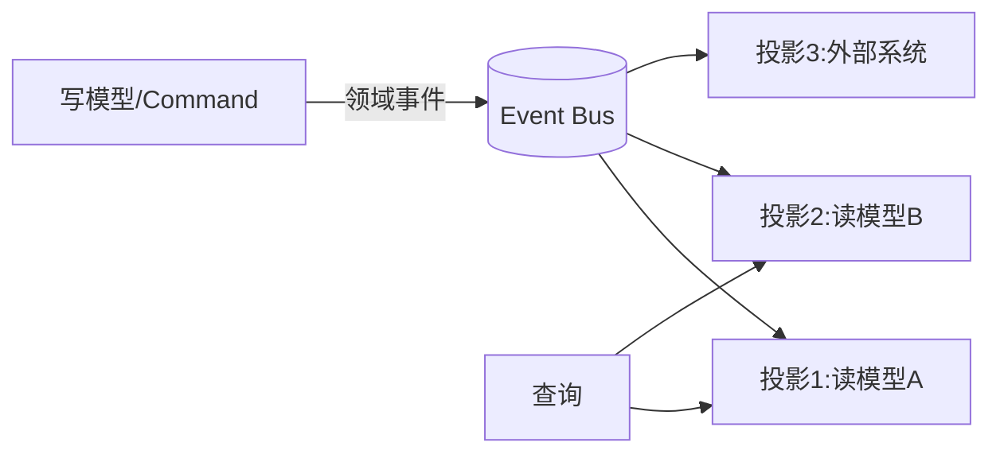

# 事件驱动与 CQRS 协同实战

> 事件驱动让系统"松耦合、可扩展"，CQRS 让"写模型"与"读模型"分离以各自优化。两者天然互补：写侧产生领域事件，读侧订阅事件构建物化视图。协同得当，能支撑高吞吐与复杂查询并存。

## 1. 协同架构



## 2. CQRS 模型

- **Command 侧**：处理写、校验业务不变量，产出事件。
- **Query 侧**：直接读预构建的物化视图，无领域逻辑。
- 两侧可用不同存储（写用关系库，读用 ES/Redis）。

## 3. 事件设计

- **事件即事实**：`OrderCreated`、`StockFrozen`，过去时、不可变。
- **幂等投影**：事件带唯一 ID，重复投递安全。
- **有序性**：同一聚合的事件按序消费，避免乱序。

```java
// 投影幂等消费（概念）
@StreamListener
void on(OrderCreated e) {
    if (projectRepo.exists(e.eventId)) return;  // 幂等
    projectRepo.upsert(toView(e));
    projectRepo.mark(e.eventId);
}
```

## 4. 一致性与补偿

- 读模型是**最终一致**，需接受短暂延迟。
- 投影失败重试；长期失败进死信人工修复。
- 提供"重建投影"能力：从事件溯源重放。

## 5. 常见坑

| 坑 | 现象 | 对策 |
| --- | --- | --- |
| 事件乱序 | 视图错 | 按聚合排序 |
| 投影丢失 | 查不到 | 死信 + 重建 |
| 读延迟 | 看不到新数据 | 接受最终一致 |
| 事件膨胀 | 存储爆 | 快照 + 过期 |
| 耦合回写 | 退化 | 读侧只读 |

## 6. 面试题

1. CQRS 为什么常和事件驱动一起用？
2. 读模型最终一致如何被接受？
3. 事件乱序怎么处理？
4. 投影如何保证幂等？
5. 事件溯源与 CQRS 关系？

## 7. 小结

事件驱动 + CQRS = 写侧产事件、读侧建视图、各自扩展。核心是用"最终一致的读模型"换取写的简单与读的高性能，并接受短暂延迟。
