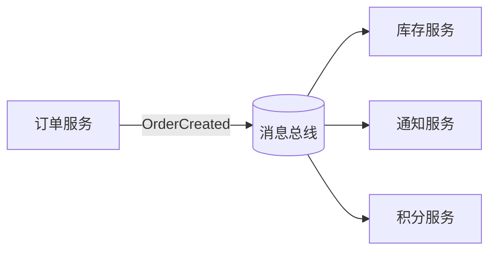
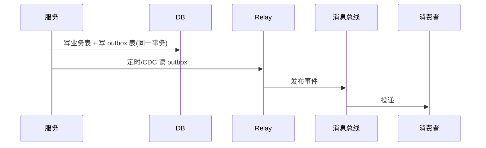

# 事件驱动架构与消息总线实战

> 事件驱动架构（EDA）以"事件"为骨架解耦服务：生产者发布事件，消费者订阅响应，系统从"同步调用链"转向"异步反应网"。本文从概念、模式、消息总线选型到落地坑点系统讲解。

## 1. 什么是事件驱动

- **事件（Event）**：已发生的事实，如 `OrderCreated`、`UserRegistered`，不可变、带时间戳。
- **命令（Command）**：希望发生的事，如 `CreateOrder`，可能失败。
- 区别：事件描述"过去"，命令表达"意图"。



订单服务只管发事件，不关心谁消费——这是 EDA 的核心解耦价值。

## 2. 三种交互模式

| 模式 | 说明 | 适用 |
| --- | --- | --- |
| 事件通知 | 仅通知"发生了什么"，消费者自行查详情 | 弱耦合、跨域 |
| 事件携带状态 | 事件内带完整快照，消费方可直接用 | 减少回查 |
| 事件溯源 | 状态由事件流重放得出 | 强审计、可回放 |

## 3. 消息总线选型

| 中间件 | 特点 | 取舍 |
| --- | --- | --- |
| Kafka | 高吞吐、持久化、分区有序 | 运维重、延迟稍高 |
| RabbitMQ | 灵活路由、低延迟 | 吞吐不及 Kafka |
| Pulsar | 存算分离、多租户 | 架构复杂 |
| Redis Stream | 轻量、易上手 | 重吞吐场景弱 |

选型看：吞吐、延迟、顺序性、投递语义（at-least-once / exactly-once）、生态。

## 4. 核心设计：消费者幂等

事件可能重复投递（at-least-once），消费方必须幂等：

```python
def handle_order_created(event):
    key = f"dedup:{event.id}"
    if redis.set(key, "1", nx=True, ex=86400):  # 首次
        process(event)
    # 重复则跳过
```

- 用事件 ID 去重（Redis/DB 唯一约束）。
- 业务状态机：只处理"未处理→已处理"的状态跃迁。

## 5. 顺序与分区

- 同聚合（如同一订单）的事件须发到同一分区，保证有序。
- Kafka 按 `key` 哈希分区，天然的订单级有序。
- 跨聚合无需全局有序，避免成为瓶颈。

## 6. 事务与一致性

### 6.1 发事件与本地事务
用**事务发件箱（Transactional Outbox）**模式，避免"本地事务提交但事件未发"的不一致：



- 业务与 outbox 同库同事务，保证一致。
- 独立 relay（或 Debezium CDC）读 outbox 发到总线，发成功后标记。

### 6.2 Saga 长事务
跨服务业务（下单→扣库存→支付）用 Saga：每个步骤有补偿动作，失败时反向补偿。

## 7. 死信与重试

- 消费失败进入重试队列，指数退避。
- 多次失败进死信队列（DLQ），人工/定时复盘。
- 切忌"失败就无限重试"——会阻塞分区。

## 8. 可观测

- 每个事件带 `traceId`，跨服务串联（OpenTelemetry）。
- 监控：积压量（lag）、消费延迟、失败率、DLQ 数量。
- 事件流可视化：哪些事件触发了哪些处理。

## 9. 落地坑点

| 坑 | 现象 | 对策 |
| --- | --- | --- |
| 消费者非幂等 | 重复处理 | 事件 ID 去重 |
| 事件膨胀 | 单事件过大 | 携 ID+必要字段，详情懒加载 |
| 循环事件 | A→B→A | 事件边界清晰、去重 |
| 顺序错乱 | 状态错 | 同聚合同分区 |
| 数据不一致 | 发了没消费 | Outbox + 对账 |
| 调试难 | 链路黑盒 | 全链路 trace |

## 10. 与事件溯源结合

事件溯源（ES）把所有状态变更存为事件流，当前状态 = 重放事件。优点：完整审计、可回放任意时点；缺点：查询需物化视图（CQRS 读模型）、学习曲线陡。

## 11. 面试题

1. 事件与命令的区别？
2. 为什么消费者必须幂等？
3. 事务发件箱解决了什么问题？
4. Kafka 如何保证同一订单事件有序？
5. 消息总线选型要考虑哪些因素？
6. 事件驱动下如何排查数据不一致？

## 12. 小结

事件驱动 = 解耦 + 异步 + 可扩展。生产落地的三块基石是：**消息总线选型、消费幂等、事务发件箱/对账**。配合 trace 与 DLQ，才能把"灵活"变成"可靠"。
