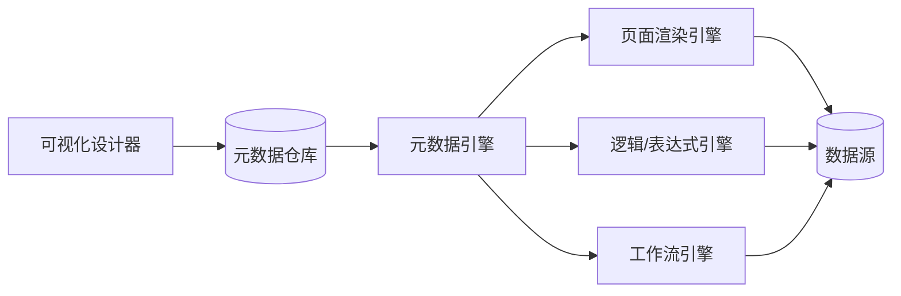

# 低代码平台架构设计

> 板块：架构 　|　 返回：[README](README.md)
> 适用：企业内应用搭建、表单/流程/报表可视化、aPaaS 平台。

低代码让"非专业开发者"通过拖拽/配置生成应用，核心是**把开发能力抽象为可配置的元数据 + 可复用的运行时引擎**。难点在抽象边界、扩展性天花板与生成代码质量。

## 一、低代码分类

| 类型 | 能力 | 适用人群 |
|------|------|----------|
| 表单/报表类 | 拖拽表单、配置报表 | 业务运营 |
| 流程类（BPM） | 可视化流程编排 | 流程管理员 |
| 应用级 aPaaS | 数据模型+页面+逻辑+部署 | 公民开发者/外包 |
| 专业低代码 | 含自定义代码/插件 | 专业开发者提速 |

## 二、核心架构

```
设计器(拖拽/配置) → 元数据(模型/页面/逻辑/权限) → 元数据引擎(解析执行)
                                                    ↓
                                          运行时(渲染/校验/流转)
                                                    ↓
                                          数据源(数据库/API/第三方)
```



## 三、关键子系统

### 3.1 元数据引擎

- 把"页面长啥样、有哪些字段、什么校验、谁可见"存为结构化元数据。
- 引擎运行时解析元数据，动态渲染与执行。
- 版本管理：元数据变更可回滚。

### 3.2 渲染引擎

- 前端按元数据渲染表单/列表/详情。
- 组件市场：内置 + 自定义组件。
- 响应式：一套配置多端（Web/移动）。

### 3.3 逻辑/表达式引擎

- 字段联动、计算公式、校验规则用表达式引擎执行。
- 避免硬编码，规则以配置驱动。

### 3.4 工作流引擎

- 审批/任务流可视化编排（见[场景设计/工单与审批流系统设计](../场景设计/工单与审批流系统设计.md)）。
- 节点、分支、会签由引擎驱动。

### 3.5 数据源与权限

- 多数据源：自有库、外部 API、第三方系统。
- 行级/字段级权限：按角色控制可见与可编辑。

## 四、扩展性设计

低代码的天花板在于"配置表达不了的需求"，需提供逃生舱：

- **自定义代码/函数**：在节点注入代码片段（沙箱执行）。
- **自定义组件**：开发者上传组件，设计器可用。
- **API 集成**：调用外部服务，扩展数据/能力。
- **生成代码/导出**：部分平台支持导出源码，脱离平台运行。

## 五、与专业开发的关系

- **互补而非替代**：低代码加速标准场景（CRUD/流程），专业开发攻坚复杂逻辑与性能。
- **专业开发造低代码，公民开发者用低代码**：平台本身由专业团队构建。
- **混合团队**：公民开发者搭骨架，开发者接手难点。

## 六、质量与治理

- **生成代码质量**：避免生成的代码不可维护；模板化 + 规范。
- **性能**：复杂页面渲染慢，需编译优化/缓存。
- **可观测**：元数据变更影响面大，需审计与灰度。
- **资产治理**：应用/组件/模板的复用与下线管理。

## 七、与常规开发的对比

| 维度 | 低代码 | 传统开发 |
|------|--------|----------|
| 速度 | 快（配置） | 慢（编码） |
| 灵活性 | 受平台能力限 | 无限 |
| 成本 | 低（人力少） | 高 |
| 维护 | 平台升级影响 | 自主可控 |
| 复杂场景 | 力不从心 | 胜任 |

## 八、常见坑

1. **过度承诺** → 复杂业务做不了；明确能力边界。
2. **生成代码烂** → 难维护；模板化 + 可审查。
3. **性能差** → 渲染慢；编译优化 + 缓存元数据。
4. **锁定** → 平台迁移难；选可导出/开放标准的。
5. **元数据失控** → 版本混乱；元数据版本管理 + 审计。
6. **权限粗** → 数据越权；行/字段级权限。
7. **公民开发者踩坑** → 缺乏工程规范；培训 + 平台约束。

## 九、延伸阅读

- [架构/DDD落地与整洁架构实战](DDD落地与整洁架构实战.md)
- [架构/企业架构](企业架构.md)
- [场景设计/工单与审批流系统设计](../场景设计/工单与审批流系统设计.md)
- [设计模式/创建型/工厂方法与建造者模式](创建型/工厂方法与建造者模式.md)
