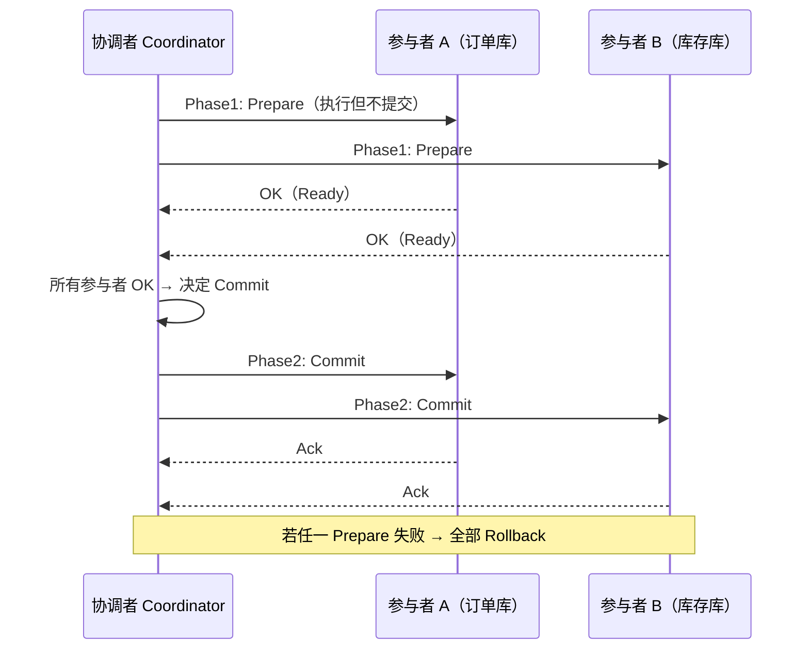
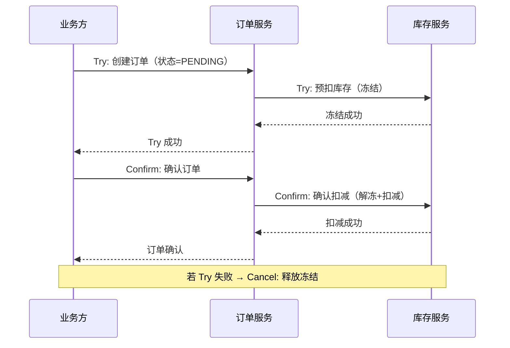
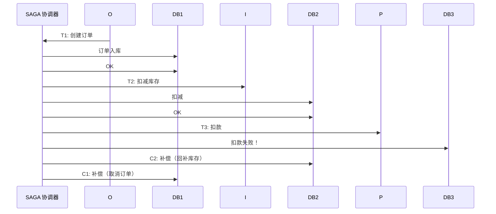
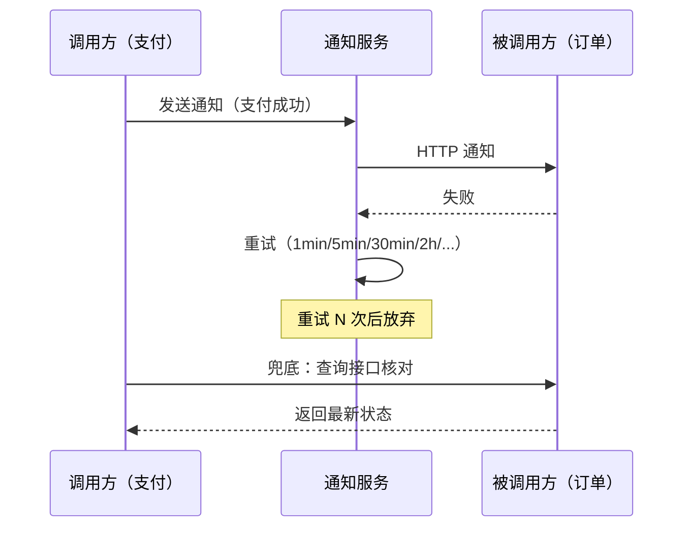

# 分布式事务实战

## 〇、本体介绍

**分布式事务**：在多个独立数据库/服务/消息队列之间保证操作的原子性（要么全成功、要么全失败）。分布式事务是**微服务架构最难的课题之一**——CAP 定理决定了完美方案不存在，只有权衡。

**核心矛盾**：
1. **强一致**（2PC）vs **高可用**（BASE）：强一致阻塞，高可用脏读；
2. **性能**（异步/最终一致）vs **正确性**（同步/强一致）：此消彼长；
3. 不同业务场景对一致性要求不同：转账要强一致，点赞可以最终一致。

**核心主线**：2PC → TCC → SAGA → 本地事务表 → 最大努力通知 → 选型决策。

---

## 一、两阶段提交（2PC）

### 1.1 流程



### 1.2 优缺点

| 维度 | 说明 |
|------|------|
| **优点** | 强一致，实现简单 |
| **缺点** | 同步阻塞（Phase1 锁资源）、单点（协调者故障）、Phase2 部分失败不一致 |
| **适用** | 同城短事务、强一致要求、参与者少 |

### 1.3 变体：三阶段提交（3PC）

- 增加 **CanCommit** 阶段（预检查），减少阻塞
- 引入超时机制（参与者超时自动提交/回滚）
- 仍不能完全解决网络分区问题

> 口诀：**"2PC 两阶段，先问后提交；阻塞是命门，强一致代价。"**

---

## 二、TCC（Try-Confirm-Cancel）

### 2.1 流程



### 2.2 三阶段详解

| 阶段 | 做什么 | 幂等 | 空回滚 | 悬挂 |
|------|--------|------|--------|------|
| **Try** | 资源预检 + 冻结 | ✅ | ❌ 需处理 | ❌ 需处理 |
| **Confirm** | 确认执行 | ✅ | - | - |
| **Cancel** | 释放冻结 | ✅ | ✅ | - |

### 2.3 TCC 异常处理

| 异常 | 处理 |
|------|------|
| **空回滚** | Cancel 先于 Try 到达（网络乱序）：Cancel 发现无冻结记录，记录"已 Cancel"，后续 Try 直接拒绝 |
| **悬挂** | Cancel 执行后 Try 到达：Cancel 标记后，Try 检查标记拒绝 |
| **幂等** | 每个阶段按业务键幂等（Confirm/Cancel 多次调用结果一致） |

### 2.4 TCC 代码示例

```java
// 订单服务 TCC
@LocalTCC
public interface OrderTCC {
    @TwoPhaseBusinessAction(name = "createOrder", commitMethod = "confirm", rollbackMethod = "cancel")
    boolean tryCreateOrder(@BusinessActionContextParameter("orderId") String orderId,
                          @BusinessActionContextParameter("userId") String userId);

    boolean confirm(BusinessActionContext ctx);

    boolean cancel(BusinessActionContext ctx);
}

// Seata TCC 实现
@Service
public class OrderTCCImpl implements OrderTCC {
    public boolean tryCreateAction(String orderId, String userId) {
        // 1. 创建订单（状态 = PENDING）
        orderDao.insert(orderId, userId, OrderStatus.PENDING);
        // 2. 冻结用户余额（freeze 字段）
        accountDao.freeze(userId, orderAmount);
        return true;
    }

    public boolean confirm(BusinessActionContext ctx) {
        String orderId = ctx.getActionContext("orderId");
        // 1. 订单状态 → CONFIRMED
        orderDao.updateStatus(orderId, OrderStatus.CONFIRMED);
        // 2. 解冻并扣减余额
        accountDao.confirmFreeze(userId, amount);
        return true;
    }

    public boolean cancel(BusinessActionContext ctx) {
        String orderId = ctx.getActionContext("orderId");
        // 1. 订单状态 → CANCELLED
        orderDao.updateStatus(orderId, OrderStatus.CANCELLED);
        // 2. 释放冻结余额
        accountDao.unfreeze(userId, amount);
        return true;
    }
}
```

> 口诀：**"Try 冻资源，Confirm 真扣；Cancel 释放，幂等兜底。"**

---

## 三、SAGA

### 3.1 思路

- 将长事务拆分为**多个本地事务**（T1, T2, T3...）
- 每个本地事务执行后，若失败则执行**补偿事务**（C3, C2, C1...）



### 3.2 编排方式

| 方式 | 思路 | 适用 |
|------|------|------|
| **编排式（Choreography）** | 每个服务完成后发事件，下一个服务消费 | 简单链路 |
| **协调式（Orchestration）** | 中央协调器按序调用各服务 | 复杂链路 |

### 3.3 SAGA vs TCC

| 维度 | SAGA | TCC |
|------|------|-----|
| 一致性 | 最终一致 | 最终一致 |
| 资源锁定 | 不锁定（直接提交） | Try 阶段锁定 |
| 适用 | 长事务、跨多个服务 | 短事务、需要资源预留 |
| 补偿 | 需要补偿事务（逆向操作） | Cancel 释放冻结 |
| 隔离性 | 无隔离（脏读） | 较好（Try 阶段锁定） |

---

## 四、本地事务表（Transactional Outbox）

### 4.1 思路

- 业务数据 + 事件数据写入**同一个本地事务**
- 独立进程轮询事件表 → 发 MQ → 消费方处理

```mermaid
sequenceDiagram
    participant S as 订单服务
    participant DB[本地 DB<br/>订单表 + 事件表]
    participant P[事件发布器<br/>轮询]
    participant MQ[Kafka/RocketMQ]
    participant I[库存服务]
    S->>DB: 本地事务: 创建订单 + 插入事件(待发布)
    P->>DB: 轮询待发布事件
    P->>MQ: 发送事件
    P->>DB: 标记已发布
    MQ->>I: 消费事件 → 扣减库存
```

### 4.2 表设计

```sql
CREATE TABLE order_outbox (
    id          BIGINT PRIMARY KEY AUTO_INCREMENT,
    aggregate_id VARCHAR(64) NOT NULL,   -- 订单号
    event_type   VARCHAR(128) NOT NULL,  -- OrderCreated
    payload      JSONB NOT NULL,          -- 事件体
    status       TINYINT DEFAULT 0,      -- 0待发布 1已发布 2失败
    retry_count  INT DEFAULT 0,
    created_at   TIMESTAMP DEFAULT NOW(),
    published_at TIMESTAMP NULL,
    INDEX idx_status_created (status, created_at)
);
```

> 口诀：**"业务事件同事务，轮询发布不丢；消费者幂等处理，最终一致保证。"**

---

## 五、最大努力通知

### 5.1 思路

- 调用方尽力通知被调用方，但不保证一定成功
- 被调用方提供**查询接口**供调用方核对

### 5.2 流程



### 5.3 对比

| 方案 | 一致性 | 性能 | 适用 |
|------|--------|------|------|
| **2PC** | 强一致 | 低 | 同城短事务 |
| **TCC** | 最终一致 | 中 | 订单/库存/账户 |
| **SAGA** | 最终一致 | 高 | 长流程/多服务 |
| **本地事务表** | 最终一致 | 高 | 异步事件驱动 |
| **最大努力通知** | 弱一致 | 最高 | 通知/回调 |

---

## 六、选型决策

```
需要强一致？
  ├── 是 → 2PC（同城）/ TCC（分布式）
  └── 否 → 事务链路长？
              ├── 长 → SAGA
              └── 短 → 需要资源预留？
                        ├── 是 → TCC
                        └── 否 → 异步即可？
                                  ├── 是 → 本地事务表
                                  └── 否 → 最大努力通知
```

| 场景 | 推荐 | 理由 |
|------|------|------|
| 银行转账 | TCC / 2PC | 强一致，不能丢 |
| 电商下单 | TCC / SAGA | 订单→库存→支付，最终一致 |
| 积分发放 | 本地事务表 | 异步，不阻塞主流程 |
| 短信通知 | 最大努力通知 | 尽力即可，可人工补发 |
| 跨系统对账 | SAGA + 对账 | 事后核对修复 |

---

## 七、与其他板块的关系

- **场景设计/幂等设计** — 分布式事务中每个阶段都必须幂等
- **场景设计/钱包与账务系统设计** — 账务系统用复式记账实现事务
- **分布式系统理论** — CAP/BASE 定理的理论基础
- **场景设计/延迟任务与订单超时关闭** — 事务超时的补偿机制
- **源码系列/RocketMQ** — RocketMQ 事务消息 = 本地事务表的实现
- **源码系列/Seata** — Seata 框架（AT/TCC/SAGA/XA 模式）
- **场景设计/抢红包系统设计** — 高并发下的事务 + 幂等

---

## 八、速查表

| 方案 | 一致性 | 性能 | 复杂度 | 适用 |
|------|--------|------|--------|------|
| **2PC** | 强一致 | 低 | 低 | 同城短事务 |
| **TCC** | 最终一致 | 中 | 高 | 订单/库存/账户 |
| **SAGA** | 最终一致 | 高 | 中 | 长流程/多服务 |
| **本地事务表** | 最终一致 | 高 | 中 | 异步事件驱动 |
| **最大努力通知** | 弱一致 | 最高 | 低 | 通知/回调 |

---

## 面试高频问题（18+ 条）

1. **分布式事务有哪些方案？** 2PC、TCC、SAGA、本地事务表、最大努力通知。
2. **2PC 的问题？** 同步阻塞（Phase1 锁资源）、协调者单点、Phase2 部分提交失败。
3. **TCC 的三个阶段？** Try（冻结资源）、Confirm（确认执行）、Cancel（释放冻结）。
4. **TCC 的空回滚是什么？** Cancel 先于 Try 到达（网络乱序），Cancel 记录标记，Try 检查拒绝。
5. **TCC 的悬挂是什么？** Cancel 执行后 Try 到达，Try 检查 Cancel 标记拒绝。
6. **SAGA 和 TCC 的区别？** SAGA 不锁定资源直接提交，需要补偿事务；TCC Try 阶段锁定。
7. **什么是本地事务表（Outbox）？** 业务数据 + 事件数据写同一本地事务，独立进程轮询发布到 MQ。
8. **本地事务表怎么保证不丢？** 事件和订单同事务写入（原子），轮询发布 + 失败重试。
9. **最大努力通知是什么？** 调用方尽力通知，被调用方提供查询接口兜底核对。
10. **怎么选型？** 强一致→2PC/TCC；长链路→SAGA；异步→本地事务表；通知→最大努力。
11. **Seata 支持哪些模式？** AT（自动补偿）、TCC、SAGA、XA。
12. **RocketMQ 事务消息是什么？** 半消息 → 执行本地事务 → 确认/回滚，= 本地事务表的 MQ 实现。
13. **分布式事务中幂等怎么做？** 业务唯一键去重（唯一索引/Redis Set/状态机 CAS）。
14. **BASE 理论是什么？** 基本可用 + 软状态 + 最终一致，是 CAP 中 AP 方案的延伸。
15. **什么是补偿事务？** SAGA 中的逆向操作：如"扣库存"的补偿是"回补库存"。
16. **SAGA 编排式和协调式区别？** 编排式：服务间事件驱动；协调式：中央协调器按序调用。
17. **XA 是什么？** 数据库层面的 2PC 接口（Java JTA），性能差，微服务不推荐。
18. **幂等和事务的关系？** 事务的 Confirm/Cancel/SAGA 补偿都必须幂等（网络重试安全）。
19. **对账在分布式事务中的作用？** 兜底手段：事务执行后定期核对，发现差异自动修复。
