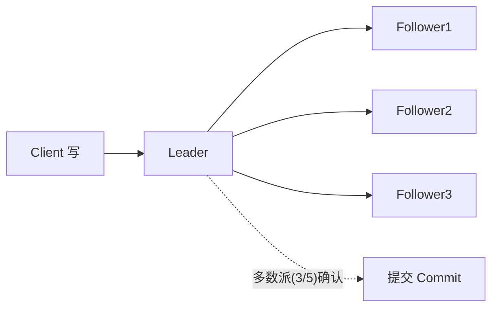

# 分布式系统核心问题（CAP / 一致性 / 共识 / 时钟）

> 配套：[分布式事务实战](分布式事务实战.md) · [容灾多活与异地多中心架构](容灾多活与异地多中心架构.md) · [微服务治理全链路](微服务治理全链路.md)
> 分布式系统的"难"集中在几个理论问题上：一致性、可用性、分区容错如何取舍？节点如何达成共识？时间如何对齐？本篇把这些问题一次讲透。

---

## 一、CAP 定理（到底在说什么）

CAP 指出：在**网络分区（P）必然发生**的前提下，一致性（C）与可用性（A）**无法同时保证**，只能选其一。

| 字母 | 含义 | 说明 |
|------|------|------|
| C 一致性 | 所有节点同一时刻看到相同数据 | 强一致（线性一致） |
| A 可用性 | 每个请求都有响应（不保证最新） | 不保证最新但必须返回 |
| P 分区容错 | 网络分区下系统仍能工作 | 分布式必选，不能放弃 |

> 关键澄清：**CAP 不是"三选二"的静态选择**，而是"分区发生时 C 与 A 如何取舍"。无分区时 CA 可同时满足；一旦分区，要么返回可能旧数据（AP），要么拒绝服务保一致（CP）。

### CP vs AP 选型

| 系统 | 选择 | 理由 |
|------|------|------|
|  ZooKeeper / etcd | CP | 协调/配置必须一致，宁可短暂不可用 |
| 注册中心（Eureka） | AP | 宁可返回旧节点列表，也不整体不可用 |
| 订单/支付核心 | CP（强一致） | 不能错账 |
| 社交 Feed / 评论 | AP（最终一致） | 短暂不一致可接受 |

---

## 二、BASE 理论（AP 的工程化）

BASE 是对 CAP 中 AP 系统的补充约束，强调**最终一致**：

- **BA（Basically Available）**：基本可用，允许降级/部分失败；
- **S（Soft state）**：软状态，允许中间态（数据暂时不一致）；
- **E（Eventual consistency）**：最终一致，经过一段时间所有副本一致。

> BASE 是「牺牲强一致换可用性」的工程落地哲学，配合**消息队列 + 对账**实现最终一致。详见[分布式事务实战·最终一致](分布式事务实战.md)。

---

## 三、一致性模型（强度谱系）

| 模型 | 保证 | 例子 |
|------|------|------|
| 线性一致（Linearizable） | 像单副本，全局有序 | etcd、ZooKeeper（读最新写） |
| 顺序一致 | 各节点顺序一致但不实时 | 某些缓存 |
| 因果一致 | 有因果关系的操作保序 | 评论-回复 |
| 最终一致 | 无新写后终将一致 | DNS、CDN、读副本 |
| 弱一致 | 不保证何时一致 | 某些内存缓存 |

> 面试要点：**强一致代价高（延迟/可用）**，绝大多数业务用最终一致 + 关键路径强一致即可。

---

## 四、共识算法（Consensus）

当多个节点要对"某件事"达成一致（谁当主、日志顺序、提交与否），需要共识算法。

### 4.1 为什么难
- 节点会崩溃（崩溃-恢复模型）；
- 网络会丢包/延迟/分区；
- 不能依赖"全局时钟"；
- 需保证：**Safety（不会达成错误一致）+ Liveness（最终会达成一致）**。

### 4.2 Paxos（理论基石）
- Leslie Lamport 提出，证明分布式共识可行性；
- 角色：Proposer / Acceptor / Learner；
- 难懂、难实现——多用作理论参考。

### 4.3 Raft（工程主流）
- 目标：可理解地实现共识；
- 三个子问题：
  1. **Leader 选举**：节点超时触发选举，多数派投票；
  2. **日志复制**：Leader 接收写，复制到多数派才提交；
  3. **安全性**：任期（term）+ 日志匹配保证不丢、不分歧。
- 应用：etcd、Consul、TiKV 等。

> 一句话：**Raft = 选主 + 日志复制 + 多数派确认**，是 etcd/Consul/TiDB 等强一致存储的底座。详见[分布式事务实战](分布式事务实战.md)与 TiDB 相关源码。

---

## 五、时间与顺序（时钟难题）

分布式没有全局时钟，"哪件事先发生"并不显然。

| 机制 | 做法 | 局限 |
|------|------|------|
| 物理时钟 NTP | 各机对齐 UTC | 有误差（毫秒级）、可能回拨 |
| 逻辑时钟（Lamport） | 事件计数递增，保偏序 | 不能区分并发 |
| 向量时钟 | 每个节点一个计数器数组 | 能识别因果/并发 |
| TrueTime / HLC | 置信区间 / 混合逻辑时钟 | Spanner / 部分 NewSQL |

> 因果一致性常依赖向量时钟识别"谁因谁果"；Spanner 用 TrueTime 把时钟误差显式纳入事务提交判断，实现"外部一致"。

---

## 六、拜占庭容错（BFT）

- 普通共识假设节点"崩溃但不撒谎"；
- **拜占庭**假设节点可能**恶意发送矛盾信息**（如区块链场景）；
- PBFT（实用拜占庭容错）可容忍 <1/3 恶意节点；区块链用 PoW/PoS 替代 BFT 以去中心化。
- 绝大多数企业内部分布式系统只需**非拜占庭容错（Crash Fault Tolerance）**，如 Raft。

---

## 七、脑裂（Split-Brain）与租约

- **脑裂**：分区后两边各自选出 Leader，都对外服务 → 数据冲突。
- **应对**：
  - **Quorum（多数派）**：写需多数确认，分区 minority 无法达成 → 自动降级；
  - **租约（Lease）**：Leader 持有有时效的租约，过期未续约则让位；
  - **fencing（栅栏）**：旧 Leader 操作被存储层拒绝（如 fencing token）。

---

## 八、面试高频追问

1. Q：CAP 是什么？ A：分区发生时 C 与 A 不能兼得；P 必选，所以选 CP 或 AP。
2. Q：CP 和 AP 怎么选？ A：核心资金/协调选 CP，社交/读多写少可接受旧数据选 AP。
3. Q：BASE 是什么？ A：基本可用+软状态+最终一致，是 AP 工程落地。
4. Q：Raft 三个子问题？ A：Leader 选举、日志复制、安全性（任期+匹配）。
5. Q：Paxos 和 Raft 区别？ A：Paxos 理论难实现，Raft 可理解、工程主流。
6. Q：脑裂怎么防？ A：Quorum 多数派 + 租约 + fencing token。
7. Q：逻辑时钟 vs 向量时钟？ A：逻辑时钟保偏序不能识别并发；向量时钟能识别因果/并发。
8. Q：为什么不用全局时钟？ A：无真正全局时钟，NTP 有误差且可能回拨，需逻辑/混合时钟。
9. Q：拜占庭容错场景？ A：节点可能恶意（区块链），需 PBFT/PoW，企业内多只需 Crash 容错。
10. Q：线性一致和最终一致区别？ A：线性一致像单副本实时一致，代价高；最终一致允许窗口期不一致。

---

## 九、Cheat Sheet

| 概念 | 一句话 |
|------|--------|
| CAP | 分区下 C 与 A 二选一，P 必选 |
| BASE | 基本可用+软状态+最终一致（AP 落地） |
| Raft | 选主+日志复制+多数派确认 |
| 时钟 | 无全局时钟，用逻辑/向量/HLC |
| 脑裂 | Quorum + 租约 + fencing |
| BFT | 防恶意节点，区块链场景 |
