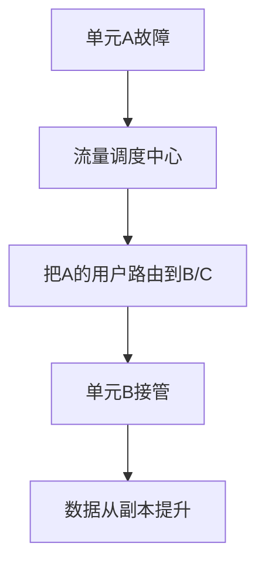

# 单元化架构与流量调度实战

> 单元化（Cell-based / Unit Architecture）把系统按"单元"切分，每个单元自包含、能独立承载部分用户流量，是超大规模、强容灾的终极解法。本文讲解单元划分、路由与容灾。

## 1. 为什么单元化

| 痛点 | 单元化解法 |
| --- | --- |
| 单集群规模上限 | 多单元水平扩展 |
| 跨地域延迟 | 用户就近接入单元 |
| 故障爆炸半径大 | 单元故障只影响本单元用户 |
| 异地多活复杂 | 以单元为调度单位 |

单元化是"同城多活 → 异地多活 → 单元化"演进的高级形态。

## 2. 单元定义

- **单元（Cell）**：一组自包含的资源（应用+数据+缓存），能独立服务一类用户。
- **单元化维度**：通常按用户 ID 取模或哈希分片（sharding key），如 `hash(userId) % N`。
- **核心约束**：一次请求的所有数据操作尽量落在同一单元内（避免跨单元调用）。

```mermaid
flowchart LR
    U[用户请求] --> G[全局路由 Gateway]
    G -->|hash(uid)| C1[单元A]
    G -->|hash(uid)| C2[单元B]
    G -->|hash(uid)| C3[单元C]
```

## 3. 路由层

- **接入层**：根据分片 key 计算单元，转发请求。
- **路由表**：单元与 key 范围的映射，支持扩缩容时再平衡。
- **兜底**：路由失败/单元不可用，可降级到备用单元（牺牲局部一致性）。

## 4. 数据单元化

- 每个单元拥有独立数据库分片，数据不跨单元共享。
- 全局数据（如配置、用户基础信息）放"全局单元"或各单元冗余同步。
- 跨单元数据访问（如跨用户交易）需特殊通道，尽量规避。

## 5. 容灾与调度



- **单元级容灾**：单元挂了，其流量切到其他单元（需容量冗余）。
- **容量规划**：预留 buffer 单元或各单元留余量承接溢出。
- **演练**：定期模拟单元故障，验证调度与数据切换。

## 6. 扩缩容与再平衡

- 新增单元：分配新的 key 区间，存量数据迁移（chunk 级）。
- 再平衡：迁移部分用户到新单元，双写过渡后切读。
- 迁移期间保证不丢请求（灰度 + 补偿）。

## 7. 与微服务关系

- 单元化是"部署/数据"层面的切分，微服务是"服务"层面的切分。
- 两者正交：一个单元内可含多个微服务，一个微服务可跨单元部署实例。
- 单元化要求服务无状态或状态收敛到本单元存储。

## 8. 落地坑点

| 坑 | 现象 | 对策 |
| --- | --- | --- |
| 跨单元调用 | 延迟/雪崩 | 强约束数据本地化 |
| 路由漂移 | 用户跳单元 | 稳定 hash + 路由表 |
| 容量无冗余 | 故障难接管 | 预留 buffer |
| 全局数据 | 成瓶颈 | 冗余+异步同步 |
| 迁移中断 | 数据不一致 | 双写+校验 |

## 9. 适用场景

- 超大规模（亿级用户）、强容灾诉求（金融、电商大促）。
- 地理分布广、需就近接入降延迟。
- 中小系统不必单元化，成本高、运维难。

## 10. 面试题

1. 单元化解决了什么问题？
2. 分片 key 如何选择？
3. 单元故障如何容灾？
4. 单元化与微服务的区别？
5. 扩单元时数据如何再平衡？

## 11. 小结

单元化 = 以"自包含单元"为单位的水平拆分与调度。核心是分片 key 路由、数据本地化、单元级容灾。它是大规模系统容灾与扩展的顶层架构，但对运维与数据设计要求极高。
