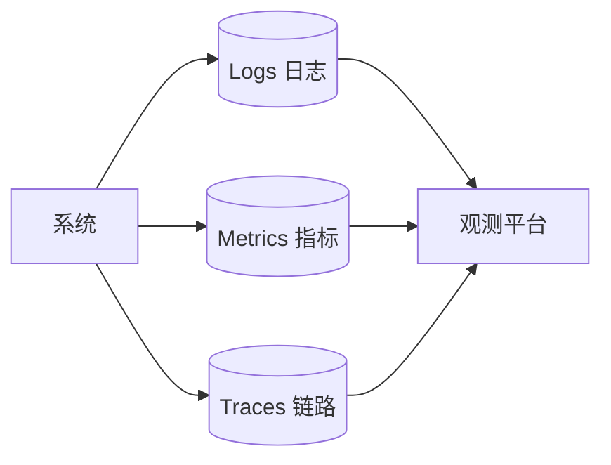
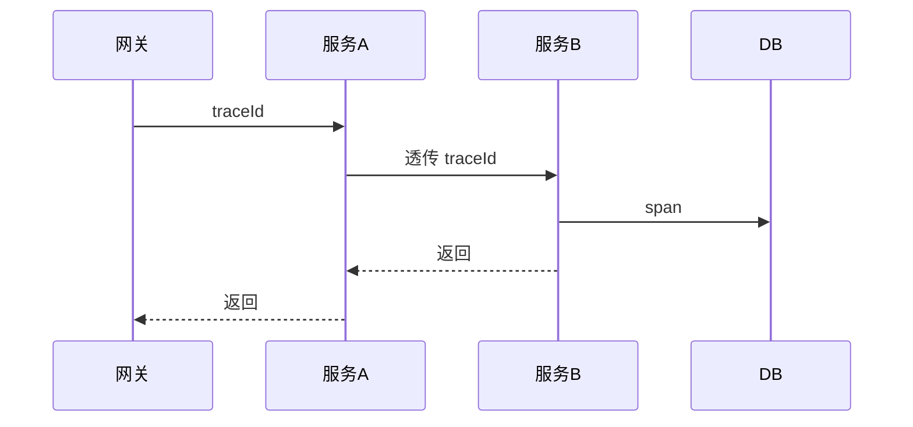

# 可观测性架构体系实战

> 可观测性（Observability）通过日志、指标、链路"三大支柱"让系统"可被理解"。本文讲解体系架构、数据采集、关联分析与落地节奏。

## 1. 三大支柱

| 支柱 | 回答 | 典型 |
| --- | --- | --- |
| Metrics | 系统怎样（量化） | QPS、延迟、错误率 |
| Logs | 发生了什么（细节） | 错误栈、业务日志 |
| Traces | 一次请求经过哪（路径） | 跨服务调用链 |

## 2. 指标体系（RED/USE）

- **RED**（请求视角）：Rate（速率）、Errors（错误率）、Duration（时延）。
- **USE**（资源视角）：Utilization、Saturation、Errors。
- 四大黄金信号：延迟、流量、错误、饱和度。

## 3. 链路追踪

- 请求入口生成 `traceId`，跨服务透传（HTTP header / MQ 属性）。
- 每跳生成 `span`，组成有向无环调用树。
- 可视化慢调用、错误传播路径。

## 4. 数据采集架构

- **Agent/SDK**：应用内埋点（OpenTelemetry SDK）。
- **Collector**：统一收集、批处理、导出（OTel Collector）。
- **存储**：指标（Prometheus/TSDB）、日志（ES/Loki）、链路（Jaeger/Tempo）。
- **展示**：Grafana 统一面板。

## 5. 统一标准：OpenTelemetry

- 一套 SDK/协议覆盖 traces、metrics、logs。
- 与厂商解耦：Collector 可导出到任意后端。
- 自动埋点 + 手动埋点结合。

## 6. 关联与排障

- 用 `traceId` 串起指标异常 → 链路定位 → 日志取证。
- SLO/错误预算驱动告警，减少噪音。
- 根因分析：从黄金信号异常下钻到具体服务/实例。

## 7. 告警治理

- 告警分层：Page（致命）/ Ticket（需关注）/ Info。
- 避免告警风暴：聚合、抑制、静默。
- 告警须可行动（actionable），否则是噪音。

## 8. 落地节奏

1. 先上 Metrics（最易、性价比高）。
2. 再上 Traces（定位跨服务问题）。
3. 最后 Logs 结构化（检索取证）。
4. 统一 OTel，避免多套 SDK 混乱。

## 9. 落地坑点

| 坑 | 现象 | 对策 |
| --- | --- | --- |
| 埋点无标准 | 数据割裂 | 统一 OTel |
| 告警风暴 | 没人看 | 分层+抑制 |
| 日志无结构 | 难检索 | JSON 结构化 |
| 成本失控 | 存太多 | 采样+分级 |
| trace 断层 | 链不全 | 全链路透传 |

## 10. 面试题

1. 可观测性三大支柱？
2. RED 与 USE 指标？
3. traceId 如何跨服务传递？
4. 为什么选 OpenTelemetry？
5. 如何减少告警噪音？

## 11. 小结

可观测性 = 指标看趋势、链路定位置、日志查细节。以 OpenTelemetry 统一采集，用 traceId 关联三者，按 Metrics→Traces→Logs 节奏落地，让系统"可被理解"。
