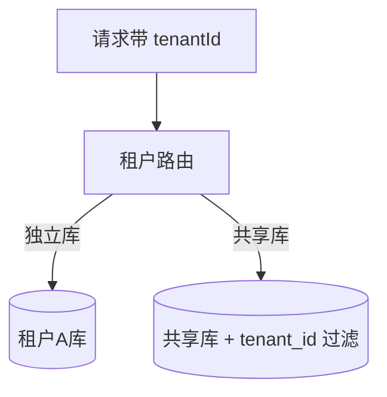

# 多租户 SaaS 架构实战

> 板块：架构 　|　 返回：[README](README.md)
> 适用：面向多企业/多组织的 SaaS 产品（CRM、ERP、协作工具）。

多租户 SaaS 的核心矛盾：**隔离性 vs 成本/效率**。如何在"租户之间互不干扰"与"资源复用降本"之间取舍，决定了分库分表与路由策略。

## 一、三种隔离模型

| 模型 | 隔离度 | 成本 | 适用 |
|------|--------|------|------|
| 独立部署（每租户独立库/实例） | 最高 | 最高 | 大客户/强合规 |
| 共享库 + 租户ID 行隔离 | 低 | 最低 | 中小客户 |
| 共享库 + Schema 隔离 | 中 | 中 | 中等规模 |



## 二、共享数据库 + 行级隔离（最常见）

- 所有租户同一库表，每行带 `tenant_id`。
- **路由**：ORM/中间件自动注入 `tenant_id` 过滤，防越权。
- **优点**：成本低、易运维；**缺点**：大租户"吵闹邻居"影响他人，隔离弱。

```sql
-- 行级隔离：所有查询自动加 tenant_id
SELECT * FROM orders WHERE tenant_id = :tid AND id = :id;
-- 索引必须含 tenant_id 前缀，否则跨租户扫全表
CREATE INDEX idx_orders_tid ON orders(tenant_id, created_at);
```

## 三、独立库/独立实例

- 大客户/合规要求高时，独立数据库甚至独立部署。
- **连接管理**：连接池按租户分组，或用 DB Proxy 路由。
- **成本**：资源不共享，需按租户规模计费回收。

## 四、租户路由与连接池

- **路由层**：在网关/中间件识别 `tenant_id`（域名/Token/Header），路由到对应数据源。
- **连接池隔离**：避免某租户占满连接池拖垮全局（按租户限额）。
- **资源配额**：CPU/存储/API 按租户配额限流。

## 五、数据迁移与扩容

- **租户搬家**：从小租户共享库迁到独立库（增长后），需在线迁移工具。
- **表结构演进**：共享库 schema 变更影响所有租户，需向后兼容 + 灰度。
- **分片**：超大数据按租户分片，热租户独立分片。

## 六、安全与合规

- **越权防护**：所有数据访问强制 `tenant_id` 作用域（中间件兜底，不靠业务自觉）。
- **数据隔离审计**：定期校验无跨租户访问。
- **合规**：某地区数据不出境 → 租户数据落在对应地域。
- **加密**：敏感字段按租户密钥加密。

## 七、计费与计量

- 按租户用量（坐席数、存储、API 调用）计量计费（见[场景设计/计费与计量系统设计](../场景设计/计费与计量系统设计.md)）。
- 配额超用触发限流或升级提示。

## 八、功能差异化

- **套餐（Edition）**：不同租户可见功能不同（按套餐鉴权）。
- **定制**：大客户需要定制字段/流程，用元数据/低代码支撑（见[架构/低代码平台架构设计](低代码平台架构设计.md)）。

## 九、与单租户对比

| 维度 | 单租户 | 多租户 |
|------|--------|--------|
| 隔离 | 强 | 需设计保障 |
| 成本 | 高 | 低（共享） |
| 运维 | 实例多 | 集中 |
| 定制 | 易 | 难（需平台化） |
| 合规 | 简单 | 需隔离证据 |

## 十、常见坑

1. **tenant_id 靠业务传** → 漏传越权；中间件强制注入。
2. **索引无 tenant_id 前缀** → 跨租户全表扫；联合索引首位放 tenant_id。
3. **大租户吵闹邻居** → 影响他人；配额 + 独立库。
4. **schema 变更不兼容** → 全租户故障；兼容演进 + 灰度。
5. **配额无限** → 资源被薅；按租户限流。
6. **合规数据跨境** → 违规；租户数据地域落地。

## 十一、延伸阅读

- [业务模型/企业服务SaaS业务模型](../业务模型/企业服务SaaS业务模型.md)
- [场景设计/计费与计量系统设计](../场景设计/计费与计量系统设计.md)
- [架构/低代码平台架构设计](低代码平台架构设计.md)
- [技术选型/注册中心与配置中心选型实战](../技术选型/注册中心与配置中心选型实战.md)
