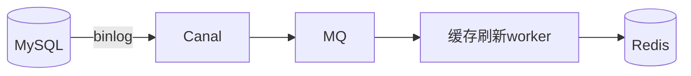

# 存储与缓存一致性架构实战

> "先更新 DB 还是先删缓存？" 这是缓存架构的经典问题。没有银弹，只有权衡。架构上要在**性能**与**正确性**之间选策略，并用**重试/订阅 binlog** 兜底最终一致。

## 1. 经典策略对比

| 策略 | 做法 | 风险 |
| --- | --- | --- |
| Cache-Aside 读 | 读 miss 查 DB 回填 | 简单常用 |
| 先删缓存再写 DB | 删除 → 写 | 并发下可能脏读 |
| 先写 DB 再删缓存 | 写 → 删 | 删失败脏数据（小概率） |
| 写 DB + 订阅 binlog 删/更缓存 | Canal → MQ → 刷新 | 最终一致，推荐 |

## 2. 推荐方案：binlog 驱动



- DB 是唯一真相源，变更经 binlog 异步刷缓存。
- 业务写只管 DB，不直接碰缓存，避免双写不一致。
- worker 失败重试，保证最终一致。

## 3. 延迟双删

```python
def update_with_double_delete(key, data):
    redis.delete(key)            # 第一次删
    db.update(data)
    sleep(0.5)                   # 等读请求结束
    redis.delete(key)            # 第二次删
```

- 解决"写过程中旧读回填"的问题。
- 时间窗难精确，仅作兜底，不完美。

## 4. 防脏读

- **读写加版本/时间戳**：缓存值带版本，旧值不覆盖新值。
- **串行化关键路径**：对强一致字段走 DB，缓存只服务弱一致读。
- **订阅 binlog** 是最稳的"最终一致"手段。

## 5. 常见坑

| 坑 | 现象 | 对策 |
| --- | --- | --- |
| 双写不一致 | 缓存脏 | 单写源 + binlog |
| 删缓存失败 | 脏读 | 重试 + 订阅 |
| 并发回填 | 旧覆盖新 | 版本号 |
| 大 key | 阻塞 | 拆分 |
| 热点失效 | 雪崩 | 过期抖动 |

## 6. 面试题

1. 先删缓存还是先写库？
2. 为什么推荐 binlog 刷缓存？
3. 延迟双删解决什么问题？
4. 如何用版本号防覆盖？
5. 强一致读怎么处理？

## 7. 小结

缓存一致性 = 单写源（DB）+ binlog 异步刷新 + 重试兜底。放弃"双写强一致"，用"订阅变更最终一致"换取性能与正确性的平衡。
