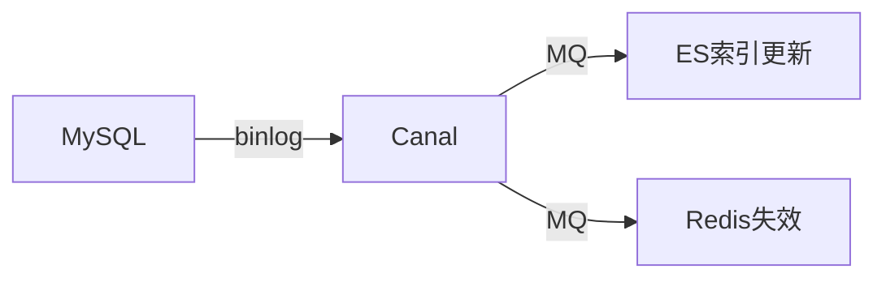

# 存储架构与数据分层实战

> 现代系统很少只用一种存储。按"热/温/冷"分层、按"结构/规模/查询"选型，是存储架构的核心。本文梳理数据分层、存储选型与一致性设计。

## 1. 数据分层

| 层 | 介质 | 访问频率 | 成本 | 典型 |
| --- | --- | --- | --- | --- |
| 热 | 内存/本地SSD | 极高 | 高 | 缓存、实时表 |
| 温 | SSD/云盘 | 中 | 中 | 业务主库 |
| 冷 | 对象存储/归档 | 低 | 低 | 日志、历史 |

## 2. 存储选型矩阵

| 数据类型 | 存储 | 原因 |
| --- | --- | --- |
| 关系/事务 | MySQL/PG | ACID、SQL |
| 文档 | MongoDB | 灵活 schema |
| KV | Redis/RocksDB | 极速点查 |
| 宽列 | Cassandra/HBase | 海量写入 |
| 时序 | InfluxDB/TDengine | 时间聚合 |
| 图 | Neo4j/Nebula | 关系遍历 |
| 搜索 | ES/OpenSearch | 全文+聚合 |
| 对象 | S3/OSS | 大文件 |

## 3. 分层迁移

- **热→温**：超过阈值（如 30 天未访问）自动降级到低成本存储。
- **温→冷**：归档历史，保留索引可检索。
- 生命周期策略（TTL/Lifecycle）自动化。

## 4. 多存储一致性

当一份数据跨多存储（如 MySQL + ES + Redis）：
- **写主，异步同步**：以 MySQL 为准，binlog 同步到 ES/Redis。
- **最终一致**：接受短暂不一致，用对账兜底。
- **强一致诉求**：分布式事务（成本高，慎用）。

## 5. 容量与扩展

- **垂直**：升配，上限明显。
- **水平**：分库分表、分区、分片集群。
- **读写分离**：主写从读，缓解读压力。
- **冷热分离**：热表小、查询快。

## 6. 数据生命周期

- 建表即定义 TTL/归档策略。
- 定期合并小文件（LSM 类存储的 compaction）。
- 备份保留策略：热备短期、冷备长期。

## 7. 落地坑点

| 坑 | 现象 | 对策 |
| --- | --- | --- |
| 单库过大 | 慢查询 | 分库分表 |
| 多存储不一致 | 数据错 | binlog 同步+对账 |
| 冷数据占热库 | 贵且慢 | 生命周期下沉 |
| 容量预估错 | 爆盘 | 监控+预警 |

## 8. 面试题

1. 数据分层依据是什么？
2. 多存储如何保持一致？
3. 冷热数据如何迁移？
4. 如何为业务选存储？
5. binlog 在存储同步中的作用？

## 9. 小结

存储架构 = 分层 + 选型 + 一致性 + 生命周期。没有万能存储，按访问模式匹配介质，用 binlog/对账保证多存储最终一致，用生命周期控制成本。
