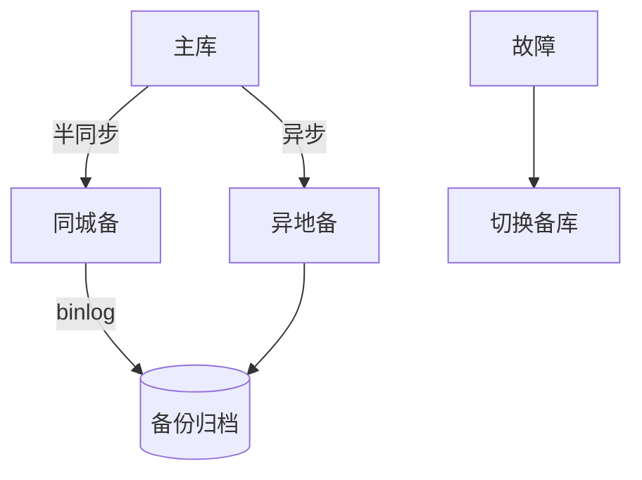

# 容灾备份与数据保护实战

> 容灾（DR）与备份是系统"最后一道防线"。本文从 RTO/RPO、备份策略、多活容灾到演练，给出可落地的数据保护方案。

## 1. 核心指标

| 指标 | 含义 | 目标 |
| --- | --- | --- |
| RTO | 恢复时间目标 | 多快恢复服务 |
| RPO | 恢复点目标 | 最多丢多少数据 |
| RLO | 恢复级别（数据/服务） | 恢复粒度 |

- 金融核心：RPO≈0，RTO 分钟级，代价高。
- 一般业务：RPO 小时级可接受。

## 2. 备份策略

- **3-2-1 原则**：3 份副本、2 种介质、1 份异地。
- 全量+增量+binlog，可恢复到任意时点（PITR）。
- 加密备份，防泄露。

## 3. 容灾架构等级

| 等级 | 描述 | RTO/RPO |
| --- | --- | --- |
| 冷备 | 备份恢复 | 小时~天 |
| 温备 | 备用环境待命 | 分钟~小时 |
| 热备/多活 | 实时同步、自动切换 | 秒~分钟，RPO≈0 |

## 4. 同城/异地

- **同城双活**：低延迟同步，防机房故障。
- **异地多活**：跨地域，防区域灾难，但一致性难（单元化见前文）。
- **两地三中心**：生产+同城+异地，兼顾可用与容灾。

## 5. 切换与演练

- **预案**：明确切换条件、步骤、责任人。
- **演练**：定期真实切换演练（chaos），验证可用性。
- **脑裂防护**： fencing 机制，防止双主写。

## 6. 数据保护合规

- 备份保留周期满足合规（如金融数年）。
- 敏感数据加密存储与传输。
- 权限最小化，操作审计。

## 7. 数据库容灾示例

- 半同步保同城不丢，异步保异地容灾。
- 切换后原主降级为从，恢复后重建同步。

## 8. 落地坑点

| 坑 | 现象 | 对策 |
| --- | --- | --- |
| 从不演练 | 切换失败 | 定期真实演练 |
| 备份不可用 | 恢复不了 | 恢复演练验证 |
| 脑裂 | 双写乱 | fencing |
| RPO 不达标 | 丢数据 | 同步策略升级 |

## 9. 面试题

1. RTO 与 RPO 区别？
2. 3-2-1 备份原则？
3. 异地多活一致性如何取舍？
4. 如何防止脑裂？
5. 为什么必须演练容灾？

## 10. 小结

容灾备份 = 指标定义 + 备份策略 + 多活架构 + 演练验证。备份不等于容灾，能恢复才是真容灾；演练是唯一检验手段。
