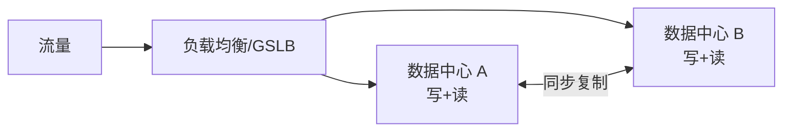
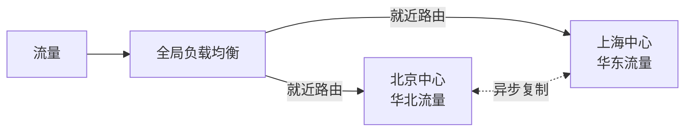
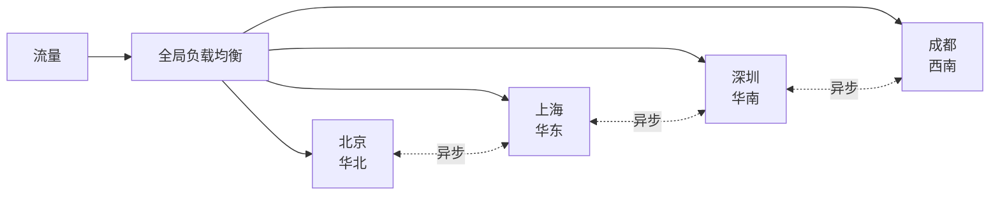
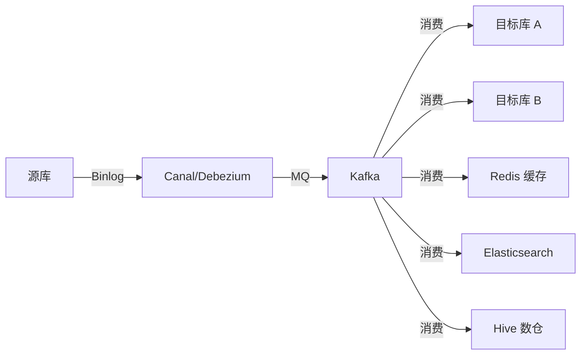
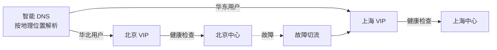
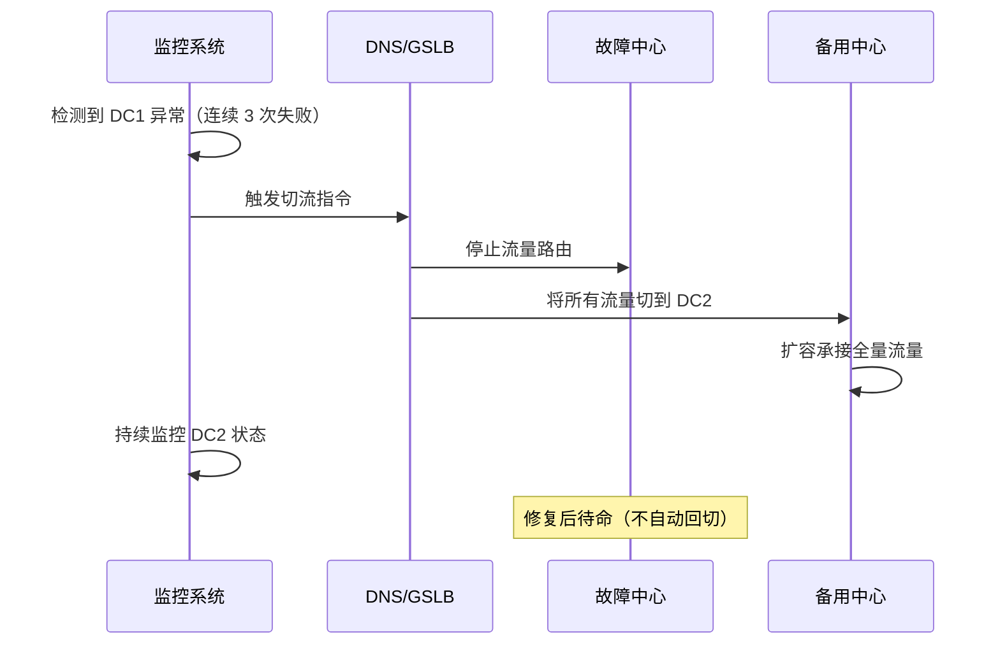

# 容灾多活与异地多中心架构

## 〇、本体介绍

**容灾多活与异地多中心**：在多个地理分布的数据中心（或可用区）同时提供服务，当一个中心故障时，其他中心可以**秒级接管**流量，保障业务连续性。它是**高可用架构的终极形态**——从"同城双活"到"异地多活"到"全球多活"。

**核心矛盾**：
1. 多中心要**数据同步**（延迟、一致性）vs **就近访问**（路由、低延迟），天然对立；
2. 活多个中心同时写入 → **数据冲突**（同一用户两个中心同时下单）；
3. 故障切流要**快**（秒级）vs 切流要**准**（不能切到也故障的中心）。

**核心主线**：容灾等级 → 多活架构模式 → 数据同步 → 流量调度 → 故障切换。

---

## 一、容灾等级（国标 GB/T 20988）

| 等级 | RPO | RTO | 架构 | 适用 |
|------|-----|-----|------|------|
| **1 级** | 24h+ | 24h+ | 数据备份 | 非核心 |
| **2 级** | 24h | 24h | 数据备份 + 备用机房 | 一般业务 |
| **3 级** | 1-24h | 数小时 | 数据异步传输 | 重要业务 |
| **4 级** | 0-1h | <1h | 数据实时复制 | 核心业务 |
| **5 级** | 0 | 分钟级 | 实时双活 | 金融核心 |
| **6 级** | 0 | 0 | 异地双活/多活 | 最高要求 |

- **RPO（Recovery Point Objective）**：能容忍丢失的数据量（0 = 零丢失）
- **RTO（Recovery Time Objective）**：故障恢复时间（越短越好）

> 口诀：**"RPO 看丢数据，RTO 看恢复；等级一到六，金融要五级。"**

---

## 二、多活架构模式

### 2.1 同城双活（同一城市两中心）



- **延迟**：< 1ms（光纤直连）
- **数据同步**：同步复制（零数据丢失）
- **适用**：金融核心、支付系统

### 2.2 异地双活（不同城市）



- **延迟**：20-50ms（跨城市光纤）
- **数据同步**：异步复制（秒级延迟）
- **关键**：业务分片（华北用户走北京、华东用户走上海），避免跨城写

### 2.3 异地多活（三地五中心）



- **单元化架构**：每个中心服务一部分用户（按 user_id 哈希分片）
- **优势**：任一中心故障，仅影响该分片用户（1/N 流量）

### 2.4 全球多活

- **挑战**：合规（GDPR/数据主权）、网络延迟（全球 100ms+）、数据一致性
- **方案**：单元化 + 数据主权（用户数据不出境）+ 最终一致

> 口诀：**"同城低延迟，异地分用户；三地五中心，全球要合规。"**

---

## 三、数据同步方案

### 3.1 同步 vs 异步

| 方案 | 延迟 | RPO | 性能影响 | 适用 |
|------|------|-----|----------|------|
| **同步复制** | < 1ms | 0 | 大（等 ACK） | 同城双活、金融核心 |
| **半同步复制** | < 1ms | 0 | 中（等一个从库 ACK） | 同城双活 |
| **异步复制** | 秒级 | 秒级 | 小 | 异地多活、跨 Region |
| **Binlog 订阅** | 秒级 | 秒级 | 无（解耦） | 跨异构存储同步 |

### 3.2 数据同步架构



- **Canal/Debezium**：解析源库 binlog → 发 MQ
- **Kafka**：解耦源与目标，支持多目标消费
- **幂等消费**：目标端按业务唯一键 upsert（防重复消费）

### 3.3 冲突解决

| 策略 | 做法 | 适用 |
|------|------|------|
| **分片写入** | 同一用户只在一个中心写（按 user_id 路由） | 首选方案 |
| **最后写入胜出** | 按时间戳取最新 | 简单场景 |
| **向量时钟** | 多版本 + 客户端解决冲突 | 最终一致系统 |
| **业务校验** | 中心间对账发现差异后修复 | 兜底方案 |

---

## 四、流量调度

### 4.1 全局负载均衡（GSLB）



### 4.2 调度策略

| 策略 | 做法 |
|------|------|
| **地理位置** | 华北→北京、华东→上海（就近访问） |
| **权重** | 按中心容量分配流量比例 |
| **健康检查** | 自动剔除故障中心 |
| **灰度** | 按用户百分比切流到新中心 |
| **单元化** | 按 user_id 哈希固定到某中心 |

---

## 五、故障切换

### 5.1 切换流程



### 5.2 切换原则

| 原则 | 说明 |
|------|------|
| **自动检测** | 健康检查 + 阈值告警，自动触发 |
| **快速切流** | DNS TTL 调低（60s），API 秒级生效 |
| **不回切** | 故障中心修复后不自动回切（人工确认稳定后切回） |
| **流量承接** | 备用中心提前扩容（日常 50% 容量，切流后扩容到 100%） |

> 口诀：**"故障自动检，切流要快准；不回切人工，备用先扩容。"**

---

## 六、单元化架构（SET 化）

### 6.1 核心思想

```
用户按 user_id 哈希 → 固定分配到某个 SET（单元）
每个 SET 是完整的"小系统"（含 DB + 缓存 + 服务）
任一 SET 故障仅影响该 SET 用户
```

### 6.2 单元化部署

```mermaid
graph TB
    subgraph SET-1
        DB1[DB] CACHE1[缓存] SVC1[服务]
    end
    subgraph SET-2
        DB2[DB] CACHE2[缓存] SVC2[服务]
    end
    subgraph SET-3
        DB3[DB] CACHE3[缓存] SVC3[服务]
    end
    ROUTER[SET 路由器] -->|hash(uid)%3=0| SET-1
    ROUTER -->|hash(uid)%3=1| SET-2
    ROUTER -->|hash(uid)%3=2| SET-3
```

### 6.3 单元化路由

```java
// 根据用户 ID 路由到对应 SET
public int routeSet(long userId) {
    return (int) (userId % SET_COUNT);
}

// 跨 SET 调用（少数场景）
public Order getOrderFromOtherSet(String orderId, int targetSet) {
    return crossSetRpcClient.call(targetSet, "getOrder", orderId);
}
```

---

## 七、与其他板块的关系

- **场景设计/全球多活库存系统设计** — 多活架构在库存系统的具体落地
- **场景设计/异地多活.md** — 异地多活截图笔记的文字延伸
- **分库分表与数据迁移** — 多活的数据分片与迁移策略
- **分布式系统理论** — CAP 定理（多活选择 AP，放弃强一致）
- **SRE与稳定性工程/03-容量规划与冗余容灾** — 容量与容灾的方法论
- **SRE与稳定性工程/04-On-call与事故管理** — 故障切换的运维流程
- **场景设计/大促容量规划与备战** — 大促期间的流量调度

---

## 八、速查表

| 主题 | 一句话 |
|------|--------|
| 容灾等级 | RPO 看丢数据，RTO 看恢复，金融要 5 级 |
| 同城双活 | 同步复制，零丢失，<1ms 延迟 |
| 异地双活 | 异步复制，秒级延迟，分用户 |
| 多地多活 | 单元化，按 user_id 哈希分片 |
| 数据同步 | Canal/Debezium → Kafka → 多目标幂等消费 |
| 流量调度 | GSLB 智能 DNS + 健康检查 + 权重路由 |
| 故障切换 | 自动检测 + 快速切流 + 不回切 + 备用扩容 |
| 冲突 | 分片写入（首选）→ 最后写入胜出 → 向量时钟 |

---

## 面试高频问题（15+ 条）

1. **什么是 RPO 和 RTO？** RPO 是能容忍丢失的数据量（0=零丢失），RTO 是故障恢复时间。
2. **同城双活和异地多活的区别？** 同城低延迟用同步复制；异地高延迟用异步复制 + 分用户。
3. **异地多活最大的挑战？** 数据同步延迟 + 跨中心写冲突 + 流量路由。
4. **怎么解决跨中心写冲突？** 分片写入（同一用户只在一个中心写，按 user_id 路由）。
5. **什么是单元化架构（SET 化）？** 用户哈希固定到某 SET，每个 SET 是完整小系统，故障仅影响该 SET。
6. **数据同步怎么做？** Canal/Debezium 解析 binlog → Kafka → 多目标幂等消费。
7. **故障切换怎么实现？** 健康检查检测异常 → DNS/GSLB 切流 → 备用中心扩容承接。
8. **为什么故障后不回切？** 防止故障中心未完全恢复导致二次故障；人工确认稳定后切回。
9. **GSLB 是什么？** 全局负载均衡，按地理位置/健康状态/权重智能路由流量。
10. **CAP 定理在多活中怎么取舍？** 多活选 AP（可用性 + 分区容忍），放弃强一致，选择最终一致。
11. **全球多活有什么特殊挑战？** 数据合规（GDPR/数据主权）、网络延迟、多时区运维。
12. **单元化的路由规则？** hash(user_id) % SET_COUNT → 固定 SET，避免跨 SET 写。
13. **备用中心日常怎么用？** 日常承担部分流量（如 50%），切流后扩容到 100%。
14. **多活对数据库有什么要求？** 支持主从复制/半同步/组复制；冲突检测；自增 ID 避免（用全局唯一 ID）。
15. **怎么验证多活切换能力？** 定期演练（混沌工程）：模拟中心故障，验证切流 + 数据一致性。
16. **SET 间怎么通信？** 尽量避免；必须时用跨 SET RPC，带 SET ID 路由。
