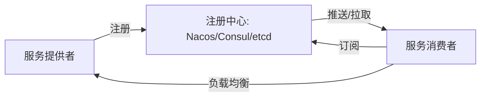
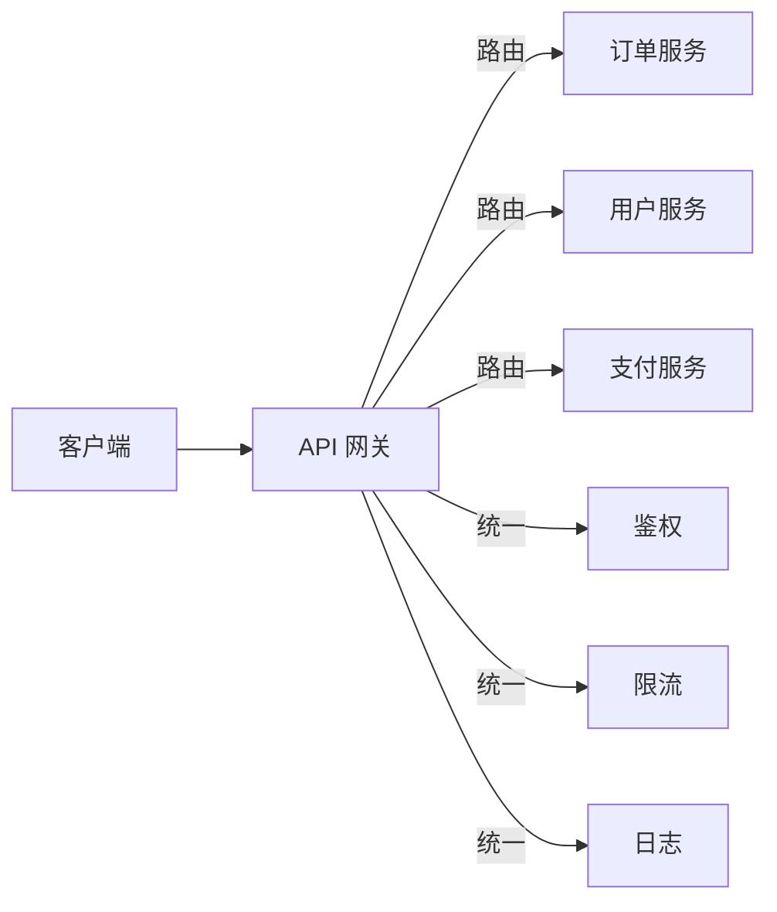
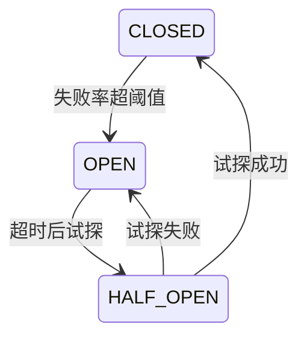
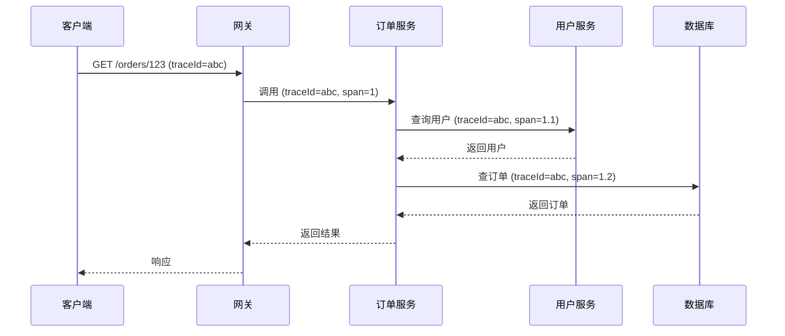
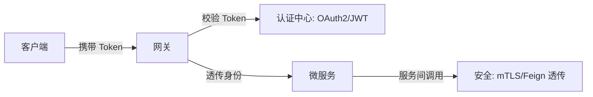

# 微服务治理全链路

## 〇、本体介绍

**微服务治理**：在微服务架构落地的全生命周期中，对服务的注册发现、配置管理、流量管控、容错降级、可观测性、安全认证等进行**统一管控**的能力体系。没有治理的微服务是"分布式单体"——比单体更复杂、更脆弱。

**核心矛盾**：
1. 服务数量爆炸后，**服务间调用关系网状化**，无治理则雪崩；
2. 业务要**快速迭代**（频繁发布）vs 系统要**稳定**（变更风险），需要灰度/回滚能力；
3. 每个服务各自实现治理逻辑导致**重复开发 + 不一致**，需要统一基础设施。

**核心主线**：注册发现 → 配置中心 → API 网关 → 限流熔断 → 分布式追踪 → 安全认证。

---

## 一、服务注册与发现

### 1.1 架构



### 1.2 注册中心对比

| 维度 | Nacos | Consul | etcd | Eureka |
|------|-------|--------|------|--------|
| 一致性协议 | Raft/Distro | Raft | Raft | AP（最终一致） |
| 配置管理 | ✅ 内置 | ✅ 需配合 | ❌ 无 | ❌ 无 |
| 健康检查 | TCP/HTTP/MySQL | TCP/HTTP/Script | 心跳 | 心跳 |
| UI 控制台 | ✅ | ✅ | ❌ | ✅ |
| 适用场景 | Java 系、配置+发现 | 多语言、强一致 | K8s 底座 | 已停更，不推荐 |

### 1.3 服务实例元数据

```json
{
  "serviceName": "order-service",
  "instanceId": "192.168.1.10:8080:DEFAULT",
  "ip": "192.168.1.10",
  "port": 8080,
  "weight": 100,
  "healthy": true,
  "metadata": {
    "version": "v2.1.0",
    "region": "cn-east-1",
    "cluster": "gray"
  }
}
```

> 口诀：**"服务启动注册，心跳保活；消费者订阅，负载均衡调；元数据路由，灰度隔离好。"**

---

## 二、配置中心

### 2.1 核心能力

| 能力 | 说明 |
|------|------|
| **动态配置** | 运行时修改配置无需重启（@RefreshScope / 监听回调） |
| **版本管理** | 配置变更历史 + 回滚能力 |
| **灰度发布** | 按实例/IP/标签灰度推送配置 |
| **环境隔离** | dev/test/prod 多环境独立配置 |
| **加密存储** | 敏感配置（密码/密钥）加密 |

### 2.2 配置优先级

```
启动参数 > 环境变量 > 远程配置中心 > 本地配置文件 > 默认值
```

### 2.3 Nacos 配置示例

```yaml
# Data ID: order-service.yaml, Group: DEFAULT_GROUP
order:
  timeout-minutes: 30
  max-retry: 3
  features:
    new-payment: true        # 功能开关：新支付渠道
    risk-check: true         # 功能开关：风控校验
```

```java
@RefreshScope  // 配置变更自动刷新
@Configuration
public class OrderConfig {
    @Value("${order.timeout-minutes:30}")
    private int timeoutMinutes;

    @Value("${order.features.new-payment:false}")
    private boolean newPaymentEnabled;
}
```

---

## 三、API 网关

### 3.1 网关职责



### 3.2 网关对比

| 维度 | Spring Cloud Gateway | Kong | APISIX | Nginx + Lua |
|------|---------------------|------|--------|-------------|
| 语言 | Java | Lua (C) | Lua (C) | C + Lua |
| 性能 | 中 | 高 | 高 | 最高 |
| 插件生态 | 中 | 丰富 | 丰富 | 中 |
| 动态配置 | Nacos 集成 | Admin API | Admin API | 需 reload |
| 适用 | Java 系微服务 | 多语言、高性能 | 多语言、高性能 | 边缘网关 |

### 3.3 关键能力

| 能力 | 做法 |
|------|------|
| **路由** | 路径/Header/参数匹配转发到对应服务 |
| **鉴权** | JWT/OAuth2 统一校验，透传用户身份到下游 |
| **限流** | 令牌桶/漏桶，按 API/用户/服务维度 |
| **灰度** | 按 Header/权重/用户分组路由到不同版本 |
| **协议转换** | HTTP ↔ gRPC，外部 REST ↔ 内部 RPC |

---

## 四、限流熔断与降级

### 4.1 限流算法

| 算法 | 思路 | 适用 |
|------|------|------|
| **计数器** | 固定窗口内计数 | 简单场景 |
| **滑动窗口** | 多个小窗口滑动 | 避免突刺 |
| **令牌桶** | 匀速产生令牌，请求消耗令牌 | 允许突发 |
| **漏桶** | 请求进入桶，匀速流出 | 严格匀速 |

### 4.2 熔断器状态机



- **CLOSED**：正常请求，统计失败率
- **OPEN**：快速失败（fallback），不调用下游
- **HALF_OPEN**：放少量请求试探，成功→CLOSED，失败→OPEN

### 4.3 降级策略

| 场景 | 降级策略 |
|------|----------|
| 推荐服务超时 | 返回热门推荐（缓存兜底） |
| 支付服务异常 | 关闭在线支付，仅保留货到付款 |
| 风控服务超时 | 放行（宁可漏过不可误杀） |
| 库存服务异常 | 降级为展示"库存紧张"，异步校验 |

> 口诀：**"限流保下游，熔断防雪崩；降级兜底走，功能可牺牲。"**

---

## 五、分布式追踪

### 5.1 追踪模型



### 5.2 核心概念

| 概念 | 说明 |
|------|------|
| **Trace** | 一次完整请求链路（全局唯一 traceId） |
| **Span** | 链路中的一个操作（含开始/结束时间） |
| **Parent Span** | 调用方 Span（构建父子关系） |
| **Annotation** | 关键事件（cs/sr/ss/cr = 客户端发送/接收，服务端接收/发送） |

### 5.3 采样策略

| 策略 | 做法 | 适用 |
|------|------|------|
| **全量采样** | 100% 采集 | 调试阶段、小规模 |
| **概率采样** | 按固定比例（如 10%） | 大规模生产 |
| **尾部采样** | 只采集慢请求/错误请求 | 排障优先 |
| **自适应采样** | 根据 QPS 动态调整 | 推荐 |

---

## 六、安全认证

### 6.1 认证架构



### 6.2 方案对比

| 方案 | 思路 | 适用 |
|------|------|------|
| **JWT** | 无状态令牌，服务端不存储 | 用户规模大、网关校验 |
| **OAuth2** | 授权码/客户端凭证 | 第三方接入、多系统 |
| **mTLS** | 双向 TLS 证书 | 服务间通信（零信任） |
| **API Key** | 简单密钥 | 开放平台、第三方 API |

---

## 七、与其他板块的关系

- **场景设计/Redis 实现限流** — 限流算法的 Redis 实现
- **稳定性三板斧** — 限流/熔断/降级的方法论基础
- **分布式锁** — 微服务间并发控制
- **分布式系统理论** — CAP 定理在治理中的权衡
- **DDD/上下文映射** — 限界上下文 → 服务边界对齐
- **云原生/K8s** — Service Mesh（Istio）是服务治理的 K8s 原生实现
- **SRE 与稳定性工程** — 治理的稳定性目标

---

## 八、速查表

| 主题 | 一句话 |
|------|--------|
| 注册发现 | Nacos/Consul/etcd，心跳保活，元数据路由 |
| 配置中心 | 动态配置 + 灰度推送 + 版本回滚 |
| API 网关 | 路由+鉴权+限流+灰度+协议转换 |
| 限流 | 令牌桶/漏桶/滑动窗口，按维度限流 |
| 熔断 | 三态机（CLOSED→OPEN→HALF_OPEN），失败率触发 |
| 降级 | 超时/异常时返回兜底数据 |
| 追踪 | TraceId 透传，Span 父子关系，采样策略 |
| 安全 | JWT/OAuth2 用户认证，mTLS 服务间认证 |

---

## 面试高频问题（15+ 条）

1. **微服务治理包括哪些？** 注册发现、配置中心、API 网关、限流熔断降级、分布式追踪、安全认证。
2. **注册中心怎么选？** Nacos（Java 系+配置）、Consul（多语言+强一致）、etcd（K8s 底座）。
3. **配置中心的作用？** 动态修改配置无需重启，支持灰度推送、版本回滚、环境隔离。
4. **API 网关职责？** 路由、鉴权、限流、灰度、协议转换、统一日志。
5. **限流算法有哪些？** 计数器、滑动窗口、令牌桶（允许突发）、漏桶（严格匀速）。
6. **熔断器原理？** 三态机：CLOSED（统计失败率）→ OPEN（快速失败）→ HALF_OPEN（试探）。
7. **降级和熔断的区别？** 熔断是失败后快速失败；降级是主动关闭非核心功能。
8. **分布式追踪怎么实现？** 全局 traceId 透传 + Span 父子关系 + 采样存储（Jaeger/SkyWalking）。
9. **采样策略怎么选？** 全量（调试）、概率（大规模生产）、尾部（排障优先）。
10. **JWT 和 Session 区别？** JWT 无状态不存储；Session 有状态需存储（Redis）。
11. **服务间认证怎么做？** mTLS（零信任）或网关透传 JWT/身份头。
12. **灰度发布怎么实现？** 网关按 Header/权重/用户分组路由到不同版本。
13. **功能开关怎么实现？** 配置中心动态配置 + @RefreshScope 实时生效。
14. **服务雪崩怎么防？** 限流（入口）+ 熔断（调用链）+ 降级（兜底）+ 隔离（线程池）。
15. **Service Mesh 和传统治理的区别？** Mesh 将治理逻辑下沉到 Sidecar，业务代码无侵入。
16. **Nacos 和 Eureka 区别？** Nacos 支持 CP/AP 切换 + 内置配置管理；Eureka 仅 AP 且已停更。
