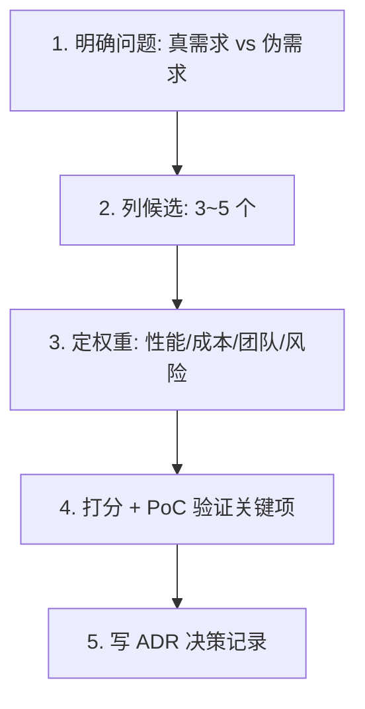

# 技术选型与决策实战（Tech Selection & Decision）

> 配套：[企业架构](企业架构.md) · [系统架构](系统架构.md) · [分布式系统核心问题](分布式系统核心问题.md)
> 选技术不是"哪个火用哪个"。本文给一套**可复用的选型框架 + 高频选型对照 + ADR 落地**，让"为什么选 A"有迹可循、可复盘、可追责。

---

## 一、选型的四个常被忽略的维度

| 维度 | 问自己 | 典型坑 |
|------|--------|--------|
| **团队匹配** | 团队会用吗？招得到人吗？ | 追新技术导致无人维护 |
| **运维成本** | 部署/监控/排障谁扛？ | 引入重组件却无 SRE |
| **演进风险** | 社区活跃？许可证？单点厂商？ | 选了停更项目 / 改协议收费 |
| **退出成本** | 将来想换有多难？ | 深度绑定某云/某框架 |

> 口诀：**不选最强的，选最合的；不为炫技，为可持续。**

---

## 二、选型决策框架（五步）



1. **明确问题**：先问"不用新技术的代价是什么"，避免为"看起来先进"而换；
2. **列候选**：别只列一个"心仪款"，至少 3 个对比；
3. **定权重**：按业务优先级给维度加权（金融重安全、创业重速度）；
4. **PoC 验证**：对关键痛点做小验证（如用 Testcontainers 跑通核心链路），别凭文档拍板；
5. **ADR 固化**：写决策记录，留痕"为什么选、放弃了谁、前提假设"（见[企业架构·ADR](企业架构.md)）。

---

## 三、高频选型对照

### 3.1 Web 框架（Java）
| 框架 | 风格 | 适用 |
|------|------|------|
| Spring Boot | 全家桶、生态全 | 绝大多数企业后端的默认 |
| Quarkus | 云原生、启动快 | Serverless / 容器高密度 |
| Micronaut | 编译期注入、低内存 | 微服务/Serverless |

### 3.2 存储选型
| 需求 | 首选 | 备注 |
|------|------|------|
| 强事务关系数据 | MySQL/PostgreSQL | 主存储 |
| 高并发 KV/缓存 | Redis | 注意一致性 |
| 文档/灵活 schema | MongoDB | 避免用它当关系库 |
| 分析/OLAP | ClickHouse / Doris | 列存、聚合快 |
| 图关系 | Neo4j / Nebula | 社交/风控关系 |
| 搜索 | Elasticsearch | 全文+聚合 |

### 3.3 消息队列
| MQ | 特点 | 适用 |
|----|------|------|
| Kafka | 高吞吐、持久、流处理 | 日志/事件流/大数据 |
| RocketMQ | 事务消息、低延迟 | 电商交易 |
| Pulsar | 存算分离、多租户 | 云原生统一消息 |

### 3.4 服务通信
| 方式 | 适用 |
|------|------|
| REST | 跨语言、调试友好 |
| gRPC | 内部高性能、强契约 |
| 消息事件 | 解耦、最终一致 |

---

## 四、主流方案的"反选"清单

| 场景 | 不要选 | 原因 |
|------|--------|------|
| 小团队单体 | 一上来微服务 | 运维爆炸 |
| 强事务核心 | 最终一致 MQ | 资金错账风险 |
| 简单 CRUD | 全套 DDD | 过度设计 |
| 高频写 | 单主 MySQL | 写瓶颈 |
| 强一致跨服务 | 同步长调用链 | 链路脆弱 |
| 冷门新框架 | 无社区/单厂 | 退出成本高 |

---

## 五、决策记录（ADR）模板

```markdown
# ADR-0031：订单服务引入 RocketMQ 事务消息

## 背景
下单后需异步通知库存/积分，原用本地事务+定时补推，漏推率 0.3%。

## 候选
A. 本地消息表（自研，成本低但需维护）
B. RocketMQ 事务消息（半消息+回查，可靠）✅
C. 直接同步调用（链路脆弱，排除）

## 决策
选 B：事务消息保证"本地事务成功↔消息必达"，漏推归零。

## 后果
+ 漏推率→0；- 引入 MQ 运维成本，需 SRE 值守。
```

---

## 六、常见误区

| 误区 | 真相 |
|------|------|
| 新技术一定更好 | 适配比先进重要 |
| 大厂用啥我用啥 | 大厂有专职团队兜底，小团队未必 |
| 一个组件解决所有 | 没有银弹，按场景组合 |
| 选型一次定终身 | 应有退出机制与定期复盘 |

---

## 七、面试高频追问

1. Q：技术选型看哪些维度？ A：团队匹配、运维成本、演进风险、退出成本，而非单纯性能。
2. Q：怎么避免选型翻车？ A：五步法（问题→候选→权重→PoC→ADR）+ 反选清单。
3. Q：为什么不选最新的？ A：看团队能否驾驭、社区是否活跃、退出成本高不高。
4. Q：框架怎么选？ A：按场景——企业默认 Spring Boot，云原生 Quarkus/Micronaut。
5. Q：存储怎么选？ A：按访问模式匹配（事务/KV/文档/OLAP/图/搜索各有所长）。
6. Q：为何 MQ 分场景？ A：Kafka 吞吐、RocketMQ 事务、Pulsar 云原生多租户。
7. Q：ADR 为什么重要？ A：决策留痕，可复盘、可追责、防"拍脑袋"。
8. Q：小团队怎么选？ A：优先成熟生态（Spring Boot+MySQL+Redis），不为先进而微服务化。

---

## 八、Cheat Sheet

| 步骤 | 要点 |
|------|------|
| 1 问题 | 真需求还是伪需求 |
| 2 候选 | 至少 3 个对比 |
| 3 权重 | 按业务优先级加权 |
| 4 验证 | PoC 跑通关键链路 |
| 5 固化 | 写 ADR 留痕 |
| 反选 | 小团队不微服务、强事务不MQ、CRUD不DDD |
