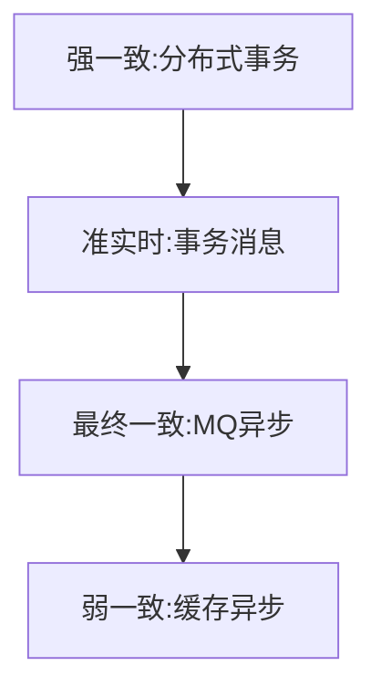
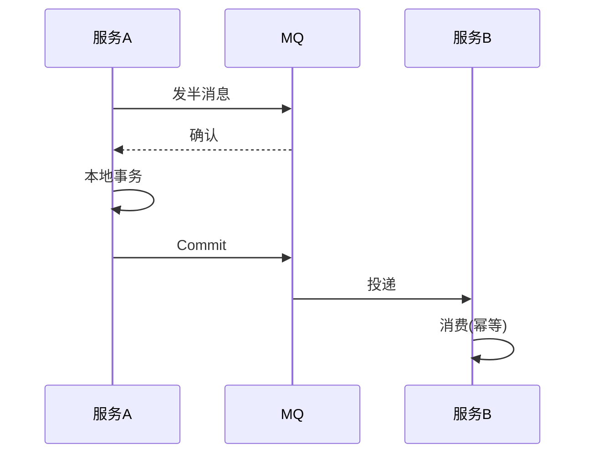

# 数据一致性架构实战

> 分布式系统中，数据散布在 DB、缓存、MQ、多服务之间，"一致性"是永恒难题。架构上要在**强一致（成本高）**与**最终一致（可用高）**之间权衡，并设计补偿与对账兜底。

## 1. 一致性层级

## 2. 方案选型

| 方案 | 一致性 | 性能 | 适用 |
| --- | --- | --- | --- |
| 2PC | 强 | 低 | 强一致短事务 |
| TCC | 强-业务 | 中 | 高并发可控 |
| 事务消息 | 最终 | 高 | 跨服务主流程 |
| Saga | 最终 | 高 | 长流程编排 |
| 对账补偿 | 最终 | 高 | 兜底 |

## 3. 事务消息模式

## 4. 最终一致要点

- **幂等消费**：同消息多次处理结果一致。
- **重试 + 死信**：失败重试，超限进死信人工。
- **对账**：定期比对双方数据，修正偏差。
- **业务可补偿**：设计反向操作（退款、冲正）。

## 5. 常见坑

| 坑 | 现象 | 对策 |
| --- | --- | --- |
| 消息丢失 | 数据不一致 | 事务消息 + 对账 |
| 重复消费 | 金额翻倍 | 幂等 |
| 2PC 阻塞 | 资源锁死 | 超时 + 熔断 |
| 补偿遗漏 | 长期偏差 | 定时对账 |
| 脏读 | 看到中间态 | 读已提交隔离 |

## 6. 面试题

1. 强一致与最终一致怎么选？
2. 事务消息如何保证不丢？
3. 最终一致为什么必须幂等？
4. Saga 与 TCC 区别？
5. 对账在一致性中起什么作用？

## 7. 小结

数据一致性 = 方案分层（2PC/TCC/事务消息/Saga/对账）+ 幂等 + 补偿。核心原则：能用最终一致就不用强一致，但必须有对账兜底。
