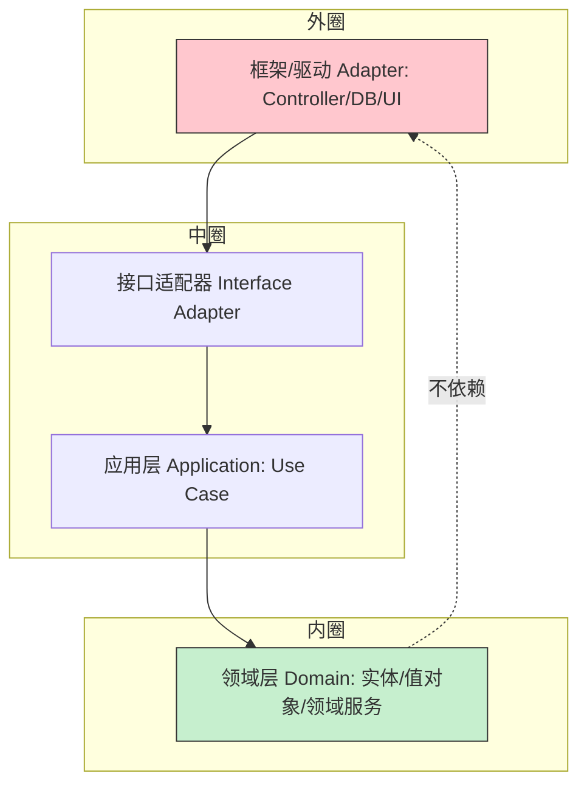

# 整洁架构与六边形架构（Clean / Hexagonal Architecture）

> 配套：[系统架构](系统架构.md) · [DDD 战术设计](../DDD/战术设计.md) · [单体到微服务演进](单体到微服务演进.md)
> 分层、依赖倒置、端口与适配器——这些概念散落各处，本篇把它们统一成「让业务逻辑不依赖框架、不依赖数据库、可测试、可替换」的 architecture 操作系统。

---

## 〇、为什么需要"架构风格"

没有约束的分层，最终会变成：Controller 调 Service、Service 直接 `new JpaRepoImpl()`、领域对象混着 `@Entity` 与业务规则、测试要起整个 Spring 容器。结果是**业务逻辑与技术框架死死绑定**，换个 ORM、做单元测试都难。

整洁架构（Clean）/ 六边形（Hexagonal）/ 洋葱（Onion）三者的核心主张**完全一致**：

> **源代码依赖只能指向内部（领域），外圈（框架/数据库/UI）依赖内圈，反过来不行。**

---

## 一、整洁架构（Robert C. Martin）四层环



| 层 | 职责 | 依赖方向 |
|----|------|----------|
| **实体（Entities）** | 企业级业务规则、领域模型 | 最内，不依赖任何外层 |
| **用例（Use Cases）** | 应用级业务规则（一个具体场景） | 只依赖实体 |
| **接口适配器** | 把数据转成外层可用的格式（DTO、Presenter） | 依赖用例与实体 |
| **框架/驱动** | Web 框架、DB、MQ、UI | 最外，依赖内层 |

**依赖规则**：源码依赖只能由外向内；内层**绝不知道**外层的存在（通过接口/依赖倒置实现）。

---

## 二、六边形架构（Alistair Cockburn）：端口与适配器

六边形架构用「**端口（Port）+ 适配器（Adapter）**」表达同样的思想，更强调**应用核心与外部世界的交互点**。

```mermaid
graph TD
    subgraph 核心
      C[应用核心 Domain + Application]
    end
    C --- P1{{端口: 驱动(入)}}
    C --- P2{{端口: 被驱动(出)}}
    DRV[Web Controller / CLI / 测试] -->|适配器| P1
    P2 -->|适配器| DB[(DB Adapter)]
    P2 -->|适配器| MQ[(MQ Adapter)]
    P2 -->|适配器| EXT[外部 API Adapter]
```

- **驱动端口（Driving Port，入）**：外部如何调用核心（如 `PlaceOrderUseCase` 接口）。
- **被驱动端口（Driven Port，出）**：核心如何调用外部（如 `PaymentGateway` 接口）。
- **适配器**：把具体技术（Spring MVC、MyBatis、Kafka）接到端口上。
- **关键**：核心是纯 Java，不 import Spring/JPA；测试时用一个内存适配器即可，无需起容器。

---

## 三、依赖倒置（DIP）：让内层不依赖外层

领域层定义接口，外层提供实现——**编译依赖向内，运行依赖向外**。

```java
// 领域层（内层）定义端口，不知道谁实现
interface PaymentGateway {            // 被驱动端口
    PaymentResult charge(Order order);
}

// 应用用例只依赖接口
class PlaceOrderUseCase {
    private final PaymentGateway gateway;
    PlaceOrderUseCase(PaymentGateway g) { this.gateway = g; }
    void execute(OrderCmd cmd) { /* 纯逻辑，调 gateway.charge */ }
}

// 外层适配器实现端口（MyBatis/HTTP 调用）
class AlipayGatewayAdapter implements PaymentGateway {
    public PaymentResult charge(Order o) { /* 真实 HTTP 调用 */ }
}
```

> 测试时注入一个 `FakePaymentGateway`（内存实现）即可跑完整用例，**零 Spring、零 DB**——这就是可测性的来源。

---

## 四、与 DDD 的对应关系

| 架构概念 | DDD 概念 |
|----------|----------|
| 实体层 | 实体 / 值对象 / 聚合根 |
| 用例层 | 应用服务（Application Service） |
| 接口适配器 | 防腐层 ACL / DTO Assembler |
| 端口 | 仓储接口（Repository 定义在领域层） |
| 适配器 | Spring Data / MyBatis 实现 |

> 与 [DDD 战术设计](../DDD/战术设计.md) 一脉相承：领域层纯净，技术细节在外层适配。这也是 [业务模型](../业务模型/) 中"核心域自研深耕"在代码层的体现。

---

## 五、落地骨架（Spring Boot 项目）

```text
com.shop
├── domain                # 内层：纯 Java，零框架依赖
│   ├── model/            # 实体/值对象/聚合
│   ├── service/          # 领域服务（含业务规则）
│   └── port/out/         # 被驱动端口（Repository/PaymentGateway 接口）
├── application           # 用例层：编排领域 + 端口
│   └── usecase/          # PlaceOrderUseCase
├── interface-adapter     # 接口适配器
│   ├── in/web/           # Controller（驱动适配器）
│   └── out/db/           # Jpa/MyBatis 实现（被驱动适配器）
└── config                # 依赖装配（Spring 把适配器注入端口）
```

- **编译约束**：`domain` 模块不依赖 `spring-boot`；用 ArchUnit 门禁守住（见[系统架构·规则自动化](系统架构.md)）。
- **测试**：领域/用例层用 JUnit + Fake 适配器，毫秒级；只有集成测试才起 Spring + Testcontainers。

---

## 六、常见反模式

| 反模式 | 表现 | 危害 | 修正 |
|--------|------|------|------|
| 领域层 import 框架 | `@Entity` 上叠业务、`@Service` 在领域包 | 无法独立测试/演进 | 双模型（DO/PO）+ 依赖倒置 |
| 用例层变贫血 | ApplicationService 只有 repo.load→save | 业务上移到 Controller | 业务规则留在领域 |
| 适配器泄漏到内层 | 领域里直接 `RestTemplate` 调外部 | 强耦合、难替换 | 抽端口 + 外层适配 |
| 过度分层 | 5 层 + 每层 DTO 互转 | 改动链路长、样板多 | 按复杂度裁剪 |

---

## 七、与微服务的关系

- 六边形架构的「端口」正好是**服务边界**：驱动端口 = 对外 API，被驱动端口 = 调其他服务/DB。
- 核心纯净 → 同一份业务核心，可被 REST 适配器、gRPC 适配器、CLI 适配器复用。
- 详见 [单体到微服务演进](单体到微服务演进.md)：先把单体按六边形写好，拆分时核心直接平移成服务。

---

## 八、面试高频追问

1. Q：整洁架构依赖规则？ A：源码依赖只能由外向内，内层不知道外层存在，靠依赖倒置实现。
2. Q：端口和适配器是什么？ A：端口是核心与外部的交互契约（接口），适配器是把具体技术接到端口的实现。
3. Q：整洁/六边形/洋葱区别？ A：思想一致（依赖向内），表述不同；六边形强调端口适配器，整洁强调四层环。
4. Q：为什么领域层不能依赖框架？ A：否则业务被框架绑架，难以测试与演进；依赖倒置让外层适配内层。
5. Q：Repository 接口放哪？ A：定义在领域层（端口），实现在外层适配器。
6. Q：怎么保证不破依赖规则？ A：ArchUnit 门禁断言「domain 不依赖 spring/jpa」等。
7. Q：六边形对测试的好处？ A：核心可注入 Fake 适配器，零容器零 DB 跑用例，毫秒级单测。
8. Q：和 DDD 的关系？ A：实体/聚合在领域层，应用服务在用例层，防腐层/仓储即适配器。

---

## 九、Cheat Sheet

| 概念 | 一句话 |
|------|--------|
| 依赖规则 | 源码依赖只能由外向内，内层不知外层 |
| 端口 | 核心与外部的交互契约（接口） |
| 适配器 | 把 Web/DB/MQ 接到端口的实现 |
| DIP | 内层定义接口，外层提供实现 |
| 收益 | 业务纯净、可测、技术可替换 |
| 守门 | ArchUnit 断言领域层零框架依赖 |
