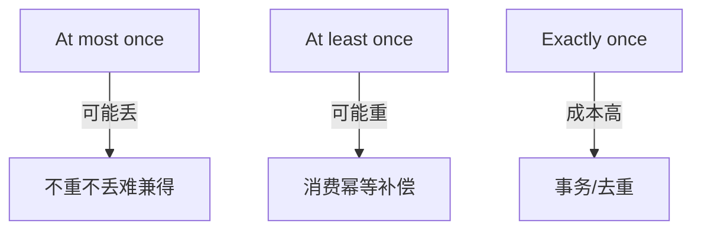
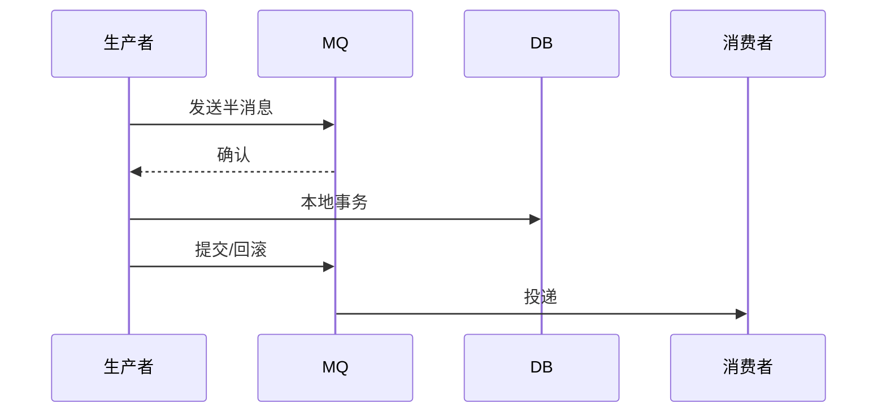

# 消息队列架构实战

> 消息队列（MQ）是分布式系统的"异步总线"与"削峰填谷"核心。本文从角色、投递语义、顺序、积压治理到选型，给出生产级设计要点。

## 1. MQ 的核心价值

| 价值 | 说明 |
| --- | --- |
| 异步解耦 | 生产者发完即返，消费者后处理 |
| 削峰填谷 | 突发流量进队列，下游按能力消费 |
| 可靠传递 | 持久化 + 重试，防丢 |
| 广播/扇出 | 一份消息多消费者 |

## 2. 投递语义



- **At-most-once**：可能丢，简单。
- **At-least-once**：可能重，需消费幂等（最常见）。
- **Exactly-once**：几乎都要基础设施支持（事务消息/去重），成本高。

> 业界共识：用 at-least-once + 幂等消费 近似 exactly-once，性价比最高。

## 3. 顺序消息

- **分区有序**：同一业务 key 发同一分区，分区内 FIFO（Kafka/RocketMQ 支持）。
- **全局有序**：单分区单消费线程，吞吐受限，除非必要不用。
- 顺序场景：订单状态流转、binlog 同步。

## 4. 消费幂等

```python
def consume(msg):
    key = f"msg:{msg.id}"
    if redis.set(key, "1", nx=True, ex=86400):
        process(msg)
```

- 消息带唯一 ID，消费前查重。
- 或业务状态机：只处理"未处理→已处理"。

## 5. 积压治理

- **监控 lag**：消费滞后量是指标生命线。
- **扩容消费**：增加消费者实例（受分区数约束）。
- **跳过/限流**：非核心消息可临时降速或丢弃（评估业务）。
- **批量消费**：提升单条吞吐。

## 6. 死信与重试

- 消费失败进重试队列，指数退避。
- 超过阈值进 DLQ，人工排查。
- 避免"失败即无限重试"阻塞分区。

## 7. 主流选型

| MQ | 优点 | 缺点 | 适用 |
| --- | --- | --- | --- |
| Kafka | 高吞吐、生态强 | 运维重、延迟中 | 日志/大数据 |
| RocketMQ | 金融级、事务消息 | 生态略弱 | 业务交易 |
| RabbitMQ | 灵活路由、低延迟 | 吞吐一般 | 任务队列 |
| Pulsar | 存算分离、多租户 | 复杂 | 云原生 |

## 8. 事务消息

用于"本地事务 + 发消息"一致（如订单创建同时通知库存）：
- 半消息 → 本地事务 → 提交/回滚消息。
- RocketMQ 原生支持；Kafka 用事务 API 或 Outbox 模式替代。



## 9. 落地坑点

| 坑 | 现象 | 对策 |
| --- | --- | --- |
| 消息丢失 | 数据缺 | 持久化+确认 |
| 重复消费 | 资损 | 幂等 |
| 顺序错 | 状态乱 | 分区键 |
| 积压 | 延迟高 | 监控+扩容 |
| 消费阻塞 | 全卡 | DLQ+隔离 |

## 10. 面试题

1. at-least-once 如何保证不重复影响业务？
2. 如何保证消息顺序？
3. 消息积压怎么处理？
4. 事务消息原理？
5. 如何选型 MQ？

## 11. 小结

MQ 是异步与解耦的基石。生产要点：选对语义（at-least-once + 幂等）、保顺序用分区键、盯紧 lag、用 DLQ 防阻塞、事务消息解"发消息+写库"一致性。
