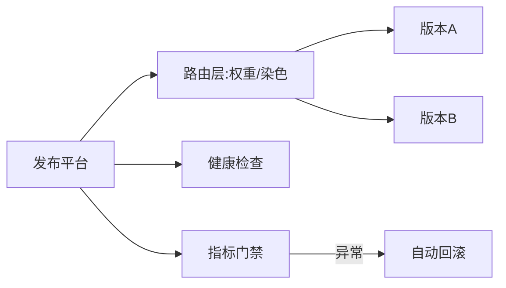

# 灰度发布与回滚架构实战

> 架构层面，发布系统要让"变更"可观测、可控制、可撤销。灰度与回滚不是运维动作，而是**架构内建能力**：流量路由、健康检查、指标门禁、自动回滚共同构成发布安全网。

## 1. 架构组成

## 2. 流量控制

- **权重路由**：网关/Service Mesh 按百分比分配。
- **染色路由**：特定用户/测试账号打标走新版本。
- **会话保持**：同一用户尽量落到同一版本，避免抖动。

## 3. 指标门禁

- 监控错误率、P99、CPU、业务指标（下单量等）。
- 每阶段设阈值，越界自动暂停/回滚。
- 对比基线（旧版本）做 A/B 判定。

## 4. 回滚策略

| 方式 | 速度 | 数据影响 |
| --- | --- | --- |
| 流量切回 | 秒级 | 无（无状态） |
| 版本回退 | 分钟 | 需兼容 |
| 配置开关 | 秒级 | 无 |

- **特性开关**：用配置控制新逻辑，回滚只需关开关。
- **数据向后兼容**：新版本写的数据老版本能读。

## 5. 常见坑

| 坑 | 现象 | 对策 |
| --- | --- | --- |
| 数据不兼容 | 回滚崩 | 先兼容 |
| 开关遗漏 | 关不掉 | 默认关 + 测试 |
| 门禁盲区 | 异常未发现 | 全维度指标 |
| 有状态 | 切回丢态 | 无状态化 |
| 回滚慢 | 扩大影响 | 流量级回滚 |

## 6. 面试题

1. 灰度发布架构需要哪些能力？
2. 特性开关有什么好处？
3. 自动回滚如何触发？
4. 有状态服务如何安全发布？
5. 指标门禁看哪些指标？

## 7. 小结

灰度与回滚 = 流量路由 + 指标门禁 + 特性开关 + 自动回滚。核心：让发布成为"可撤销的连续动作"，而不是"全有全无的赌博"。
