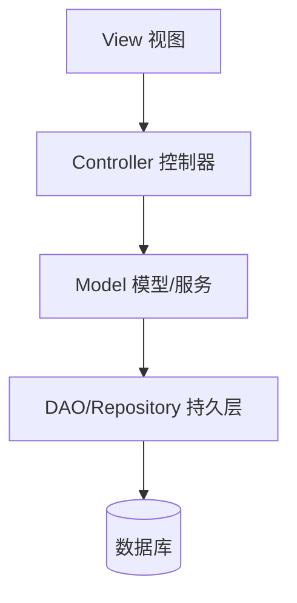
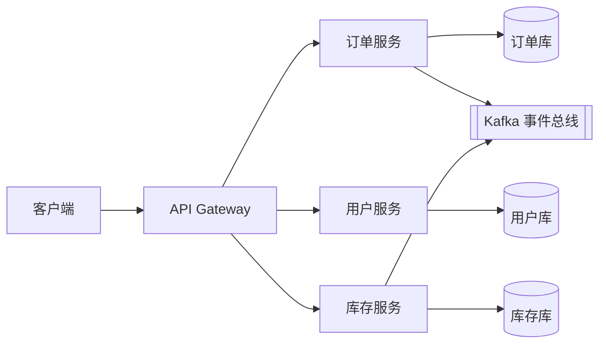

# 系统架构

> 系统架构关注**单个系统的内部结构**：如何将需求落成一个可演进、可测试、可扩展、有韧性的软件系统。它与「设计模式」的关系，类似城市总体规划与一栋楼施工图的关系——架构定**边界与通信**，模式定**局部套路**。

**一句话定位**：架构的本职是「定义良好的结构，治理复杂度，把系统从随心所欲的混乱状态带向井井有条的有序状态」（这也是阿里 COLA 对项目初衷的表述）。

---

## 一、什么是系统架构（与架构师的第一性原理）

架构 = **要素（Elements） + 结构（Relationships）**。

- **要素**：组成系统的重要部件（模块、服务、组件、存储、外部依赖）。
- **结构**：要素之间如何依赖、如何通信、如何隔离。

架构师的核心工作，不是在白板上画漂亮的图，而是**持续回答三个问题**：

1. 系统由哪些职责边界清晰的部件组成？（切分）
2. 部件之间如何通信、依赖方向是什么？（连接）
3. 当需求、流量、团队规模变化时，结构能否平滑演进？（演进）

> **架构不是「技术选型清单」，而是「取舍（Trade-off）的记录」**。没有银弹，只有适合当前团队与业务阶段的「最不坏解」。

### 系统架构 vs 设计模式 vs 企业架构

| 维度 | 系统架构 | 设计模式 | 企业架构 |
| --- | --- | --- | --- |
| 关注对象 | 单个系统 | 局部代码套路 | 全公司业务+IT 蓝图 |
| 时间跨度 | 数月~数年 | 一次提交 | 数年战略 |
| 核心问题 | 系统怎么拆、怎么连 | 这个类怎么写更优雅 | 公司能力怎么沉淀、怎么治理 |
| 典型产出 | 架构图、ADR、边界 | 类/对象结构 | 蓝图、标准、治理委员会 |
| 参考框架 | C4、4+1、演进式架构 | GoF 23 | TOGAF/Zachman/ArchiMate |

三者互补而非替代：**企业架构**决定「做什么能力」，**系统架构**决定「单个系统怎么做」，**设计模式**决定「代码怎么写」。

---

## 二、核心设计原则（系统架构的"宪法"）

这些原则与设计模式板块的「六大设计原则」一脉相承，只是作用在更高层：

1. **关注点分离（Separation of Concerns）**：每层/模块只解决一类问题。
2. **高内聚、低耦合**：把相关的放一起，把无关的隔开；越少共享状态越好。
3. **依赖倒置（DIP）**：源码依赖指向「内层（领域/策略）」，基础设施依赖领域，而非反过来。这是整洁架构/六边形架构的基石。
4. **显式边界（Explicit Boundaries）**：用包/模块/目录硬隔离，配合工具在编译期拦住越界依赖（见第七节）。
5. **康威定律（Conway's Law）**：系统结构会**镜像**组织结构。要让架构解耦，先让团队解耦；反之，强行让一个团队维护强耦合系统必然痛苦。
6. **演进式架构（Evolutionary Architecture）**：架构不是一次定死，而是通过「适应度函数（Fitness Functions）」——自动化测试/度量——保证系统在演进中关键属性（性能、耦合度、韧性）不被破坏。

---

## 三、主流架构风格（按演进顺序）

> 选型铁律：**从最简单能work的开始，按需演进**。不要为了「看起来先进」上微服务。

### 1. 分层架构（Layered / MVC）

最传统、最易理解的风格，水平切分为表现层 / 业务逻辑层 / 持久层（MVC 是其特化）。



- **适用**：传统业务系统、CRUD 重的应用、团队熟悉 MVC 框架。
- **优点**：职责清晰、资料多、上手快。
- **缺点**：容易退化为「千层面代码（Lasagna Code）」——一个改动沿层向上涟漪；表现层可能直接穿透到 DAO，破坏分层。

### 2. 模块化单体（Modular Monolith）

**强烈推荐的「现实起点」**：仍是单体部署，但内部用**包/模块边界**（常以 DDD 限界上下文为划分依据）把业务清晰切开。

- 避免了分布式的运维税，又享受清晰边界。
- 是「单体 → 微服务」最稳的过渡形态。
- **反模式警示**：若服务间必须一起部署、共享数据库、强同步调用，那叫**分布式单体（Distributed Monolith）**——既没拿到微服务的好处，又背上了它的复杂度。

### 3. 微服务（Microservices）

把应用拆成围绕**业务能力（限界上下文）**组织、可独立部署、通常**独享数据库**的小服务。



- **通信**：同步 REST/gRPC，异步走消息（Kafka/RabbitMQ）。
- **必备支撑设施**：服务注册发现、API Gateway、配置中心、**Service Mesh（Istio/Linkerd，治理服务间通信）**。
- **适用**：大型多团队、需要独立扩缩容的复杂平台（Netflix、Amazon 即典型案例）。
- **不适用**：小团队、简单领域、运维成熟度低——会凭空增加部署/监控/网络/分布式事务的巨大负担。
- **何时该拆**（来自实践派问答）：出现持续合并冲突、部署排队、只需扩一部分却要扩整体时，再考虑。先 Modular Monolith 划清边界，再拆。

### 4. 事件驱动架构（EDA, Event-Driven）

部件通过**事件**通信：生产者发事件、不关心谁消费；消费者订阅自己关心的事件。

- **优点**：极致解耦、易扩展、天然适配异步/实时处理（如 `OrderPlaced` 事件并行触发库存、物流、通知）。
- **代价**：顺序、幂等、最终一致性需要专门设计；调试链路更长（需分布式追踪）。

### 5. CQRS + 事件溯源（Event Sourcing）

- **CQRS（命令查询职责分离）**：写模型（强一致、领域校验）与读模型（为查询优化、可冗余、可物化视图）分离。适合读写比悬殊、报表重的系统。
- **事件溯源**：系统状态不由「当前快照」存储，而由**一串不可变事件**重放得到。带来天然审计日志、时间旅行调试；代价是复杂度与存储膨胀。

### 6. 整洁架构 / 六边形架构 / 洋葱架构

三者同源，核心都是**以业务（领域）为核心，解耦外部依赖**。

```mermaid
flowchart TD
    subgraph Outer[外层·机制]
        UI[UI/Controller] -->|调用| APP
        DB[(DB Adapter)] -.实现.-|Repository 接口| DOM
        MSG[[MQ Adapter]] -.实现.-|Port| DOM
    end
    subgraph Inner[内层·策略]
        APP[Application 用例] --> DOM[Domain 领域]
    end
    style Inner fill:#eef,stroke:#88a
```

- **依赖规则（Dependency Rule）**：源码依赖**只能指向内**（领域不知道 DB/框架/HTTP 的存在）。
- **端口与适配器（Ports & Adapters）**：领域定义接口（端口），基础设施实现它（适配器）。换数据库/框架只是换适配器，领域零改动。
- **价值**：领域可毫秒级单测、技术可替换、团队可并行。

### 7. Serverless / FaaS

函数即服务，云厂商托管扩缩容。适合**突发、事件驱动、成本敏感**负载（如图片处理、Webhook）。代价：冷启动、厂商绑定、调试难。

### 8. Service Mesh（服务网格）

严格说不是「一种系统架构」，而是微服务时代的**基础设施层**：把服务发现、熔断、鉴权、观测等横切关注点下沉到 sidecar（如 Envoy），让业务代码回归纯粹。当服务数涨到几十上百时几乎是必选项。

---

## 四、架构决策矩阵（怎么选）

| 风格 | 最适合 | 团队规模 | 可扩展性 | 运维复杂度 | 典型场景 |
| --- | --- | --- | --- | --- | --- |
| 分层单体 | 简单 CRUD、MVP、内部工具 | 小（1–5） | 低–中 | 低 | 后台管理、创业起步 |
| 模块化单体 | 成长中的单体 | 小–中 | 中 | 低–中 | 需清晰边界但暂不想分布式 |
| 微服务 | 复杂平台、独立扩缩容 | 大（多团队） | 很高 | 高 | 电商、社交、金融核心 |
| 事件驱动 | 异步、实时数据处理 | 任意 | 很高 | 高 | Feed、风控、流式计算 |
| 整洁/六边形 | 重视可测与技术可替换 | 任意 | 中–高 | 中 | 长生命周期业务系统 |
| Serverless | 突发、事件型 | 任意 | 高（自动） | 低 | 文件处理、定时任务 |

**选型检查清单**：
1. 画出领域边界与团队归属（康威定律）。
2. 选「预期增长下最简单能支撑」的架构。
3. 每个服务/模块都先接好指标、日志、追踪。
4. 外部调用处落地重试、熔断、幂等。
5. 用消费者驱动的契约测试保护关键集成。
6. 上 CI/CD + 特性开关/灰度，小步快跑。

---

## 五、韧性与可靠性模式（Resilience）

分布式系统**一定会出错**，架构要「假设故障、容忍并恢复」：

- **重试 + 指数退避 + 抖动（Jitter）**：避免惊群，缓解瞬时故障。
- **熔断器（Circuit Breaker）**：下游持续降级时快速失败，给其恢复窗口。
- **舱壁（Bulkhead）**：把故障隔离在有限区域（如按业务隔离线程池），避免全盘雪崩。
- **Saga**：跨服务的长事务，用「一系列本地事务 + 补偿操作」替代两阶段提交（编排 Choreography 或 编制 Orchestration 两种风格）。
- **幂等（Idempotency）**：用幂等 token / 消息去重，让异步重试安全。
- **超时 / 限流 / 降级**：永远给外部调用设超时；过载时丢车保帅。

---

## 六、可观测性（Observability）先行

架构一开始就要为「看不见的问题」做准备：

- **三大支柱**：指标（Metrics，延迟/错误率/流量）、日志（结构化、带上下文）、追踪（Tracing，用 correlation ID 串起跨服务请求）。
- **标准**：OpenTelemetry 已成事实标准，统一采集。
- 告警要对齐**用户影响**，而非机器指标；配合混沌工程验证真实故障模式。

---

## 七、数据一致性与跨服务事务

- **强一致**：金融、库存等关键路径，正确性优先（可用 TCC、Saga 强一致变体）。
- **最终一致**：多数用户侧功能，配合 UX 处理「暂未刷新」更划算。
- **常见落地**：本地消息表、事务消息（RocketMQ）、Saga 补偿、CQRS 读模型异步同步。
- **铁律**：**服务间不要共享数据库**，否则耦合回潮，微服务名存实亡。

---

## 八、架构治理与落地（让架构不只是一张图）

1. **ADR（架构决策记录）**：把重要决策的「背景—选项—结论—后果」写下来。未来的人知道**为什么**，才不会无意中推翻它。
2. **自动化边界校验**：用工具把架构规则变成「合并前就报错的门禁」。
   - Java：`ArchUnit` 写断言（「domain 不能依赖 infrastructure」）。
   - TS/JS：`eslint-plugin-import` 禁止从 domain 反向 import 基础设施。
   - 规则自动化比人工 review 更可扩展。
3. **CI/CD + 渐进交付**：特性开关（Feature Flag）、金丝雀发布（Canary）、蓝绿部署，降低每次变更风险。
4. **基础设施即代码（IaC）+ 最小权限**：环境可重建、权限可审计。

---

## 九、架构图怎么画（沟通对象决定画法）

- **C4 模型**（Context → Container → Component → Code）：从「系统上下文」到「代码」四个缩放层级，每层服务不同受众，避免一张图塞下全世界。
- **4+1 视图**：逻辑视图 / 进程视图 / 物理视图 / 开发视图 + 场景，覆盖不同干系人。
- **原则**：图是沟通工具不是艺术品。**给开发者的图**要标清依赖方向；**给老板的图**只要讲清能力边界与风险。不要为了「全」而画没人看得懂的巨图。

---

## 十、GitHub 开源参考（系统架构）

| 项目 | 语言 | 为什么值得看 |
| --- | --- | --- |
| [donnemartin/system-design-primer](https://github.com/donnemartin/system-design-primer) | 文档 | 系统设计入门「神级」仓库：可扩展性、缓存、负载均衡、CAP、分片、消息队列等全覆盖，附面试题+图解+Anki 记忆卡，是建立系统架构直觉的一站式起点。 |
| [binhnguyennus/awesome-scalability](https://github.com/binhnguyennus/awesome-scalability) | 列表 | 高质量「可扩展性案例」聚合：真实公司架构复盘、高并发模式、容量设计，适合做方案时找参照。 |
| [alibaba/COLA](https://github.com/alibaba/COLA) | Java | 阿里开源的「整洁面向对象分层架构」，提供可落地的 archetype 与组件（状态机、扩展点、异常处理），是把整洁/六边形思想落到单系统的参考框架（详见[企业架构](企业架构.md)）。 |
| [dotnet-architecture/eShopOnContainers](https://github.com/dotnet-architecture/eShopOnContainers) | C#/.NET | 微软官方微服务参考实现：容器化、CQRS、事件总线、API Gateway 一应俱全，.NET 栈最佳样板。 |
| [spring-projects/spring-petclinic-microservices](https://github.com/spring-projects/spring-petclinic-microservices) | Java | Spring 生态微服务教学示例，轻量易读，适合对照理解服务拆分。 |
| [kubernetes/kubernetes](https://github.com/kubernetes/kubernetes) | Go | 微服务/云原生的编排底座，理解「部署、弹性、服务发现」的底层机制。 |
| [apache/kafka](https://github.com/apache/kafka) | Java/Scala | 事件驱动架构的事实标准消息/流平台，理解 EDA 必读。 |
| [phodal/awesome-architecture](https://github.com/phodal/awesome-architecture) | 列表 | 中文架构 awesome 清单，聚合大量国内外的架构文章、模式与工具。 |

---

## 十一、延伸阅读

- 书籍：《企业应用架构模式》（Martin Fowler）、《Clean Architecture》（Robert C. Martin）、《领域驱动设计》（Eric Evans）、《Building Evolutionary Architectures》（Ford/Sadalage）。
- 关联阅读：[设计模式](设计模式/设计模式分类.md)（局部套路）、[DDD](../DDD/入门.md)（边界划分思想）、[场景设计](../场景设计/)（高并发实战）。
- 实践心法：架构是**工具不是规则**——好架构师懂多种模式，更懂**何时用、何时组合、何时别用**。先简单、度量和演进，永远对齐业务目标。
