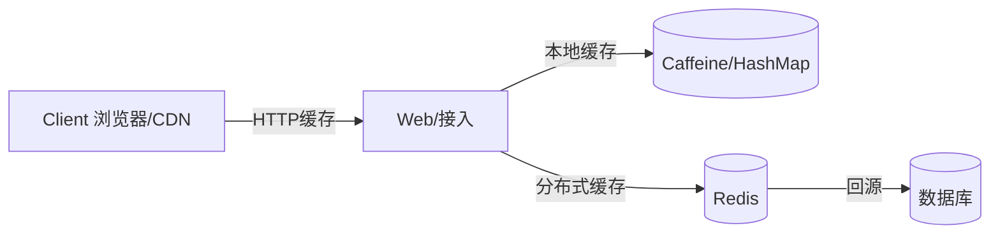

# 缓存架构与多级缓存实战

> 缓存是提升性能、扛住高并发的利器，但也带来一致性、失效、雪崩等经典难题。多级缓存（本地+分布式+客户端）是生产标配，本文系统讲解。

## 1. 缓存的位置



| 层级 | 代表 | 速度 | 容量 | 一致性 |
| --- | --- | --- | --- | --- |
| 客户端 | 浏览器/CDN | 最快 | 小 | 弱 |
| 本地缓存 | Caffeine/Guava | 极快 | 中 | 弱 |
| 分布式缓存 | Redis | 快 | 大 | 较强 |
| 数据库 | MySQL | 慢 | 最大 | 强 |

## 2. 缓存读写模式

### 2.1 Cache Aside（旁路）
- 读：先查缓存，未命中查库并回写。
- 写：先更新库，再删缓存（非更新缓存）。

```python
def get(key):
    v = cache.get(key)
    if v is None:
        v = db.query(key)
        cache.set(key, v, ttl=300)
    return v

def update(key, val):
    db.update(key, val)
    cache.delete(key)   # 删而非写，避免并发写覆盖
```

### 2.2 Read/Write Through & Behind
由缓存层统一管理读写，对调用方透明，但实现复杂。

## 3. 缓存一致性

Cache Aside 的"先更新库再删缓存"在并发下仍可能不一致：
- 解决：延时双删（更新后删一次，延迟再删）、或订阅 binlog 异步删（Canal）。
- 强一致场景：读写都走库+缓存只作只读副本，或用分布式锁串行化。

## 4. 三大经典问题

### 4.1 缓存穿透（查不存在的 key）
- 现象：大量查不存在的数据，直击 DB。
- 对策：布隆过滤器拦截、缓存空值（短 TTL）。

### 4.2 缓存击穿（热点 key 失效）
- 现象：某热点 key 过期瞬间，大量请求打到 DB。
- 对策：互斥重建（只放一个线程重建）、逻辑过期（不真删，异步刷新）。

### 4.3 缓存雪崩（大量 key 同时失效）
- 现象：同一时刻大量 key 过期或 Redis 挂，DB 被打垮。
- 对策：TTL 加随机抖动、Redis 高可用集群、限流降级。

## 5. 多级缓存协同

- 本地缓存扛绝大部分读，Redis 扛跨实例共享。
- 本地缓存更新：通过消息（如 Redis Pub/Sub 或配置中心）广播失效。
- 注意本地缓存容量与一致性窗口，敏感数据慎用。

## 6. 缓存与数据库双写

- 优先"删缓存"而非"更缓存"，减少并发写不一致。
- 用 binlog 订阅保证最终一致（Canal → MQ → 删缓存）。
- 关键路径可加短暂延迟双删兜底。

## 7. 容量与淘汰

- Redis 内存有限，设 `maxmemory` + 淘汰策略（LRU/LFU）。
- 热点数据永不过期 + 主动刷新，避免雪崩。
- 大 key / 热 key 拆分（hash 打散、本地多副本）。

## 8. 落地坑点

| 坑 | 现象 | 对策 |
| --- | --- | --- |
| 数据不一致 | 读到旧值 | binlog 删缓存 |
| 穿透 | DB 被打 | 布隆/空值 |
| 击穿 | 热点失效洪峰 | 互斥重建 |
| 雪崩 | 集体失效 | TTL 抖动 |
| 大 key | Redis 慢 | 拆分 |

## 9. 面试题

1. Cache Aside 为什么删缓存不更新缓存？
2. 缓存穿透/击穿/雪崩区别与对策？
3. 如何保证缓存与库最终一致？
4. 多级缓存如何协同失效？
5. 本地缓存一致性如何保证？

## 10. 小结

缓存 = 性能与一致性的权衡艺术。生产推荐"Cache Aside + 多级缓存 + binlog 异步失效 + 防穿透/击穿/雪崩"。理解三大问题比会加缓存更重要。
