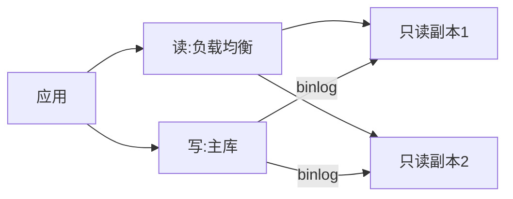

# 读写分离与多副本实战

> 读多写少场景下，读写分离用多副本分摊读流量，是性价比最高的扩展手段之一。但复制延迟带来的"读旧数据"问题，是它绕不开的工程妥协。架构上要明确哪些读可以容忍延迟、哪些必须走主库。

## 1. 架构

## 2. 路由策略

| 读类型 | 路由 |
| --- | --- |
| 写后强一致读 | 主库 |
| 容忍延迟读 | 任意副本 |
| 报表/统计 | 专用副本 |
| 实时校验 | 主库 |

## 3. 复制延迟应对

- **写后读主**：刚写入的会话读主库，避免读旧。
- **延迟感知路由**：副本延迟超阈值则切主/其他副本。
- **会话级 sticky**：同一会话读同一副本，减少抖动。

## 4. 高可用

- 主库故障自动选主（如 MHA / Orchestrator）。
- 副本故障自动剔除，读流量重分布。
- 副本重建从主库拉全量 + 增量。

## 5. 常见坑

| 坑 | 现象 | 对策 |
| --- | --- | --- |
| 读旧数据 | 业务异常 | 写后读主 |
| 延迟飙升 | 数据滞后 | 延迟感知 |
| 主库压力 | 没真正分流 | 区分读类型 |
| 脑裂 | 双主 | 选主防脑裂 |
| 副本断 | 读失败 | 健康检查 |

## 6. 面试题

1. 读写分离如何解决读旧？
2. 哪些读必须走主库？
3. 复制延迟如何监控？
4. 主库故障如何切换？
5. 读写分离适用什么场景？

## 7. 小结

读写分离 = 多副本分摊读 + 延迟感知路由 + 高可用切换。核心是"区分读的一致性要求"，把能容忍延迟的读尽量推到副本。
