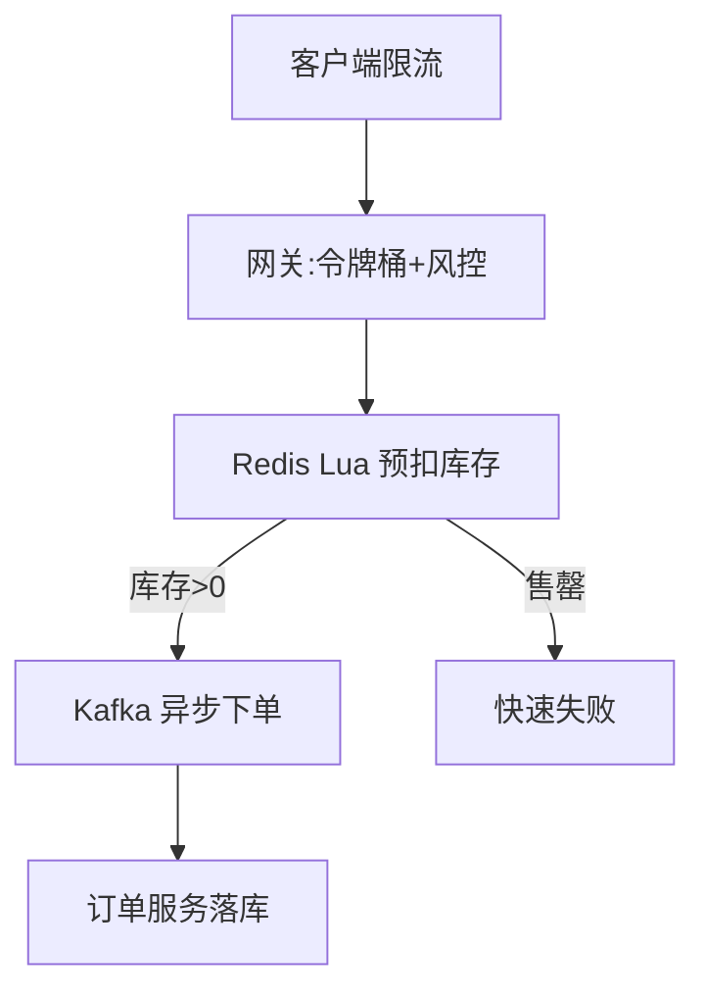

# 高并发架构实战（High-Concurrency in Practice）

> 本篇是「[系统架构](../架构/系统架构.md)」的风格/原理在**具体场景**的落地：不谈抽象原则，直接拆秒杀、库存扣减、Feed 流、IM 长连接、热点账户五类高频高并发场景，给出可套用的架构套路。
>
> 配套：韧性模式见「[系统架构·韧性](../架构/系统架构.md)」，缓存/锁见「[场景设计](../场景设计)」，消息队列见「[基础知识/中间件](../基础知识/中间件)」。

---

## 〇、本体介绍

高并发架构的目标就三个：**扛住量（吞吐）、保住稳（不崩）、不出错（一致）**。抽象原则人人会背，难点在具体场景的组合拳。本篇按「场景 → 矛盾 → 套路」拆解五类最常被问到的实战。

---

## 一、秒杀 / 限时抢购

### 矛盾
瞬时流量是日常的百倍，但**有效库存极少**（100 件被 10 万人抢）。绝大多数请求注定失败，却要公平、快速返回。

### 套路（分层削峰）
1. **客户端**：按钮置灰、答题/验证码错峰、随机退避。
2. **网关/接入**：**限流（令牌桶）** + 黑名单 + 风控，拦掉明显无效流量。
3. **库存预检（Redis）**：用 `Lua` 原子脚本预扣库存，库存<=0 直接快速失败，根本不进 DB。
4. **异步下单（MQ）**：预扣成功的请求发消息，订单服务慢慢消费落库，平滑写峰值。
5. **独立集群**：秒杀链路与常规交易隔离，避免拖垮正常业务。

---

## 二、库存扣减（防超卖）

### 矛盾
「查库存 → 扣库存」非原子，高并发下必超卖。

### 套路（四选一/组合）
- **乐观锁**：`UPDATE stock SET cnt=cnt-1 WHERE id=? AND cnt>=1` —— 简单有效，适合中低并发。
- **Redis + Lua 原子预扣**：内存操作，扛极高并发，再异步落库（需保证最终一致）。
- **库存分桶**：把 1000 件拆成 10 桶，请求哈希到桶，降低单点行锁竞争。
- **行级锁 / 事务**：`SELECT ... FOR UPDATE` 串行化，简单但吞吐低，仅适合低并发。
- 关键：**预占 + 超时回滚**（下单未支付，定时任务释放预占库存）。

---

## 三、Feed 信息流（读多写少）

### 矛盾
大 V 粉丝千万，发布即触达所有人；普通用户只需看关注流。

### 套路
- **推模式（写扩散）**：发布写粉丝收件箱（Redis Sorted Set/时间线存储）→ 读极快，大 V 爆炸。
- **拉模式（读扩散）**：读时聚合关注源 → 写轻，长尾慢。
- **混合（主流）**：普通用户推、大 V 拉 + 热榜合并；翻页用 **cursor** 而非 offset。

---

## 四、IM 长连接（海量连接）

### 矛盾
百万级设备保持长连接、每秒心跳，还要消息不丢不重不乱序。

### 套路
- **接入层无状态 Gateway 集群**：连接与逻辑解耦，连接 ID↔用户 映射存 Redis。
- **消息序号（seq）发号器**：严格递增保有序；`clientMsgId` 去重保不重。
- **大群读扩散**：万人大群转读扩散，避免写爆炸。
- 详见「[社交IM](../业务模型/社交IM业务模型.md)」。

---

## 五、热点账户 / 热点数据

### 矛盾
某个账户（如大促红包账户、明星动态）被海量并发读写，行锁/单点成瓶颈。

### 套路
- **拆分**：热点账户拆成多个子账户（分桶），请求分散，定时归集。
- **合并写**：把多次加款合并成一次批量更新（如红包入账攒批）。
- **缓存 + 异步落库**：读走缓存，写经 MQ 异步持久化。
- **避免热点键**：Redis 单 key 过热 → 加随机后缀打散到多 key。

---

## 六、通用高并发武器库

| 手段 | 解决 | 注意 |
|------|------|------|
| 缓存（多级） | 读扛量 | 一致性/击穿/雪崩 |
| MQ 削峰 | 写平滑 | 消息积压 |
| 限流/熔断/降级 | 保稳定 | 降级粒度 |
| 分库分表 | 数据扩展 | 跨分片 JOIN |
| 无锁/原子操作 | 并发安全 | ABA/CAS 自旋 |
| 静态化 + CDN | 带宽/读 | 更新失效 |

---

## 面试高频追问

1. Q：秒杀如何防超卖且高吞吐？ A：Redis Lua 原子预扣 + 售罄快速失败 + MQ 异步下单，DB 只承接预扣成功的少量请求。
2. Q：库存扣减用乐观锁还是 Redis？ A：中低并发用乐观锁简单；极高并发用 Redis 原子预扣 + 异步落库，注意最终一致。
3. Q：Feed 推拉怎么选？ A：普通用户推、大 V 拉 + 热榜合并（混合）；翻页用 cursor。
4. Q：热点账户怎么破？ A：拆分子账户/分桶 + 合并写 + 缓存异步落库 + 热点 key 打散。
5. Q：限流算法有哪些？ A：令牌桶（允许突发）、漏桶（平滑）、计数器（固定窗口/滑动窗口）。
6. Q：MQ 削峰后消息积压怎么办？ A：消费者扩容、批量消费、优先级队列、死信兜底，并监控 lag。
7. Q：为什么大群 IM 用读扩散？ A：写扩散对万人大群写入爆炸，读扩散只存一份群消息，成员读时聚合。
8. Q：缓存与 DB 一致性怎么保？ A：写时先更新 DB 再删缓存（或延迟双删），读未命中回源并回填，最终一致 + 对账。
