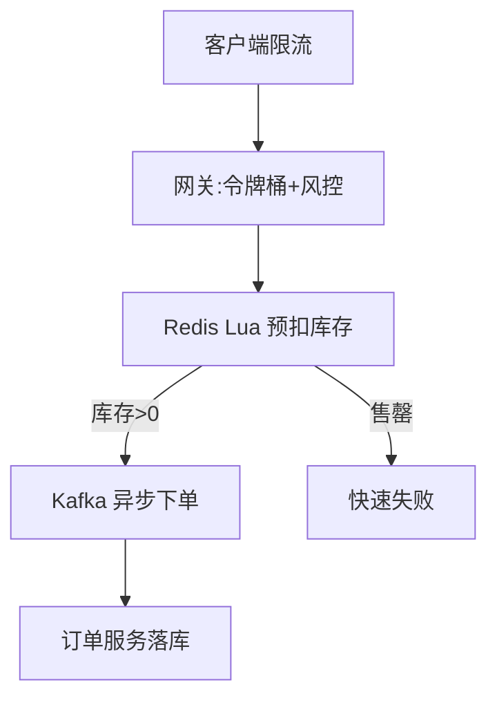

# 高并发架构实战（High-Concurrency in Practice）

> 本篇是「[系统架构](../架构/系统架构.md)」的风格/原理在**具体场景**的落地：不谈抽象原则，直接拆秒杀、库存扣减、Feed 流、IM 长连接、热点账户五类高频高并发场景，给出可套用的架构套路。
>
> 配套：韧性模式见「[系统架构·韧性](../架构/系统架构.md)」，缓存/锁见「[场景设计](../场景设计)」，消息队列见「[基础知识/中间件](../基础知识/中间件)」。

---

## 〇、本体介绍

高并发架构的目标就三个：**扛住量（吞吐）、保住稳（不崩）、不出错（一致）**。抽象原则人人会背，难点在具体场景的组合拳。本篇按「场景 → 矛盾 → 套路」拆解五类最常被问到的实战。

---

## 一、秒杀 / 限时抢购

### 矛盾
瞬时流量是日常的百倍，但**有效库存极少**（100 件被 10 万人抢）。绝大多数请求注定失败，却要公平、快速返回。

### 套路（分层削峰）
1. **客户端**：按钮置灰、答题/验证码错峰、随机退避。
2. **网关/接入**：**限流（令牌桶）** + 黑名单 + 风控，拦掉明显无效流量。
3. **库存预检（Redis）**：用 `Lua` 原子脚本预扣库存，库存<=0 直接快速失败，根本不进 DB。
4. **异步下单（MQ）**：预扣成功的请求发消息，订单服务慢慢消费落库，平滑写峰值。
5. **独立集群**：秒杀链路与常规交易隔离，避免拖垮正常业务。



---

## 二、库存扣减（防超卖）

### 矛盾
「查库存 → 扣库存」非原子，高并发下必超卖。

### 套路（四选一/组合）
- **乐观锁**：`UPDATE stock SET cnt=cnt-1 WHERE id=? AND cnt>=1` —— 简单有效，适合中低并发。
- **Redis + Lua 原子预扣**：内存操作，扛极高并发，再异步落库（需保证最终一致）。
- **库存分桶**：把 1000 件拆成 10 桶，请求哈希到桶，降低单点行锁竞争。
- **行级锁 / 事务**：`SELECT ... FOR UPDATE` 串行化，简单但吞吐低，仅适合低并发。
- 关键：**预占 + 超时回滚**（下单未支付，定时任务释放预占库存）。

---

## 三、Feed 信息流（读多写少）

### 矛盾
大 V 粉丝千万，发布即触达所有人；普通用户只需看关注流。

### 套路
- **推模式（写扩散）**：发布写粉丝收件箱（Redis Sorted Set/时间线存储）→ 读极快，大 V 爆炸。
- **拉模式（读扩散）**：读时聚合关注源 → 写轻，长尾慢。
- **混合（主流）**：普通用户推、大 V 拉 + 热榜合并；翻页用 **cursor** 而非 offset。

---

## 四、IM 长连接（海量连接）

### 矛盾
百万级设备保持长连接、每秒心跳，还要消息不丢不重不乱序。

### 套路
- **接入层无状态 Gateway 集群**：连接与逻辑解耦，连接 ID↔用户 映射存 Redis。
- **消息序号（seq）发号器**：严格递增保有序；`clientMsgId` 去重保不重。
- **大群读扩散**：万人大群转读扩散，避免写爆炸。
- 详见「[社交IM](../业务模型/社交IM业务模型.md)」。

---

## 五、热点账户 / 热点数据

### 矛盾
某个账户（如大促红包账户、明星动态）被海量并发读写，行锁/单点成瓶颈。

### 套路
- **拆分**：热点账户拆成多个子账户（分桶），请求分散，定时归集。
- **合并写**：把多次加款合并成一次批量更新（如红包入账攒批）。
- **缓存 + 异步落库**：读走缓存，写经 MQ 异步持久化。
- **避免热点键**：Redis 单 key 过热 → 加随机后缀打散到多 key。

---

## 六、LLM 推理高并发（2025-2026 新场景）

AI 应用的高并发和经典场景不同：**瓶颈不在 DB 而在 GPU/显存/token 成本**。三大矛盾：

| 矛盾 | 机理 | 解法 |
|------|------|------|
| 推理慢（首 token 秒级） | Prefill 重、模型大 | 前缀缓存/提示缓存、PD 分离（见[训练与部署/05](../大模型/训练与部署/05-推理优化与部署工程.md)） |
| 显存被 KV Cache 占满 | 每并发请求都吃 KV | GQA/MLA 模型、KV 量化、分页调度（vLLM）、KV 分层存储 |
| 流式输出难扛量 | SSE 长连接数 = 并发 | 网关流式转发、连接池、断线重连、背压 |

**架构套路（从「单点调模型」到「推理网关 + 弹层」）**：

```
客户端 → [LLM 网关: 路由/限流/计量/降级] → [推理集群: vLLM/SGLang 多副本]
                        ↓ 语义缓存（相似 query 复用答案，可省 30-70% 成本）
                        ↓ 模型路由（简单问题小模型，难题大模型）
```

- **令牌级限流（Token-based）**：按「并发请求数」限不够，要按 **tokens/min** 限（大 prompt 请求吃掉的算力是小请求的百倍）；流式响应按**字节/秒**限；
- **排队与削峰**：推理请求比普通 API 重得多——网关内置队列 + 超时返回「排队中」提示，比硬顶住更稳；
- **成本即容量**：推理的「容量」不是 QPS 而是 **token/s 预算**（$ 预算 → tokens/min → 并发上限），容量估算公式见第九节；
- **缓存三连**：**提示缓存**（相同系统提示/文档前缀命中，Anthropic/OpenAI 均支持）、**语义缓存**（embedding 相似度命中）、**KV 复用**（Radix 前缀树，见[上下文工程/02](../大模型/上下文工程/02-核心原理与杠杆.md)）。

> 一句话：**LLM 高并发 = 推理网关（路由+令牌限流+计量）+ 缓存（提示/语义/KV）+ 弹性推理集群；面试答「GPU 显存 + token 预算」而不是「加机器」。**

---

## 七、通用高并发武器库（深化：限流与缓存三问）

| 手段 | 解决 | 注意 |
|------|------|------|
| 缓存（多级） | 读扛量 | 一致性/击穿/雪崩 |
| MQ 削峰 | 写平滑 | 消息积压 |
| 限流/熔断/降级 | 保稳定 | 降级粒度 |
| 分库分表 | 数据扩展 | 跨分片 JOIN |
| 无锁/原子操作 | 并发安全 | ABA/CAS 自旋 |
| 静态化 + CDN | 带宽/读 | 更新失效 |

### 7.1 限流算法对比（面试必背）

| 算法 | 思路 | 允许突发 | 平滑度 | 实现 |
|------|------|---------|--------|------|
| 固定窗口 | 每秒计数清零 | 边界可双倍突刺 | 差 | 最简，Redis INCR+EXPIRE |
| 滑动窗口 | 时间戳集合/窗口内计数 | 边界平滑 | 中 | Redis ZSET（记录时间戳） |
| 令牌桶 | 定时放令牌，请求取令牌 | ✅ 允许 | 中 | Redis Lua 原子取令牌 |
| 漏桶 | 请求先进桶，按固定速率出 | ❌ | 最好 | 队列 + 固定消费速率 |

- **选型**：允许突发（秒杀开局）→ 令牌桶；要绝对平滑（下游限速）→ 漏桶；简单够用 → 滑动窗口（固定窗口的边界突刺是事故高发点）；
- **分布式限流**：Redis Lua 原子（`INCRBY`/令牌桶脚本）+ 网关层本地限流兜底（防 Redis 抖动）；Sentinel 实现见[基础知识/中间件/Sentinel](../基础知识/中间件/Sentinel限流熔断.md)。

### 7.2 缓存三大问题（穿透/击穿/雪崩）完整解法

| 问题 | 现象 | 解法链 |
|------|------|--------|
| **穿透** | 查不存在 key，DB 被压 | ①布隆过滤器前置拦截 ②空值也缓存（短 TTL）③参数校验 |
| **击穿** | 热点 key 过期瞬间并发打到 DB | ①互斥锁重建（分布式锁，只放一个线程回源）②逻辑过期（value 带过期时间，异步重建）③热点永不过期 + 后台更新 |
| **雪崩** | 大量 key 同时过期 / 缓存层宕机 | ①TTL 加随机抖动 ②多级缓存（本地 Caffeine + Redis）③缓存层高可用（哨兵/Cluster）+ 熔断降级 |

> 与[场景设计/缓存三大问题](../场景设计/缓存经典三问与一致性.md)、[场景设计/redis实现限流](../场景设计/redis实现限流.md)联动：那里有代码级实现。

---

## 八、面试高频追问

1. Q：秒杀如何防超卖且高吞吐？ A：Redis Lua 原子预扣 + 售罄快速失败 + MQ 异步下单，DB 只承接预扣成功的少量请求。
2. Q：库存扣减用乐观锁还是 Redis？ A：中低并发用乐观锁简单；极高并发用 Redis 原子预扣 + 异步落库，注意最终一致。
3. Q：Feed 推拉怎么选？ A：普通用户推、大 V 拉 + 热榜合并（混合）；翻页用 cursor。
4. Q：热点账户怎么破？ A：拆分子账户/分桶 + 合并写 + 缓存异步落库 + 热点 key 打散。
5. Q：限流算法有哪些？ A：令牌桶（允许突发）、漏桶（平滑）、计数器（固定窗口/滑动窗口）。
6. Q：MQ 削峰后消息积压怎么办？ A：消费者扩容、批量消费、优先级队列、死信兜底，并监控 lag。
7. Q：为什么大群 IM 用读扩散？ A：写扩散对万人大群写入爆炸，读扩散只存一份群消息，成员读时聚合。
8. Q：缓存与 DB 一致性怎么保？ A：写时先更新 DB 再删缓存（或延迟双删），读未命中回源并回填，最终一致 + 对账。

---

## 八、高并发排查速查（故障现场对照）

| 现象 | 常见根因 | 先查什么 |
|------|----------|----------|
| 接口 RT 飙升 | 慢 SQL / 缓存穿透 | 慢查询日志、缓存命中率 |
| 大量 5xx | 依赖超时无兜底 / 线程池打满 | 熔断状态、线程池队列 |
| 数据库连接爆 | 连接未释放 / 长事务 | 连接池监控、慢事务 |
| 消息大量积压 | 消费能力不足 / 死循环重试 | lag 监控、死信队列 |
| 内存溢出/OOM | 缓存无上限 / 大对象 | 堆监控、GC 日志 |
| 请求堆积不响应 | 线程池饱和 → 无降级 | 拒绝策略、限流阈值 |

> 排查原则：**先看饱和度（CPU/线程/连接/队列）→ 再看慢点（Trace）→ 最后看代码**，避免一上来就翻代码。

---

## 九、容量估算快速公式（面试加分）

| 场景 | 公式 | 例 |
|------|------|-----|
| 单机吞吐 | 1000 / 平均RT(ms)（单线程理论值） | RT=50ms → 2 万 QPS（理论） |
| 实例数 | 峰值QPS / 单实例实测吞吐 × (1+Headroom) | 10 万 / 1 万 × 1.3 ≈ 13 台 |
| 缓存命中收益 | 命中率 × 读占比 × 缓存读耗时节省 | 95% 命中省 95% 的 DB 读 |
| 队列积压恢复 | 积压量 / (消费速率 − 生产速率) | 100 万 / (2000−500) ≈ 667s |

> 与 [SRE·容量规划](../SRE与稳定性工程/03-容量规划与冗余容灾.md) 联动：公式给「够不够」，压测给「真实值」，预案给「扛不扛得住」。

### 9.1 全链路压测与容量验收（把公式变成闭环）

估算只是纸面数字，**验收靠压测**，落地三步：

1. **压测分级**：单接口压测（定位单点上限）→ 全链路压测（真实流量模型，测最薄弱链路）→ **影子流量**（线上真实请求复制到测试环境，最接近真实）；
2. **瓶颈定位顺序**：看饱和度（CPU/线程/连接/队列）→ 看慢点（Trace）→ 看锁/GC → 改代码；每次只改一个变量；
3. **压测 → 容量 → 预算闭环**：压测得出真实单机吞吐 → 回填实例数公式 → 折算成成本预算 → 超预算则**回到架构**（加缓存/削峰/降级），而不是无限加机器。

```text
压测结果: 单实例 8K QPS (p99 80ms)
→ 峰值 10 万 QPS 需 13 台 (×1.3 headroom)
→ 13 × 8 核 × 成本 = 月预算 12 万
→ 超预算 → 方案: 加 60% 命中缓存 → 回源 4 万 QPS → 6 台 → 预算减半 ✅
```

> **验收标准**：压测目标不是「打满机器」，而是「**在 SLO（如 p99 < 200ms）内扛住 N 倍峰值**」——大促容量规划完整打法见[场景设计/大促容量规划与备战](../场景设计/大促容量规划与备战.md)。
