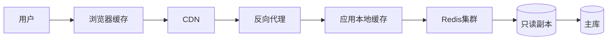

# 高并发读架构实战

> "读多写少"是绝大多数系统的真实画像。高并发读的架构目标是**把请求挡在离用户最近的地方**：浏览器缓存 → CDN → 反向代理 → 应用缓存 → 分布式缓存 → 只读副本 → 主库。每一层都是一道减压阀。

## 1. 读链路分层



## 2. 缓存策略

| 层 | 技术 | 命中率贡献 |
| --- | --- | --- |
| 本地 | Caffeine | 高（无网络） |
| 分布式 | Redis | 高（共享） |
| 静态 | CDN | 极高（边缘） |
| 页面 | 反代缓存 | 中 |

## 3. 关键设计

- **多级缓存**：本地 + Redis，避免 Redis 单点压力。
- **热点探测**：自动识别热点 key，本地多副本。
- **空值/防穿透**：空结果也缓存短时长。
- **防击穿**：热点 key 互斥重建或逻辑过期。
- **防雪崩**：过期时间加随机抖动。

```java
// 逻辑过期防击穿（概念）
V v = cache.get(k);
if (v != null && !v.expired()) return v;
if (lock.tryLock(k)) {
    rebuild(k);      // 异步/同步重建
}
return cache.get(k);
```

## 4. 读写分离

- 写主库，读走只读副本。
- 复制延迟用"写后读主"或延迟感知路由。
- 副本故障自动剔除，读回源主库。

## 5. 常见坑

| 坑 | 现象 | 对策 |
| --- | --- | --- |
| 缓存穿透 | DB 被打 | 空值缓存 + 布隆 |
| 缓存击穿 | 单 key 崩 | 互斥重建 |
| 缓存雪崩 | 大量失效 | 过期抖动 |
| 复制延迟 | 读旧数据 | 读写分离策略 |
| 本地缓存爆 | OOM | 容量上限 |

## 6. 面试题

1. 多级缓存如何配合？
2. 缓存穿透/击穿/雪崩区别与对策？
3. 读写分离读旧数据怎么办？
4. 热点 key 如何治理？
5. CDN 适合缓存什么？

## 7. 小结

高并发读 = 分层挡压 + 多级缓存 + 防三害 + 读写分离。核心是把读请求在越靠前的地方终结，越往后成本越高。
