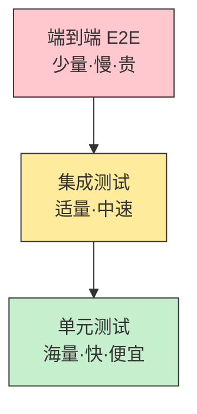
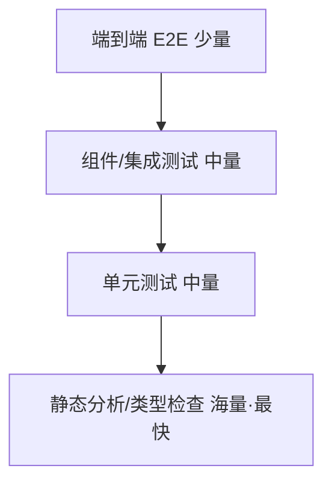
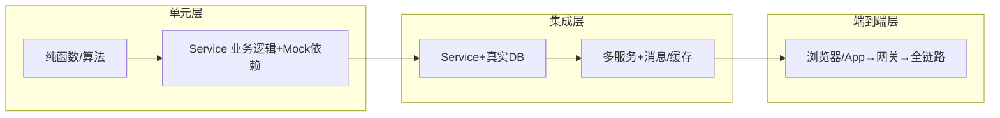
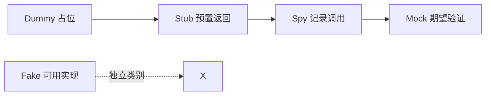
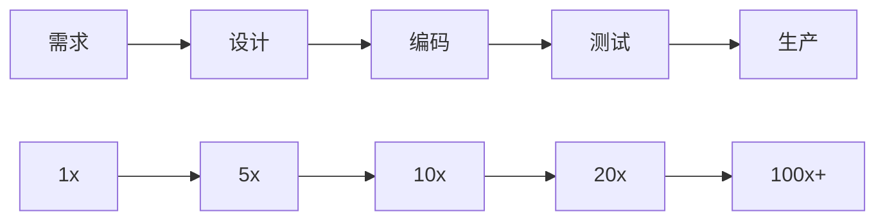

# 01 · 测试体系总论

> 写测试之前，先想清楚三个问题：**测什么、在哪一层测、用什么替身隔离、覆盖到什么程度**。这一篇把测试领域的"地图"画清楚，后面各篇都是这张地图的某个区域放大。

---

## 一、为什么需要一套"测试体系"

单写几个 `@Test` 很容易，难的是让整套测试**可信、快、好维护、能兜住真实缺陷**。没有体系，常见三种崩坏：

- **"测试比代码还多 bug"**：测试本身不可靠，红绿无意义；
- **"改一行跑半小时"**：E2E 当主力，反馈慢到没人跑；
- **"覆盖率 90% 还是一堆线上事故"**：覆盖的是 happy path，分支/异常没覆盖。

体系的目标：**用最小成本，获得最大的缺陷拦截置信度**。

---

## 二、测试金字塔（Test Pyramid）

Mike Cohn 提出的经典模型，定义了"各层测试的数量比例"。



| 层级 | 范围 | 速度 | 数量 | 稳定性 | 典型工具 |
|------|------|------|------|--------|----------|
| 单元 Unit | 单个函数/类，隔离依赖 | 毫秒 | 海量（占 70%+） | 高 | JUnit5、pytest、Go test |
| 集成 Integration | 跨模块/真实依赖（DB、MQ） | 秒级 | 适量（20%） | 中 | Spring Boot Test、Testcontainers |
| 组件/接口 API | 单个服务对外接口 | 秒~分 | 少量 | 中 | REST Assured、Postman、Karate |
| 端到端 E2E | 跨服务全链路 | 分~十分 | 极少（<10%） | 低（Flaky 多） | Playwright、Cypress |

**反模式 · 冰淇淋锥（Ice Cream Cone）**：E2E 巨多、单测几乎没有——反馈慢、脆弱、维护灾难。很多"传统 QA 团队"正是这样。

> **口诀：金字塔别反成冰淇淋，单测是地基、E2E 是塔尖。**

### 现代修正：测试奖杯（Testing Trophy）

Kent C. Dodds 提出，对前端/组件化时代更贴切：



强调**静态分析（类型系统、Lint）是最底层、最便宜的"测试"**，应优先用满。

---

## 三、测试象限（Agile Testing Quadrants）

Brian Marick / Lisa Crispin 的象限，从"业务 vs 技术""支持团队 vs 评判产品"两个维度组织测试。

```mermaid
quadrantChart
    title 测试象限
    x-axis 支持团队 --> 评判产品
    y-axis 技术导向 --> 业务导向
    quadrant-1 Q1 技术·支持: 单元/组件
    quadrant-2 Q2 业务·支持: 功能/原型
    quadrant-3 Q3 业务·评判: E2E/探索性
    quadrant-4 Q4 技术·评判: 性能/安全/混沌
```

| 象限 | 目的 | 例子 |
|------|------|------|
| Q1 技术·支持 | 帮开发写对代码 | 单元、组件、API 测试 |
| Q2 业务·支持 | 帮业务确认需求 | 验收测试、原型、用例 |
| Q3 业务·评判 | 评判产品体验 | E2E、探索性测试、可用性 |
| Q4 技术·评判 | 评判非功能质量 | 性能、安全、混沌、兼容性 |

**启示**：自动化主要覆盖 Q1+Q4（确定性、可量化）；Q2/Q3 的人为判断（探索性测试）难以完全自动化，需保留人工。

---

## 四、测试分层（按"被测对象边界"切）

金字塔讲的是"数量比例"，分层讲的是"每一层具体测谁、用什么依赖"。



- **单元层**：只测"自己写的逻辑"，DB/HTTP/时间/随机数等一律替身隔离。
- **集成层**：引入**真实**依赖（Testcontainers 起的 MySQL/Redis），验证"我的代码和真实依赖接得对"。
- **端到端层**：从外部视角验证"用户能走通"，不关心内部实现。

> 关键原则：**在能定位缺陷的最小层级测**。一个算税逻辑错误，单测就该红，不必等 E2E 才发现。

---

## 五、测试替身（Test Doubles）

Gerard Meszaros 的经典分类——"替代真实依赖的对象"有 5 种，别再笼统叫"Mock"。

| 替身 | 干什么 | 验证什么 | 例子 |
|------|--------|----------|------|
| **Dummy** | 仅占位，从不使用 | 满足参数签名 | `null` 或空对象 |
| **Stub** | 预置返回，不验证调用 | 提供可控输入 | 返回固定用户 |
| **Spy** | 记录调用，可部分真实 | 调用是否发生+部分逻辑 | 记录发了几封邮件 |
| **Mock** | 预编程期望，验证交互 | 是否按预期被调用 | 验证 `save()` 被调一次 |
| **Fake** | 轻量但可用的实现 | 行为正确（非生产级） | 内存数据库 In-Memory DB |



**最常见的误区**：把所有替身都当 Mock 用——"为了隔离而 Mock 了一切"，结果测的是"Mock 行为"而非"真实逻辑"，且过度耦合实现细节（一改内部调用就红）。

> **口诀：该用 Stub 别用 Mock，测行为更要测结果；Fake 比 Mock 更接近真相。**

---

## 六、测试覆盖率：看什么、别迷信什么

### 6.1 三种覆盖率口径

| 口径 | 含义 | 局限 |
|------|------|------|
| **行覆盖 Line** | 每行执行过没 | 不保证分支都走 |
| **分支覆盖 Branch** | 每个 if/else 分支都走 | 不保证组合 |
| **变异覆盖 Mutation** | 故意改代码（如 `>` 改 `<`），看测试能否抓住 | 最严，但慢 |

### 6.2 覆盖率陷阱

- **"90% 覆盖 = 高质量"是错觉**：全在 happy path，边界/异常 0 覆盖，等于没测。
- **为覆盖率而写测试**：`assertEquals(true, true)` 式凑数，反而污染套件。
- **正确用法**：覆盖率用于**找盲区**（哪没测），不是 KPI。门禁设下限（如增量行覆盖 ≥80%），但更要**Code Review 看测试有没有测对**。

### 6.3 代码示意：覆盖率该测分支而非只走主路径

```java
// 被测逻辑
int discount(int price, boolean vip) {
    if (price <= 0) throw new IllegalArgumentException("price");
    int d = price > 1000 ? 100 : 0;   // 分支1
    if (vip) d += 50;                  // 分支2
    return Math.max(0, price - d);
}

// 好的测试：覆盖异常 + 三个分支组合
@Test void testBranches() {
    assertThrows(IllegalArgumentException.class, () -> discount(0, false)); // 异常
    assertEquals(1000, discount(1000, false));  // 不打折
    assertEquals(900,  discount(1000, true));   // vip+满减
    assertEquals(50,   discount(100,  true));   // 仅vip
}
```

---

## 七、测试左移（Shift-Left）与质量内建

### 7.1 缺陷修复成本曲线



发现越晚越贵。**左移 = 把验证动作尽量提前**：需求阶段写验收标准（BDD）、编码前想清边界、写代码同时写单测（TDD）、静态分析在保存即提示。

### 7.2 质量内建（Built-in Quality）

> W. Edwards Deming："你不能检验质量进去，它必须被建造进去。"

质量内建三件套：
1. **预防优于检测**：规范、类型、Lint 在写时就挡住低级错；
2. **每个人对质量负责**：不是 QA 兜底，开发自测、CR 互相把关；
3. **快速反馈闭环**：本地→CI→预发，每一环都能秒级/分钟级暴露问题。

---

## 八、测试经济学的两个关键权衡

1. **边际收益递减**：从 0→70% 覆盖很容易拦住大量缺陷；70%→95% 成本陡增、收益渐平。设合理门禁，别追 100%。
2. **脆弱性 vs 置信度**：Mock 越细，测试越脆（实现一变就红）；过度用真实依赖，测试越慢越 Flaky。按"分层"分配——单测用 Mock 求快，集成用真实求真。

---

## 九、本篇速记 Cheat Sheet

| 概念 | 一句话 |
|------|--------|
| 测试金字塔 | 海量单测、适量集成、极少 E2E |
| 测试奖杯 | 静态分析是地基，最便宜 |
| 测试象限 | 自动化主覆盖 Q1(技术支撑)+Q4(技术评判) |
| 测试替身 | Dummy/Stub/Spy/Mock/Fake，别全当 Mock |
| 覆盖率 | 找盲区用，不是 KPI；看分支别只看行 |
| 左移 | 验证尽量提前，缺陷越晚越贵 |
| 质量内建 | 质量是设计出来的，不是测出来的 |

> 下一篇：[02 单元测试](02-单元测试.md) —— 金字塔的底座，JUnit5 + Mockito 实战，AAA、参数化、TDD、边界与反模式。
