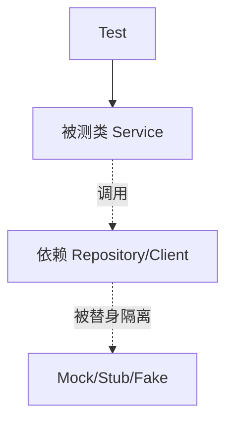
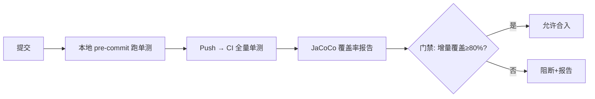

# 02 · 单元测试

> 单元测试是金字塔的底座：快（毫秒级）、多（占套件 70%+）、稳（隔离外部依赖）。这一篇用 Java 生态（JUnit5 + Mockito）为主讲透，同时覆盖多语言共性。

---

## 一、什么是"单元"

一个**单元** = 一个可独立验证的最小逻辑块（通常一个类的方法，或纯函数）。单元测试的硬约束：

- **不依赖** 数据库、网络、文件系统、时钟、随机数、外部服务；
- **不依赖** 其他测试的执行顺序；
- **可重复**：同样的输入永远同样的输出；
- **快**：成千上万个能在几秒内跑完。



---

## 二、AAA 结构（Arrange-Act-Assert）

每个测试三段落清晰分离，可读性最强：

```java
@Test
void shouldApplyVipDiscountWhenPriceAbove1000() {
    // Arrange 准备
    Order order = new Order(1200, true);
    PricingService svc = new PricingService();

    // Act 执行
    int finalPrice = svc.calculate(order);

    // Assert 断言
    assertEquals(1100, finalPrice);
}
```

> 反模式：一个测试方法里塞 5 个 Act/Assert，"测试即文档"的价值丧失，失败时不知哪步错。

### 2.1 测试可读性的三个杠杆

| 杠杆 | 做法 | 效果 |
|------|------|------|
| 命名 | `shouldXxxWhenYyy` | 失败即懂，无需读实现 |
| 结构 | 严格 AAA | 一眼看清输入→动作→期望 |
| 数据 | 工厂/构造器最小必要 | 不淹没在造数据代码里 |

---

## 三、JUnit 5 核心能力

### 3.1 生命周期注解

| 注解 | 作用 | 频率 |
|------|------|------|
| `@Test` | 测试方法 | 每个测试 |
| `@BeforeEach` | 每个测试前 | 公共准备 |
| `@AfterEach` | 每个测试后 | 清理 |
| `@BeforeAll` | 所有测试前（静态） | 贵资源初始化（连接池） |
| `@AfterAll` | 所有测试后（静态） | 释放 |
| `@Disabled` | 跳过 | 临时 |

### 3.2 参数化测试（测分支/边界的神器）

```java
@ParameterizedTest
@ValueSource(ints = {1, 100, 1000, 99999})
void shouldRejectNonPositive(int price) {
    // 一次写、多组跑，覆盖边界
}

@ParameterizedTest
@CsvSource({"1200,true,1100", "100,false,100", "100,true,50"})
void discountTable(int price, boolean vip, int expect) {
    assertEquals(expect, new PricingService().calculate(new Order(price, vip)));
}
```

`@MethodSource` 可喂复杂对象、`@EnumSource` 喂枚举、`@CsvFileSource` 从 CSV 批量加载。参数化是**用最小代码覆盖最大分支面**的关键。

### 3.3 异常与超时断言

```java
assertThrows(IllegalArgumentException.class, () -> svc.calculate(null));
assertTimeout(Duration.ofMillis(50), () -> svc.heavy());
```

### 3.4 嵌套与标签（按层组织）

```java
@Nested class VipScenarios { ... }      // 子分组
@Tag("slow") @Test void integrationLike() { ... }  // CI 可按 tag 筛选
```

### 3.5 断言库对比（JUnit 自带 vs AssertJ）

| 写法 | 示例 | 评价 |
|------|------|------|
| JUnit 自带 | `assertEquals(1100, p)` | 够用但冗长、可读性弱 |
| AssertJ | `assertThat(p).isEqualTo(1100).isPositive()` | 流式、错误提示好、推荐 |
| Hamcrest | `assertThat(p, is(1100)) | 老牌、可读、生态略旧 |

```java
// AssertJ 链式断言，失败信息更友好
assertThat(order.getFinalPrice())
    .isNotNegative()
    .isLessThan(order.getAmount())
    .isEqualTo(1100);
```

---

## 四、Mockito：如何隔离依赖

### 4.1 三类核心 API

```java
@Service
class OrderService {
    private final PaymentClient pay;     // 外部依赖，要 Mock
    private final OrderRepo repo;        // 数据库，要 Mock/Stub

    OrderService(PaymentClient pay, OrderRepo repo) { this.pay = pay; this.repo = repo; }

    String place(Order o) {
        String id = pay.charge(o.getAmount());   // 调用外部
        repo.save(o.withTxnId(id));               // 写库
        return id;
    }
}

@ExtendWith(MockitoExtension.class)
class OrderServiceTest {
    @Mock  PaymentClient pay;     // 自动 Mock
    @Mock  OrderRepo repo;
    @InjectMocks OrderService svc; // 自动注入上面两个 Mock

    @Test
    void placeShouldSaveAfterCharge() {
        when(pay.charge(100)).thenReturn("TXN123");
        String id = svc.place(new Order(100));
        assertEquals("TXN123", id);
        verify(repo).save(argThat(o -> "TXN123".equals(o.getTxnId())));
        verify(pay).charge(100);
    }

    @Test
    void placeShouldPropagateWhenPayFails() {
        when(pay.charge(anyInt())).thenThrow(new RuntimeException("down"));
        assertThrows(RuntimeException.class, () -> svc.place(new Order(100)));
        verify(repo, never()).save(any());   // 验证"没写库"
    }
}
```

### 4.2 Mock 的边界纪律

| 该做 | 不该做 |
|------|--------|
| Mock 掉**慢/不可控/外部**依赖 | Mock 自己的纯逻辑（等于没测） |
| 用 `verify` 验证**副作用/交互** | 用 `verify` 验证本可断言返回值的东西 |
| Stub 返回**最小必要**数据 | 为每个测试建巨大对象树 |
| 用 `any()` 谨慎（可能掩盖参数错误） | 滥用 `any()` 让测试形同虚设 |

> **口诀：Mock 测交互，Stub 给数据，断言看结果，别 Mock 自己。**

### 4.3 高级：参数捕获、连续返回、答案回调

```java
// ArgumentCaptor：捕获传入的参数做精细断言
ArgumentCaptor<Order> cap = ArgumentCaptor.forClass(Order.class);
verify(repo).save(cap.capture());
assertThat(cap.getValue().getTxnId()).isEqualTo("TXN123");

// 连续返回（第一次抛错、重试后成功）
when(pay.charge(anyInt()))
    .thenThrow(new RuntimeException("timeout"))
    .thenReturn("TXN123");

// Answer：根据输入动态返回
when(repo.find(anyLong())).thenAnswer(inv -> new User(inv.getArgument(0)));
```

### 4.4 常见陷阱

| 陷阱 | 原因 | 修正 |
|------|------|------|
| `NullPointerException` | `@InjectMocks` 调无参构造，字段 final 注入失败 | 手写构造 `new OrderService(pay, repo)` |
| `UnnecessaryStubbingException` | Stub 了没用到的返回 | 删多余 Stub 或 `lenient()` |
| 过度 `verify` | 把可断言返回值也 verify | 返回值优先断言 |
| 断言过松 | `assertNotNull` 掩盖假绿 | 断言具体值/契约 |

---

## 五、测试什么：不只是 happy path

单元测试最有价值的是**边界与异常**，而非主流程。

| 类别 | 例子 |
|------|------|
| 边界值 | 0、负数、极大、空集合、null |
| 等价类 | 合法区间 vs 非法区间各取代表 |
| 异常路径 | 超时、下游 500、数据缺失 |
| 并发 | 同一对象多线程调用（少见，多在集成层） |
| 确定性 | 含 `new Date()`/`Random` 的代码要注入 Clock/Random |

**注入时间/随机，别在测试里和"现在"较劲：**

```java
class ReportService {
    private final Clock clock;                  // 注入，可测
    ReportService(Clock clock) { this.clock = clock; }
    String today() { return LocalDate.now(clock).toString(); }
}
// 测试：Clock.fixed(Instant.parse("2026-08-03T00:00:00Z"), ZoneUTC)
```

边界值分析（BVA）口诀：**上点、离点、内点**——如区间 `[1,100]`，取 0、1、2、99、100、101 六值覆盖。

---

## 六、TDD 与 BDD：写测试的顺序

### 6.1 TDD（测试驱动开发）红-绿-重构


好处：逼出**可测的设计**（难测往往意味着耦合重）、防止过度设计。代价：前期慢，适合核心复杂逻辑，不必全量 TDD。

### 6.2 BDD（行为驱动开发）

用自然语言描述行为，桥接业务与测试。JUnit5 + 断言库（AssertJ）即可近似：

```java
@Test
void givenVipUser_whenCheckout_thenApplyExtraDiscount() { ... }
```

或 Cucumber（`Feature` 文件 + Step 定义），适合验收测试（Q2 象限）。

### 6.3 TDD 适用边界

| 适合 TDD | 不适合 TDD |
|----------|-----------|
| 核心算法、计价、规则引擎 | UI 交互、第三方 SDK 封装 |
| 复杂业务逻辑、状态机 | 探索性原型、一次性脚本 |
| 高价值、易变的需求 | 已稳定的胶水代码 |

---

## 七、单元测试反模式清单

| 反模式 | 危害 | 修正 |
|--------|------|------|
| 测试间共享可变状态 | 顺序相关、诡异失败 | 每个测试自包含，`@BeforeEach` 重建 |
| 一个测试多断言主题 | 失败时难定位 | 拆分；或用语义分组 |
| Mock 一切（包括自身逻辑） | 测的是 Mock | 只 Mock 外部依赖 |
| 断言过松（`assertNotNull`） | 假绿 | 断言具体值与契约 |
| 测试依赖真实 DB/网络 | 慢、Flaky | 移到集成层，单测用替身 |
| 测试名"test1/test2" | 失败看不懂 | 命名 `shouldXxxWhenYyy` |
| 复制粘贴测试数据 | 难维护 | 用测试数据工厂（见 08 篇） |
| 测试里用 `Thread.sleep` 等异步 | 慢且 Flaky | `Awaitility` / `CompletableFuture` 断言 |

---

## 八、多语言速查

| 语言/生态 | 框架 | Mock 库 | 特色 |
|-----------|------|---------|------|
| Java | JUnit5 / TestNG | Mockito / MockK(Kotlin) | 生态最全 |
| Python | pytest | unittest.mock / pytest-mock | fixture 机制灵活 |
| Go | 内置 testing | 手写为接口写 Fake | 偏好 Fake 而非 Mock |
| JS/TS | Jest / Vitest | jest.mock / sinon | 快照测试 |
| C# | xUnit / NUnit | Moq / NSubstitute | 强类型 Mock |

> Go 社区共识：**偏好手写接口 Fake 而非 Mock 框架**——接口小、Fake 可控、不依赖反射魔法，测的是"行为"而非"调用"。

### 8.1 pytest 示例（对比 Java）

```python
import pytest
from pricing import discount

@pytest.mark.parametrize("price,vip,expect", [
    (1000, False, 1000), (1000, True, 900), (100, True, 50),
])
def test_discount(price, vip, expect):
    assert discount(price, vip) == expect

def test_negative_raises():
    with pytest.raises(ValueError):
        discount(0, False)
```

---

## 九、CI 中跑单测的工程要点



- **并行**：JUnit5 支持 `@Execution(CONCURRENT)` + 分片跑，缩短时长；
- **失败即停前先全跑**：CI 应跑全量而非遇错即停，完整暴露；
- **缓存**：Maven/Gradle 依赖缓存，避免每次重下；
- **报告**：JUnit XML + HTML 报告，失败定位快。

---

## 十、面试高频追问（20 题 + 要点）

1. **单元的定义与硬约束？** → 最小可验证逻辑块；不依赖外部、可重复、快。
2. **AAA 是什么？** → Arrange / Act / Assert 三段分离。
3. **JUnit5 生命周期注解？** → BeforeEach/AfterEach/BeforeAll/AfterAll。
4. **参数化测试好处？** → 一次写多组跑，覆盖分支/边界。
5. **Mockito `verify` 与 `when` 区别？** → when 给数据，verify 验交互。
6. **Mock vs Stub？** → Stub 给返回、Mock 验调用。
7. **为何别 Mock 自己逻辑？** → 等于没测，且耦合实现。
8. **ArgumentCaptor 用途？** → 捕获参数做精细断言。
9. **`@InjectMocks` NPE 怎么办？** → final 字段手写构造注入。
10. **时间/随机怎么测？** → 注入 Clock/Random。
11. **边界值分析三要点？** → 上点、离点、内点。
12. **TDD 红绿重构？** → 先失败测试→最小实现→重构。
13. **TDD 适用场景？** → 核心算法/规则，不适合 UI 胶水。
14. **AssertJ 对比 JUnit 自带？** → 流式、错误友好。
15. **测试共享状态危害？** → 顺序相关、诡异失败。
16. **`Thread.sleep` 在测试里问题？** → 慢且 Flaky，用 Awaitility。
17. **Go 为什么偏好 Fake？** → 接口小、可控、无反射魔法。
18. **CI 单测门禁怎么设？** → 增量覆盖≥80%，失败阻断。
19. **UnnecessaryStubbing 什么原因？** → Stub 未使用，删或 lenient。
20. **如何让单测快？** → 隔离外部、并行、缓存依赖。

---

## 十一、Cheat Sheet

| 主题 | 要点 |
|------|------|
| 结构 | AAA：Arrange / Act / Assert |
| 边界 | 参数化测边界、异常、空值；BVA 上/离/内点 |
| Mock | 只替外部依赖；verify 交互、when 给数据 |
| 确定性 | 注入 Clock/Random，不依赖"现在" |
| TDD | 红-绿-重构，逼出可测设计 |
| 反模式 | 共享状态、Mock 自己、断言过松、sleep |
| CI | 增量门禁、并行、报告、失败阻断 |

> 下一篇：[03 集成测试与契约测试](03-集成测试与契约测试.md) —— 单测隔离了依赖，集成测试用 Testcontainers 引入真实 DB/MQ，验证"我的代码和真实依赖接得对"，并用契约测试解决微服务耦合。
